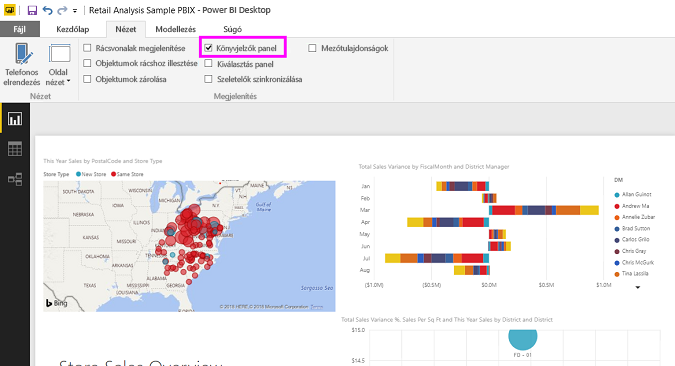
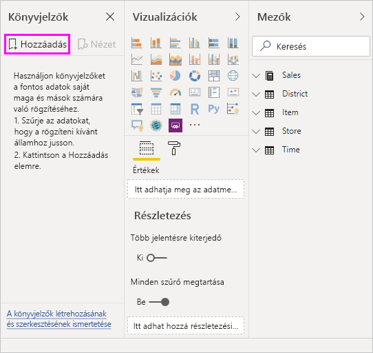
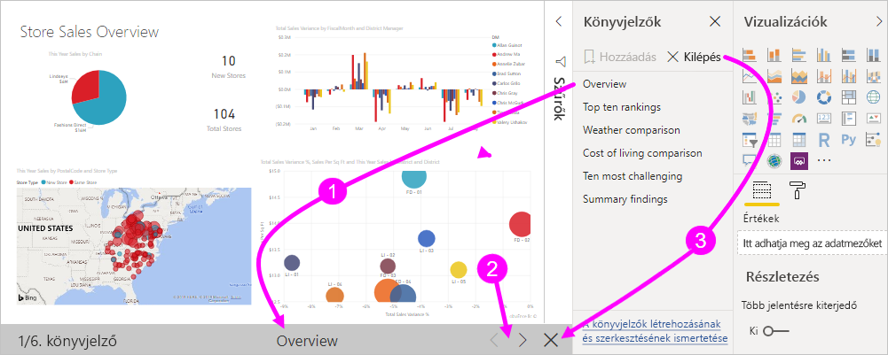
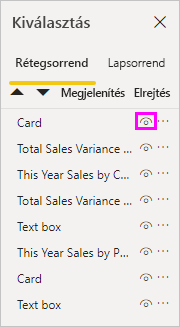
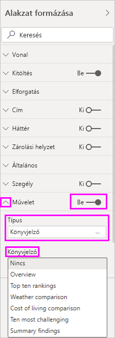
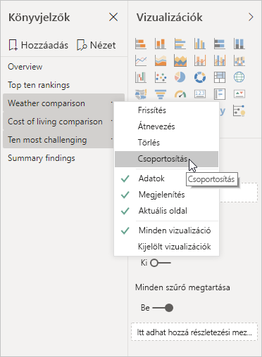
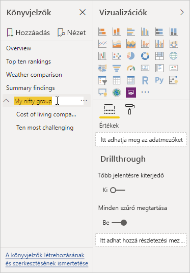
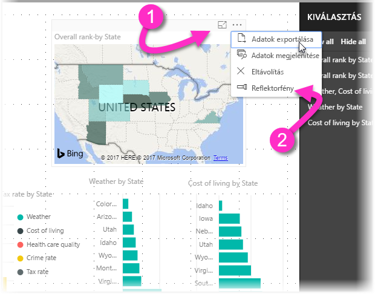
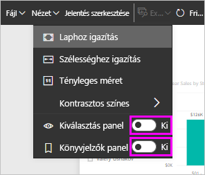
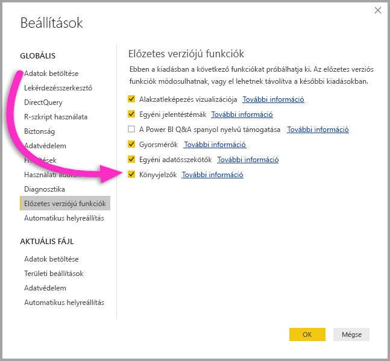

# Könyvjelzők létrehozása a Power BI Desktopban elemzések megosztásához és történetek felépítéséhez
A Power BI-ban a *könyvjelzők* használatával rögzítheti az egyes jelentésoldalak aktuális nézetkonfigurációját, beleértve a szűréseket és a vizualizációk állapotát. A mentett könyvjelző kiválasztásával később visszatérhet az állapothoz. 

Egy tetszőleges sorrendbe rendezett teljes könyvjelzőgyűjteményt is létrehozhat, majd ezeket sorban megnyitva egy olyan bemutatót állíthat össze, amelyben lényegi összefüggések sorozatát mutathatja be, vagy előadhatja azt a történetet, amelyet a vizualizációkkal és a jelentésekkel be szeretne mutatni. 

A könyvjelzőknek rengeteg felhasználási módja létezik. A könyvjelzők segítségével például nyomon követheti, hogy hol tart épp a jelentések készítésében (a könyvjelzők hozzáadása, törlése és átnevezése nem bonyolult dolog), illetve létrehozhat belőlük egy PowerPoint-szerű bemutatót is, amely a könyvjelzőkön végigléptetve bemutat egy történetet a jelentésen keresztül. 

> [!TIP]
> Tudnivalók a Power BI-beli személyes könyvjelzők használatáról: [Személyes könyvjelzők bejelentése a Power BI szolgáltatásban](https://powerbi.microsoft.com/blog/announcing-personal-bookmarks-in-the-power-bi-service/). 

## A könyvjelzők használata
A könyvjelzők használatához válassza a Power BI Desktop menüszalagon a **Nézet** lapot, majd válassza a **Könyvjelzők panelt**. 

A létrehozott könyvjelzőkhöz a rendszer a következő elemeket menti:

* Az aktuális oldal
* Szűrők
* Szeletelők, szeletelőtípusok (például legördülő menü vagy lista), valamint szeletelőállapot
* A vizualizáció kiválasztásának állapota (például szűrők keresztikemelése)
* A rendezés iránya
* A részletezés helye
* Objektumok láthatósága (a **Kiválasztás** panel használatával)
* A látható objektumok fókusz vagy **Reflektorfény** módja

Állítson be egy jelentésoldalt úgy, amilyen állapotban a könyvjelzővel menteni szeretné. Miután a jelentésoldalt és a vizualizációkat a kívánt módon elrendezte, a könyvjelző hozzáadásához kattintson a **Könyvjelzők** panel **Hozzáadás** gombjára. 

A Power BI Desktop létrehoz egy könyvjelzőt, amelynek egy általános nevet ad. A könyvjelzőket könnyen **átnevezheti**, **törölheti** vagy **frissítheti**, ha a könyvjelző neve melletti három pontra kattint, majd kiválasztja a megfelelő műveletet a megjelenő menüből.

Miután létrehozott egy könyvjelzőt, a megjelenítéséhez válassza ki a **Könyvjelzők** panelen. 

Azt is kiválaszthatja, hogy minden könyvjelző alkalmazzon **adattulajdonságokat**, például szűrőket és szeletelőket; **megjelenítési** tulajdonságokat, például reflektorfényt és annak láthatóságát; valamint az **aktuális oldal** módosításait, amelyek a könyvjelző hozzáadásakor látható oldalt jelenítik meg. Ezek a funkciók akkor hasznosak, ha könyvjelzőkkel vált a jelentésnézetek és a kiválasztott vizualizációk között, ekkor ugyanis célszerű kikapcsolni az adattulajdonságokat, hogy a szűrők ne álljanak alaphelyzetbe, ha a felhasználók egy könyvjelző kiválasztásával váltanak nézetet. 

Az ilyen módosítások elvégzéséhez válassza a könyvjelző neve melletti három pontot, majd jelölje be az **Adatok**, **Megjelenítés** és egyéb vezérlők melletti jelölőnégyzeteket, vagy törölje a jelölésüket. 

## A könyvjelzők rendezése
Előfordulhat, hogy a könyvjelzőket más sorrendben hozza létre, mint amilyenben aztán be szeretné őket mutatni. Ez nem jelent problémát, mivel a könyvjelzőket könnyedén átrendezheti.

- A **Könyvjelzők** panelen áthúzással módosítsa a könyvjelzők sorrendjét. 

   A könyvjelzők közötti sárga vonal jelzi a helyet, ahová az elhúzott könyvjelző kerülni fog.

   

A könyvjelzők sorrendje a könyvjelzők **Nézet** funkciójának használatakor lehet fontos, amint arra a következő szakasz kitér.

## Diavetítés a könyvjelzőkkel
Ha van több könyvjelzője, amelyeket sorrendben be szeretne mutatni, a **Könyvjelzők** panel **Nézet** gombjának kiválasztásával indíthatja el a diavetítést.

A **Nézet** módban érdemes odafigyelni a néhány dologra.

   

1. A könyvjelző neve a könyvjelző címsorában látható a vászon alján.

2. A könyvjelző címsorában lévő nyilakkal léptethet előre és hátra a könyvjelzők között.

3. A **Nézet** módból a **Könyvjelzők** panel **Kilépés** gombjával, vagy a könyvjelzők címsorán található **X** gombbal léphet ki. 

A **Nézet** módban bezárhatja a **Könyvjelzők** panelt a panel **X** gombjára kattintva, így több hely marad a bemutatónak. A **Nézet** módban az összes vizualizáció interaktívan kezelhető, és keresztkiemelést is lehet alkalmazni, ahogy közvetlen használat során is. 

## Láthatóság: A Kiválasztás panel használata
A **Könyvjelzők** panelhez kapcsolódó **Kiválasztás** panel az aktuális oldalon lévő összes objektum listáját jeleníti meg, és lehetővé teszi az egyes objektumok kiválasztását és láthatóságának beállítását. 

A **Kiválasztás** panelen kiválaszthat egy objektumot, és az objektum jobb oldalán lévő szem ikonra kattintva ki- és bekapcsolhatja az adott objektum láthatóságát. 

A könyvjelzők hozzáadásakor a rendszer az egyes objektumok láthatósági állapotát is menti a **Kiválasztás** panelen megadott beállítások szerint. 

Érdemes megjegyezni, hogy a szeletelők a láthatósági állapotuktól függetlenül szűrik a jelentésoldalt. Így számos különböző könyvjelzőt hozhat létre különböző szeletelőbeállításokkal, és az adott jelentésoldal sokféleképpen jelenhet meg (és különböző lényegi összefüggésekre mutathat rá) a különböző könyvjelzőkön.

> [!NOTE]
> Ha a **Kiválasztás** panelt könyvjelzőkkel együtt használja, akkor a kiválasztás láthatóságának módosítása esetén a láthatóság visszaáll az alapértelmezett beállításra. Az ilyen módosítások után kattintson a jobb gombbal a könyvjelzőre, és válassza a *Frissítés* lehetőséget a láthatóság frissítéséhez.

## Alakzatok és képek könyvjelzői
Alakzatokat és képeket is hozzárendelhet a könyvjelzőkhöz. Ezzel a funkcióval, ha kiválaszt egy objektumot, megjelenik az adott objektumhoz rendelt könyvjelző. Ez a funkció különösen hasznos lehet akkor, ha gombokat használ. További információt a [Gombok használata a Power BI-ban](desktop-buttons.md) című cikkben talál. 

Egy könyvjelző objektumhoz rendeléséhez: 

1. Jelölje ki az objektumot a jelentésvásznon. Ezután a megjelenő **Alakzat formázása** panelen kapcsolja **BE** állásba a **Művelet** kapcsolót.

2. Bontsa ki a **Művelet** szakaszt. A **Típus** területen válassza ki a **Könyvjelző** lehetőséget.

3. A **Könyvjelzők** területen válasszon ki egy könyvjelzőt.

   

Az objektumokhoz rendelt könyvjelzőknek számos felhasználási módja van. Létrehozhat egy látványos tartalomjegyzéket a jelentésoldalon, vagy különböző nézeteket (például különféle vizualizációtípusokat) mutathat be ugyanazokról az adatokról.

A szerkesztési módban nyomja le a **Ctrl** billentyűt, és jelölje ki a hivatkozást annak megnyitásához. A szerkesztési módon kívül elég rákattintani az objektumra a hivatkozás megnyitásához. 

## Könyvjelzőcsoportok

A Power BI Desktop 2018. augusztusi kiadásától kezdve könyvjelzőcsoportokat is létrehozhat és használhat. A könyvjelzőcsoport az Ön által létrehozott könyvjelzők gyűjteménye, amelyeket csoportokba gyűjtve jeleníthet meg. 

Könyvjelzőcsoport létrehozásához: 
1. Nyomja le a **Ctrl** billentyűt, és válassza ki a csoportba felvenni kívánt könyvjelzőket. 

2. Válassza ki a kijelölt könyvjelzők melletti három pontot, majd a megjelenő menüben válassza a **Csoport** elemet.

   

A Power BI Desktop a csoportnak automatikusan a *Csoport 1* nevet adja. A név melletti három pontra kattintva kiválaszthatja az **Átnevezés** lehetőséget, és átnevezheti a csoportot, amire csak szeretné.

Mint minden könyvjelzőcsoport esetén, a könyvjelzőcsoport nevének kibontása csak a könyvjelzők csoportjának kibontására és összecsukására szolgál, és a név nem jelöl konkrét könyvjelzőket. 

A könyvjelzők **Megjelenítés** funkciójának használatakor az alábbi részletek érvényesek:

* Ha a kiválasztott könyvjelző egy könyvjelzőcsoport tagja, a **Megjelenítés** választásakor csak *az adott csoport* könyvjelzői jelennek meg. 

* Ha a kiválasztott könyvjelző nem csoport, vagy ha a csoport legfelső szintjén található (például a könyvjelzőcsoport nevéről van szó), akkor a jelentés összes könyvjelzője megjelenik, azok is, amelyek valamelyik csoporthoz tartoznak. 

Könyvjelzők csoportosításának megszüntetése: 
1. Válassza ki egy csoport bármelyik könyvjelzőjét, és kattintson az amellett lévő három pontra. 

2. A megjelenő helyi menüben válassza a **Csoportosítás megszüntetése** lehetőséget.

   

   Ha egy csoport bármely könyvjelzőjénél a **Csoportosítás megszüntetése** funkciót használja, azzal minden könyvjelzőt eltávolít a csoportból; a művelet törli a csoportot, de nem törli magukat a könyvjelzőket. 

Ha csupán egyetlen könyvjelzőt szeretne eltávolítani a csoportból: 
1. Válassza a **Csoportosítás megszüntetése** lehetőséget az adott csoport bármely könyvjelzőjénél, amely megszünteti a csoportot. 

2. Válassza ki az új csoportba felvenni kívánt könyvjelzőket (**Ctrl** + az egyes könyvjelzőkre való kattintással), majd válassza újra a **Csoportosítás** lehetőséget. 

## A reflektorfény használata
A könyvjelzőkkel egy időben bevezetett másik funkció a *reflektorfény*. A reflektorfénnyel felhívhatja például a figyelmet egy adott diagramra, amikor a könyvjelzőket **Nézet** módban mutatja be.

Lássuk, miben különbözik a reflektorfény a fókusz módtól:

1. Fókusz módban kiválaszthatja a vizualizáció **Fókusz mód** ikonját, aminek eredményeként a vizualizáció kitölti a teljes vásznat.

2. A reflektorfény esettében kiválaszthatja a **Reflektorfény** elemet a vizualizációhoz tartozó három pontra kattintva, hogy az eredeti méretében emelhessen ki egy vizualizációt azáltal, hogy az oldalon lévő összes többi vizualizációt majdnem teljesen elhalványítja. 

Ha kijelöli az előző képen látható vizualizáció **Fókusz mód** ikonját, az oldal a következőképpen jelenik meg:

Ezzel szemben, ha a vizualizáció menüjében (...) a **Reflektorfény** elemre kattint, az oldal így néz majd ki:

Ha egy könyvjelző hozzáadásakor a fókusz vagy a reflektorfény mód be van kapcsolva, a könyvjelző megőrzi a beállítást.

## A könyvjelzők a Power BI szolgáltatásban
Ha egy, a Power BI szolgáltatásban közzétett jelentés tartalmaz könyvjelzőket, azokat a Power BI szolgáltatásban is megtekintheti és használhatja. Ha a jelentés tartalmaz könyvjelzőket, akkor a **Kiválasztás** és a **Könyvjelzők** paneleket a **Nézet** > **Kiválasztás panel** vagy a **Nézet** > **Könyvjelzők panel** lehetőség kiválasztásával jelenítheti meg. 

A **Könyvjelzők** panel ugyanúgy működik a Power BI szolgáltatásban, mint a Power BI Desktopban. Itt is le tudja játszani a könyvjelzőket diavetítésként a **Nézet** kiválasztásával.

A könyvjelzők között a könyvjelzők szürke címsorán léptethet, és nem a fekete nyilakkal. (A fekete nyilak a jelentésoldalak, és nem a könyvjelzők közötti váltásra szolgálnak.)

## A könyvjelzők előzetes verziójának engedélyezése (a 2018. márciusinál korábbi verziók esetében)
A Power BI Desktop 2018. márciusi verziójától kezdve a könyvjelzőkezelési funkció általánosan elérhető. 

Mindig ajánlott a legújabb kiadásra frissíteni. Ha mégis a Power BI Desktop korábbi verzióját használja, a könyvjelzőkezelési funkció a 2017. októberi kiadással vált elérhetővé a Power BI Desktopban, valamint a könyvjelző-kompatibilis jelentésekben a Power BI szolgáltatásban. 

A könyvjelzők előzetes verziójának engedélyezése: 

1. Válassza ki a **Fájl** > **Lehetőségek és beállítások** > **Lehetőségek** > **Előzetes verziójú funkciók** lehetőséget, majd válassza a **Könyvjelzők** lehetőséget. 

   

2. A könyvjelzők előzetes verziójának engedélyezése után indítsa újra a Power BI Desktopot.

## Korlátozások és szempontok
A könyvjelzőkezelési funkciók aktuális kiadásának használatára vonatkozik néhány korlátozás és egyéb szempont.

* A legtöbb Power BI-vizualizáció zökkenőmentesen működik a könyvjelzőkkel. Ha hibát tapasztal egy könyvjelző és egy egyéni vizualizáció használatakor, lépjen kapcsolatba az egyéni vizualizáció létrehozójával, és kérje meg, hogy szolgáltasson támogatást a könyvjelzőkhöz. 
* Ha egy vizualizációt a könyvjelző létrehozását követően ad hozzá a jelentésoldalhoz, a vizualizáció az alapértelmezett állapotában jelenik meg. Ez azt jelenti, hogy ha egy olyan oldalra vesz fel szeletelőt, ahol már hozott létre könyvjelzőket, a szeletelő az alapértelmezett állapotának megfelelően viselkedik majd.
* Ha a vizualizációkat a könyvjelzők létrehozását követően áthelyezi, a változást a könyvjelzők automatikusan tükrözni fogják. 

## Következő lépések
A könyvjelzőkhöz hasonló vagy azokkal együtt használható funkciókkal kapcsolatos részletesebb információkat az alábbi cikkekben talál:

* [Részletezés használata a Power BI Desktopban](desktop-drillthrough.md)
* [Irányítópult-csempe vagy jelentésvizualizáció megjelenítése fókusz módban](../consumer/end-user-focus.md)
