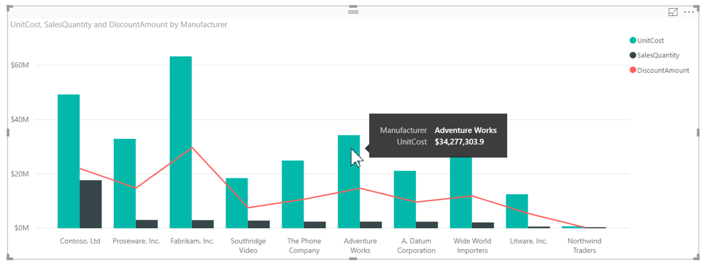

# Elemleírások testreszabása a Power BI Desktopban

Az elemleírások használatával elegáns módon lehet kiegészítő környezeti információkat és részleteket megjeleníteni a vizualizációkban lévő adatpontokról. Az alábbi képen egy diagramhoz hozzáadott elemleírás látható a Power BI Desktopban.

A képi megjelenítés létrehozásakor az alapértelmezett elemleírás az adatpont értékét és kategóriáját jeleníti meg. Az elemleírások adatainak testreszabása számos példány esetében hasznos lehet. Az elemleírások testreszabása további kontextust és információkat biztosít a vizualizációt megtekintő felhasználók számára. Az egyéni elemleírásokkal további adatpontokat adhat meg, amelyek az elemleírás részeként jelennek meg.

## Az elemleírások testreszabása

Testreszabott elemleírások létrehozásához a **Vizualizációk** panel **Mezők** területéről húzzon át egy mezőt az **Elemleírások** gyűjtőbe az alábbi ábrán látható módon. Az alábbi ábrán három mező van az **Elemleírások** gyűjtőbe helyezve.

Miután hozzáadta az elemleírásokat az **Elemleírások** szakaszhoz, a kurzort a vizualizáció adatpontjai fölé húzva megjelennek az adott mezők értékei.

## Elemleírások testreszabása aggregációkkal és gyorsmérők

Egy aggregációs függvény vagy egy *gyorsmérő* kiválasztásával további testreszabást végezhet az elemleírásokon. Válassza a mező melletti nyilat az **Elemleírások** gyűjtőben. Ezután válasszon az elérhető lehetőségek közül.

Az elemleírások számos módon testreszabhatók az adatkészlet bármely elérhető mezőjének használatával, így gyors információk és elemzések biztosíthatók az irányítópultokat és a jelentéseket megtekintő felhasználók számára.
