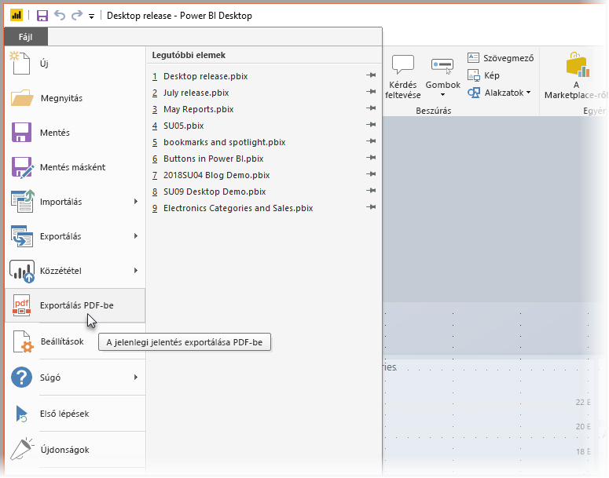
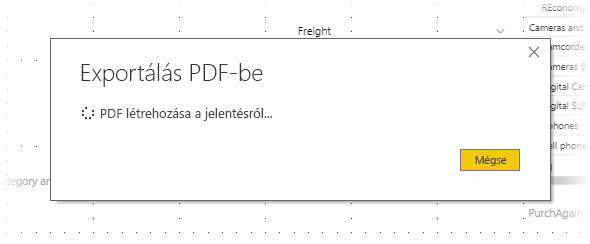

# Jelentések exportálása PDF-be a Power BI Desktopból
A **Power BI Desktopban** vagy a Power BI szolgáltatásban a jelentések PDF-fájlba exportálhatók, a PDF-formátumú jelentések pedig egyszerűen megoszthatók és kinyomtathatók.

A jelentések **Power BI Desktopból** kinyomtatható vagy másokkal megosztható PDF-be exportálásának folyamata nagyon egyszerű. Elég a **Fájl > Exportálás PDF-be** lehetőséget választani a Power BI Desktopban.

Az **Exportálás PDF-be** eljárás a jelentés minden *látható* oldalát exportálja úgy, hogy a jelentés minden oldala a PDF-fájl egy oldalaként lesz exportálva. Az éppen nem látható jelentésoldalak, például elemleírások vagy rejtett oldalak nem lesznek a PDF-fájlba exportálva. 

A **Fájl > Exportálás PDF-be** lehetőség választásakor az exportálás elindul, és egy párbeszédpanel jelzi, hogy az exportálás folyamatban van. A párbeszédpanel az exportálási folyamat befejezéséig a képernyőn marad. Az exportálás folyamán az éppen exportált jelentéssel való összes interakció le van tiltva. A jelentés csak akkor lesz kezelhető, ha megvárja az exportálási folyamat végét, vagy megszakítja az exportálást. 

Amikor az exportálás befejeződik, a PDF a számítógépen lévő alapértelmezett PDF-megjelenítőbe lesz betöltve. 

## Megfontolandó szempontok és korlátozások
Az **Exportálás PDF-be** funkció használatára vonatkozik még néhány további szempont:

* A funkció exportálja a Power BI-vizualizációkat, de *nem* exportálja a jelentésben használt háttérképeket.

Mivel a háttérképek nem lesznek a PDF-be exportálva, külön figyelmet kell fordítani a sötét hátterű jelentésekre. Ha a jelentés szövege világos színű vagy fehér, hogy kiemelkedjen a sötét háttérképen, akkor nehezen olvasható vagy olvashatatlan lesz az exportált PDF-ben, mivel a háttérkép nem lesz a jelentés többi részével együtt exportálva. 

## További lépések
A **Power BI Desktop** sokféle érdekes vizuális elemet és funkciót tartalmaz. További információt az alábbi forrásanyagokban talál:

* [Vizuális elemek használata Power BI-jelentések továbbfejlesztéséhez](desktop-visual-elements-for-reports.md)
* [Mi az a Power BI Desktop?](../fundamentals/desktop-what-is-desktop.md)
