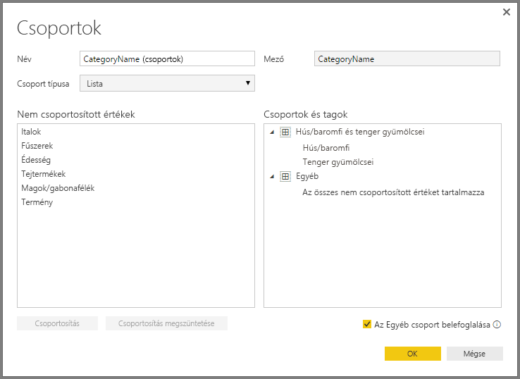

# Csoportosítás és dobozolás használata a Power BI Desktopban
Amikor a Power BI Desktop vizualizációkat hoz létre, az adatokat az alapul szolgáló adatokban talált értékek alapján adatrészletekben (vagy csoportokban) aggregálja. Ez gyakran elegendő is, de lehetnek alkalmak, amikor finomítani szeretné az adattömbök megjelenítését. Előfordulhat például, hogy három termékkategóriát egy nagyobb kategóriában (egy *csoportban*) szeretne elhelyezni. Az is előfordulhat, hogy az eladási adatokat 1 000 000 dollár méretű dobozokban szeretné látni, nem pedig 923 983 dolláros méretű adatrészletekben.

A Power BI Desktopban *csoportosíthatja* az adatokat, és így jobban áttekintheti, elemezheti és feltárhatja a vizualizációkban foglalt adatokat és tendenciákat. A *dobozméretet* is meghatározhatja az értékek egyenlő méretű csoportokra osztásához, ami lehetővé teszi az adatok könnyebben értelmezhető vizualizációját. Ezt a műveletet gyakran *dobozolásnak* nevezik.

## A csoportosítás használata
A csoportosítás használatához CTRL+kattintással válasszon ki két vagy több elemet egy vizualizáción. Ezután kattintson a jobb gombbal a többszörös kijelölés egyik elemére, majd válassza a **Csoportosítás** lehetőséget a helyi menüben.

Miután létrejött a csoport, a rendszer hozzáadja azt a vizualizáció **Jelmagyarázat** gyűjtőjéhez. A csoport a **Mezők** listában is megjelenik.

Amikor már rendelkezik egy csoporttal, könnyedén szerkesztheti a csoport tagjait. Kattintson a jobb gombbal a mezőre a **Jelmagyarázat** gyűjtőben vagy a **Mezők** listában, majd válassza **Csoportok szerkesztése** lehetőséget.

A megjelenő **Csoportok** párbeszédpanelen létrehozhat új csoportokat, vagy módosíthatja a meglévőket. Emellett bármelyik csoportot *átnevezheti*. Ehhez egyszerűen kattintson duplán a csoport címére a **Csoportok és tagok** mezőben, majd adja meg az új nevet.

A csoportokkal sok mindent megtehet. Hozzáadhat elemeket a **Nem csoportosított értékek** listáról egy új vagy egy létező csoporthoz. Új csoport létrehozásához válasszon ki két vagy több elemet (CTRL+kattintással) a **Nem csoportosított értékek** mezőből, és kattintson a mező alatti **Csoportosítás** gombra.

Hozzáadhat egy nem csoportosított értéket egy létező csoporthoz: ehhez csak válasszon ki egy **Nem csoportosított értéket**, aztán válassza ki a meglévő csoportot, amelyhez hozzá szeretné adni, majd válassza a **Csoportosítás** gombot. Ha el szeretne távolítani egy elemet egy csoportból, válassza ki azt a **Csoportok és tagok** mezőben, majd válassza a **Csoportosítás megszüntetése** lehetőséget. A nem csoportosított kategóriákat emellett áthelyezheti az **Egyéb** csoportba, vagy nem csoportosítottan hagyhatja őket.

> [!NOTE]
> A **Mezők** szakasz bármelyik mezőjéhez is létrehozhat csoportokat, és ehhez nem kell egy meglévő vizualizáció több elemét kijelölnie. Csak kattintson a jobb gombbal a mezőre, és válassza a megjelenő menüben az **Új csoport** elemet.

## A dobozolás használata
A dobozméretet a **Power BI Desktop** numerikus és időmezőihez állíthatja be. A dobozolással megfelelő méretűre állíthatja a Power BI Desktop által megjelenített adatokat.

Egy dobozméret alkalmazásához kattintson a jobb gombbal egy **Mezőre**, és válassza az **Új csoport** lehetőséget.

A **Csoportok** párbeszédpanelen állítsa a **Doboz méretét** a kívánt értékre.

Amikor az **OK** gombra kattint, észreveheti, hogy megjelenik a **Mezők** panelen egy új mező, amelyhez hozzá van fűzve a **(bins)** (dobozok) kifejezés. Ezután ezt a mezőt ráhúzhatja a vászonra, ha a dobozméretet alkalmazni szeretné egy vizualizációban.

Ha működés közben szeretné látni a *dobozolást*, tekintse meg ezt a [videót](https://www.youtube.com/watch?v=BRvdZSfO0DY).

Mindössze ennyit kell tudni a *csoportosítás* és a *dobozolás* használatáról, hogy a jelentéseiben szereplő vizualizációk pont úgy jelenítsék meg az adatokat, ahogyan szeretné.
