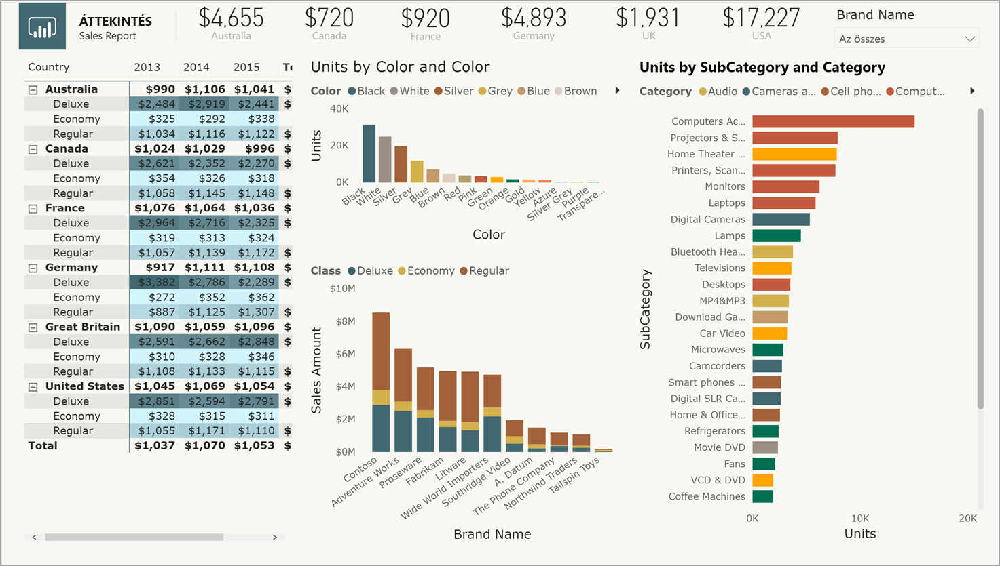
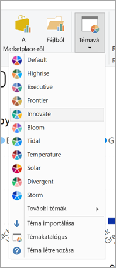
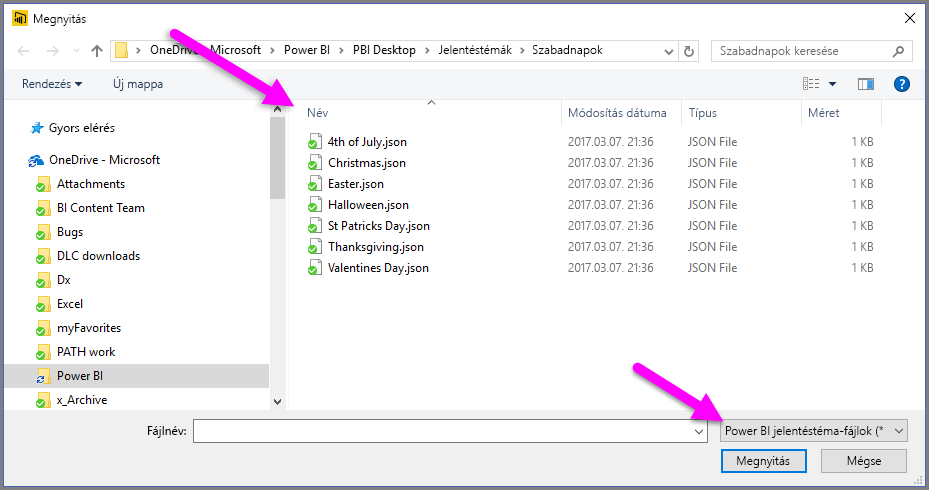

# <a name="use-report-themes-in-power-bi-desktop"></a>Jelentéstémák használata a Power BI Desktopban

A Power BI Desktop *jelentéstémáinak* használatával olyan tervezési módosításokat hajthat végre az egész jelentésen, mint a vállalati színek, a változó ikonkészletek, vagy egy új alapértelmezett vizualizációs formázás. Jelentéstéma alkalmazásakor a jelentésben szereplő összes vizualizáció a kiválasztott téma színeit és formázását fogja alapértelmezettként használni. Ez alól van néhány kivétel, amelyeket a cikk későbbi részében mutatunk be.



Kétféle jelentéstéma létezik, a beépített jelentéstémák és az egyéni jelentéstémafájlok:

- A beépített jelentéstémák különböző előre meghatározott színsémákat nyújtanak, amelyek a Power BI Desktop beépített részei. A beépített jelentéstémákat közvetlenül a Power BI Desktop menüjéből választhatja ki.

- Az egyéni jelentéstémafájlok az ő alapstruktúrájukat meghatározó JSON-fájlokban jönnek létre. Egyéni jelentéstéma alkalmazásához importálja a JSON-fájlt ezután a Power BI Desktopba, majd alkalmazza a jelentésre.

  A meglévő jelentéstémákat is testreszabhatja a Power BI Desktopban a [**Téma testreszabása** párbeszédpanelen](#create-and-customize-a-theme-in-power-bi-desktop).

A **Vizualizációk** panel **Formázás** szakaszában látható elemek szinte mindegyikét testreszabhatja és egységesítheti közvetlenül a Power BI Desktopban elvégezve a testreszabásokat, vagy a jelentéstéma JSON-fájljával. A cél az, hogy teljes körűen, egészen a legapróbb részletekig megszabhassa a jelentések alapértelmezett megjelenését és működését.

## <a name="how-report-themes-work"></a>A jelentéstémák működése

Power BI Desktop-jelentésre úgy alkalmazhat jelentéstémát, hogy kiválaszt egyet az [elérhető beépített jelentéstémák](#built-in-report-themes) közül, [egyéni JSON-témafájlt importál](#import-custom-report-theme-files) vagy a [**Téma testreszabása** párbeszédpanelt használja](#create-and-customize-a-theme-in-power-bi-desktop).

A testreszabható alapértelmezésekről a [jelentéstémák JSON-formátuma](#report-theme-json-file-format) című szakasz nyújt részletes leírást.

### <a name="built-in-report-themes"></a>Beépített jelentéstémák

Választás a rendelkezésre álló beépített jelentéstémák közül:

1. Válassza a **Témaváltás** lehetőséget a **Kezdőlap** menüszalagon.

   

2. Válassza ki a legördülő menü egyik elemét.

   A jelentéstémát ezzel alkalmazza a jelentésre.

A következő táblázat a rendelkezésre álló beépített jelentéstémákat mutatja be.

| Beépített jelentéstéma | Alapértelmezett színsorrend |
|------ |---------- |
| Alapértelmezett | |
| Toronyház | |
| Vezető | |
| Határ| |
| Újítás | |
| Virágzás | |
| Hullámzás| |
| Hőmérséklet | |
| Nap| |
| Széttartó | |
| Vihar | |
| Klasszikus | |
| Városi park | |
| Osztályterem | |
| Színvakok által is használható | |
| Elektromos | |
| Kontrasztos | |
| Naplemente | |
| Alkonyat | |

## <a name="customize-report-themes"></a>Jelentéstémák testreszabása

A Power BI Desktop 2019. decemberi kiadásától kezdődően a jelentéstémák kétféleképpen szabhatók testre:

- [Téma létrehozása és testreszabása a Power BI Desktopban](#create-and-customize-a-theme-in-power-bi-desktop)
- [Egyéni jelentéstéma JSON-fájljának létrehozása és testreszabása](#introduction-to-report-theme-json-files)

### <a name="create-and-customize-a-theme-in-power-bi-desktop"></a>Téma létrehozása és testreszabása a Power BI Desktopban

Téma közvetlen testreszabása a Power BI Desktopban:

1. A **Kezdőlap** menüszalagján válassza a **Témaváltás** > **Aktuális téma testreszabása** lehetőséget.

   Megjelenik egy párbeszédpanel, amelyen a jelentésre aktuálisan alkalmazott jelentéstéma testreszabási lehetőségei láthatók.

   

2. Ha egy meglévő témát szeretne módosítani, válassza ki (vagy importálja) a témát, majd válassza az **Aktuális téma testreszabása** lehetőséget.

   

A testreszabható témabeállítások a következő kategóriákba vannak sorolva, amelyek a **Téma testreszabása** ablakban is megjelennek:

- **Név és színek**: A téma név- és színbeállításai tartalmazzák a [témaszíneket](#how-report-theme-colors-stick-with-your-reports), a hangulatszíneket, az eltérő színeket és a [szerkezeti színeket (Speciális)](#setting-structural-colors) is.
- **Szöveg**: A szövegbeállítások tartalmazzák a betűkészletet, a méretet és a színt, amelyek meghatározzák az [elsődleges szövegosztály alapértelmezéseit](#setting-formatted-text-defaults) a címkékhez, címekhez, kártyákhoz és KPI-khez, valamint a lapok fejléceihez.
- **Vizualizációk**: A vizualizációk beállításai között szerepel a háttér, a szegélyek, a fejléc és az elemleírások.
- **Oldal**: A lap elembeállításai közé tartozik a háttérkép és a háttér.
- **Szűrőpanel**: A Szűrő panel beállításai, beleértve a háttérszínt, az átlátszóságot, a betűtípust és az ikon színét, a méretet, és a szűrőkártyákat.

A módosítások elvégzése után a téma mentéséhez válassza az **Alkalmazás és mentés** lehetőséget. A téma mostantól a jelenlegi jelentésben is használható, valamint exportálható.

Az aktuális téma ilyen testreszabásával gyorsan és egyszerűen szabhat testre témákat. Azonban finomabb módosításokat is végezhet a témákban, amelyhez a téma [JSON-fájljának módosítása](#report-theme-json-file-format) szükséges.

> [!TIP]
> A leggyakrabban használt jelentéstéma-beállításokat testreszabhatja a **Téma testreszabása** párbeszédpanel vezérlőivel. Ennél részletesebb beállításhoz exportálhatja a téma JSON-fájlját, és részletes módosításokat végezhet manuálisan a fájlban megadott beállítások módosításával. Átnevezheti a részletesen beállított JSON-fájlt, és később importálhatja.

### <a name="import-custom-report-theme-files"></a>Egyéni jelentéstémafájlok importálása

Egyéni jelentéstémafájlok importálása:

1. Válassza a **Témaváltás** lehetőséget a **Kezdőlap** menüszalagon, majd a legördülő menüben válassza a **Téma importálása** elemet.

   

   Ekkor megjelenik egy ablak, amelyben megkeresheti a JSON-témafájl helyét.

2. Az alábbi képen néhány ünnepi témafájl szerepel. Példánkban egy márciushoz illő ünnepi témát, a *St Patricks Day.json* fájlt fogjuk kiválasztani.

   

   A Power BI Desktop jelzi, ha a téma sikeresen betöltődött.

   

## <a name="introduction-to-report-theme-json-files"></a>A jelentéstéma JSON-fájljai – bevezetés

 Amikor megnyitja az előző szakaszban említett alapszintű JSON-fájlt (St Patricks Day.json), az a következőképpen jelenik meg:

 ```json
    {
        "name": "St Patrick's Day",
        "dataColors": ["#568410", "#3A6108", "#70A322", "#915203", "#D79A12", "#bb7711", "#114400", "#aacc66"],
        "background":"#FFFFFF",
        "foreground": "#3A6108",
        "tableAccent": "#568410"
    }
```

A jelentéstéma JSON-fájlja a következő sorokat tartalmazza:

- **name** (név): A jelentéstéma neve. Ez az egyetlen kötelező mező.
- **dataColors** (adatszínek): A Power BI Desktop vizualizációiban szereplő adatokhoz használható hexadecimális színkódok listája. A lista annyi színt tartalmazhat, amennyit csak szeretne.
- **background**, **firstLevelElements**, **tableAccent** (stb.): Színosztályok. A színosztályokkal egyszerre több szerkezeti színt állíthat be a jelentésben.

A JSON-fájlt alapul használva saját importálandó jelentéstémafájlt hozhat létre. Ha a csak a jelentés alapvető színeit szeretné módosítani, módosítsa a fájl nevét és hexadecimális kódjait.

A jelentéstémák JSON-fájljaiban Önnek csak a módosítani kívánt formázást kell meghatároznia. Amit nem szab meg a JSON-fájlban, az visszaáll a Power BI Desktop alapértelmezett beállításaira.

A JSON-fájlok létrehozásának számos előnye van. Megadhatja például, hogy minden diagram 12-es betűméretet használjon, vagy hogy egyes vizualizációk egy adott betűtípuscsaládot használjanak, esetleg kikapcsolhatja az adatcímkéket bizonyos diagramtípusoknál. JSON-fájlok használatával olyan jelentéstémafájlt hozhat létre, amely szabványosítja a diagramokat és a jelentéseket, így megkönnyíti az egységes vállalati jelentések létrehozását.

A JSON-fájl formátumával kapcsolatos további információ: [Jelentéstémát tartalmazó JSON-fájlok formátuma](#report-theme-json-file-format).

> [!NOTE]
> Egy egyéni JSON-jelentéstémát biztonságosan módosíthat a [**Téma testreszabása** párbeszédpanelen](#create-and-customize-a-theme-in-power-bi-desktop).  A párbeszédpanel nem módosítja azokat a témabeállításokat, amelyeket nem tud szabályozni, és helyben frissíti a jelentéstéma módosításait.

## <a name="how-report-theme-colors-stick-with-your-reports"></a>Hogyan társulnak a jelentéshez a jelentéstéma színei?

Ha a jelentést közzéteszi a Power BI szolgáltatásban, a Jelentéstéma színei társítva maradnak. A **Formátum** panel **Adatszínek** szakaszában megjelenik a választott jelentéstéma.

A jelentéstémában elérhető színek megtekintése:

1. Válasszon ki egy vizualizációt.

2. Az **Vizualizáció** panel **Formátum** szakaszában válassza az **Adatszínek** elemet.

3. A jelentéstéma **témaszínadatainak** megtekintéséhez válassza ki az egyik elem legördülő menüjét.

   

A példánkban St. Patrick’s Day jelentéstémában szereplő sokféle zöld és barna szín alkalmazása után tekintse meg a témaszíneket. Látja ezt a sok zöld árnyalatot? Ez azért jelenik meg így, mert ezek a színek az előzőleg importált és alkalmazott jelentéstéma részei.

A színpaletta színei az éppen használatban lévő témához is kapcsolódnak. Tegyük fel például, hogy a felső sor harmadik színét választja ki egy adatponthoz. Ha később egy másik témára vált, az adatpont színe automatikusan frissül az új téma felső sorának harmadik színére, ahogyan az a Microsoft Office-ban is történne.

### <a name="situations-when-report-theme-colors-wont-stick-to-your-reports"></a>Milyen helyzetekben nem társulnak a jelentéshez a jelentéstéma színei?

Tegyük fel, hogy egyéni színkészletet (vagy egyedi színt) alkalmaz egy vizualizáció valamelyik adatpontjára a színválasztó **Egyéni szín** lehetőségének segítségével. Ha ezután egy jelentéstémát alkalmaz, azzal *nem* fogja felülírni az imént testre szabott adatpontot.

Vagy tegyük fel, hogy manuálisan állítja be egy adatpont színét a **Téma színei** szakaszban. Új jelentéstéma alkalmazásakor ezek a színek *nem* fognak frissülni. Az alapértelmezett színek visszaállításához (ha azt szeretné, hogy azok frissüljenek egy új jelentéstéma alkalmazásakor) válassza a **Visszaállítás alapértelmezettre** lehetőséget, vagy egy színt a színválasztóban a **Téma színei** palettán.


Számos Power BI-vizualizáció nem alkalmazza a jelentéstémákat.

## <a name="custom-report-theme-files-you-can-use-right-now"></a>Azonnal használható egyéni jelentéstémák

Meg szeretne ismerkedni a jelentéstémákkal? Tekintse meg az egyéni jelentéstémákat a [témakatalógusban](https://community.powerbi.com/t5/Themes-Gallery/bd-p/ThemesGallery), vagy próbálja ki az alábbi, előre elkészített egyéni jelentéstémák JSON-fájljait, amelyeket letöltés után a Power BI Desktop-jelentésbe importálhat:

- [Hullám téma](https://community.powerbi.com/t5/Themes-Gallery/Waveform/m-p/140536). Ezt a témát a jelentéstémák első kiadását bejelentő [blogbejegyzésben](https://powerbi.microsoft.com/blog/power-bi-desktop-march-feature-summary/) mutattuk be. [A Waveform.json fájl letöltése](https://go.microsoft.com/fwlink/?linkid=843924).

  

- [Színvak felhasználók számára is látható téma](https://community.powerbi.com/t5/Themes-Gallery/Color-Blind-Friendly/m-p/140597).
Ez a jelentéstéma könnyebben olvasható a látássérültek számára. [A ColorblindSafe-Longer.json fájl letöltése](https://go.microsoft.com/fwlink/?linkid=843923).

  .

- Power View-témák, többek között az Apothecary.json. [Power View-témák letöltése zip-fájlban](https://go.microsoft.com/fwlink/?linkid=843925).

  

- A Valentine's Day téma.

  

  Innen kimásolhatja Valentine's Day nevű JSON-fájl kódját:

   ```json
       {
           "name": "Valentine's Day",
           "dataColors": ["#990011", "#cc1144", "#ee7799", "#eebbcc", "#cc4477", "#cc5555", "#882222", "#A30E33"],
           "background":"#FFFFFF",
           "foreground": "#ee7799",
           "tableAccent": "#990011"
       }
   ```

Íme néhány további jelentéstéma, amelyet kiindulási pontként használhat:

- [Sunflower-twilight](https://community.powerbi.com/t5/Themes-Gallery/Sunflower-Twilight/m-p/140749)
- [Plum](https://community.powerbi.com/t5/Themes-Gallery/Plum/m-p/140711)
- [Autumn](https://community.powerbi.com/t5/Themes-Gallery/Autumn/m-p/140746)
- [High contrast](https://community.powerbi.com/t5/Themes-Gallery/Color-Blind-Friendly/m-p/140597)

A jelentéstémák színek segítségével tükrözhetik az Ön személyiségét, vagy a vállalat arculatát, esetleg az aktuális évszak, vagy ünnep hangulatát.

## <a name="export-report-themes-preview"></a>Jelentéstémák exportálása (előzetes verzió)

A Power BI Desktop 2019. decemberi kiadásától kezdődően közvetlenül exportálhatja a Power BI Desktopból az aktuálisan alkalmazott jelentéstémát egy JSON-fájlba. Jelentéstéma exportálása után újra felhasználhatja azt más jelentésekben. Ezen a módon a legtöbb beépített téma JSON-fájlját is exportálhatja. Az egyetlen kivétel az alapszintű Klasszikus és Alapértelmezett téma, amelyekre más importált témák épülnek.

A jelenleg alkalmazott téma exportálása Power BI Desktopról:

1. Válassza a **Fájl** > **Lehetőségek és beállítások** > **Beállítások** menüpontot.

2. Az **Előzetes verziójú funkciók** szakaszban válassza ki **Aktuális téma testreszabása** lehetőséget, majd válassza **OK** gombot.

   A rendszer kérheti, hogy az előzetes verziójú funkció engedélyezéséhez indítsa újra a Power BI Desktopot. Az újraindítás után megkezdheti az aktuálisan alkalmazott téma exportálását.

3. A **Kezdőlap** menüszalagján válassza a **Témaváltás** > **Aktuális téma testreszabása** lehetőséget.

4. A **Mentés másként** párbeszédpanelen keresse meg azt a könyvtárat, amelybe a JSON-fájlt menteni szeretné, majd válassza a **Mentés**lehetőséget.

## <a name="report-theme-json-file-format"></a>Jelentéstémát tartalmazó JSON-fájlok formátuma

A téma JSON-fájlja alapesetben csak egyetlen kötelező sorral rendelkezik: ez a **név**.

```json
{
    "name": "Custom Theme"
}
```

A **név** kivételével minden más szabadon választható, így a témafájlhoz csak a formázni kívánt tulajdonságokat kell hozzáadnia, a többihez tovább használhatja a Power BI alapértelmezett beállításait.

### <a name="setting-theme-colors"></a>Témaszínek beállítása

A **név** alatt az adatok színéhez kapcsolódó következő alapvető tulajdonságokat veheti fel:

- **dataColors** (adatszínek): A Power BI Desktop-vizualizációkban szereplő adatokat megjelenítő alakzatok színezéséhez használható hexadecimális színkódok listája. A lista annyi színt tartalmazhat, amennyit csak szeretne. Ha a lista összes színét felhasználta, és a vizualizációhoz további színek szükségesek, a rendszer automatikusan visszavált a Power BI alapértelmezett színpalettájára.
- **jó**, **semleges**, **rossz**: Ezek állítják be a vízesésdiagram és a KPI-vizualizáció által használt állapotszíneket.
- **maximum**, **közép**, **minimum**, **null**: Ezek a színek állítják be a különböző színátmeneteket a feltételes formázás párbeszédpanelen.

A színeket meghatározó alapszintű téma a következőhöz hasonló:

```json
{
    "name": "Custom Theme",
    "dataColors": [
        "#118DFF",
        "#12239E",
        "#E66C37",
        "#6B007B",
        "#E044A7",
        "#744EC2",
        "#D9B300",
        "#D64550",
        "#197278",
        "#1AAB40"
    ],
    "good": "#1AAB40",
    "neutral": "#D9B300",
    "bad": "#D64554",
    "maximum": "#118DFF",
    "center": "#D9B300",
    "minimum": "#DEEFFF",
    "null": "#FF7F48"
}
```

### <a name="setting-structural-colors"></a>Szerkezeti színek beállítása

A következő lépésben különböző színosztályokat vehet fe, például **background** (háttér) és **firstLevelElements** (első szintű elemek). Ezek a színosztályok határozzák meg a jelentés olyan szerkezeti elemeinek színét, mint a tengely-rácsvonalak, a kiemelő színek és a vizualizáció elemeinek háttérszíne.

A formázható hat színosztály az alábbi táblázatban látható.  A **színosztályok** neve a [**Téma testreszabása** párbeszédpanel](#create-and-customize-a-theme-in-power-bi-desktop) „Név és színek” területének „Speciális” részén megadott neveknek felel meg.

|Színosztály  |Ezt formázza  |
|---------|---------|
| **firstLevelElements** <br> **foreground**    (elavult) | Feliratok háttérszíne (ha az adatpontok kívül vannak) <br> Trendvonal színe <br>  Szövegdoboz alapértelmezett színe <br> Táblázat- és mátrix-értékek és összegek betűszínek Adatsávok tengely színe <br> Kártya-adatfeliratok <br> Kijelző képfelirat értékének színe <br> KPI cél színe <br>  KPI szöveg színe <br> Szeletelő elem színe (Fókusz módban)  <br> Szeletelő legördülő elem betűszíne <br> Szeletelő numerikus bevitel betűszíne <br> Szeletelő fejléc betűszíne <br> Pontdiagram arányvonal színe <br> Vonaldiagram előrejelzés-vonal színe <br> Térképvezető vonal színe <br> Szűrő ablaktábla és kártya szövegszíne|
| **secondLevelElements** <br> **foregroundNeutralSecondary** (elavult) | „világos” [másodlagos szövegosztályok](#setting-formatted-text-defaults) <br> Címkék színe  <br> Jelmagyarázat címke színe <br> Tengely címke színe <br> Táblázat és mátrix fejlécének betűszíne <br> Kijelző cél és célvezető vonal színe <br>  KPI trend tengelyének színe <br> Szeletelő csúszka színe <br> Szeletelő elem betűszíne <br> Szeletelő körvonalának színe <br> Vonaldiagram színe rámutatáskor <br> Többsoros kártya címének színe <br> Menüszalag-diagram vonás színe <br> Alakzat leképezésének szegélyszíne <br> Gomb szövegének betűszíne <br> Gomb ikon vonalszíne <br> Gomb körvonalának színe |
| **thirdLevelElements** <br >**backgroundLight** (elavult) | Tengely rácsvonalának színe <br> Táblázat és mátrix rács színe <br> Szeletelő fejléc háttérszíne (Fókusz módban)  <br> Többsoros kártya körvonalának színe  <br> Alakzatkitöltés színe <br> Kijelző ív háttérszíne <br> Alkalmazott szűrőkártya háttérszíne <br> Ha a háttér = FFFFFF: <br> Gomb kitöltőszíne letiltva <br> Gomb körvonalának színe letiltva <br> |
| **fourthLevelElements** <br> **foregroundNeutralTertiary** (elavult) | jelmagyarázat halvány színe <br> Kártya kategóriacímke színe <br> Többsoros kártya kategóriacímke színe <br> Többsoros kártya sávszíne <br> Tölcsérdiagram konverziós ráta vonás színe <br> Gomb szövegének betűszíne letiltva <br> Gomb ikon vonalszíne letiltva <br> |
| **háttér** | Címkék háttérszíne (ha az adatpontok belül vannak) <br> Szeletelő legördülő elemeinek háttérszíne  <br> Fánkdiagram vonás színe <br> Fatérkép vonás színe <br> Kombinált diagram háttérszíne <br> Gomb kitöltőszíne <br> Szűrő ablaktábla és elérhető szűrőkártya háttérszíne |
| **secondaryBackground** <br> **backgroundNeutral** (elavult) | Táblázat- és mátrixrács körvonalának színe <br> Alakzat leképezésének alapértelmezett színe <br> Menüszalag-diagram kitöltőszíne (ha a sorozategyeztetés ki van kapcsolva) <br> Ha a háttér != FFFFFF: <br> Gomb kitöltőszíne letiltva <br> Gomb körvonalának színe letiltva <br> |
| **tableAccent** | Felülbírálja a táblázat- és mátrixrács körvonalának színét, ha van |

Ez a témaminta a színosztályokat állítja be:

```json
{
    "name": "Custom Theme",
    "firstLevelElements": "#252423",
    "secondLevelElements": "#605E5C",
    "thirdLevelElements": "#F3F2F1",
    "fourthLevelElements": "#B3B0AD",
    "background": "#FFFFFF",
    "secondaryBackground": "#C8C6C4",
    "tableAccent": "#118DFF"
}
```

> [!TIP]
> Ha „sötét témát”, vagy a tipikus „fekete” **firstLevelElements** elemek „fehér” **background** háttéren stílustól eltérő más színes témát készít, mindig állítsa be a többi szerkezeti színt és az [elsődleges szövegosztály színeit](#setting-formatted-text-defaults) is.  Így biztosítható, hogy (például) a diagramok háttérrel rendelkező adatfeliratai ne üssenek el a várt stílustól és olvashatóak legyenek, valamint hogy a tengely-rácsvonalak is jól látsszanak.

### <a name="setting-formatted-text-defaults"></a>Formázott szöveg alapértelmezéseinek beállítása

Ezt követően szövegosztályokat adhat a JSON-fájlhoz. Ezek hasonlítanak a színosztályokhoz, de a funkciójuk az, hogy a jelentésben szereplő szövegcsoportok betűinek nagyságát, színét és családját frissíthesse velük.

12 szövegosztály van, de csak négyet kell beállítania a jelentésben szereplő különböző szövegcsoportokhoz: ezek az úgynevezett *elsődleges osztályok*.  Ez a négy elsődleges osztály a [**Téma testreszabása** párbeszédpanel](#create-and-customize-a-theme-in-power-bi-desktop) ”Szöveg” területén állítható be: Az „Általános” címszó a **feliratokra**, a „Cím” a **címekre**, a „Kártyák és KPI-k” a **képfeliratokra**, a „Lapfejlécek” pedig **fejlécekre** vonatkozik.

A többi szövegosztály, a *másodlagos osztályok*, automatikusan származtatják tulajdonságaikat a társított elsődleges osztályokból. A másodlagos osztályok gyakran választanak halványabb színárnyalatot vagy arányosan nagyobb, illetve kisebb szövegméretet az elsődleges osztályokból.

Vegyük példának a **címke** osztályt. A **címke** osztály alapértelmezett formázása Segoe UI, #252423 (sötétszürke szín) és 12 pontos betűméret. Ez az osztály a tábla és a mátrix értékeit formázza. A táblázatban és a mátrixban szereplő végösszegek általában hasonló formázást kapnak, de a kiemelés kedvéért félkövér változatban, így a **félkövér** címkeosztályt használják. Ezt az osztályt azonban nem kell megadnia a téma JSON-fájljában; a Power BI ezt automatikusan megteszi. Ha később úgy dönt, hogy 14 pontos betűmérettel rendelkező címkét ad meg a témában, nem kell frissítenie a **félkövér címke** osztályt, mivel az örökli a **címke** osztály szövegformázását.

Az alábbi táblázat az alábbi adatokat tartalmazza:

- A négy elsődleges szövegosztályt, az általuk elvégzett formázást, és az alapértelmezett beállításokat
- Az összes másodlagos osztályt, az általuk végrehajtott formázásokat, és azt az alapértelmezett beállítást, ami egyedi az elsődleges osztályhoz képest

|Elsődleges osztály  |Másodlagos osztályok  |JSON-osztály neve  | Alapértelmezett beállítások  |Társított vizualizációs objektumok  |
|---------|---------|---------|---------|---------|
| Képfelirat | N.A. | képfelirat | DIN <br> #252423 <br> 45pt |Kártya-adatfeliratok <br> KPI-kijelzők|
|Fejléc|N.A.|fejléc|Segoe UI Semibold <br> #252423 <br> 12pt |Főbb befolyásolók fejlécei |
| Cím || cím |DIN <br> #252423 <br> 12pt |Kategória tengely neve <br> Értéktengely neve <br> Többsoros kártya címe * <br> Szeletelő fejléce|
|-| Nagy cím | largeTitle |14pt |Vizualizáció címe |
|Címke ||címke |Segoe UI<br>#252423<br>10pt |Tábla és mátrix oszlopainak fejlécei <br> Mátrix sorazonosítók<br>Táblázat és mátrix rács<br>Táblázat és mátrix értékek |
|-|Félkövér |semiboldLabel| Segoe UI Semibold | Főbb befolyásolók profiljának szövege
|-|Nagy |largeLabel |12pt | Többsoros kártya-adatfeliratok |
|-|Kicsi |smallLabel |9pt |Referenciavonalak címkéi * <br>Szeletelő adattartomány címkéi<br> Szeletelő numerikus bevitel szövegstílusa<br>Szeletelő keresődoboz<br>Főbb befolyásolók befolyásolószövegei|
|-|Világos |lightLabel |#605E5C |Jelmagyarázat szövege<br>Gomb szövege<br>Kategória tengelycímkék<br>Tölcsérdiagram adatcímkék<br>Tölcsérdiagram konverziós ráta címkék<br>Kijelző cél<br>Pontdiagram kategóriacímke<br>Szeletelő elemek|
|-|Félkövér |boldLabel |Segoe UI Bold |Mátrix részösszegek<br>Mátrix végösszegek<br>Táblázat végösszegek |
|-|Nagy és világos |largeLightLabel |#605E5C<br>12pt |Kártya kategóriacímkék<br>Kijelző címkék<br>Többsoros kártya kategóriacímkék |
|-|Kicsi és világos |smallLightLabel |#605E5C<br>9pt |Adatfeliratok<br>Érték tengelycímkék|

*\* A csillaggal jelölt elemek is a jelentéstéma első adatszínével vannak színezve.*

> [!TIP]
> A szövegosztályok *világos* változatai a fentiekben definiált [szerkezeti színekből](#setting-structural-colors) veszik a világos színt.  Ha „sötét témát” készít, mindig állítsa be a „firstLevelElements” (az elsődleges szövegszínnel azonos), a „secondLevelElements” (a kívánt „világos” szövegszínnel azonos) és a „background” (az első és második szintű elemek színével is kellően kontrasztos) színt is.

Ez a mintatéma csak az elsődleges szövegosztályokat állítja be:

```json
{
    "name": "Custom Theme",
    "textClasses": {
        "callout": {
            "fontSize": 45,
            "fontFace": "DIN",
            "color": "#252423"
        },
        "title": {
            "fontSize": 12,
            "fontFace": "DIN",
            "color": "#252423"
        },
        "header": {
            "fontSize": 12,
            "fontFace": "Segoe UI Semibold",
            "color": "#252423"
        },
        "label": {
            "fontSize": 10,
            "fontFace": "Segoe UI",
            "color": "#252423"
        }
    }
}
```

Mivel a másodlagos osztályok az elsődleges osztályoktól örökölnek tulajdonságokat, ezeket nem kell beállítania a témafájlban. Azonban ha nincs megelégedve az öröklési szabályokkal (például nem szeretné, ha a végösszegek a táblázat többi értékének félkövér változatában szerepelnének), explicit módon is formázhatja a témafájlban található másodlagos osztályokat, az elsődleges osztályokhoz hasonlóan.

### <a name="setting-visual-property-defaults-visualstyles"></a>Vizualizációtulajdonságok alapértelmezéseinek beállítása (`visualStyles`)

Végül pedig, ha egy bővített, a jelentések összes vizualizáció-formázását jóval részletesebben szabályozó JSON-fájlt szeretne létrehozni, akkor beszúrhat egy **visualStyles** nevű szakaszt a JSON-fájlba, amellyel beágyazhatja a formázási beállításokat. Az alábbi sablon a **visualStyles** szakaszra mutat példát:

```json
    "visualStyles": {
        "<visualName>": {
            "<styleName>": {
                "<cardName>": [{
                    "<propertyName>": <propertyValue>
                }]
            }
        }
    }
```

A **visualName** és a **cardName** szakaszokban használjon egy adott vizualizáció- és kártyanevet. Jelenleg a **styleName** mindig egy csillag jel (*), de egy későbbi kiadásban különböző stílusokat hozhat létre a vizualizációkhoz, és elnevezheti őket (a táblázat és mátrix stílus-funkciójához hasonlóan). A **propertyName** a formázási lehetőség neve, a **propertyValue** pedig a formázási lehetőség értéke.

A **visualName** és a **cardName** esetén használja az idézőjelek közé helyezett csillag karaktert, ha a beállítást minden olyan vizualizációra vagy kártyára alkalmazni szeretné, amely rendelkezik egy tulajdonsággal. Ha a vizualizáció és a kártya neve helyett is a csillagjelet használja, hatékonyan alkalmazhatja a beállítást az egész jelentésre, például ugyanazt a betűméretet vagy konkrét betűosztályt használhatja minden szöveghez, minden vizualizációban.

Ez a minta néhány tulajdonság beállítását mutatja be a vizuális stílusokon keresztül:

```json
{
   "name":"Custom Theme",
   "visualStyles":{
      "*": {
         "*": {
            "*": [{
                "wordWrap": true
            }],
            "categoryAxis": [{
                "gridlineStyle": "dotted"
            }],
            "filterCard": [
              {
                "$id": "Applied",
                "foregroundColor": {"solid": {"color": "#252423" } }
              },
              {
                "$id":"Available",
                "border": true
              }
            ]
         }
      },
      "scatterChart": {
         "*": {
            "bubbles": [{
                  "bubbleSize": -10
            }]
         }
      }
   }
}
```

Ez a példa a következő beállításokat végzi el:

- Sortörés bekapcsolása mindenhol
- Rácsvonal stílusának pontozottra állítása minden, kategóriatengellyel rendelkező vizualizációban
- Formázás beállítása az elérhető és alkalmazott szűrőkártyákhoz (figyelje meg a „$id” elemet használó formátumot a szűrőkártyák verzióinak beállításánál)
- Buborék méretének beállítása pontdiagramokhoz, -10 értékre.

> [!NOTE]
> Csak azokat a formázási elemeket kell megadnia, amelyeket módosítani szeretne. A JSON-fájlban nem szereplő formázási elemek az alapértelmezett értékeket és beállításokat veszik fel.

### <a name="visualstyles-definition-list"></a>`visualStyles` definíciólista

Az ebben a szakaszban szereplő táblázatok a JSON-fájl létrehozásához szükséges vizualizációneveket (**visualName**), kártyaneveket (**cardName**), tulajdonságneveket (**propertyName**) és enumerálásokat adják meg.

| visualName-értékek |
| --- |
| areaChart |
| barChart |
| basicShape |
| card |
| clusteredBarChart |
| clusteredColumnChart |
| columnChart |
| comboChart |
| donutChart |
| filledMap |
| funnel |
| gauge |
| hundredPercentStackedBarChart |
| hundredPercentStackedColumnChart |
| image |
| kpi |
| lineChart |
| lineClusteredColumnComboChart |
| lineStackedColumnComboChart |
| map |
| multiRowCard |
| pieChart |
| pivotTable |
| ribbonChart |
| scatterChart |
| shapeMap |
| slicer |
| stackedAreaChart |
| tableEx |
| treemap |
| waterfallChart |

Az alábbi tábla **cardName** értékeket határoz meg. Az egyes cellákban szereplő első érték a JSON-fájl kifejezés. A második érték a kártyának a Power BI Desktop felhasználói felületén megjelenített neve.

| cardName-értékek |
| --- |
| axis: Mérőtengely |
| breakdown: Lebontás |
| bubbles: Buborékok |
| calloutValue: Buborék értéke |
| card: Kártya |
| cardTitle: Kártya címe |
| categoryAxis: X tengely |
| categoryLabels: Kategóriacímkék |
| columnFormatting: Mezőformázás |
| columnHeaders: Oszlopfejlécek |
| dataLabels: Adatfeliratok |
| fill: Kitöltés |
| fillPoint: Kitöltési pont |
| forecast: Előrejelzés |
| general: Általános |
| goals: Célok |
| grid: Rács |
| header: Fejléc |
| imageScaling: Méretezés |
| indicator: Jelző |
| items: Elemek |
| labels: Adatfeliratok |
| legend: Jelmagyarázat |
| lineStyles: Alakzatok |
| mapControls: Térképvezérlők |
| mapStyles: Térképstílusok |
| numericInputStyle: Számbevitelek |
| percentBarLabel: Árfolyamcímke |
| plotArea: Rajzterület |
| plotAreaShading: Szimmetriaárnyékolás |
| ratioLine: Arányvonal |
| referenceLine: Állandó-vonal |
| ribbonChart: Menüszalagok |
| rotation: Elforgatás |
| rowHeaders: Sorazonosítók |
| selection: Kijelölési vezérlők |
| sentimentColors: Hangulatszínek |
| shape: Alakzat |
| slider: Csúszka |
| status: Színkódok |
| subTotals: Részösszegek |
| target: Cél |
| total: Végösszeg |
| trend: Trendvonal |
| trendline: Trendtengely |
| valueAxis: Y tengely |
| values: Értékek |
| wordWrap: Sortörés |
| xAxisReferenceLine: Állandó-vonal az X tengelyen |
| y1AxisReferenceLine: Állandó-vonal |
| zoom: Nagyítás |

### <a name="properties-within-each-card"></a>Az egyes kártyákon belüli tulajdonságok

A következő szakasz az egyes kártyákon belüli tulajdonságokat határozza meg. A kártya neve után az egyes tulajdonságok neve következik. Minden tulajdonság esetén a formázás ablaktábla megjelenítésekor látható név, a formázási lehetőség által végzett művelet leírása, és a formázási lehetőség típusa. Ez a módszer megmutatja, hogy milyen értékeket használhat a témafájlban.

A **dateTime** érték meghatározásakor a dátumnak aposztrófok közötti ISO-formátumú dátumnak kell lennie, amely a „datetime” kifejezéssel kezdődik. Lásd a következő példát:

  „datetime'2011-10-05T14:48:00.000Z'”

A Boole-értékek értéke true (igaz) vagy false (hamis). A sztringeknek idézőjelek között kell szerepelniük, például "ez egy sztring". A számok csak az értéket magát jelzik, idézőjelek nélkül.

A színeket a következő formátumban kell megadni úgy, a példában szereplő „FFFFFF” helyére az egyéni hexadecimális kód kerüljön:

    { "solid": { "color": "#FFFFFF" } }

Az enumerálás általában a legördülő listák formázásánál használatos, és azt jelenti, hogy az elem az ablaktáblán lévő bármely lehetőséghez beállítható, például a „RightCenter” a jelmagyarázat pozíciójához, vagy a „Data value, percent of total” (Adatérték, az összes százaléka) a tortadiagram adatcímkéjéhez. Az enumerálások listája a tulajdonságlista alatt látható.

```json
{
      "general":{
        "responsive": {
          "type": [
            "bool"
          ],
          "displayName": [
            "(Preview) Responsive"
          ],
          "description": [
            "The visual will adapt to size changes"
          ]
        },
        "legend": {
        "show": {
          "type": [
            "bool"
          ],
          "displayName": [
            "Show"
          ]
        },
        "position": {
          "type": [
            "enumeration"
          ],
          "displayName": [
            "Position"
          ],
          "description": [
            "Select the location for the legend"
          ]
        },
        "showTitle": {
          "type": [
            "bool"
          ],
          "displayName": [
            "Title"
          ],
          "description": [
            "Display a title for legend symbols"
          ]
        },
        "labelColor": {
          "type": [
            "fill"
          ],
          "displayName": [
            "Color"
          ]
        },
        "fontFamily": {
          "type": [
            "formatting"
          ],
          "displayName": [
            "Font family"
          ]
        },
        "fontSize": {
          "type": [
            "formatting"
          ],
          "displayName": [
            "Text Size"
          ]
        }
      },
      "categoryAxis": {
        "show": {
          "type": [
            "bool"
          ],
          "displayName": [
            "Show"
          ]
        },
        "axisScale": {
          "type": [
            "enumeration"
          ],
          "displayName": [
            "Scale type"
          ]
        },
        "start": {
          "type": [
            "numeric",
            "dateTime"
          ],
          "displayName": [
            "Start"
          ],
          "description": [
            "Enter a starting value (optional)"
          ]
        },
        "end": {
          "type": [
            "numeric",
            "dateTime"
          ],
          "displayName": [
            "End"
          ],
          "description": [
            "Enter an ending value (optional)"
          ]
        },
        "axisType": {
          "type": [
            "enumeration"
          ],
          "displayName": [
            "Type"
          ]
        },
        "showAxisTitle": {
          "type": [
            "bool"
          ],
          "displayName": [
            "Title"
          ],
          "description": [
            "Title for the X-axis",
            "Title for the Y-axis"
          ]
        },
        "axisStyle": {
          "type": [
            "enumeration"
          ],
          "displayName": [
            "Style"
          ]
        },
        "labelColor": {
          "type": [
            "fill"
          ],
          "displayName": [
            "Color"
          ]
        },
        "fontFamily": {
          "type": [
            "formatting"
          ],
          "displayName": [
            "Font family"
          ]
        },
        "fontSize": {
          "type": [
            "formatting"
          ],
          "displayName": [
            "Text Size"
          ]
        },
        "labelDisplayUnits": {
          "type": [
            "formatting"
          ],
          "displayName": [
            "Display units"
          ],
          "description": [
            "Select the units (millions, billions, etc.)"
          ]
        },
        "labelPrecision": {
          "type": [
            "numeric"
          ],
          "displayName": [
            "Value decimal places"
          ],
          "description": [
            "Select the number of decimal places to display for the values"
          ]
        },
        "concatenateLabels": {
          "type": [
            "bool"
          ],
          "displayName": [
            "Concatenate labels"
          ],
          "description": [
            "Always concatenate levels of the hierarchy instead of drawing the hierarchy."
          ]
        },
        "preferredCategoryWidth": {
          "type": [
            "numeric"
          ],
          "displayName": [
            "Minimum category width"
          ]
        },
        "titleColor": {
          "type": [
            "fill"
          ],
          "displayName": [
            "Title color"
          ]
        },
        "titleFontFamily": {
          "type": [
            "formatting"
          ],
          "displayName": [
            "Font family"
          ]
        },
        "titleFontSize": {
          "type": [
            "formatting"
          ],
          "displayName": [
            "Title text size"
          ]
        },
        "position": {
          "type": [
            "enumeration"
          ],
          "displayName": [
            "Position"
          ],
          "description": [
            "Select left or right"
          ]
        },
        "color": {
          "type": [
            "fill"
          ],
          "displayName": [
            "Color"
          ],
          "description": [
            "Select color for data labels"
          ]
        },
        "duration": {
          "type": [
            "numeric"
          ]
        }
      },
      "valueAxis": {
        "show": {
          "type": [
            "bool"
          ],
          "displayName": [
            "Show"
          ]
        },
        "position": {
          "type": [
            "enumeration"
          ],
          "displayName": [
            "Position"
          ],
          "description": [
            "Select left or right"
          ]
        },
        "axisScale": {
          "type": [
            "enumeration"
          ],
          "displayName": [
            "Scale type"
          ]
        },
        "start": {
          "type": [
            "numeric",
            "dateTime"
          ],
          "displayName": [
            "Start"
          ],
          "description": [
            "Enter a starting value (optional)"
          ]
        },
        "end": {
          "type": [
            "numeric",
            "dateTime"
          ],
          "displayName": [
            "End"
          ],
          "description": [
            "Enter an ending value (optional)"
          ]
        },
        "showAxisTitle": {
          "type": [
            "bool"
          ],
          "displayName": [
            "Title"
          ],
          "description": [
            "Title for the Y-axis",
            "Title for the X-axis"
          ]
        },
        "axisStyle": {
          "type": [
            "enumeration"
          ],
          "displayName": [
            "Style"
          ]
        },
        "labelColor": {
          "type": [
            "fill"
          ],
          "displayName": [
            "Color"
          ]
        },
        "fontFamily": {
          "type": [
            "formatting"
          ],
          "displayName": [
            "Font family"
          ]
        },
        "fontSize": {
          "type": [
            "formatting"
          ],
          "displayName": [
            "Text Size"
          ]
        },
        "labelDisplayUnits": {
          "type": [
            "formatting"
          ],
          "displayName": [
            "Display units"
          ],
          "description": [
            "Select the units (millions, billions, etc.)"
          ]
        },
        "labelPrecision": {
          "type": [
            "numeric"
          ],
          "displayName": [
            "Value decimal places"
          ],
          "description": [
            "Select the number of decimal places to display for the values"
          ]
        },
        "titleColor": {
          "type": [
            "fill"
          ],
          "displayName": [
            "Title color"
          ]
        },
        "titleFontFamily": {
          "type": [
            "formatting"
          ],
          "displayName": [
            "Font family"
          ]
        },
        "titleFontSize": {
          "type": [
            "formatting"
          ],
          "displayName": [
            "Title text size"
          ]
        },
        "axisLabel": {
          "type": [
            "none"
          ],
          "displayName": [
            "Y-Axis (Column)"
          ]
        },
        "secShow": {
          "type": [
            "bool"
          ],
          "displayName": [
            "Show secondary"
          ]
        },
        "alignZeros": {
          "type": [
            "bool"
          ],
          "displayName": [
            "Align zeros"
          ],
          "description": [
            "Align the zero tick marks for both value axes"
          ]
        },
        "secAxisLabel": {
          "type": [
            "none"
          ],
          "displayName": [
            "Y-Axis (Line)"
          ]
        },
        "secPosition": {
          "type": [
            "enumeration"
          ],
          "displayName": [
            "Position"
          ],
          "description": [
            "Select left or right"
          ]
        },
        "secAxisScale": {
          "type": [
            "enumeration"
          ],
          "displayName": [
            "Scale type"
          ]
        },
        "secStart": {
          "type": [
            "numeric"
          ],
          "displayName": [
            "Start"
          ],
          "description": [
            "Enter a starting value (optional)"
          ]
        },
        "secEnd": {
          "type": [
            "numeric"
          ],
          "displayName": [
            "End"
          ],
          "description": [
            "Enter an ending value (optional)"
          ]
        },
        "secShowAxisTitle": {
          "type": [
            "bool"
          ],
          "displayName": [
            "Title"
          ],
          "description": [
            "Title for the Y-axis"
          ]
        },
        "secAxisStyle": {
          "type": [
            "enumeration"
          ],
          "displayName": [
            "Style"
          ]
        },
        "secLabelColor": {
          "type": [
            "fill"
          ],
          "displayName": [
            "Color"
          ]
        },
        "secFontFamily": {
          "type": [
            "formatting"
          ],
          "displayName": [
            "Font family"
          ]
        },
        "secFontSize": {
          "type": [
            "formatting"
          ],
          "displayName": [
            "Text Size"
          ]
        },
        "secLabelDisplayUnits": {
          "type": [
            "formatting"
          ],
          "displayName": [
            "Display units"
          ],
          "description": [
            "Select the units (millions, billions, etc.)"
          ]
        },
        "secLabelPrecision": {
          "type": [
            "numeric"
          ],
          "displayName": [
            "Value decimal places"
          ],
          "description": [
            "Select the number of decimal places to display for the values"
          ]
        },
        "secTitleColor": {
          "type": [
            "fill"
          ],
          "displayName": [
            "Title color"
          ]
        },
        "secTitleFontFamily": {
          "type": [
            "formatting"
          ],
          "displayName": [
            "Font family"
          ]
        },
        "secTitleFontSize": {
          "type": [
            "formatting"
          ],
          "displayName": [
            "Title text size"
          ]
        }
      },
      "dataPoint": {
        "defaultColor": {
          "type": [
            "fill"
          ],
          "displayName": [
            "Default color",
            "Default Column Color"
          ]
        },
        "fill": {
          "type": [
            "fill"
          ],
          "displayName": [
            "Fill"
          ]
        },
        "defaultCategoryColor": {
          "type": [
            "fill"
          ],
          "displayName": [
            "Default color",
            "Default Column Color"
          ]
        },
        "showAllDataPoints": {
          "type": [
            "bool"
          ],
          "displayName": [
            "Show all"
          ]
        }
      },
      "labels": {
        "show": {
          "type": [
            "bool"
          ],
          "displayName": [
            "Show"
          ]
        },
        "showSeries": {
          "type": [
            "bool"
          ],
          "displayName": [
            "Show"
          ]
        },
        "color": {
          "type": [
            "fill"
          ],
          "displayName": [
            "Color"
          ],
          "description": [
            "Select color for data labels"
          ]
        },
        "labelDisplayUnits": {
          "type": [
            "formatting"
          ],
          "displayName": [
            "Display units"
          ],
          "description": [
            "Select the units (millions, billions, etc.)"
          ]
        },
        "labelPrecision": {
          "type": [
            "numeric"
          ],
          "displayName": [
            "Value decimal places"
          ],
          "description": [
            "Select the number of decimal places to display for the values"
          ]
        },
        "showAll": {
          "type": [
            "bool"
          ],
          "displayName": [
            "Customize series"
          ]
        },
        "fontSize": {
          "type": [
            "formatting"
          ],
          "displayName": [
            "Text Size"
          ]
        },
        "fontFamily": {
          "type": [
            "formatting"
          ],
          "displayName": [
            "Font family"
          ]
        },
        "labelDensity": {
          "type": [
            "formatting"
          ],
          "displayName": [
            "Label density"
          ]
        },
        "labelOrientation": {
          "type": [
            "enumeration"
          ],
          "displayName": [
            "Orientation"
          ]
        },
        "labelPosition": {
          "type": [
            "enumeration"
          ],
          "displayName": [
            "Position"
          ]
        },
        "percentageLabelPrecision": {
          "type": [
            "numeric"
          ],
          "displayName": [
            "% decimal places"
          ],
          "description": [
            "Select the number of decimal places to display for the percentages"
          ]
        },
        "labelStyle": {
          "type": [
            "enumeration"
          ],
          "displayName": [
            "Label style"
          ]
        }
      },
      "lineStyles": {
        "strokeWidth": {
          "type": [
            "numeric"
          ],
          "displayName": [
            "Stroke width"
          ]
        },
        "strokeLineJoin": {
          "type": [
            "enumeration"
          ],
          "displayName": [
            "Join type"
          ]
        },
        "lineStyle": {
          "type": [
            "enumeration"
          ],
          "displayName": [
            "Line style"
          ]
        },
        "showMarker": {
          "type": [
            "bool"
          ],
          "displayName": [
            "Show marker"
          ]
        },
        "markerShape": {
          "type": [
            "enumeration"
          ],
          "displayName": [
            "Marker shape"
          ]
        },
        "markerSize": {
          "type": [
            "numeric"
          ],
          "displayName": [
            "Marker size"
          ]
        },
        "markerColor": {
          "type": [
            "fill"
          ],
          "displayName": [
            "Marker color"
          ]
        },
        "showSeries": {
          "type": [
            "bool"
          ],
          "displayName": [
            "Customize series",
            "Show"
          ]
        },
        "shadeArea": {
          "type": [
            "bool"
          ],
          "displayName": [
            "Shade area"
          ]
        }
      },
      "plotArea": {
        "transparency": {
          "type": [
            "numeric"
          ],
          "displayName": [
            "Transparency"
          ],
          "description": [
            "Set transparency for background color"
          ]
        }
      },
      "trend": {
        "show": {
          "type": [
            "bool"
          ],
          "displayName": [
            "Show"
          ]
        },
        "displayName": {
          "type": [
            "text"
          ],
          "displayName": [
            "Name"
          ],
          "description": [
            "Set trend line name"
          ]
        },
        "lineColor": {
          "type": [
            "fill"
          ],
          "displayName": [
            "Color"
          ],
          "description": [
            "Set trend line color"
          ]
        },
        "transparency": {
          "type": [
            "numeric"
          ],
          "displayName": [
            "Transparency"
          ],
          "description": [
            "Set transparency for trend line color"
          ]
        },
        "style": {
          "type": [
            "enumeration"
          ],
          "displayName": [
            "Style"
          ],
          "description": [
            "Set trend line style"
          ]
        },
        "combineSeries": {
          "type": [
            "bool"
          ],
          "displayName": [
            "Combine Series"
          ],
          "description": [
            "Show one trend line per series or combine"
          ]
        }
      },
      "y1AxisReferenceLine": {
        "show": {
          "type": [
            "bool"
          ],
          "displayName": [
            "Show"
          ]
        },
        "value": {
          "type": [
            "numeric"
          ],
          "displayName": [
            "Value"
          ],
          "description": [
            "Set reference line numeric value"
          ]
        },
        "lineColor": {
          "type": [
            "fill"
          ],
          "displayName": [
            "Color"
          ],
          "description": [
            "Set reference line color"
          ]
        },
        "transparency": {
          "type": [
            "numeric"
          ],
          "displayName": [
            "Transparency"
          ],
          "description": [
            "Set transparency for reference line color"
          ]
        },
        "style": {
          "type": [
            "enumeration"
          ],
          "displayName": [
            "Line style"
          ]
        },
        "position": {
          "type": [
            "enumeration"
          ],
          "displayName": [
            "Position"
          ],
          "description": [
            "Arrange relative to chart data points"
          ]
        },
        "dataLabelShow": {
          "type": [
            "bool"
          ],
          "displayName": [
            "Data label"
          ],
          "description": [
            "Display a data label for the reference line"
          ]
        },
        "dataLabelColor": {
          "type": [
            "fill"
          ],
          "displayName": [
            "Color"
          ],
          "description": [
            "Set the reference line data label color"
          ]
        },
        "dataLabelDecimalPoints": {
          "type": [
            "numeric"
          ],
          "displayName": [
            "Decimal Places"
          ]
        },
        "dataLabelHorizontalPosition": {
          "type": [
            "enumeration"
          ],
          "displayName": [
            "Horizontal Position"
          ],
          "description": [
            "Set the horizontal position for the reference line data label"
          ]
        },
        "dataLabelVerticalPosition": {
          "type": [
            "enumeration"
          ],
          "displayName": [
            "Vertical Position"
          ],
          "description": [
            "Set the vertical position for the reference line data label"
          ]
        },
        "dataLabelDisplayUnits": {
          "type": [
            "formatting"
          ],
          "displayName": [
            "Display units"
          ],
          "description": [
            "Select the units (millions, billions, etc.)"
          ]
        }
      },
      "referenceLine": {
        "show": {
          "type": [
            "bool"
          ],
          "displayName": [
            "Show"
          ]
        },
        "displayName": {
          "type": [
            "text"
          ],
          "displayName": [
            "Name"
          ],
          "description": [
            "Set reference line name"
          ]
        },
        "value": {
          "type": [
            "numeric"
          ],
          "displayName": [
            "Value"
          ],
          "description": [
            "Set reference line numeric value"
          ]
        },
        "lineColor": {
          "type": [
            "fill"
          ],
          "displayName": [
            "Color"
          ],
          "description": [
            "Set reference line color"
          ]
        },
        "transparency": {
          "type": [
            "numeric"
          ],
          "displayName": [
            "Transparency"
          ],
          "description": [
            "Set transparency for reference line color"
          ]
        },
        "style": {
          "type": [
            "enumeration"
          ],
          "displayName": [
            "Line style"
          ]
        },
        "position": {
          "type": [
            "enumeration"
          ],
          "displayName": [
            "Position"
          ],
          "description": [
            "Arrange relative to chart data points"
          ]
        },
        "dataLabelShow": {
          "type": [
            "bool"
          ],
          "displayName": [
            "Data label"
          ],
          "description": [
            "Display a data label for the reference line"
          ]
        },
        "dataLabelColor": {
          "type": [
            "fill"
          ],
          "displayName": [
            "Color"
          ],
          "description": [
            "Set the reference line data label color"
          ]
        },
        "dataLabelDecimalPoints": {
          "type": [
            "numeric"
          ],
          "displayName": [
            "Decimal Places"
          ]
        },
        "dataLabelHorizontalPosition": {
          "type": [
            "enumeration"
          ],
          "displayName": [
            "Horizontal Position"
          ],
          "description": [
            "Set the horizontal position for the reference line data label"
          ]
        },
        "dataLabelVerticalPosition": {
          "type": [
            "enumeration"
          ],
          "displayName": [
            "Vertical Position"
          ],
          "description": [
            "Set the vertical position for the reference line data label"
          ]
        },
        "dataLabelDisplayUnits": {
          "type": [
            "formatting"
          ],
          "displayName": [
            "Display units"
          ],
          "description": [
            "Select the units (millions, billions, etc.)"
          ]
        }
      },
      "line": {
        "lineColor": {
          "type": [
            "fill"
          ],
          "displayName": [
            "Line color"
          ]
        },
        "transparency": {
          "type": [
            "numeric"
          ],
          "displayName": [
            "Transparency"
          ],
          "description": [
            "Set transparency for background color"
          ]
        },
        "weight": {
          "type": [
            "numeric"
          ],
          "displayName": [
            "Weight"
          ]
        },
        "roundEdge": {
          "type": [
            "numeric"
          ],
          "displayName": [
            "Round edges"
          ]
        }
      },
      "fill": {
        "show": {
          "type": [
            "bool"
          ],
          "displayName": [
            "Show"
          ]
        },
        "fillColor": {
          "type": [
            "fill"
          ],
          "displayName": [
            "Fill color"
          ]
        },
        "transparency": {
          "type": [
            "numeric"
          ],
          "displayName": [
            "Transparency"
          ],
          "description": [
            "Set transparency for background color"
          ]
        }
      },
      "rotation": {
        "angle": {
          "type": [
            "numeric"
          ],
          "displayName": [
            "Rotation"
          ]
        }
      },
      "categoryLabels": {
        "show": {
          "type": [
            "bool"
          ],
          "displayName": [
            "Show"
          ]
        },
        "color": {
          "type": [
            "fill"
          ],
          "displayName": [
            "Color"
          ],
          "description": [
            "Select color for data labels"
          ]
        },
        "fontSize": {
          "type": [
            "formatting"
          ],
          "displayName": [
            "Text Size"
          ]
        },
        "fontFamily": {
          "type": [
            "formatting"
          ],
          "displayName": [
            "Font family"
          ]
        }
      },
      "wordWrap": {
        "show": {
          "type": [
            "bool"
          ],
          "displayName": [
            "Show"
          ]
        }
      },
      "dataLabels": {
        "color": {
          "type": [
            "fill"
          ],
          "displayName": [
            "Color"
          ],
          "description": [
            "Select color for data labels"
          ]
        },
        "fontSize": {
          "type": [
            "formatting"
          ],
          "displayName": [
            "Text Size"
          ]
        },
        "fontFamily": {
          "type": [
            "formatting"
          ],
          "displayName": [
            "Font family"
          ]
        }
      },
      "cardTitle": {
        "color": {
          "type": [
            "fill"
          ],
          "displayName": [
            "Color"
          ],
          "description": [
            "Select color for data labels"
          ]
        },
        "fontSize": {
          "type": [
            "formatting"
          ],
          "displayName": [
            "Text Size"
          ]
        },
        "fontFamily": {
          "type": [
            "formatting"
          ],
          "displayName": [
            "Font family"
          ]
        }
      },
      "card": {
        "outline": {
          "type": [
            "enumeration"
          ],
          "displayName": [
            "Outline"
          ]
        },
        "outlineColor": {
          "type": [
            "fill"
          ],
          "displayName": [
            "Outline color"
          ],
          "description": [
            "Color of the outline"
          ]
        },
        "outlineWeight": {
          "type": [
            "numeric"
          ],
          "displayName": [
            "Outline weight"
          ],
          "description": [
            "Thickness of the outline in pixels"
          ]
        },
        "barShow": {
          "type": [
            "bool"
          ],
          "displayName": [
            "Show bar"
          ],
          "description": [
            "Display a bar to the left side of the card as an accent"
          ]
        },
        "barColor": {
          "type": [
            "fill"
          ],
          "displayName": [
            "Bar color"
          ]
        },
        "barWeight": {
          "type": [
            "numeric"
          ],
          "displayName": [
            "Bar thickness"
          ],
          "description": [
            "Thickness of the bar in pixels"
          ]
        },
        "cardPadding": {
          "type": [
            "numeric"
          ],
          "displayName": [
            "Padding"
          ],
          "description": [
            "Background"
          ]
        },
        "cardBackground": {
          "type": [
            "fill"
          ],
          "displayName": [
            "Background"
          ]
        }
      },
      "percentBarLabel": {
        "show": {
          "type": [
            "bool"
          ],
          "displayName": [
            "Show"
          ]
        },
        "color": {
          "type": [
            "fill"
          ],
          "displayName": [
            "Color"
          ],
          "description": [
            "Select color for data labels"
          ]
        },
        "fontSize": {
          "type": [
            "formatting"
          ],
          "displayName": [
            "Text Size"
          ]
        },
        "fontFamily": {
          "type": [
            "formatting"
          ],
          "displayName": [
            "Font family"
          ]
        }
      },
      "axis": {
        "min": {
          "type": [
            "numeric"
          ],
          "displayName": [
            "Min"
          ]
        },
        "max": {
          "type": [
            "numeric"
          ],
          "displayName": [
            "Max"
          ]
        },
        "target": {
          "type": [
            "numeric"
          ],
          "displayName": [
            "Target"
          ]
        }
      },
      "target": {
        "show": {
          "type": [
            "bool"
          ],
          "displayName": [
            "Show"
          ]
        },
        "color": {
          "type": [
            "fill"
          ],
          "displayName": [
            "Color"
          ],
          "description": [
            "Select color for data labels"
          ]
        },
        "labelDisplayUnits": {
          "type": [
            "formatting"
          ],
          "displayName": [
            "Display units"
          ],
          "description": [
            "Select the units (millions, billions, etc.)"
          ]
        },
        "labelPrecision": {
          "type": [
            "numeric"
          ],
          "displayName": [
            "Value decimal places"
          ],
          "description": [
            "Select the number of decimal places to display for the values"
          ]
        },
        "fontSize": {
          "type": [
            "formatting"
          ],
          "displayName": [
            "Text Size"
          ]
        },
        "fontFamily": {
          "type": [
            "formatting"
          ],
          "displayName": [
            "Font family"
          ]
        }
      },
      "calloutValue": {
        "show": {
          "type": [
            "bool"
          ],
          "displayName": [
            "Show"
          ]
        },
        "color": {
          "type": [
            "fill"
          ],
          "displayName": [
            "Color"
          ],
          "description": [
            "Select color for data labels"
          ]
        },
        "labelDisplayUnits": {
          "type": [
            "formatting"
          ],
          "displayName": [
            "Display units"
          ],
          "description": [
            "Select the units (millions, billions, etc.)"
          ]
        },
        "labelPrecision": {
          "type": [
            "numeric"
          ],
          "displayName": [
            "Value decimal places"
          ],
          "description": [
            "Select the number of decimal places to display for the values"
          ]
        }
      },
      "forecast": {
        "show": {
          "type": [
            "bool"
          ],
          "displayName": [
            "Show"
          ]
        },
        "displayName": {
          "type": [
            "text"
          ],
          "displayName": [
            "Name"
          ],
          "description": [
            "Set forecast name"
          ]
        },
        "confidenceBandStyle": {
          "type": [
            "enumeration"
          ],
          "displayName": [
            "Confidence band style"
          ],
          "description": [
            "Set forecast confidence band style"
          ]
        },
        "lineColor": {
          "type": [
            "fill"
          ],
          "displayName": [
            "Color"
          ],
          "description": [
            "Set forecast line color"
          ]
        },
        "transparency": {
          "type": [
            "numeric"
          ],
          "displayName": [
            "Transparency"
          ],
          "description": [
            "Set transparency for background color"
          ]
        },
        "style": {
          "type": [
            "enumeration"
          ],
          "displayName": [
            "Line style"
          ]
        },
        "transform": {
          "type": [
            "queryTransform"
          ]
        }
      },
      "bubbles": {
        "bubbleSize": {
          "type": [
            "formatting"
          ],
          "displayName": [
            "Size"
          ]
        }
      },
      "mapControls": {
        "autoZoom": {
          "type": [
            "bool"
          ],
          "displayName": [
            "Auto zoom"
          ]
        },
        "zoomLevel": {
          "type": [
            "numeric"
          ]
        },
        "centerLatitude": {
          "type": [
            "numeric"
          ]
        },
        "centerLongitude": {
          "type": [
            "numeric"
          ]
        }
      },
      "mapStyles": {
        "mapTheme": {
          "type": [
            "enumeration"
          ],
          "displayName": [
            "Theme"
          ]
        }
      },
      "shape": {
        "map": {
          "type": [
            "geoJson"
          ]
        },
        "projectionEnum": {
          "type": [
            "enumeration"
          ],
          "displayName": [
            "Projection"
          ],
          "description": [
            "Projection"
          ]
        }
      },
      "zoom": {
        "autoZoom": {
          "type": [
            "bool"
          ],
          "displayName": [
            "Auto zoom"
          ],
          "description": [
            "Zoom in on shapes with available data"
          ]
        },
        "selectionZoom": {
          "type": [
            "bool"
          ],
          "displayName": [
            "Selection zoom"
          ],
          "description": [
            "Zoom in on selected shapes"
          ]
        },
        "manualZoom": {
          "type": [
            "bool"
          ],
          "displayName": [
            "Manual zoom"
          ],
          "description": [
            "Allow user to zoom and pan"
          ]
        }
      },
      "xAxisReferenceLine": {
        "show": {
          "type": [
            "bool"
          ],
          "displayName": [
            "Show"
          ]
        },
        "value": {
          "type": [
            "numeric"
          ],
          "displayName": [
            "Value"
          ],
          "description": [
            "Set reference line numeric value"
          ]
        },
        "lineColor": {
          "type": [
            "fill"
          ],
          "displayName": [
            "Color"
          ],
          "description": [
            "Set reference line color"
          ]
        },
        "transparency": {
          "type": [
            "numeric"
          ],
          "displayName": [
            "Transparency"
          ],
          "description": [
            "Set transparency for reference line color"
          ]
        },
        "style": {
          "type": [
            "enumeration"
          ],
          "displayName": [
            "Line style"
          ]
        },
        "position": {
          "type": [
            "enumeration"
          ],
          "displayName": [
            "Position"
          ],
          "description": [
            "Arrange relative to chart data points"
          ]
        },
        "dataLabelShow": {
          "type": [
            "bool"
          ],
          "displayName": [
            "Data label"
          ],
          "description": [
            "Display a data label for the reference line"
          ]
        },
        "dataLabelColor": {
          "type": [
            "fill"
          ],
          "displayName": [
            "Color"
          ],
          "description": [
            "Set the reference line data label color"
          ]
        },
        "dataLabelDecimalPoints": {
          "type": [
            "numeric"
          ],
          "displayName": [
            "Decimal Places"
          ]
        },
        "dataLabelHorizontalPosition": {
          "type": [
            "enumeration"
          ],
          "displayName": [
            "Horizontal Position"
          ],
          "description": [
            "Set the horizontal position for the reference line data label"
          ]
        },
        "dataLabelVerticalPosition": {
          "type": [
            "enumeration"
          ],
          "displayName": [
            "Vertical Position"
          ],
          "description": [
            "Set the vertical position for the reference line data label"
          ]
        },
        "dataLabelDisplayUnits": {
          "type": [
            "formatting"
          ],
          "displayName": [
            "Display units"
          ],
          "description": [
            "Select the units (millions, billions, etc.)"
          ]
        }
      },
      "fillPoint": {
        "show": {
          "type": [
            "bool"
          ],
          "displayName": [
            "Show"
          ]
        }
      },
      "colorByCategory": {
        "show": {
          "type": [
            "bool"
          ],
          "displayName": [
            "Show"
          ]
        }
      },
      "plotAreaShading": {
        "show": {
          "type": [
            "bool"
          ],
          "displayName": [
            "Show"
          ]
        },
        "upperShadingColor": {
          "type": [
            "fill"
          ],
          "displayName": [
            "Upper shading"
          ],
          "description": [
            "Shading color of the upper region"
          ]
        },
        "lowerShadingColor": {
          "type": [
            "fill"
          ],
          "displayName": [
            "Lower shading"
          ],
          "description": [
            "Shading color of the lower region"
          ]
        },
        "transparency": {
          "type": [
            "numeric"
          ],
          "displayName": [
            "Transparency"
          ],
          "description": [
            "Set transparency for background color"
          ]
        }
      },
      "ratioLine": {
        "show": {
          "type": [
            "bool"
          ],
          "displayName": [
            "Show"
          ]
        },
        "lineColor": {
          "type": [
            "fill"
          ],
          "displayName": [
            "Color"
          ],
          "description": [
            "Set reference line color"
          ]
        },
        "transparency": {
          "type": [
            "numeric"
          ],
          "displayName": [
            "Transparency"
          ],
          "description": [
            "Set transparency for line color"
          ]
        },
        "style": {
          "type": [
            "enumeration"
          ],
          "displayName": [
            "Line style"
          ]
        }
      },
      "grid": {
        "outlineColor": {
          "type": [
            "fill"
          ],
          "displayName": [
            "Outline color"
          ],
          "description": [
            "Color of the outline"
          ]
        },
        "outlineWeight": {
          "type": [
            "numeric"
          ],
          "displayName": [
            "Outline weight"
          ],
          "description": [
            "Thickness of the outline in pixels"
          ]
        },
        "gridVertical": {
          "type": [
            "bool"
          ],
          "displayName": [
            "Vert grid"
          ],
          "description": [
            "Show/Hide the vertical gridlines"
          ]
        },
        "gridVerticalColor": {
          "type": [
            "fill"
          ],
          "displayName": [
            "Vert grid color"
          ],
          "description": [
            "Color for the vertical gridlines"
          ]
        },
        "gridVerticalWeight": {
          "type": [
            "numeric"
          ],
          "displayName": [
            "Vert grid thickness"
          ],
          "description": [
            "Thickness of the vertical gridlines in pixels"
          ]
        },
        "gridHorizontal": {
          "type": [
            "bool"
          ],
          "displayName": [
            "Horiz grid"
          ],
          "description": [
            "Show/Hide the horizontal gridlines"
          ]
        },
        "gridHorizontalColor": {
          "type": [
            "fill"
          ],
          "displayName": [
            "Horiz grid color"
          ],
          "description": [
            "Color for the horizontal gridlines"
          ]
        },
        "gridHorizontalWeight": {
          "type": [
            "numeric"
          ],
          "displayName": [
            "Horiz grid thickness"
          ],
          "description": [
            "Thickness of the horizontal gridlines in pixels"
          ]
        },
        "rowPadding": {
          "type": [
            "numeric"
          ],
          "displayName": [
            "Row padding"
          ],
          "description": [
            "Padding in pixels applied to top and bottom of every row"
          ]
        },
        "imageHeight": {
          "type": [
            "numeric"
          ],
          "displayName": [
            "Image height"
          ],
          "description": [
            "The height of images in pixels"
          ]
        },
        "textSize": {
          "type": [
            "numeric"
          ],
          "displayName": [
            "Text Size"
          ]
        }
      },
      "columnHeaders": {
        "outline": {
          "type": [
            "enumeration"
          ],
          "displayName": [
            "Outline"
          ]
        },
        "fontColor": {
          "type": [
            "fill"
          ],
          "displayName": [
            "Font color"
          ],
          "description": [
            "Font color of the cells"
          ]
        },
        "backColor": {
          "type": [
            "fill"
          ],
          "displayName": [
            "Background color"
          ],
          "description": [
            "Background color of the cells"
          ]
        },
        "wordWrap": {
          "type": [
            "bool"
          ],
          "displayName": [
            "Word wrap"
          ]
        },
        "fontFamily": {
          "type": [
            "formatting"
          ],
          "displayName": [
            "Font family"
          ]
        },
        "fontSize": {
          "type": [
            "formatting"
          ],
          "displayName": [
            "Text Size"
          ]
        },
        "autoSizeColumnWidth": {
          "type": [
            "bool"
          ],
          "displayName": [
            "Auto-size column width"
          ]
        },
        "urlIcon": {
          "type": [
            "bool"
          ],
          "displayName": [
            "URL icon"
          ],
          "description": [
            "Show an icon instead of the full URL"
          ]
        }
      },
      "values": {
        "outline": {
          "type": [
            "enumeration"
          ],
          "displayName": [
            "Outline"
          ]
        },
        "backColor": {
          "type": [
            "fill"
          ],
          "displayName": [
            "Color scales"
          ]
        },
        "fontColorPrimary": {
          "type": [
            "fill"
          ],
          "displayName": [
            "Font color"
          ],
          "description": [
            "Font color of the odd rows"
          ]
        },
        "backColorPrimary": {
          "type": [
            "fill"
          ],
          "displayName": [
            "Background color"
          ],
          "description": [
            "Background color of the odd rows"
          ]
        },
        "fontColorSecondary": {
          "type": [
            "fill"
          ],
          "displayName": [
            "Alternate font color"
          ],
          "description": [
            "Font color of the even rows"
          ]
        },
        "backColorSecondary": {
          "type": [
            "fill"
          ],
          "displayName": [
            "Alternate background color"
          ],
          "description": [
            "Background color of the even rows"
          ]
        },
        "urlIcon": {
          "type": [
            "bool"
          ],
          "displayName": [
            "URL icon"
          ],
          "description": [
            "Show an icon instead of the full URL"
          ]
        },
        "fontFamily": {
          "type": [
            "formatting"
          ],
          "displayName": [
            "Font family"
          ]
        },
        "fontSize": {
          "type": [
            "formatting"
          ],
          "displayName": [
            "Text Size"
          ]
        },
        "wordWrap": {
          "type": [
            "bool"
          ],
          "displayName": [
            "Word wrap"
          ]
        },
        "bandedRowHeaders": {
          "type": [
            "bool"
          ],
          "displayName": [
            "Banded row style"
          ],
          "description": [
            "Apply banded row style to the last level of the row group headers, using the colors of the values."
          ]
        },
        "valuesOnRow": {
          "type": [
            "bool"
          ],
          "displayName": [
            "Show on rows"
          ],
          "description": [
            "Show values in row groups rather than columns"
          ]
        }
      },
      "total": {
        "outline": {
          "type": [
            "enumeration"
          ],
          "displayName": [
            "Outline"
          ]
        },
        "fontColor": {
          "type": [
            "fill"
          ],
          "displayName": [
            "Font color"
          ],
          "description": [
            "Font color of the cells"
          ]
        },
        "backColor": {
          "type": [
            "fill"
          ],
          "displayName": [
            "Background color"
          ],
          "description": [
            "Background color of the cells"
          ]
        },
        "applyToHeaders": {
          "type": [
            "bool"
          ],
          "displayName": [
            "Apply to labels"
          ]
        },
        "totals": {
          "type": [
            "bool"
          ],
          "displayName": [
            "Totals"
          ]
        },
        "fontFamily": {
          "type": [
            "formatting"
          ],
          "displayName": [
            "Font family"
          ]
        },
        "fontSize": {
          "type": [
            "formatting"
          ],
          "displayName": [
            "Text Size"
          ]
        }
      },
      "columnFormatting": {
        "fontColor": {
          "type": [
            "fill"
          ],
          "displayName": [
            "Font color"
          ],
          "description": [
            "Font color of the cells"
          ]
        },
        "backColor": {
          "type": [
            "fill"
          ],
          "displayName": [
            "Background color"
          ],
          "description": [
            "Background color of the cells"
          ]
        },
        "styleHeader": {
          "type": [
            "bool"
          ],
          "displayName": [
            "Color header"
          ]
        },
        "styleValues": {
          "type": [
            "bool"
          ],
          "displayName": [
            "Color values"
          ]
        },
        "styleTotal": {
          "type": [
            "bool"
          ],
          "displayName": [
            "Color total"
          ]
        },
        "styleSubtotals": {
          "type": [
            "bool"
          ],
          "displayName": [
            "Color subtotals"
          ]
        }
      },
      "rowHeaders": {
        "outline": {
          "type": [
            "enumeration"
          ],
          "displayName": [
            "Outline"
          ]
        },
        "fontColor": {
          "type": [
            "fill"
          ],
          "displayName": [
            "Font color"
          ],
          "description": [
            "Font color of the cells"
          ]
        },
        "backColor": {
          "type": [
            "fill"
          ],
          "displayName": [
            "Background color"
          ],
          "description": [
            "Background color of the cells"
          ]
        },
        "wordWrap": {
          "type": [
            "bool"
          ],
          "displayName": [
            "Word wrap"
          ]
        },
        "fontFamily": {
          "type": [
            "formatting"
          ],
          "displayName": [
            "Font family"
          ]
        },
        "fontSize": {
          "type": [
            "formatting"
          ],
          "displayName": [
            "Text Size"
          ]
        },
        "stepped": {
          "type": [
            "bool"
          ],
          "displayName": [
            "Stepped layout"
          ],
          "description": [
            "Render row headers with stepped layout"
          ]
        },
        "steppedLayoutIndentation": {
          "type": [
            "numeric"
          ],
          "displayName": [
            "Stepped layout indentation"
          ],
          "description": [
            "Set the indentation, in pixels, applied to row headers"
          ]
        },
        "urlIcon": {
          "type": [
            "bool"
          ],
          "displayName": [
            "URL icon"
          ],
          "description": [
            "Show an icon instead of the full URL"
          ]
        }
      },
      "subTotals": {
        "outline": {
          "type": [
            "enumeration"
          ],
          "displayName": [
            "Outline"
          ]
        },
        "fontColor": {
          "type": [
            "fill"
          ],
          "displayName": [
            "Font color"
          ],
          "description": [
            "Font color of the cells"
          ]
        },
        "backColor": {
          "type": [
            "fill"
          ],
          "displayName": [
            "Background color"
          ],
          "description": [
            "Background color of the cells"
          ]
        },
        "fontFamily": {
          "type": [
            "formatting"
          ],
          "displayName": [
            "Font family"
          ]
        },
        "fontSize": {
          "type": [
            "formatting"
          ],
          "displayName": [
            "Text Size"
          ]
        },
        "rowSubtotals": {
          "type": [
            "bool"
          ],
          "displayName": [
            "Total row"
          ]
        },
        "columnSubtotals": {
          "type": [
            "bool"
          ],
          "displayName": [
            "Total column"
          ]
        },
        "applyToHeaders": {
          "type": [
            "bool"
          ],
          "displayName": [
            "Apply to labels"
          ]
        }
      },
      "selection": {
        "selectAllCheckboxEnabled": {
          "type": [
            "bool"
          ],
          "displayName": [
            "Select All"
          ]
        },
        "singleSelect": {
          "type": [
            "bool"
          ],
          "displayName": [
            "Single Select"
          ]
        }
      },
      "header": {
        "show": {
          "type": [
            "bool"
          ],
          "displayName": [
            "Show"
          ]
        },
        "fontColor": {
          "type": [
            "fill"
          ],
          "displayName": [
            "Font color"
          ],
          "description": [
            "Font color of the cells"
          ]
        },
        "background": {
          "type": [
            "fill"
          ],
          "displayName": [
            "Background"
          ]
        },
        "outline": {
          "type": [
            "enumeration"
          ],
          "displayName": [
            "Outline"
          ]
        },
        "textSize": {
          "type": [
            "numeric"
          ],
          "displayName": [
            "Text Size"
          ]
        },
        "fontFamily": {
          "type": [
            "formatting"
          ],
          "displayName": [
            "Font family"
          ]
        }
      },
      "items": {
        "fontColor": {
          "type": [
            "fill"
          ],
          "displayName": [
            "Font color"
          ],
          "description": [
            "Font color of the cells"
          ]
        },
        "background": {
          "type": [
            "fill"
          ],
          "displayName": [
            "Background"
          ]
        },
        "outline": {
          "type": [
            "enumeration"
          ],
          "displayName": [
            "Outline"
          ]
        },
        "textSize": {
          "type": [
            "numeric"
          ],
          "displayName": [
            "Text Size"
          ]
        },
        "fontFamily": {
          "type": [
            "formatting"
          ],
          "displayName": [
            "Font family"
          ]
        }
      },
      "numericInputStyle": {
        "fontColor": {
          "type": [
            "fill"
          ],
          "displayName": [
            "Font color"
          ],
          "description": [
            "Font color of the cells"
          ]
        },
        "textSize": {
          "type": [
            "numeric"
          ],
          "displayName": [
            "Text Size"
          ]
        },
        "fontFamily": {
          "type": [
            "formatting"
          ],
          "displayName": [
            "Font family"
          ]
        },
        "background": {
          "type": [
            "fill"
          ],
          "displayName": [
            "Background"
          ]
        }
      },
      "slider": {
        "show": {
          "type": [
            "bool"
          ],
          "displayName": [
            "Show"
          ]
        },
        "color": {
          "type": [
            "fill"
          ],
          "displayName": [
            "Color"
          ]
        }
      },
      "dateRange": {
        "includeToday": {
          "type": [
            "bool"
          ],
          "displayName": [
            "Include today"
          ]
        }
      },
      "sentimentColors": {
        "increaseFill": {
          "type": [
            "fill"
          ],
          "displayName": [
            "Increase"
          ]
        },
        "decreaseFill": {
          "type": [
            "fill"
          ],
          "displayName": [
            "Decrease"
          ]
        },
        "totalFill": {
          "type": [
            "fill"
          ],
          "displayName": [
            "Total"
          ]
        },
        "otherFill": {
          "type": [
            "fill"
          ],
          "displayName": [
            "Other"
          ]
        }
      },
      "breakdown": {
        "maxBreakdowns": {
          "type": [
            "integer"
          ],
          "displayName": [
            "Max breakdowns"
          ],
          "description": [
            "The number of individual breakdowns to show (rest grouped into Other)"
          ]
        }
      },
      "indicator": {
        "indicatorDisplayUnits": {
          "type": [
            "formatting"
          ],
          "displayName": [
            "Display units"
          ],
          "description": [
            "Select the units (millions, billions, etc.)"
          ]
        },
        "indicatorPrecision": {
          "type": [
            "numeric"
          ],
          "displayName": [
            "Value decimal places"
          ],
          "description": [
            "Select the number of decimal places to display for the values"
          ]
        },
        "kpiFormat": {
          "type": [
            "text"
          ],
          "displayName": [
            "Format"
          ]
        }
      },
      "trendline": {
        "show": {
          "type": [
            "bool"
          ],
          "displayName": [
            "Show"
          ]
        }
      },
      "goals": {
        "showGoal": {
          "type": [
            "bool"
          ],
          "displayName": [
            "Goal"
          ]
        },
        "showDistance": {
          "type": [
            "bool"
          ],
          "displayName": [
            "Distance"
          ]
        }
      },
      "status": {
        "direction": {
          "type": [
            "enumeration"
          ],
          "displayName": [
            "Direction"
          ]
        },
        "goodColor": {
          "type": [
            "fill"
          ],
          "displayName": [
            "Good Color"
          ]
        },
        "neutralColor": {
          "type": [
            "fill"
          ],
          "displayName": [
            "Neutral Color"
          ]
        },
        "badColor": {
          "type": [
            "fill"
          ],
          "displayName": [
            "Bad Color"
          ]
        }
      }
```


### <a name="enumerations-in-the-json-file"></a>Enumerálások a JSON-fájlban
A következő szakasz a JSON-fájlban használható enumerálásokat határozza meg.

```json
    {
        "legend": {
            "position": [
                {
                    "value": "Top",
                    "displayName": "Top"
                },
                {
                    "value": "Bottom",
                    "displayName": "Bottom"
                },
                {
                    "value": "Left",
                    "displayName": "Left"
                },
                {
                    "value": "Right",
                    "displayName": "Right"
                },
                {
                    "value": "TopCenter",
                    "displayName": "Top Center"
                },
                {
                    "value": "BottomCenter",
                    "displayName": "Bottom Center"
                },
                {
                    "value": "LeftCenter",
                    "displayName": "Left Center"
                },
                {
                    "value": "RightCenter",
                    "displayName": "Right center"
                }
            ],
            "legendMarkerRendering": [
                {
                    "value": "markerOnly",
                    "displayName": "Markers only"
                },
                {
                    "value": "lineAndMarker",
                    "displayName": "Line and markers"
                },
                {
                    "value": "lineOnly",
                    "displayName": "Line only"
                }
            ]
        },
        "categoryAxis": {
            "axisScale": [
                {
                    "value": "linear",
                    "displayName": "Linear"
                },
                {
                    "value": "log",
                    "displayName": "Log"
                }
            ],
            "axisType": [
                {
                    "value": "Scalar",
                    "displayName": "Continuous"
                },
                {
                    "value": "Categorical",
                    "displayName": "Categorical"
                }
            ],
            "axisStyle": [
                {
                    "value": "showTitleOnly",
                    "displayName": "Show title only"
                },
                {
                    "value": "showUnitOnly",
                    "displayName": "Show unit only"
                },
                {
                    "value": "showBoth",
                    "displayName": "Show both"
                }
            ],
            "gridlineStyle": [
                {
                    "value": "dashed",
                    "displayName": "Dashed"
                },
                {
                    "value": "solid",
                    "displayName": "Solid"
                },
                {
                    "value": "dotted",
                    "displayName": "Dotted"
                }
            ],
            "position": [
                {
                    "value": "Left",
                    "displayName": "Left"
                },
                {
                    "value": "Right",
                    "displayName": "Right"
                }
            ]
        },
        "valueAxis": {
            "position": [
                {
                    "value": "Left",
                    "displayName": "Left"
                },
                {
                    "value": "Right",
                    "displayName": "Right"
                }
            ],
            "axisScale": [
                {
                    "value": "linear",
                    "displayName": "Linear"
                },
                {
                    "value": "log",
                    "displayName": "Log"
                }
            ],
            "axisStyle": [
                {
                    "value": "showTitleOnly",
                    "displayName": "Show title only"
                },
                {
                    "value": "showUnitOnly",
                    "displayName": "Show unit only"
                },
                {
                    "value": "showBoth",
                    "displayName": "Show both"
                }
            ],
            "gridlineStyle": [
                {
                    "value": "dashed",
                    "displayName": "Dashed"
                },
                {
                    "value": "solid",
                    "displayName": "Solid"
                },
                {
                    "value": "dotted",
                    "displayName": "Dotted"
                }
            ],
            "secPosition": [
                {
                    "value": "Left",
                    "displayName": "Left"
                },
                {
                    "value": "Right",
                    "displayName": "Right"
                }
            ],
            "secAxisScale": [
                {
                    "value": "linear",
                    "displayName": "Linear"
                },
                {
                    "value": "log",
                    "displayName": "Log"
                }
            ],
            "secAxisStyle": [
                {
                    "value": "showTitleOnly",
                    "displayName": "Show title only"
                },
                {
                    "value": "showUnitOnly",
                    "displayName": "Show unit only"
                },
                {
                    "value": "showBoth",
                    "displayName": "Show both"
                }
            ]
        },
        "lineStyles": {
            "strokeLineJoin": [
                {
                    "value": "miter",
                    "displayName": "Miter"
                },
                {
                    "value": "round",
                    "displayName": "Round"
                },
                {
                    "value": "bevel",
                    "displayName": "Bevel"
                }
            ],
            "lineStyle": [
                {
                    "value": "dashed",
                    "displayName": "Dashed"
                },
                {
                    "value": "solid",
                    "displayName": "Solid"
                },
                {
                    "value": "dotted",
                    "displayName": "Dotted"
                }
            ],
            "markerShape": [
                {
                    "value": "circle",
                    "displayName": "●"
                },
                {
                    "value": "square",
                    "displayName": "■"
                },
                {
                    "value": "diamond",
                    "displayName": "◆"
                },
                {
                    "value": "triangle",
                    "displayName": "▲"
                },
                {
                    "value": "x",
                    "displayName": "☓"
                },
                {
                    "value": "shortDash",
                    "displayName": " -"
                },
                {
                    "value": "longDash",
                    "displayName": "—"
                },
                {
                    "value": "plus",
                    "displayName": "+"
                }
            ]
        },
        "trend": {
            "style": [
                {
                    "value": "dashed",
                    "displayName": "Dashed"
                },
                {
                    "value": "solid",
                    "displayName": "Solid"
                },
                {
                    "value": "dotted",
                    "displayName": "Dotted"
            }
        ]
    },
    "y1AxisReferenceLine": {
        "style": [
            {
                "value": "dashed",
                "displayName": "Dashed"
            },
            {
                "value": "solid",
                "displayName": "Solid"
            },
            {
                "value": "dotted",
                "displayName": "Dotted"
            }
        ],
        "position": [
            {
                "value": "back",
                "displayName": "Behind"
            },
            {
                "value": "front",
                "displayName": "In Front"
            }
        ],
        "dataLabelText": [
            {
                "value": "Value",
                "displayName": "Value"
            },
            {
                "value": "Name",
                "displayName": "Name"
            },
            {
                "value": "ValueAndName",
                "displayName": "Name and Value"
            }
        ],
        "dataLabelHorizontalPosition": [
            {
                "value": "left",
                "displayName": "Left"
            },
            {
                "value": "right",
                "displayName": "Right"
            }
        ],
        "dataLabelVerticalPosition": [
            {
                "value": "above",
                "displayName": "Above"
            },
            {
                "value": "under",
                "displayName": "Under"
            }
        ]
    },
    "referenceLine": {
        "style": [
            {
                "value": "dashed",
                "displayName": "Dashed"
            },
            {
                "value": "solid",
                "displayName": "Solid"
            },
            {
                "value": "dotted",
                "displayName": "Dotted"
            }
        ],
        "position": [
            {
                "value": "back",
                "displayName": "Behind"
            },
            {
                "value": "front",
                "displayName": "In Front"
            }
        ],
        "dataLabelText": [
      {
        "value": "Value",
        "displayName": "Value"
      },
      {
        "value": "Name",
        "displayName": "Name"
      },
      {
        "value": "ValueAndName",
        "displayName": "Name and Value"
      }
    ],
    "dataLabelHorizontalPosition": [
      {
        "value": "left",
        "displayName": "Left"
      },
      {
        "value": "right",
        "displayName": "Right"
      }
    ],
    "dataLabelVerticalPosition": [
      {
        "value": "above",
        "displayName": "Above"
      },
      {
        "value": "under",
        "displayName": "Under"
      }
    ]
    },
    "labels": {
    "labelOrientation": [
      {
        "value": "vertical",
        "displayName": "Vertical"
      },
      {
        "value": "horizontal",
        "displayName": "Horizontal"
      }
    ],
    "labelPosition": [
      {
        "value": "Auto",
        "displayName": "Auto"
      },
      {
        "value": "InsideEnd",
        "displayName": "Inside End"
      },
      {
        "value": "OutsideEnd",
        "displayName": "Outside End"
      },
      {
        "value": "InsideCenter",
        "displayName": "Inside Center"
      },
      {
        "value": "InsideBase",
        "displayName": "Inside Base"
      }
    ],
    "labelStyle": [
      {
        "value": "Category",
        "displayName": "Category"
      },
      {
        "value": "Data",
        "displayName": "Data value"
      },
      {
        "value": "Percent of total",
        "displayName": "Percent of total"
      },
      {
        "value": "Both",
        "displayName": "Category, data value"
      },
      {
        "value": "Category, percent of total",
        "displayName": "Category, percent of total"
      },
      {
        "value": "Data value, percent of total",
        "displayName": "Data value, percent of total"
      },
      {
        "value": "Category, data value, percent of total",
        "displayName": "All detail labels"
      }
     ]
    },
    "card": {
        "outline": [
          {
            "value": "None",
            "displayName": "None"
          },
          {
            "value": "BottomOnly",
            "displayName": "Bottom only"
          },
          {
            "value": "TopOnly",
            "displayName": "Top only"
          },
          {
            "value": "LeftOnly",
            "displayName": "Left only"
          },
          {
            "value": "RightOnly",
            "displayName": "Right only"
          },
          {
            "value": "TopBottom",
            "displayName": "Top + bottom"
          },
          {
            "value": "LeftRight",
            "displayName": "Left + right"
          },
          {
            "value": "Frame",
            "displayName": "Frame"
          }
         ]
    },
    "imageScaling": {
        "imageScalingType": [
          {
            "value": "Normal",
            "displayName": "Normal"
          },
          {
            "value": "Fit",
            "displayName": "Fit"
          },
          {
            "value": "Fill",
            "displayName": "Fill"
          }
        ]
    },
    "forecast": {
        "confidenceBandStyle": [
          {
            "value": "fill",
            "displayName": "Fill"
          },
          {
            "value": "line",
            "displayName": "Line"
          },
          {
            "value": "none",
            "displayName": "None"
          }
        ],
        "style": [
          {
            "value": "dashed",
            "displayName": "Dashed"
          },
          {
            "value": "solid",
            "displayName": "Solid"
          },
          {
            "value": "dotted",
            "displayName": "Dotted"
          }
        ]
        },
        "mapStyles": {
        "mapTheme": [
          {
            "value": "aerial",
            "displayName": "Aerial"
          },
          {
            "value": "canvasDark",
            "displayName": "Dark"
          },
          {
            "value": "canvasLight",
            "displayName": "Light"
          },
          {
            "value": "grayscale",
            "displayName": "Grayscale"
          },
          {
            "value": "road",
            "displayName": "Road"
          }
        ]
    },
    "shape": {
        "projectionEnum": [
          {
            "value": "albersUsa",
            "displayName": "Albers USA"
          },
          {
            "value": "equirectangular",
            "displayName": "Equirectangular"
          },
          {
            "value": "mercator",
            "displayName": "Mercator"
          },
          {
            "value": "orthographic",
            "displayName": "Orthographic"
          }
        ]
        },
        "xAxisReferenceLine": {
        "style": [
          {
            "value": "dashed",
            "displayName": "Dashed"
          },
          {
            "value": "solid",
            "displayName": "Solid"
          },
          {
            "value": "dotted",
            "displayName": "Dotted"
          }
        ],
        "position": [
          {
            "value": "back",
            "displayName": "Behind"
          },
          {
            "value": "front",
            "displayName": "In Front"
          }
        ],
        "dataLabelText": [
          {
            "value": "Value",
            "displayName": "Value"
          },
          {
            "value": "Name",
            "displayName": "Name"
          },
          {
            "value": "ValueAndName",
            "displayName": "Name and Value"
          }
        ],
        "dataLabelHorizontalPosition": [
          {
            "value": "left",
            "displayName": "Left"
          },
          {
            "value": "right",
            "displayName": "Right"
          }
        ],
        "dataLabelVerticalPosition": [
          {
            "value": "above",
            "displayName": "Above"
          },
          {
            "value": "under",
            "displayName": "Under"
          }
        ]
        },
        "ratioLine": {
        "style": [
          {
            "value": "dashed",
            "displayName": "Dashed"
          },
          {
            "value": "solid",
            "displayName": "Solid"
          },
          {
            "value": "dotted",
            "displayName": "Dotted"
          }
        ]
        },
        "columnHeaders": {
        "outline": [
          {
            "value": "None",
            "displayName": "None"
          },
          {
            "value": "BottomOnly",
            "displayName": "Bottom only"
          },
          {
            "value": "TopOnly",
            "displayName": "Top only"
          },
          {
            "value": "LeftOnly",
            "displayName": "Left only"
          },
          {
            "value": "RightOnly",
            "displayName": "Right only"
          },
          {
            "value": "TopBottom",
            "displayName": "Top + bottom"
          },
          {
            "value": "LeftRight",
            "displayName": "Left + right"
          },
          {
            "value": "Frame",
            "displayName": "Frame"
          }
        ]
        },
        "values": {
        "outline": [
          {
            "value": "None",
            "displayName": "None"
          },
          {
            "value": "BottomOnly",
            "displayName": "Bottom only"
          },
          {
            "value": "TopOnly",
            "displayName": "Top only"
          },
          {
            "value": "LeftOnly",
            "displayName": "Left only"
          },
          {
            "value": "RightOnly",
            "displayName": "Right only"
          },
          {
            "value": "TopBottom",
            "displayName": "Top + bottom"
          },
          {
            "value": "LeftRight",
            "displayName": "Left + right"
          },
          {
            "value": "Frame",
            "displayName": "Frame"
          }
        ]
        },
        "total": {
        "outline": [
          {
            "value": "None",
            "displayName": "None"
          },
          {
            "value": "BottomOnly",
            "displayName": "Bottom only"
          },
          {
            "value": "TopOnly",
            "displayName": "Top only"
          },
          {
            "value": "LeftOnly",
            "displayName": "Left only"
          },
          {
            "value": "RightOnly",
            "displayName": "Right only"
          },
          {
            "value": "TopBottom",
            "displayName": "Top + bottom"
          },
          {
            "value": "LeftRight",
            "displayName": "Left + right"
          },
          {
            "value": "Frame",
            "displayName": "Frame"
          }
        ]
        },
        "rowHeaders": {
        "outline": [
          {
            "value": "None",
            "displayName": "None"
          },
          {
            "value": "BottomOnly",
            "displayName": "Bottom only"
          },
          {
            "value": "TopOnly",
            "displayName": "Top only"
          },
          {
            "value": "LeftOnly",
            "displayName": "Left only"
          },
          {
            "value": "RightOnly",
            "displayName": "Right only"
          },
          {
            "value": "TopBottom",
            "displayName": "Top + bottom"
          },
          {
            "value": "LeftRight",
            "displayName": "Left + right"
          },
          {
            "value": "Frame",
            "displayName": "Frame"
          }
        ]
        },
        "subTotals": {
        "outline": [
          {
            "value": "None",
            "displayName": "None"
          },
          {
            "value": "BottomOnly",
            "displayName": "Bottom only"
          },
          {
            "value": "TopOnly",
            "displayName": "Top only"
          },
          {
            "value": "LeftOnly",
            "displayName": "Left only"
          },
          {
            "value": "RightOnly",
            "displayName": "Right only"
          },
          {
            "value": "TopBottom",
            "displayName": "Top + bottom"
          },
          {
            "value": "LeftRight",
            "displayName": "Left + right"
          },
          {
            "value": "Frame",
            "displayName": "Frame"
          }
        ],
        "rowSubtotalsPosition": [
          {
            "value": "Top",
            "displayName": "Top"
          },
          {
            "value": "Bottom",
            "displayName": "Bottom"
          }
        ]
        },
        "general": {
        "orientation": [
          {
            "value": "vertical",
            "displayName": "Vertical"
          },
          {
            "value": "horizontal",
            "displayName": "Horizontal"
          }
        ]
        },
        "data": {
        "relativeRange": [
          {
            "value": "Last",
            "displayName": "Last"
          },
          {
            "value": "Next",
            "displayName": "Next"
          },
          {
            "value": "This",
            "displayName": "This"
          }
        ],
        "relativePeriod": [
          {
            "value": "None",
            "displayName": "Select"
          },
          {
            "value": "Days",
            "displayName": "Days"
          },
          {
            "value": "Weeks",
            "displayName": "Weeks"
          },
          {
            "value": "Calendar Weeks",
            "displayName": "Weeks (Calendar)"
          },
          {
            "value": "Months",
            "displayName": "Months"
          },
          {
            "value": "Calendar Months",
            "displayName": "Months (Calendar)"
          },
          {
            "value": "Years",
            "displayName": "Years"
          },
          {
            "value": "Calendar Years",
            "displayName": "Years (Calendar)"
          }
        ],
        "mode": [
          {
            "value": "Between",
            "displayName": "Between"
          },
          {
            "value": "Before",
            "displayName": "Before"
          },
          {
            "value": "After",
            "displayName": "After"
          },
          {
            "value": "Basic",
            "displayName": "List"
          },
          {
            "value": "Dropdown",
            "displayName": "Dropdown"
          },
          {
            "value": "Relative",
            "displayName": "Relative"
          },
          {
            "value": "Single",
            "displayName": "Single Value"
          }
        ]
        },
        "header": {
        "outline": [
          {
            "value": "None",
            "displayName": "None"
          },
          {
            "value": "BottomOnly",
            "displayName": "Bottom only"
          },
          {
            "value": "TopOnly",
            "displayName": "Top only"
          },
          {
            "value": "LeftOnly",
            "displayName": "Left only"
          },
          {
            "value": "RightOnly",
            "displayName": "Right only"
          },
          {
            "value": "TopBottom",
            "displayName": "Top + bottom"
          },
          {
            "value": "LeftRight",
            "displayName": "Left + right"
          },
          {
            "value": "Frame",
            "displayName": "Frame"
          }
        ]
        },
        "items": {
        "outline": [
          {
            "value": "None",
            "displayName": "None"
          },
          {
            "value": "BottomOnly",
            "displayName": "Bottom only"
          },
          {
            "value": "TopOnly",
            "displayName": "Top only"
          },
          {
            "value": "LeftOnly",
            "displayName": "Left only"
          },
          {
            "value": "RightOnly",
            "displayName": "Right only"
          },
          {
            "value": "TopBottom",
            "displayName": "Top + bottom"
          },
          {
            "value": "LeftRight",
            "displayName": "Left + right"
          },
          {
            "value": "Frame",
            "displayName": "Frame"
          }
        ]
        },
        "status": {
        "direction": [
          {
            "value": "Positive",
            "displayName": "High is good"
          },
          {
            "value": "Negative",
            "displayName": "Low is good"
          }
         ]
       }
    }
  }
}
```

## <a name="limitations-and-considerations"></a>Korlátozások és szempontok

Ha az eredeti témák egyikét, a „Klasszikus” témát használja, vagy olyan egyéni témát használt, amelyet ezek egyikére importált, a téma párbeszédpanelének szöveges területe nem lesz konfigurálható.

Azok a beépített témák, amelyekre ez a korlátozás vonatkozik, többek között a következők:
* Klasszikus
* Városi park
* Osztályterem
* Színvakok által is használható
* Elektromos
* Kontrasztos
* Naplemente
* Alkonyat

Ha az érintett témák egyikét használja, és nem kell módosítania a szövegbeállításokat, akkor a párbeszédpanel többi lapját problémamentesen és biztonságosan használhatja. Ha mégis szövegosztályokat szeretne használni az érintett témák egyikével, a következő lehetőségek közül választhat:

- A szövegosztályok engedélyezésének leggyorsabb és legegyszerűbb módja az Alapértelmezett témabeállítások kiválasztása.
- Ha az aktuális egyéni téma megtartásával szeretné engedélyezni a szöveges beállítások lapját, a következőket kell megtennie:
  1. Exportálja az aktuális témát.
  1. Válassza ki az alapértelmezett témát.
  1. Importálja az első lépésben exportált témát.

A jelentésben megjelenő szöveg más lesz, de a témabeállítási párbeszédpanel elérhetővé válik a szövegbeállítások lapja.


