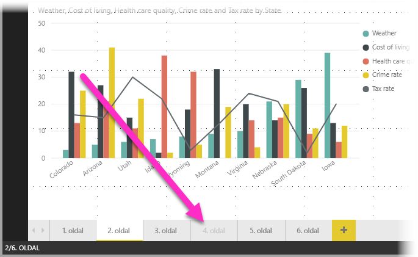

# A Jelentés nézet használata a Power BI Desktopban

Ha már dolgozott a Power BI-jal, tudja, milyen egyszerűen hozhatók létre dinamikus perspektívákat és adatelemzést biztosító jelentések. A Power BI speciális funkciókat tesz elérhetővé a Power BI Desktopban. A Power BI Desktoppal többek között létrehozhat összetett lekérdezéseket, egyesíthet különböző forrásokból származó adatokat és kapcsolatot hozhat létre táblák között.

A Power BI Desktop egy *Jelentés nézetet* is tartalmaz, amelyben bármennyi, vizualizációkat tartalmazó jelentésoldalt létrehozhat. A Power BI Desktop Jelentés nézete hasonló a kialakítással rendelkezik, mint egy jelentés Szerkesztési nézete a *Power BI szolgáltatásban*. Többek között áthelyezheti a vizualizációkat, vagy másolhatja, beillesztheti és egyesítheti őket.

A különbség az, hogy ha a Power BI Desktopot használja, dolgozhat lekérdezésekkel, és modellezheti az adatokat annak érdekében, hogy az adatai a legjobb elemzést tegyék lehetővé a jelentésekben. Ezután mentheti a Power BI Desktop-fájlt bárhová, ahová szeretné, legyen az a helyi lemez vagy a felhő.

## Nézzük meg mindezt a gyakorlatban!

Ha először tölt be adatokat a Power BI Desktopba, a Jelentés nézet egy üres vászonnal jelenik meg.

Ha a bal oldali navigációs panelen található ikonokra kattint, válthat a **Jelentés nézet**, az **Adat nézet** és a **Kapcsolat nézet** között:

Miután hozzáadott néhány adatot, hozzáadhat mezőket az új vizualizációhoz a vásznon.

A vizualizáció típusának módosításához válassza ki azt a vásznon, majd válasszon egy új típust **Vizualizációk** területen.

> [!TIP]
> Érdemes kipróbálnia különböző vizualizációtípusokat is. Fontos, hogy a vizualizáció egyértelmű módon közölje az információkat.

Egy jelentés legalább egy üres oldallal kezdődik. Az oldalak a kezelőpanelen jelennek meg, a vászon bal oldalán. Egy oldalhoz sokféle vizualizációt hozzáadhat, de fontos, hogy ne vigye túlzásba őket. A túl sok vizualizáció zsúfolttá teheti az oldalt, és nehézkessé a megfelelő információ megtalálását. Új oldalakat is hozzáadhat a jelentéshez. Ehhez egyszerűen kattintson az **Új oldal** elemre a menüszalagon.

Egy oldal törléséhez a Jelentés nézet alján kattintson az **X** elemre az oldal lapján.

> [!NOTE]
> A jelentések és a vizualizációk nem rögzíthetők a Power BI Desktop irányítópultján. Ehhez közzé kell tennie azokat a Power BI-webhelyen. További információ: [Adatkészletek és jelentések közzététele a Power BI Desktopból](desktop-upload-desktop-files.md).

## Jelentések közötti másolás és beillesztés

Egy vizualizáció egyszerűen kimásolható egy Power BI Desktop-jelentésből, és beilleszthető egy másik jelentésbe. A jelentésvizualizáció másolásához használja a Ctrl+C billentyűparancsot. A másik Power BI Desktop-jelentésben használja a Ctrl+V billentyűkombinációt a vizualizáció beillesztéséhez. Egyszerre egy, vagy egy oldalon belül több másolandó vizualizációt is kijelölhet, és beilleszthet a cél Power BI Desktop-jelentésbe.

A vizualizációk másolásának és beillesztésének lehetősége azok számára hasznos, akik rendszeresen készítenek és frissítenek több jelentést. A fájlok közötti másoláskor a Formázás panelen explicit módon megadott beállítások és formázások is másolva lesznek, a témára vagy alapértelmezett beállításokra épülő vizuális elemek pedig automatikusan a céljelentés témájának megfelelően lesznek frissítve. Ha tehát egy vizualizációt már megformázott a kívánt módon, átmásolhatja az újabb jelentésekbe, és a formázásba fektetett munka nem vész kárba.

Ha a modellben lévő mezők eltérnek, akkor a vizualizáción hibajelzés jelenik meg, és egy figyelmeztetés tájékoztatja a hiányzó mezőkről. Ez a hiba ahhoz hasonló, amikor törlik a modellnek a vizualizáció által használt egyik mezőjét.

A hiba javításához elég pótolni a hiányzó mezőket a használni kívánt mezőkkel az abban a jelentésben lévő modellből, ahová a vizualizációt beillesztette. Ha egyéni vizualizációt használ, akkor ezt az egyéni vizualizációt is importálnia kell a céljelentésbe.

## Jelentésoldalak elrejtése

Jelentés létrehozásánál a jelentés egyes lapjait el is rejtheti. Ez akkor lehet hasznos, ha a jelentésben alapul szolgáló adatokat vagy vizualizációkat kell létrehoznia, de nem szeretné, ha ezek az oldalak megjelennének mások számára, például ha olyan táblázatokat vagy vizualizációkat hoz létre, amelyeket más jelentésoldalakhoz szeretne felhasználni. Ezen kívül számos más kreatív oka is lehet annak, hogy egy létrehozott jelentésoldalt el szeretne rejteni egy közzétett jelentésben.

A jelentésoldal elrejtése egyszerűen elvégezhető. Kattintson jobb gombbal a jelentésoldalt jelző fülre, és a megjelenő menüben válassza az **Elrejt** lehetőséget.

A jelentésoldal elrejtésénél fontos lehet figyelembe venni néhány szempontot:

* A Power BI Desktopban a rejtett jelentésnézet is látható, jóllehet az oldal címe szürkén jelenik meg. Az alábbi képen a 4. oldal (Page 4 címmel) el van rejtve.

    

* Ha a jelentést a Power BI szolgáltatásban nézik meg, az elrejtett jelentésoldal *nem jelenik meg*.

* A jelentésoldalak elrejtése *nem* biztonsági célokat szolgál. Az oldalt a felhasználók továbbra is elérhetik, és a tartalma is hozzáférhető a részletező elemzés és más módszerek használatával.

* Az elrejtett oldal esetén a Megtekintési módban nem jelennek meg navigációs nyilak.
