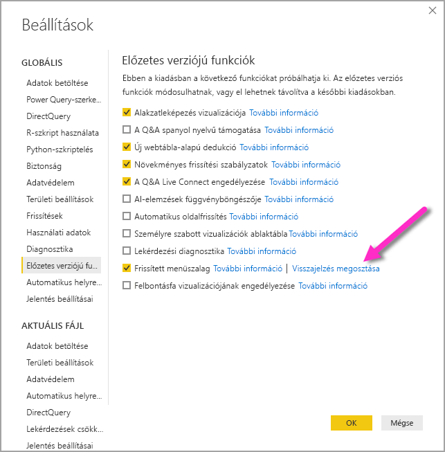

# A frissített menüszalag használata a Power BI Desktopban

A 2020. márciusi frissítéstől kezdve a Power BI Desktop átdolgozott menüszalagja biztosít a más Microsoft-termékekéhez, például a Microsoft Office-éhoz jobban illeszkedő megjelenést és felületet. 2019 novemberétől a frissített menüszalag előzetes verzióként jelenik meg a havi frissítésekben, és a 2020. márciusi frissítéstől kezdve az új menüszalag az alapértelmezett felhasználói felület.

## A frissített menüszalag engedélyezése

A 2020. márciusi frissítéstől kezdve a frissített menüszalag alapértelmezés szerint be van kapcsolva. A Power BI Desktop korábbi verzióiban (a 2019. novemberi frissítéstől kezdve) a Power BI frissített menüszalagja előzetes verziójú szolgáltatás volt, és engedélyezni kellett. Ezekben a korábbi verziókban az engedélyezéshez válassza a **Fájl > Lehetőségek és beállítások > Lehetőségek** menüpontot, majd a bal oldali oszlop **Előzetes funkciók** elemét. A jobb oldali panelen található a **Frissített menüszalag** jelölőnégyzete. Az előzetes funkció engedélyezéséhez jelölje be a **Frissített menüszalag** melletti jelölőnégyzetet. Ahhoz, hogy az előzetes funkció módosítása érvénybe lépjen, újra kell indítania a Power BI Desktopot.

> [!NOTE]
> A Power BI Desktop 2020. márciusi verziójától kezdődően nem szükséges engedélyezni a frissített menüszalagot, mivel 2020 márciusától kezdve az új menüszalag az alapértelmezett felhasználói felület.

## Az új menüszalag funkciói

A menüszalag frissítésével járó előnyök célja, hogy a Power BI Desktop és a több Microsoft-termék felülete is könnyen kezelhető és ismerős legyen. 

Ezek az előnyök az alábbi kategóriákba sorolhatók:

* **Továbbfejlesztett megjelenés, működés és elrendezés** – a frissített Power BI Desktop-menüszalag ikonjai és funkciói az Office-alkalmazások menüszalag-elemeinél megszokott megjelenéshez, működéshez és elrendezéshez igazodnak.

    

* **Intuitív Téma-katalógus** – a **Nézet** menüszalagon található Téma-katalógus a PowerPoint témakatalógusánál megszokott módon jelenik meg és működik. Ennek részeként a menüszalagon lévő képek megmutatják, hogyan jelennek meg a téma módosításai, például a színkombinációk és betűkészletek a jelentésre alkalmazva. 

    

* **Dinamikus menüszalag-tartalom a nézet alapján** – a Power BI Desktop meglévő menüszalagján a nem elérhető ikonok és parancsok csupán ki vannak szürkítve, így közel sem optimális felület áll elő. A frissített menüszalagon az ikonok dinamikusan vannak megjelenítve és elrendezve, így mindig tudni lehet, hogy mely lehetőségek állnak rendelkezésre az adott környezetben.

* **Egysoros menüszalag, amely összecsukva helyet takarít meg** – a frissített menüszalag egy további előnye, hogy maga a menüszalag egyetlen sorra csukható össze, és dinamikusan jeleníti meg a környezetnek megfelelő menüszalag-elemeket. 

    

* **Gyorsbillentyű-tippek a navigáláshoz és a gombok kiválasztásához** – a menüszalagon való navigálásban az **Alt + Windows gomb** lenyomásával aktiválható gyorsbillentyű-tippek segítenek. Ezek aktiválása után a billentyűzeten lenyomott billentyűkkel navigálhat.

    

* **Egyéni formátumsztringek** – az egyéni formátumsztringeket nem csak a *Tulajdonságok* panelen állíthatja be, hanem a menüszalagon is. Jelölje ki a testreszabni kívánt mértéket vagy oszlopot. Ekkor a kijelöléstől függően megnyílik a **Mértékeszközök** vagy **Oszlopeszközök** helyi menü. A lap formázási szakaszában közvetlenül a legördülő mezőbe gépelheti be az egyéni formátumsztringet.

    

* **Akadálymentesség** – a címsor, a menüszalag és a Fájl menü teljesen akadálymentes. A Ctrl + F6 billentyűkombinációval léphet a menüszalag szakaszra. Ott a **Tab** billentyűvel mozoghat a felső és az alsó sáv között, a nyílbillentyűkkel pedig az elemek között.

A látható változásokon kívül a frissített menüszalag lehetőséget biztosít a Power BI Desktop és a menüszalag későbbi frissítéseire, például az alábbiakra:

* Olyan rugalmasabb és intuitívebb vezérlőelemek létrehozása a menüszalagon, mint a vizualizációk katalógusa
* A *Fekete* és a *Sötétszürke* Office-témák hozzáadása a Power BI Desktophoz
* Az akadálymentesség javítása

## További lépések
A Power BI Desktop használatával számos adatforráshoz csatlakozhat. Az adatforrásokkal kapcsolatos információkért lásd az alábbi forrásanyagokat:

* [Mi az a Power BI Desktop?](../fundamentals/desktop-what-is-desktop.md)
* [Adatforrások a Power BI Desktopban](../connect-data/desktop-data-sources.md)
* [Adatok formázása és kombinálása a Power BI Desktoppal](../connect-data/desktop-shape-and-combine-data.md)
* [Kapcsolódás az Excelhez a Power BI Desktopban](../connect-data/desktop-connect-excel.md)   
* [Adatok közvetlen bevitele a Power BI Desktopba](../connect-data/desktop-enter-data-directly-into-desktop.md)   
