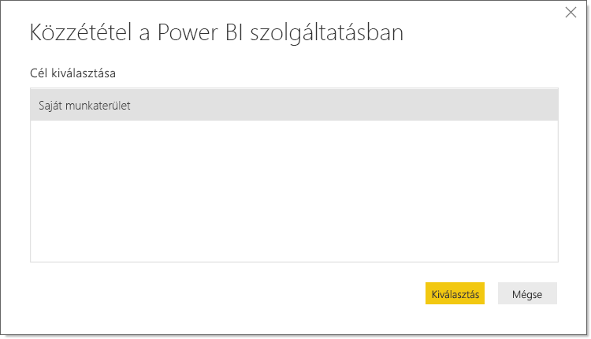

# Adatkészletek és jelentések közzététele a Power BI Desktopból
Amikor közzétesz egy Power BI Desktop-fájlt a Power BI szolgáltatásban, a modellben található adatokat is közzéteszi az Ön Power BI-munkaterületén. Ugyanez a **Jelentés** nézetben létrehozott összes jelentésre is igaz. A munkaterület-kezelőben megjelenik egy ugyanilyen nevű új adatkészlet, valamint az összes jelentés.

A Power BI Desktopból való közzétételnek az eredménye ugyanaz, mintha a Power BI-ban az **Adatok beolvasása** használatával csatlakozunk és feltöltünk egy Power BI Desktop-fájlt.

> [!NOTE]
> A jelentés Power BI-ban végrehajtott módosításai nem lesznek az eredeti Power BI Desktop-fájlba mentve. Ez a jelentésbeli vizualizációk hozzáadására, törlésére és módosítására is vonatkozik.
> 
> 

## Power BI Desktop-adatkészletek és -jelentések közzététele
1. A Power BI Desktopban válassza a **Fájl** \> **Közzététel** \> **Közzététel a Power BI-ban** lehetőséget, vagy a menüszalagon a **Közzététel** elemet.  

   

2. Jelentkezzen be a Power BI szolgáltatásba.
3. Válassza ki a célt.

   

A közzététel befejezésekor egy hivatkozást kap, amely a jelentésére mutat. A hivatkozást választva megnyithatja a jelentést saját Power BI-webhelyén.

## Egy Power BI Desktoppal közzétett adatkészlet újbóli közzététele vagy cseréje
Egy Power BI Desktop-fájl közzétételekor a rendszer a Power BI Desktopban létrehozott adathalmazt és jelentéseket közzéteszi az Ön Power BI-webhelyén. Egy Power BI Desktop-fájl újbóli közzétételekor a rendszer a Power BI-webhelyen található adathalmazt lecseréli a Power BI Desktop-fájlból származó frissített adathalmazra.

Az eljárás egyszerű, de van néhány lényeges tudnivaló:

* Ha a Power BI-ban kettő vagy több adathalmaznak ugyanaz a neve, mint a Power BI Desktop-fájlnak, akkor a közzététel meghiúsulhat. Ügyeljen arra, hogy a Power BI-ban csak egy adatkészletnek legyen ugyanaz a neve. Át is nevezheti a fájlt, és közzéteheti úgy, amivel létrehoz egy új, a fájllal megegyező nevű adatkészletet.
* Ha átnevez vagy töröl egy oszlopot vagy mértéket, a Power BI-ban az adott mezőre hivatkozó vizualizációk meghibásodhatnak. 
* A Power BI a meglévő oszlopok esetében bizonyos formázási módosításokat figyelmen kívül hagy. Ilyen például, ha egy oszlop formátumát 0,25-ről 25%-ra módosítjuk.
* Tegyük fel, hogy frissítési ütemezést konfigurált a Power BI-ban egy meglévő adathalmazhoz. Ha új adatforrásokat vesz fel a fájlba, majd újra közzéteszi azt, a következő ütemezett frissítés előtt be kell jelentkeznie ezekbe a forrásokba.
* Amikor újból közzétesz egy a Power BI Desktopban közzétett adathalmazt, amelyhez frissítési ütemezés van meghatározva, az adathalmaz frissítése az ismételt közzététel után azonnal megkezdődik. 

