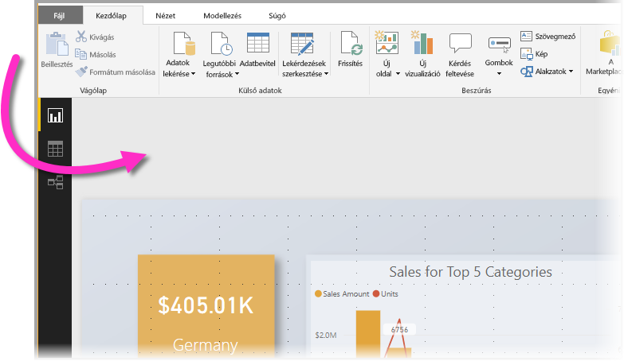
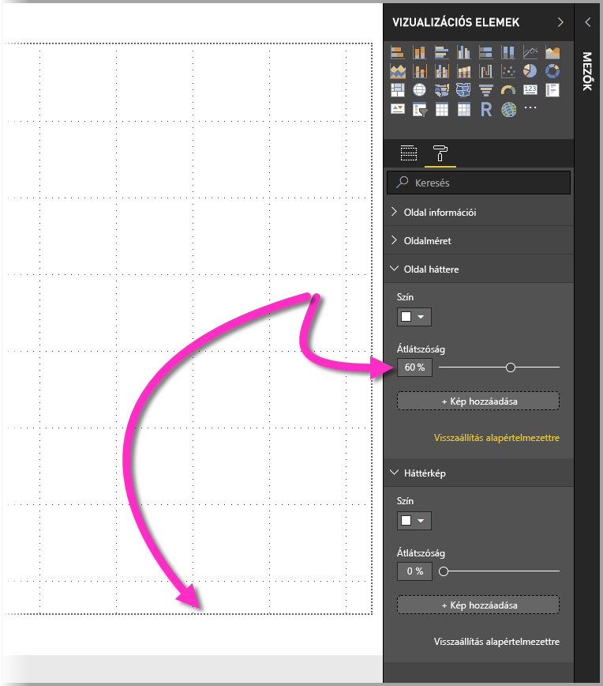
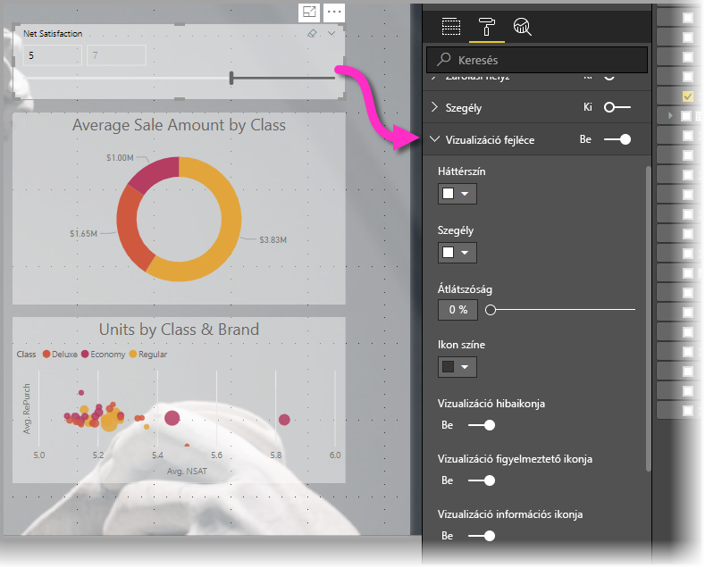
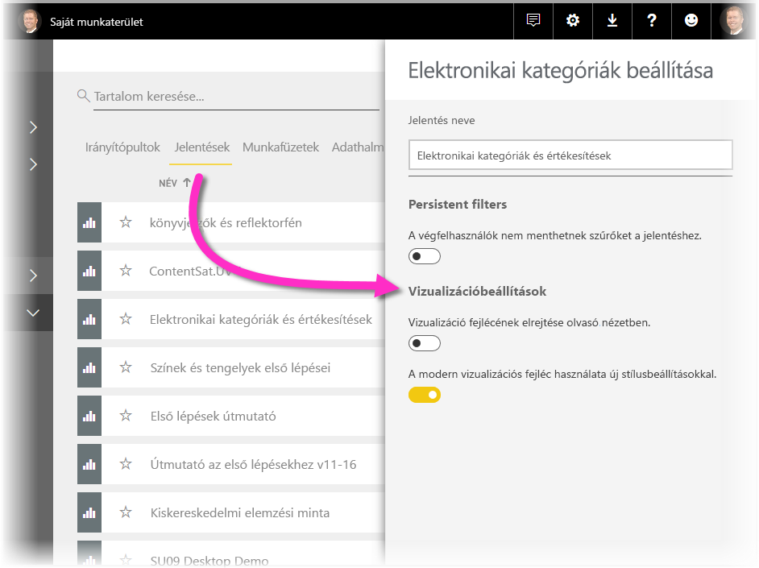

# Vizuális elemek használata Power BI-jelentések továbbfejlesztéséhez

A **Power BI Desktop** lehetővé teszi, hogy háttérképekkel, továbbfejlesztett vizualizáció-fejlécekkel és más vizualizációs elemekkel javítson a jelentések megjelenésén.

A **Power BI Desktop** 2018. júliusi kiadásától kezdve lehetőség van arra, hogy a jelentéseinek megjelenését javíthassa, így azok még tetszetősebbek lehetnek a felhasználók számára. Ebben az cikkben az alábbi lehetőségeket ismertetjük: 

* **Háttérkép** alkalmazása jelentésekben, amelyek kiemelik és tetszetősebben jelenítik meg az adatokra támaszkodó információkat
* Továbbfejlesztett **vizualizáció-fejléc** használata az egyes vizualizációkhoz, amelyekkel tökéletes igazítású vizualizációkat lehet megjeleníteni a vásznon. 

A következő szakaszban bemutatjuk, hogyan használhatóak ezek az elemek, és hogyan alkalmazhatók konkrét jelentésekben.

## Háttérkép használata Power BI-jelentésekben

**Háttérkép** használatával formázható a jelentésoldalon kívüli szürke terület. Az alábbi képen egy nyíl mutatja, hogy melyik területen alkalmazható a háttérkép. 

A háttérképet beállíthatja egyes jelentésoldalakhoz is, de használhatja ugyanazt a háttérképet a jelentés minden oldalán is. A háttérkép teszteléséhez kattintson a **Formázás** ikonra úgy, hogy ne legyen közben kijelölve egyetlen vizualizáció sem a jelentésben, és ekkor a panelen megjelenik a **Háttérkép** kártya.

A **Szín** legördülő menüben kiválaszthat egy színt is **háttérképként**, vagy ha képet szeretne háttérképként alkalmazni, akkor válassza a **Kép hozzáadása** lehetőséget. Az **Áttetszőség** csúszkával áttetszőséget is alkalmazhat a háttérképre függetlenül attól, hogy színt vagy képet választott.

A **háttérképpel** kapcsolatosan az alábbi fogalmakat célszerű megismerni:

* A jelentésterületen kívüli szürke terület a **háttérkép** területe
* A vásznon azt a területet, ahová a vizualizációkat helyezheti, a jelentés **oldalának** nevezzük. Ez a **Formázás** panelen az **Oldal háttere** legördülő menü használatával módosítható.

A jelentés **oldala** a háttérképhez képest mindig előtérben van, a **háttérkép** pedig mögötte van, és a háttérkép egyúttal a legalsó elem a jelentésoldalon. Ha áttetszőséget alkalmaz az oldalra, az a jelentés vizualizációira is alkalmazva lesz, így a háttérkép a vizualizációk alatt láthatóvá válik a háttérben.

Minden új jelentés esetében alapértelmezésként az alábbi beállítások érvényesek:

* A jelentés **oldala** **fehér** színű, áttetszősége pedig **100%**
* A **háttérkép** színe **fehér**, áttetszősége pedig **0%**

Ha az oldal hátterét 50%-nál magasabb áttetszőségűre állítja, a jelentés készítése vagy szerkesztése idején egy pontozott szegélyvonal jelenik meg, amely a jelentésvászon szegélyét mutatja. 

Fontos megjegyezni, hogy a pontozott vonal *csak* a jelentés szerkesztése közben jelenik meg, a jelentést például a *Power BI szolgáltatásban* megtekintő felhasználó számára azonban **láthatatlan** marad.

> [!NOTE]
> Ha sötét színű háttérképet használ és a betű színét fehérre vagy nagyon világosra állítja, vegye figyelembe, hogy az **Exportálás PDF-be** funkció nem exportálja a háttérképet, így a fehér betűk gyakorlatilag láthatatlanok lesznek az exportált PDF-fájlban. A [PDF-be való exportálásról](desktop-export-to-pdf.md) az **Exportálás PDF-be** című témakörben olvashat bővebben.

## Továbbfejlesztett vizualizáció-fejlécek használata a Power BI-jelentésekben

A **Power BI Desktop** 2018. júliusi kiadásától kezdve jelentősen továbbfejlesztettük a jelentésekben használható vizualizáció-fejléceket. A legfontosabb fejlesztések közé tartozik, hogy a fejlécet elkülönítettük a vizualizációtól, így az elhelyezése szabadon megválasztható az egyéni elrendezéshez és pozicionáláshoz, valamint hogy a fejléc mostantól magában a vizualizációban jelenik meg, nem pedig fölötte. 

Alapbeállítás szerint a fejléc a vizualizáción belül, a címhez igazítva jelenik meg. Az alábbi képen a fejléc (a rajzszög ikon, a kibontás ikon és a három pont ikon) a vizualizáción belül jobbra igazítva jelenik meg a cím vízszintes elhelyezkedésével egy vonalban.

Ha a vizualizáció nem rendelkezik címmel, a fejléc a vizualizáció fölött jobbra igazítva helyezkedik el, ahogy az alábbi képen látható. 

Ha a vizualizációt a jelentés legfelső részére helyezte, akkor a vizualizáció fejléce a vizualizáció aljához illeszkedik. 

A **Vizualizációk** panelen a **Formázás** szakaszban minden vizualizáció rendelkezik egy **Vizualizáció fejléce** nevű kártyával. Ezen a kártyán a vizualizáció fejlécének számos tulajdonságát beállíthatja

> [!NOTE]
> Jelentés készítése vagy szerkesztése közben a kapcsolók láthatósága nem befolyásolja a jelentést. A hatásuk megjelenítéséhez közzé kell tenni a jelentést, és olvasó nézetben kell megtekinteni. Ez a viselkedésmód gondoskodik róla, hogy szerkesztés közben a vizualizáció-fejlécekre alkalmazható számos beállítási lehetőség funkciója érvényesüljön, különös tekintettel a szerkesztés közben megjelenő figyelmeztető ikonokra.

A csak a **Power BI szolgáltatásban** megjelenő jelentések esetén a vizualizációk fejléceit úgy állíthatja be, ha a **Saját munkaterület > Jelentések** területen a **Beállítások** ikont választja. Itt ahhoz a jelentéshez tartozó beállításokat állíthatja be, amelyhez a **Beállítások** lehetőséget választotta, ahogy az alábbi képen látható.

### Továbbfejlesztett vizualizáció-fejlécek engedélyezése meglévő jelentésekhez

Új jelentéseknél alapértelmezett beállításként használhatóak az új vizualizáció-fejlécek. Már meglévő jelentésekhez azonban engedélyezni kell ezt a viselkedésmódot a **Power BI Desktopban**. Ehhez lépjen a **Fájl > Lehetőségek és beállítások** területre, majd a **Jelentés beállításai** szakaszban jelölje be a **Modern vizualizáció-fejlécek használata frissített stíluslehetőségekkel** jelölőnégyzetet.

## További lépések
Ha többet szeretne megtudni a **Power BI Desktopról**, illetve a szoftver használatának kezdeti lépéseiről, tekintse meg a következő cikkeket.

* [Mi az a Power BI Desktop?](../fundamentals/desktop-what-is-desktop.md)
* [Lekérdezések áttekintése a Power BI Desktopban](../transform-model/desktop-query-overview.md)
* [Adatforrások a Power BI Desktopban](../connect-data/desktop-data-sources.md)
* [Csatlakozás adatokhoz a Power BI Desktopban](../connect-data/desktop-connect-to-data.md)
* [Adatok formázása és kombinálása a Power BI Desktoppal](../connect-data/desktop-shape-and-combine-data.md)
* [Gyakori lekérdezési feladatok a Power BI Desktopban](../transform-model/desktop-common-query-tasks.md)   
