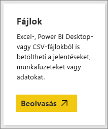

# Power BI-minták beszerzése
Tegyük fel, hogy kezdő felhasználó a Power BI-ban, és egyelőre adatok nélkül szeretné kipróbálni.  Vagy szeretne megtekinteni néhány jelentést, amelyek szemléltetik a Power BI képességeit. Mi segítünk.

A Power BI többféle mintát kínál, többféle célra: 
- A Data Stories Galleryben megnyitható, a Power BI Desktopban megnyitható és tanulmányozható, vagy a Power BI szolgáltatásba feltölthető **[Power BI-jelentés](#sales--returns-sample-pbix-file) (.pbix fájl)** .
- Az AppSource-ból letölthető **[mintaalkalmazás](#sample-app-from-appsource)** , amely szintén működik a Power BI szolgáltatásban. Az alkalmazások irányítópultokat, jelentéseket és adathalmazokat tartalmaznak. Ezeket módosíthatja, majd megoszthatja a munkatársaival.
- A Power BI szolgáltatásban **[nyolc eredeti beépített minta](#eight-original-samples)** található, irányítópultokat, jelentéseket és adathalmazokat tartalmazó *tartalomcsomagok* formájában. Ezeket közvetlenül a Power BI szolgáltatásban telepítheti. A beépített minták Power BI-jelentések (.pbix) és Excel-munkafüzetek (.xlsx) formájában is elérhetők.
- A beépített minták **[Excel-munkafüzet](#download-sample-excel-files)** -verziójában megtalálható az adatmodell és a Power View-lapok. Az Excelben megismerheti és szerkesztheti az adatmodellt, az Excel-munkafüzetet pedig a Power BI-jelentés adatforrásaként használhatja. A munkafüzetet Excel-fájlként is feltöltheti, majd a Power BI-jelentésekben megjelenítheti az Excel-vizualizációkat és a kimutatástáblákat. 
- Szintén Excel-fájlként tölthető le a **[Pénzügyi adatok minta-munkafüzet](sample-financial-download.md)** nevű egyszerű tábla. Ez a tábla fiktív termékek anonimizált adatait tartalmazza, szegmensekre és országokra lebontott értékesítési értékekkel. Hasznos alapadatbázis lehet egy Power BI-jelentéshez.

Az online dokumentációnk ugyanezeket a mintákat használja az oktatóanyagokban és példákban, így könnyen követhető.

## Értékesítés és visszáru .pbix mintafájl

:::image type="content" source="media/sample-datasets/sales-returns-sample-pbix.png" alt-text="Értékesítés és visszáru .pbix mintafájl":::

*Értékesítés és visszáru .pbix mintajelentés*

Miguel Myers és Chris Hamill, Power BI-jelentéstervezők, azért hozták létre az Értékesítés és visszáru .pbix fájlt, hogy az a Power BI számos új funkcióit szemléltesse, köztük a gombokat, a részletezést, a feltételes formázást, a lehetőségelemzést, és az egyéni elemleírásokat. 

A jelentés által használt példában egy Microsoft-témájú gördeszkákat árusító cég szerepel. A cég elemezni szeretné az értékesítési és visszáruadatokat, és elemezni szeretnék, hogyan kell módosítaniuk műveleteiket. 

A jelentést a következő módokon tanulmányozhatja:

- Megtekintheti és kipróbálhatja a Power BI-közösség [Data Stories Gallery](https://community.powerbi.com/t5/Data-Stories-Gallery/Sales-amp-Returns-Sample-Report/m-p/876607) webhelyén.
- Letöltheti a .pbix fájlt, és részletesen megismerheti. Betekinthet „a kulisszák mögé”, és láthatja, hogy Miguel miképpen hozta létre a jelentést. Ha a következő hivatkozásra kattint, a fájl automatikusan letöltődik: [Értékesítés és visszáru mintajelentés](https://go.microsoft.com/fwlink/?linkid=2113239).
- A jelentésről [Az új Értékesítés és visszáru mintajelentés bemutatása](https://powerbi.microsoft.com/blog/take_a_tour_of_the_new_sales_returns_sample_report/) című Power BI-blogbejegyzésében olvashat.

## AppSource-ból származó mintaalkalmazás

A Marketing és értékesítés *alkalmazás* a Microsoft AppSource-on érhető el. Az alkalmazás egy olyan Power BI-tartalomtípus, amely kombinálja az összetartozó irányítópultokat és jelentéseket. Egy alkalmazás egy vagy több irányítópultot és egy vagy több jelentést tartalmazhat egy csomagban. A Marketing és értékesítés alkalmazást a Power BI szolgáltatás **Alkalmazások** helyéről, vagy az AppSource-ból, a böngésző használatával töltheti le.

- Az [Alkalmazások telepítése és használata](../consumer/end-user-app-view.md) című cikk ismerteti az alkalmazások Power BI szolgáltatásból való letöltését.
- Ez a hivatkozás az AppSource-ban található [Értékesítés és marketing alkalmazásra](https://appsource.microsoft.com/product/power-bi/microsoft-retail-analysis-sample.salesandmarketingsample?tab=Overview) mutat.

A telepítést követően megjelenik a saját alkalmazásgyűjteményében.

:::image type="content" source="media/sample-datasets/power-bi-sales-marketing-app.png" alt-text="Értékesítés és marketing alkalmazáscsempe":::

Miután megnyitotta, kattintson a **Felfedezés mintaadatok segítségével** lehetőségre. 

:::image type="content" source="media/sample-datasets/power-bi-explore-app.png" alt-text="Az alkalmazás felfedezése":::

Ekkor megjelenik az alkalmazásnézet, amelynek navigációs paneljén az irányítópult és az egyéni jelentéslapok láthatók. 

:::image type="content" source="media/sample-datasets/power-bi-sales-marketing-app-navigation.png" alt-text="Az alkalmazás navigációs panelje":::

Mivel telepítette az alkalmazást, megnyithatja a *munkaterületet* is, és szerkesztheti az alkalmazás részeit. A munkaterület megnyitásához válassza a **Szerkesztés** ceruzaikont.

:::image type="content" source="media/sample-datasets/power-bi-app-edit-pencil.png" alt-text="Alkalmazás szerkesztése":::

A munkaterület listanézetében megjelenik az alkalmazás irányítópultja, jelentése és adathalmaza. Mindegyiket szerkesztheti ugyanitt, a munkaterületen.

:::image type="content" source="media/sample-datasets/power-bi-sales-marketing-workspace.png" alt-text="Értékesítés és marketing munkaterület":::

Igény esetén a szervezetben bárkivel megoszthatja az alkalmazást. Válassza az **App frissítése** lehetőséget.

:::image type="content" source="media/sample-datasets/power-bi-update-app.png" alt-text="Alkalmazás frissítése gomb":::

Végezze el a beállításokat a **Beállítás** lapon, beleértve az **Alkalmazástéma színének** kiválasztását is. 

:::image type="content" source="media/sample-datasets/power-bi-app-setup.png" alt-text="Alkalmazás beállításának kiválasztása":::

Végezze el a beállításokat a **Navigáció** és az **Engedélyek** lapon, majd kattintson az **Alkalmazás frissítése** elemre.

:::image type="content" source="media/sample-datasets/power-bi-select-update-app.png" alt-text="Válassza az Alkalmazás frissítése elemet a közzétételhez":::

További információ az [alkalmazások Power BI-beli közzétételéről](../collaborate-share/service-create-distribute-apps.md).

## Nyolc eredeti minta
Nyolc eredeti mintát használhat fel. Mindegyik egy adott iparághoz készült. Mindegyikhez különböző formátumokat használhat:

- Telepítheti a [beépített tartalomcsomagokat](#install-built-in-content-packs) a Power BI szolgáltatásban.
- Letöltheti a [Power BI-jelentésfájlokat](#download-original-sample-power-bi-files) (.pbix).
- Letöltheti az [Excel-munkafüzetfájlokat](#download-sample-excel-files) (.xlsx), majd feltöltheti őket a Power BI szolgáltatásba.
- Megismerheti az [Excel-fájlokat magában az Excelben](#explore-excel-samples-inside-excel).

Az obviEnce cég ([www.obvience.com](http://www.obvience.com/)) és a Microsoft közösen hozta létre a Power BI-ban használható mintákat.  Az adatok névtelenek, és különböző szektorokhoz tartoznak: pénzügy, HR, értékesítés és egyebek. 

Ezek a minták több formátumban érhetők el: tartalomcsomag, Excel-munkafüzet és .pbix Power BI-fájl formájában. Ha nem tudja, ezek mik, vagy hogyan veheti őket használatba, ne aggódjon. Ez a cikk az összeset ismerteti. Az összes mintát ismertetjük egy *bemutatóban*. Ezek a bemutatók olyan cikkek, amelyek leírják a minták háttértörténetét, és ismertetik a különböző használati helyzeteket. Ilyen forgatókönyv lehet például a felettesi kérdésekre való válaszadás, a versenyképes elemzések keresése, a megosztható jelentések és irányítópultok létrehozása vagy egy üzleti váltás megmagyarázása.

Mielőtt hozzálátnánk, ejtsünk szót ezen minták használatának jogi irányelveiről. Ez után bemutatjuk a mintákat és azok használatát.

### Az Excel-mintamunkafüzetek használati útmutatója

&copy;2015 Microsoft Corporation. All rights reserved. A dokumentumok és munkafüzetek az adott állapotban érhetők el. A munkafüzetekben megjelenő adatokat és nézeteket, beleértve az URL-címeket és egyéb internetes webhelyhivatkozásokat, értesítés nélkül módosíthatjuk. Ezeket csak saját felelősségre használhatja. Egyes példák csak szemléltető céllal jelennek meg, és nem valódi esetek. Szándékos vagy következtetett kapcsolattal nem rendelkeznek a valósággal. A Microsoft nem vállal kifejezett vagy törvényi garanciát az itt megjelenő információért.

A munkafüzetek nem ruházzák fel Önt semmilyen joggal a Microsoft-termékekben szereplő szellemi tulajdon felett. A munkafüzetet csak hivatkozási céllal, belső használatra kaphatja meg, és csak ilyen céllal készíthet róla másolatot.

A munkafüzeteket és a kapcsolódó adatokat az obviEnce szolgáltatja. [www.obvience.com](http://www.obvience.com)

Az obviEnce egy független szoftverszállító és szellemitulajdon-inkubátor, amely a Microsoft üzleti intelligenciájával foglalkozik. A cég szorosan együttműködik a Microsofttal az ajánlott eljárások kidolgozásában és a Microsoft üzletiintelligencia-megoldásainak kreatív tervezésében, fejlesztésében és üzembe helyezésében.

A munkafüzetek és azok adatai az obviEnce LLC tulajdonát képezik, és kizárólag a Power BI iparági mintaadatokkal használható funkcióinak bemutatására szolgálnak.

A munkafüzetek és/vagy azok adatainak használata csak a fenti esetre terjedhet ki (amely minden munkafüzet Info munkalapján is megtalálható). A munkafüzetet és az összes vizualizációt az alábbi szerzői jogi nyilatkozattal kell ellátni: obviEnce &copy;.

Ha az alábbi hivatkozások bármelyikére kattintva letölti az Excel-munkafüzeteket vagy a .pbix-fájlokat, azzal elfogadja az itt ismertetett feltételeket.

### Ügyfél-jövedelmezőségi minta  
[Ügyfél-jövedelmezőségi minta: bemutató](sample-customer-profitability.md)

Ez az iparági minta egy pénzügyi igazgató a vállalat igazgatóira, termékeire és ügyfeleire vonatkozó fő mérőszámait elemzi. Segítségével megvizsgálhatja, hogy milyen tényezők befolyásolják a cég jövedelmezőségét.

### Emberi erőforrások minta 
[Emberi erőforrások minta: bemutató](sample-human-resources.md)

Ez az iparági minta egy cég felvételi stratégiájával foglalkozik, és az újonnan felvett, az aktív és a már máshol dolgozó alkalmazottakat elemzi.  Az adatok elemzésével trendeket azonosíthat a távozásokra és a felvételi stratégia esetleges előítéleteire nézve.

### Informatikaköltség-elemzési minta 
[Informatikaköltség-elemzési minta: bemutató](sample-it-spend.md)

Ez az iparági minta egy cég informatikai részlegének tervezett és valós kiadásait hasonlítja össze. Az összevetés segít megérteni, hogy milyen pontosan tervezte a cég az idei évet, és feltárhatóvá teszi a tervtől jelentősen eltérő területeket. A példában szereplő cég egy éves tervezési cikluson halad végig, és minden negyedévben friss becslést készít (Latest Estimate - LE) a pénzügyi év informatikai költségeiben bekövetkezett változások elemzéséhez.

### Lehetőségelemzési minta 
[Lehetőségelemzési minta: bemutató](sample-opportunity-analysis.md)

Ez az iparági minta egy szoftvercég értékesítési csatornáit elemzi. Az értékesítési vezetők régiók, az ügylet mérete és a csatorna alapján követik a lehetőségeket és figyelik a közvetlen és a partneri értékesítési csatornákat.

### Beszerzéselemzési minta  
[Beszerzéselemzési minta: bemutató](sample-procurement.md)

Ez az iparági minta egy pénzügyi igazgató a vállalat igazgatóira, termékeire és ügyfeleire vonatkozó fő mérőszámait elemzi. Segítségével megvizsgálhatja, hogy milyen tényezők befolyásolják a cég jövedelmezőségét.

### Kiskereskedelmi elemzési minta  
[Kiskereskedelmi elemzési mintaa: bemutató](sample-retail-analysis.md)

Ez az iparági minta a több üzletben és körzetben értékesített cikkek kiskereskedelmi értékesítési adatait elemzi. A mérőszámok a folyó év teljesítményét vetik össze a tavalyival a következő területeken: értékesítés, egységek, bruttó nyereség, eltérés, új üzletek elemzett adatai.

### Értékesítési és marketingminta  
[Értékesítési és marketing minta: bemutató](sample-sales-and-marketing.md)

Ez az iparági minta egy gyártással foglalkozó céget, a VanArsdel kft.-t elemzi. Segítségével a marketingigazgató megfigyelheti az iparágat és a VanArsdel piaci részesedését.  A minta elemzésével megismerheti a cég piaci részesedését, értékesítési adatait és a vele kapcsolatos véleményeket.

### Szállítói minőségi minta  
[Szállítói minőségi minta: bemutató](sample-supplier-quality.md)

Ez az iparági minta az ellátási láncok egyik tipikus problémájára, a szállítók minőségelemzésére helyezi a hangsúlyt. Az elemzésben két fő mérőszám játszik szerepet: a hibák összesített száma és a hibák által okozott összesített állásidő. A mintának két fő célja van: feltárni, hogy a minőséget tekintve kik a legjobb és legrosszabb szállítók, és azonosítani, hogy mely üzemek végzik jobban a hibák feltárását és elutasítását, hogy minimalizálják az állásidőt.

### Beépített tartalomcsomagok telepítése

Kezdjük a *tartalomcsomagokkal*. A beépített minták elérhetők a Power BI szolgáltatásban; nem kell kilépnie a Power BI-ból a megkeresésükhöz. A tartalomcsomagok egy vagy több olyan irányítópultból, adathalmazból és jelentésből állnak, amelyeket valaki létrehoz, és a Power BI-ban használhatók. Minden Power BI-beli minta-tartalomcsomag tartalmaz egy adathalmazt, egy jelentést és egy irányítópultot.  A tartalomcsomagok továbbra is elérhetők, de hamarosan elavulttá válnak. A Power BI Desktopban azonban nem érhetők el.

1. Nyissa meg a Power BI szolgáltatást (app.powerbi.com), és jelentkezzen be.
2. Lépjen a Saját munkaterületre, vagy bármely más munkaterületre, ahol telepíteni kívánja a mintát. 
2. A bal alsó sarokban válassza az **Adatok lekérése** lehetőséget.

    
3. Az ekkor megjelenő Adatbeolvasás lapon kattintson a **Minták** lehetőségre.

   
4. Válasszon ki egy mintát a minta leírásának megjelenítéséhez, majd kattintson a **Csatlakozás** elemre.  

   
5. A Power BI importálja a tartalomcsomagot, és egy új irányítópultot, jelentést és adatkészletet ad hozzá az aktuális munkaterülethez. A mintákkal kipróbálhatja a Power BI funkcióit.  

   

Az új adatokkal már nyugodtan dolgozhat.  Próbálja ki néhány oktatóanyagunk lépéseit a minta-tartalomcsomagokkal, vagy csak nyissa meg a Power BI-t, és fedezze fel a funkciókat.

### Eredeti Power BI-mintafájlok letöltése
A minta-tartalomcsomagok .pbix-fájlként is elérhetők. A .pbix-fájlok a Power BI Desktop szolgáltatáshoz lettek kialakítva.  

1. A fájlokat letöltheti az alábbi hivatkozásokkal. A következő linkek kiválasztásával automatikusan menti a fájlt a Letöltések mappába. 

   - [Ügyfél-jövedelmezőségi minta PBIX](https://download.microsoft.com/download/6/A/9/6A93FD6E-CBA5-40BD-B42E-4DCAE8CDD059/Customer%20Profitability%20Sample%20PBIX.pbix)
   - [Emberi erőforrások minta PBIX](https://download.microsoft.com/download/6/9/5/69503155-05A5-483E-829A-F7B5F3DD5D27/Human%20Resources%20Sample%20PBIX.pbix)
   - [Beszerzéselemzési minta PBIX](https://download.microsoft.com/download/D/5/3/D5390069-F723-413B-8D27-5888500516EB/Procurement%20Analysis%20Sample%20PBIX.pbix)
   - [Kiskereskedelmi elemzési minta PBIX](https://download.microsoft.com/download/9/6/D/96DDC2FF-2568-491D-AAFA-AFDD6F763AE3/Retail%20Analysis%20Sample%20PBIX.pbix)
   - [Értékesítési és marketing minta PBIX](https://download.microsoft.com/download/9/7/6/9767913A-29DB-40CF-8944-9AC2BC940C53/Sales%20and%20Marketing%20Sample%20PBIX.pbix)
   - [Szállítói minőségelemzési minta PBIX](https://download.microsoft.com/download/8/C/6/8C661638-C102-4C04-992E-9EA56A5D319B/Supplier-Quality-Analysis-Sample-PBIX.pbix)

1. A Power BI Desktopban válassza a **Fájl > Megnyitás** lehetőséget, majd lépjen arra a helyre, ahova a .pbix-mintafájlt mentette.

4. A Power BI Desktopban történő megnyitáshoz kattintson a .pbix-fájlra.

### Excel-mintafájlok letöltése
A minta-tartalomcsomagok Excel-munkafüzetként is elérhetők. Az Excel-munkafüzetek a Power BI szolgáltatásban való használathoz készültek.  

1. A fájlokat egyenként letöltheti az alábbi hivatkozásokról, vagy [egyszerre, egy ZIP-fájlban](https://go.microsoft.com/fwlink/?LinkId=535020). Ha már tapasztalt felhasználó, célszerű letöltenie az Excel-munkafüzeteket és felfedezni vagy szerkeszteni az adatmodelleket.

   - [Ügyfél-jövedelmezőségi minta](https://go.microsoft.com/fwlink/?LinkId=529781)
   - [Emberi erőforrások minta](https://go.microsoft.com/fwlink/?LinkId=529780)
   - [Lehetőségkövetési minta](https://go.microsoft.com/fwlink/?LinkId=529782)
   - [Beszerzéselemzési minta](https://go.microsoft.com/fwlink/?LinkId=529784)
   - [Kiskereskedelmi elemzési minta](https://go.microsoft.com/fwlink/?LinkId=529778)
   - [Értékesítési és marketing minta](https://go.microsoft.com/fwlink/?LinkId=529785)
   - [Szállítói minőségelemzési minta](https://go.microsoft.com/fwlink/?LinkId=529779)

2. Mentse a letöltött fájlt. Fontos, hogy hova menti a fájlt.

      **Helyi meghajtó** – Ha a fájlt a saját számítógépére vagy a cég valamilyen más helyére mentette, a Power BI-ból importálhatja a fájlt Power BI-ba. A fájl a helyi meghajtón marad, tehát a teljes fájl nem lesz importálva a Power BI-ba. Annyi történik, hogy létrejön egy új adatkészlet az Ön Power BI-webhelyén, a rendszer pedig betölti abba az adatokat, és bizonyos esetekben az adatmodellt is. Ha a fájlban vannak jelentések, azok a Power BI-webhely Jelentések területén jelennek meg.
    
     **OneDrive – Vállalati verzió** – Ha OneDrive Vállalati verzióval rendelkezik, és a Power BI-hoz is használt fiókkal jelentkezik be oda, akkor a OneDrive vállalati verziója a legjobb megoldás arra, hogy az Excelben vagy a Power BI Desktopban készült munkái vagy .CSV-fájljai szinkronban maradjanak az adathalmazzal, a jelentésekkel és az irányítópultokkal a Power BI-ban. Mivel a Power BI és a OneDrive egyaránt a felhőben található, a Power BI nagyjából óránként kapcsolódik a OneDrive-on található fájlhoz. Ha módosításokat talál, az adatkészlet, a jelentések és az irányítópultok automatikusan frissülnek a Power BI-ban.
    
     **SharePoint-csoportwebhelyek** – A Power BI-ban lévő fájloknak a SharePoint-csoportwebhelyekre történő mentése nagyjából ugyanúgy zajlik, mint a OneDrive Vállalati verzió esetében. A legnagyobb különbség a fájlhoz a Power BI-ból való csatlakozás módja. Megadhat egy URL-címet vagy csatlakozhat a gyökérmappához.
1. Nyissa meg a Power BI szolgáltatást (app.powerbi.com), és jelentkezzen be.

1. Lépjen a Saját munkaterületre, vagy bármely más munkaterületre, vagy hozzon létre egy munkaterületet csak a minta számára.

4. A navigációs panel bal alsó sarkában kattintson az **Adatbeolvasás** elemre.

    
5. Ekkor megjelenik az **Adatbeolvasás** lap. Itt válassza a **Fájlok > Lekérés** lehetőséget.

    
6. Kattintson arra a helyre, ahova mentette a mintát.

    
7. Válassza ki a fájlt. Attól függően, hogy melyik helyre mentette a fájlt, kattintson a **Csatlakozás** vagy a **Megnyitás** lehetőségre.

8. Döntse el, hogy importálni szeretné az adatokat, vagy inkább megnyitná a munkafüzetet a Power BI-ban, és megtekintené úgy, ahogy az az Excel Online-ban szerepel.

    
9. Ha az **Importálás** lehetőséget választja, a Power BI importálja a mintamunkafüzetet, és hozzáadja egy új irányítópulthoz, jelentéshez, vagy adathalmazhoz, amelyek ebben az esetben mind a **Beszerzéselemzési minta** nevet kapják.

    - Mivel a munkafüzetben Power View-lapok vannak, a Power BI által létrehozott jelentés minden Power BI-laphoz külön oldalt tartalmaz. 
    - A Power BI létrehoz egy új irányítópultot egy új, üres csempével.  Ha erre a csempére kattint, eljut az imént hozzáadott jelentéshez.

10. Nyissa meg a jelentést. Kattintson a jelentés különböző elemeire a közöttük lévő interakciók megismeréséhez. 

    

### Excel-minták felfedezése az Excelben

(Nem kötelező) Szeretné tudni, hogyan alakulnak át az Excel-munkafüzet adatai Power BI-adathalmazokká és -jelentésekké? Ha megnyitja a mintákat az *Excelben*, és végignézi a munkalapokat, megértheti a konvertálás működését.

- Amikor először nyit meg egy minta-munkafüzetet az Excelben, két figyelmeztetés jelenhet meg. Az első figyelmeztetés tudatja Önnel, hogy a munkafüzet védett nézetben van. Kattintson a **Szerkesztés engedélyezése** lehetőségre. A második figyelmeztetés tudatja Önnel, hogy a munkafüzet külső adatkapcsolatokkal rendelkezik. Válassza a **Tartalom engedélyezése** lehetőséget.
- Mindegyik munkafüzet több Power View-munkalapot tartalmaz. Ha látni szeretné a Power View-munkalapokat az Excelben, [engedélyeznie kell a Power View beépülő modult](https://support.office.com/article/flash-silverlight-and-shockwave-controls-blocked-in-microsoft-office-55738f12-a01d-420e-a533-7cef1ff6aeb1) a beállításkulcs-csomag letöltésével.
- Hol vannak a tényleges adatok? A Power Pivot-adatmodellben. Az adatok megtekintéséhez nincs szükség a Power View-munkalapokra. A **Power Pivot** lapon válassza a **Kezelés** lehetőséget.

    Nem látja a **Power Pivot** lapot? [Engedélyezze a Power Pivot bővítményt](https://support.office.com/article/Start-Power-Pivot-in-Microsoft-Excel-2013-add-in-A891A66D-36E3-43FC-81E8-FC4798F39EA8).

    A Power Pivotban az összes mögöttes táblában lévő adatot és az összes DAX-képletet is látni fogja. 

- Az Info lapon a minta készítőjéről, az obviEnce-ről találhat információkat.

## Következő lépések
[A Power BI szolgáltatás alapfogalmai tervezők számára](../fundamentals/service-basic-concepts.md)

[Oktatóanyag: Csatlakozás a Power BI-mintákhoz](sample-tutorial-connect-to-the-samples.md)

[Power BI-adatforrások](../connect-data/service-get-data.md)

További kérdései vannak? [Kérdezze meg a Power BI közösségét](https://community.powerbi.com/)
