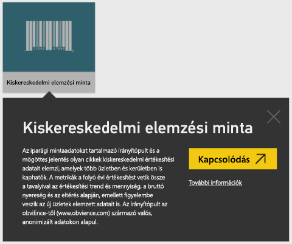
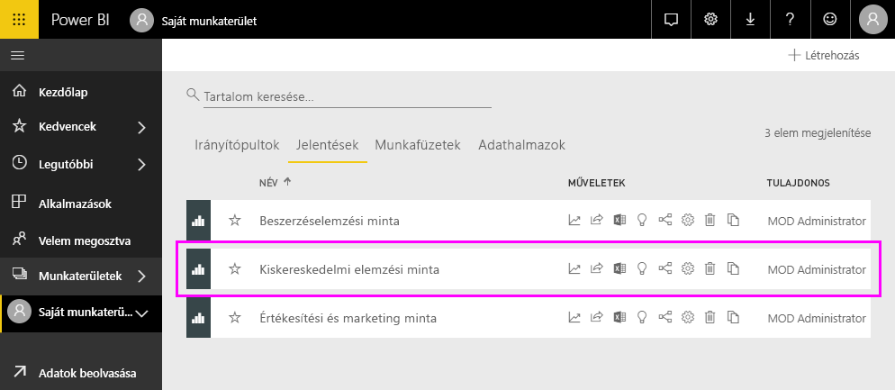
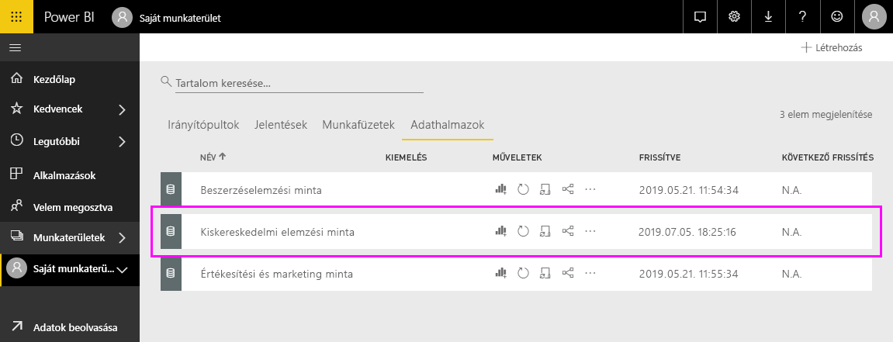
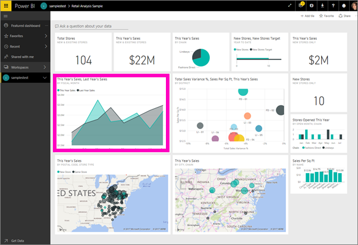
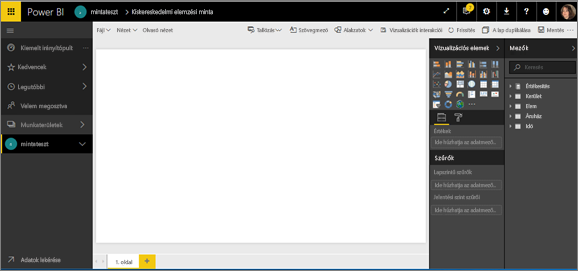
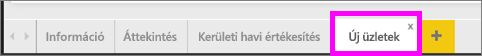
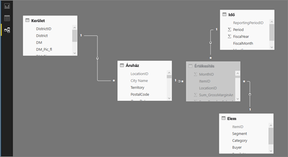

# A Kiskereskedelmi elemzési minta bemutatása

Ez az oktatóanyag az alábbi témákat mutatja be: 
- A Kiskereskedelmi elemzési tartalomcsomag-minta importálása, a Power BI szolgáltatáshoz való hozzáadása, és a tartalom megnyitása. A *tartalomcsomagok* olyan típusú minták, ahol az adatkészlethez irányítópult és jelentés is mellékelve van. 
- Nyissa meg a Kiskereskedelmi elemzési minta .pbix-fájlját a Power BI Desktopban.

További háttérinformációkat [A Power BI-hoz használható mintaadathalmazok](sample-datasets.md) témakörben talál. Abban a cikkben megismerkedhet a mintákkal, azok beszerzésével, mentési helyével, használatával, valamint az egyes mintákhoz kapcsolódó történetekkel. 

## Előfeltételek
A minták elérhetőek a Power BI szolgáltatáshoz és a Power BI Desktophoz is. A leírás követéséhez a Kiskereskedelmi elemzési mintát használhatja.

Az ebben az oktatóanyagban használt *Kiskereskedelmi elemzési* minta tartalomcsomag irányítópultot, jelentést és adatkészletet is tartalmaz.
Annak érdekében, hogy megismerkedhessen ezzel a tartalomcsomaggal és annak felhasználási helyzetével, tekintse meg a [Kiskereskedelmi elemzési minta – Power BI: Bemutató](sample-retail-analysis.md) témakört a kezdés előtt.

## A minta importálása a Power BI szolgáltatásban

1. Nyissa meg a Power BI szolgáltatást (app.powerbi.com), jelentkezzen be, majd nyissa meg azt a munkaterületet, ahol a mintát szeretné menteni. 

    Ha nem rendelkezik Power BI Pro-licenccel, a mintát a Saját munkaterületre mentheti.

2. Kattintson az **Adatok lekérése** elemre a navigációs panel alján. 

   

   Ha nem jelenik meg az **Adatok lekérése** elem, bontsa ki a navigációs panelt a panel tetején található következő ikon kiválasztásával: .

5. Ekkor megjelenik az **Adatok lekérése** lap. Itt válassza a **Minták** lehetőséget.
   
6. Válassza a **Kiskereskedelmi elemzési minta** elemet, majd a **Kapcsolódás** lehetőséget.   
   
   

## Mi lett importálva?
A mintaként használható tartalomcsomagok esetében a **Kapcsolódás** lehetőség kiválasztásakor a Power BI az adott tartalomcsomag másolatát kéri le és tárolja az Ön számára a felhőben. Mivel a tartalomcsomagot létrehozó személy adatkészletet, jelentést és irányítópultot is foglalt a csomagba – a **Kapcsolódás** lehetőség választásakor mindezek lekérése megtörténik. 

1. A **Kapcsolódás** lehetőség választásakor a Power BI létrehozza az új irányítópultot, és felveszi azt az **Irányítópultok** lapon található listára. 
   
   
2. Nyissa meg a **Jelentések** lapot. Itt egy új, *Kiskereskedelmi elemzési minta* nevű jelentést fog látni.
   
   
   
   Tekintse meg az **Adathalmazok** lapot; itt is új adathalmaz jelenik meg.
   
   

## Az új tartalmak vizsgálata
Most vizsgálja meg saját maga is az irányítópultot, az adatkészletet és a jelentést. Számos lehetséges módja van az irányítópultok, jelentések és adatkészletek közötti navigációnak. Az alábbiakban ezek egyikét mutatjuk be.  

1. Lépjen vissza az **Irányítópultok** lapra, majd válassza a **Kiskereskedelmi elemzési minta** irányítópultot annak megnyitásához.       

   Megnyílik a többféle vizualizáció-csempét tartalmazó irányítópult.   
 
1. Válassza ki az irányítópult egyik csempéjét az alapjául szolgáló jelentés megnyitásához. Ebben a példában a **Folyó évi értékesítések, Tavalyi értékesítések Pénzügyi hónap szerint** területdiagramot választjuk.  

   

   A jelentés a választott területdiagramot tartalmazó oldallal, ebben az esetben a jelentés **Körzeti havi értékesítés** oldalával nyílik meg.
   
   
   
   > [!NOTE]
   > Ha a csempe a [Power BI Q&A](power-bi-tutorial-q-and-a.md) használatával lett létrehozva, akkor helyette a Q&A oldala nyílik meg. Ha a csempét az [Excelből rögzítették](service-dashboard-pin-tile-from-excel.md), akkor az Excel Online nyílik meg a Power BI-ban.
   > 
   > 
1. Ha valaki megoszt egy tartalomcsomagot a kollégáival, akkor jellemzően csak az elemzési eredményeket kívánja megosztani, nem pedig közvetlen hozzáférést adni az adatokhoz. Az **Adathalmazok** lapon számos lehetősége van az adathalmaz vizsgálatára. Az adatsorokat és -oszlopokat azonban nem tekintheti meg úgy, ahogyan a Power BI Desktopban vagy az Excelben tehetné. 
   
   
   
1. Az adatkészlet átvizsgálásának egyik módja, ha az alapoktól kezdve létrehozza saját vizualizációit és jelentéseit. Kattintson a diagramikonra  az adatkészlet jelentésszerkesztési módban történő megnyitásához.
     
   

1. Az adathalmaz átvizsgálásának másik módja a [Gyors elemzések](../consumer/end-user-insights.md) szolgáltatás futtatása. Válassza a **További beállítások** (...) lehetőséget, majd a **Gyors elemzések lekérése** elemet. Ha az elemzések elkészültek, válassza az **Elemzések megtekintése** lehetőséget.
     
    

## A minta letöltése a Power BI Desktopban 
Amikor először nyitja meg a minta .pbix-fájlt a Power BI Desktopban, az Jelentés nézetben nyílik meg, amelyben bármennyi, vizualizációt tartalmazó jelentésoldalt megvizsgálhat, létrehozhat és módosíthat. A Jelentés nézet felülete nagyjából ugyanazzal a kialakítással rendelkezik, mint egy jelentés Szerkesztési nézete a Power BI szolgáltatásban. Többek között áthelyezheti a vizualizációkat, vagy másolhatja, beillesztheti és egyesítheti őket. 

A jelentés Power BI szolgáltatásban végzett szerkesztésétől eltérően a Power BI Desktopban dolgozhat lekérdezésekkel is, és modellezheti az adatokat annak érdekében, hogy azok a legjobb elemzést tegyék lehetővé a jelentésekben. Ezután mentheti a Power BI Desktop-fájlt bárhová, ahová szeretné, legyen az a helyi lemez vagy a felhő.

1. Töltse le a [Kiskereskedelmi elemzési minta .pbix-fájlját](https://download.microsoft.com/download/9/6/D/96DDC2FF-2568-491D-AAFA-AFDD6F763AE3/Retail%20Analysis%20Sample%20PBIX.pbix), és nyissa meg a Power BI Desktopban. 

    

1. A fájl Jelentés nézetben nyílik meg. Figyelje meg a négy lapfület a jelentésszerkesztő alján; ezek a jelentés négy oldalának felelnek meg. Ebben a példában éppen az **Új üzletek** oldal van kiválasztva. 

    .

1. Ha a jelentésszerkesztőt részletesebben is szeretné megismerni, olvassa el [A jelentésszerkesztő bemutatása](service-the-report-editor-take-a-tour.md) című témakört.

## Mit tartalmaz a jelentés?
A minta .pbix-fájl letöltésekor nem csak a jelentést, de a *mögöttes adathalmazt* is letöltötte. A fájl megnyitásakor a Power BI Desktop betölti az adatokat és az azokhoz tartozó lekérdezéseket és kapcsolatokat. A mögöttes adatokat és kapcsolatokat megtekintheti, de a mögöttes lekérdezéseket nem tekintheti meg a Lekérdezésszerkesztőben.

1. A táblázat ikont  választva válthat [Adatnézetre](../connect-data/desktop-data-view.md).
 
    

    Adatnézetben megvizsgálhatja, felderítheti és megismerheti Power BI Desktop-modellben lévő adatokat. Az adatnézettel másképp tekintheti meg a táblákat, oszlopokat és adatokat, mint a Lekérdezésszerkesztőben. Az adatnézetben látott adatok már be vannak töltve a modellbe.

    Az adatok modellezésekor előfordulhat, hogy csak meg szeretné tekinteni egy tábla sorainak és oszlopainak tényleges tartalmát anélkül, hogy ehhez egy vizualizációt vagy jelentésvásznat kellene létrehoznia. Ez különösen jellemző, amikor mértékeket vagy számított oszlopokat hoz létre, vagy amikor azonosítani szeretné az adatok típusát vagy kategóriáját.

1. Váltson [Kapcsolatok nézetre](../transform-model/desktop-relationship-view.md) a következő ikonnal: .
 
    

    A Kapcsolat nézet megjeleníti a modellben szereplő összes táblát, oszlopot és kapcsolatot. Itt létrehozhat kapcsolatokat, valamint megtekintheti és módosíthatja is azokat.

## Következő lépések
Ezzel a környezettel biztonságosan kísérletezhet, mert dönthet úgy, hogy nem menti a módosításokat. De ha mégis mentené őket, bármikor lekérheti a minta egy új másolatát az **Adatok lekérése** lehetőség választásával.

Reméljük, hogy ez a bemutató segített megérteni a mintaadatok Power BI irányítópultok, adathalmazok, kapcsolatok és jelentések segítségével történő elemzését. Most Önön a sor – kapcsolódjon a saját adataihoz. A Power BI használatával számos különböző adatforráshoz kapcsolódhat. További információt az [Első lépések a Power BI szolgáltatással](../fundamentals/service-get-started.md) és az [Első lépések a Power BI Desktoppal](../fundamentals/desktop-getting-started.md) című témakörökben találhat.  

További információ:  
- [A Power BI szolgáltatás alapfogalmai tervezők számára](../fundamentals/service-basic-concepts.md)
- [Minták a Power BI szolgáltatáshoz](sample-datasets.md)
- [Power BI-adatforrások](../connect-data/service-get-data.md)

További kérdései vannak? [Kérdezze meg a Power BI közösségét](https://community.powerbi.com/)
