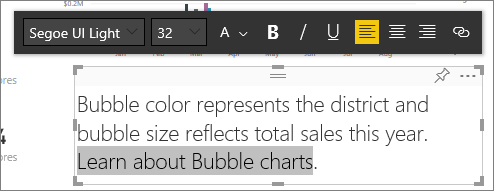
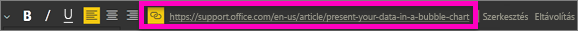

# Hivatkozás hozzáadása szövegmezőhöz egy jelentésben
A jelentésekhez szövegdobozokat adhat hozzá a Power BI Desktopban vagy a Power BI szolgáltatásban. Egy irányítópultra rögzíthet egy jelentésbeli szövegdobozt, vagy közvetlenül is hozzáadhat egyet. Bárhol helyezkedik el a szövegmező, mindig felvehető hozzá hivatkozás. Ez a cikk azt mutatja be, hogyan adhat hozzá hivatkozást egy jelentésbeli szövegdobozhoz. 

Megfigyelheti, hogyan hoz létre Will Thompson egy szövegdobozt, és hogyan ad hozzá hivatkozást. 

<iframe width="560" height="315" src="https://www.youtube.com/embed/_3q6VEBhGew#t=0m55s" frameborder="0" allowfullscreen></iframe>

A Power BI-táblázatokban és -mátrixokban használható hivatkozáskoról a [Hivatkozások hozzáadása táblázathoz](power-bi-hyperlinks-in-tables.md) című cikkben talál információt. A szövegdobozok irányítópulthoz történő hozzáadásáról a [Képek, videók és egyebek hozzáadása az irányítópulthoz](service-dashboard-add-widget.md) című cikkből tájékozódhat. 

## Hivatkozás szövegdobozhoz adása
1. Nyisson meg egy jelentést, [hozzon létre egy szövegdobozt](power-bi-reports-add-text-and-shapes.md), és írjon bele valamilyen szöveget. 
2. Jelölje ki a meglévő szöveget, vagy adjon hozzá új szöveget hivatkozásként való használathoz. 

   Megjelenik a szövegdoboz menüje.
   
   
3. Válassza a hivatkozás ikont  a szövegdoboz menüjében.

   A szövegdoboz menüjében megjelenik a hivatkozás mező.

4. Írja vagy illessze be az URL-címet a hivatkozás mezőbe, majd kattintson a **Kész** gombra.
   
   
5. Tesztelje a hivatkozást:  

   a. Vigye a kurzort a szövegdobozban lévő új hiperhivatkozás bármelyik része fölé, hogy a hivatkozás mezőben megjelenjen az URL-cím.  
     
      
   
      

   b. Válassza a hivatkozás mezőben lévő URL-címet, hogy az oldal megnyíljon egy új böngészőablakban.

## A hivatkozás eltávolítása
1. Jelölje ki a hivatkozást a szövegmezőben, hogy ki legyen emelve.
   
     
2. Válassza a szövegdoboz menüjének **Eltávolítás** elemét. 

   A Power BI Desktop eltávolítja a hivatkozást, de a szöveget meghagyja.

## További lépések
[Szövegdobozok és alakzatok Power BI-jelentésekben](power-bi-reports-add-text-and-shapes.md)

Több kérdése van? [Kérdezze meg a Power BI közösségét](https://community.powerbi.com/).

