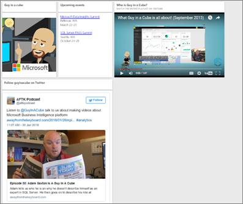

# <a name="add-images-videos-and-more-to-your-dashboard"></a>Képek, videók és egyéb elemek hozzáadása az irányítópulthoz

Az irányítópultra felvett csempékkel képet, szövegdobozt, videót, adatfolyamot vagy webes kódot helyezhet el az irányítópulton. 

Figyelje meg, hogyan vesz fel Amanda csempéket egy irányítópultra.

   
<iframe width="560" height="315" src="https://www.youtube.com/embed/e2PD8m1Q0vU" frameborder="0" allowfullscreen></iframe>


## <a name="add-an-image-video-or-other-tile"></a>Kép, videó vagy más csempe felvétele
Képeket, szövegdobozokat, videókat, streamelési adatokat és webes kódokat adhat hozzá közvetlenül az irányítópulthoz.

1. Az irányítópult felső menüsávján válassza a **Csempe hozzáadása** elemet. A rendelkezésre álló helytől függően előfordulhat, hogy csak a pluszjelet  látja.
   
    
2. Válassza ki a hozzáadni kívánt csempe típusát: 

    **[Webes tartalom](#add-web-content)**

    **[Kép](#add-an-image)**

    **[Szövegdoboz](#add-a-text-box-or-dashboard-heading)**

    **[Videó](#add-a-video)**

    **[Saját streamelési adatok](#add-streaming-data)**
   
    

## <a name="add-an-image"></a>Kép hozzáadása
Ha vállalati emblémát vagy más képet szeretne felvenni az irányítópultra, mentse online helyre a képfájlt, így hivatkozhat rá. Ügyeljen arra, hogy a képfájl eléréséhez ne legyen szükség biztonsági hitelesítő adatokra. Mivel a OneDrive és a SharePoint például hitelesítő adatokat kér, az ott tárolt képeket nem lehet ezen a módon hozzáadni az irányítópulthoz.  

1. A **Csempe hozzáadása** ablakban válassza a **Kép** > **Tovább** lehetőséget.

2. Adja meg a kép adatait a **Képcsempe felvétele** ablakban:   
   
   a. Ha azt szeretné, hogy cím jelenjen meg a kép fölött, válassza a **Cím és alcím megjelenítése** lehetőséget, majd írjon be egy **Címet** és igény esetén egy **Alcímet** is.

   b. Adja meg a kép **URL-címét**.

   c. Ha hivatkozássá alakítaná a csempét, jelölje be az **Egyéni hivatkozás beállítása** jelölőnégyzetet, és adja meg az **URL-címet**. 

      Amikor a munkatársai a csempére vagy a címre kattintanak, a rendszer erre az URL-címre irányítja őket.

   d. Kattintson az **Alkalmaz** gombra. 

      

3. Az irányítópulton igény szerint áthelyezheti a képet, és módosíthatja a méretét.
     
     

## <a name="add-a-text-box-or-dashboard-heading"></a>Szövegdoboz vagy irányítópult-címsor hozzáadása

Ha az irányítópult címsorát kívánja megadni, írja be a címsort a szövegdobozba, és válasszon nagyobb betűméretet.

1. A **Csempe hozzáadása** ablakban válassza a **Szövegdoboz** > **Tovább** lehetőséget.

2. A szövegdoboz formázása:
   
   a. Ha azt szeretné, hogy cím jelenjen meg a szövegdoboz fölött, válassza a **Cím és alcím megjelenítése** lehetőséget, majd írjon be egy **Címet** és igény esetén egy **Alcímet** is.

   b. Írja be és formázza a szövegdoboz **Tartalmát**.  

   c. Igény szerint egyéni hivatkozást is beállíthat a címhez. Az egyéni hivatkozások lehetnek külső helyek, vagy a munkaterületen található irányítópultok vagy jelentések. Ugyanakkor mivel ebben a példában magában a szövegdobozban adtuk meg a hivatkozásokat, üresen kell hagyni az **Egyéni hivatkozás beállítása** jelölőnégyzetet.

   d. Kattintson az **Alkalmaz** gombra. 

     
   
3. Az irányítópulton igény szerint áthelyezheti a szövegdobozt, és módosíthatja a méretét.
   
   

## <a name="add-a-video"></a>Videó hozzáadása
Ha YouTube- vagy Vimeo-videócsempét ad hozzá az irányítópulthoz, a lejátszó közvetlenül az irányítópulton fog elindulni.

1. A **Csempe hozzáadása** ablakban válassza a **Videó** > **Tovább** lehetőséget.
2. Adja meg a videó adatait a **Videócsempe felvétele** ablakban:   
   
   a. Ha azt szeretné, hogy cím jelenjen meg a videócsempe fölött, válassza a **Cím és alcím megjelenítése** lehetőséget, majd írjon be egy **Címet**, és igény szerint egy **Alcímet** is. Ebben a példában **Alcímet** adunk meg, amelyet aztán a teljes YouTube lejátszási listára mutató hivatkozássá konvertálunk.

   b. Adja meg a **Videó URL-címét**.

   c. Adjon meg egy hivatkozást a **Címhez** és az **Alcímhez**, hogy a munkatársai a beágyazott videó után a teljes lejátszási listát megtekinthessék a YouTube-on. Ehhez a **Működés** területen válassza az **Egyéni hivatkozás beállítása** lehetőséget, majd adja meg a lejátszási lista **URL-címét**.

   d. Kattintson az **Alkalmaz** gombra.  

   

3. Az irányítópulton igény szerint áthelyezheti a videó csempét, és módosíthatja a méretét.
     
   
4. A videó lejátszásához kattintson a videó csempére.
5. A YouTube lejátszási listájának felkereséséhez kattintson az alcímre.

## <a name="add-streaming-data"></a>Streamelési adatok hozzáadása
A PubNub használatával adatfolyamokat, például Twitter-hírcsatornákat vagy érzékelőadatokat adhat az irányítópult csempéjéhez. A Power BI integrációt hozott létre az adatok PubNubtól való átvételére. Will most elmagyarázza a működését.
   

<iframe width="560" height="315" src="https://www.youtube.com/embed/kOuINwgkEkQ" frameborder="0" allowfullscreen></iframe>

1. A **Csempe hozzáadása** ablakban válassza a **Saját streamelési adatok** > **Tovább** lehetőséget.
2. Válassza a **Streamelési adathalmaz hozzáadása** lehetőséget.
3. Hozzon létre **Új streamelési adathalmazt** a Power BI API vagy a PubNub használatával.
4. Töltse ki az **Adathalmaz neve**, az **Előfizetési kulcs** és a **Csatorna neve** mezőket. Ha a kapcsolat biztonságos, akkor engedélykulccsal is rendelkezik. A kipróbálásához használhatja a PubNubtól származó mintaértékeket.
5. Válassza a **Tovább** gombot.
    Láthatja az adathalmazban elérhető mezőket, azok adattípusát és JSON-formátumát.
6. Válassza a **Connect** (Kapcsolódás) elemet.
    Létrehozott egy streamelési adathalmazt.
7. Térjen vissza az irányítópultra, és válassza ismét a **Csempe hozzáadása** > **Saját streamelési adatok** > **Tovább** lehetőséget.
8. Válassza ki az érzékelőadatok létrehozott adathalmazát > **Tovább**.
9. Válassza ki a kívánt vizualizációtípust. Az ilyen adatokhoz többnyire a vonaldiagramok illenek.
10. Válassza a **Tengely**, **Jelmagyarázat** és **Értékek** lehetőségeket.
11. Határozza meg a megjeleníteni kívánt időtartamot másodpercben, percben vagy órában.
12. Válassza a **Tovább** gombot.
13. Ha szeretné, megadhat **Címet** és **Alcímet** is.
14. Rögzítse az irányítópulton.


1. A **Csempe hozzáadása** ablakban válassza a **Saját streamelési adatok** > **Tovább** lehetőséget.

2. Válassza a **Streamelési adathalmaz hozzáadása** lehetőséget.

3. Hozzon létre **Új streamelési adathalmazt** a Power BI API vagy a PubNub használatával.

4. Töltse ki az **Adathalmaz neve**, az **Előfizetési kulcs** és a **Csatorna neve** mezőket. Ha a kapcsolat biztonságos, akkor engedélykulccsal is rendelkezik. A kipróbálásához használhatja a PubNubtól származó mintaértékeket.

5. Válassza a **Tovább** gombot.

   Láthatja az adathalmazban elérhető mezőket, azok adattípusát és JSON-formátumát.

6. Válassza a **Connect** (Kapcsolódás) elemet.

   Létrehozott egy streamelési adathalmazt.

7. Térjen vissza az irányítópultra, és válassza ismét a **Csempe hozzáadása** > **Saját streamelési adatok** > **Tovább** lehetőséget.

8. Válassza ki az érzékelőadatok létrehozott adathalmazát > **Tovább**.

9. Válassza ki a kívánt vizualizációtípust. Az ilyen adatokhoz többnyire a vonaldiagramok illenek.

10. Válassza a **Tengely**, **Jelmagyarázat** és **Értékek** lehetőségeket.

11. Határozza meg a megjeleníteni kívánt időtartamot másodpercben, percben vagy órában.

12. Válassza a **Tovább** gombot.

13. Megadhat hozzá **Címet** és **Alcímet**.

14. Rögzítse az irányítópulton.

## <a name="add-web-content"></a>Webes tartalom hozzáadása
A jelentés vagy irányítópult címeként bármilyen HTML-tartalmat beilleszthet vagy beírhat. Adja meg manuálisan, vagy másolja és illessze be a Twitter, YouTube, embed.ly stb. által megadott beágyazási kódot.

1. A **Csempe hozzáadása** ablakban válassza a **Webes tartalom** > **Tovább** lehetőséget.

2. Adja meg az adatokat a **Webtartalom-csempe hozzáadása** ablakban:
   
   a. Ha azt szeretné, hogy cím jelenjen meg a csempe fölött, válassza a **Cím és alcím megjelenítése** lehetőséget, majd írjon be egy **Címet** és igény esetén egy **Alcímet** is.

   b. Adja meg a beágyazási kódot. Ebben a példában egy Twitter-hírcsatornát másolunk és illesztünk be.

   c. Kattintson az **Alkalmaz** gombra.

   
   

3. Az irányítópulton igény szerint áthelyezheti a webes tartalom csempéjét, és módosíthatja a méretét.
     
   

### <a name="tips-for-embedding-web-content"></a>Tippek a webes tartalom beágyazására
* iFrame-tartalmak esetén használjon biztonságos forrást. Ha az iFrame-alapú beágyazási kód megadásakor üres csempét kap, ellenőrizze, hogy nem a *http* előtagot használja-e az iFrame-forráshoz. Ha így van, módosítsa *https*-re.
  
  ```html
  <iframe src="https://xyz.com">
  ```
* Szerkessze meg a szélesség- és magasságadatokat. A beágyazási kód beágyazza a videót, és 560 × 315 pixelre állítja be a videólejátszót. A méret nem változik a csempe méretének módosítása esetén.
  
  ```html
  <iframe width="560" height="315"
  src="https://www.youtube.com/embed/Cle_rKBpZ28" frameborder="0"
   allowfullscreen></iframe>
  ```
  
  Ha a videólejátszót a csempe méretéhez szeretné igazítani, állítsa 100%-ra a szélességet és a magasságot.
  
  ```html
  <iframe width="100%" height="100%"
  src="https://www.youtube.com/embed/Cle_rKBpZ28" frameborder="0"
   allowfullscreen></iframe>
  ```
* Ez a kód beágyaz egy tweetet, és az irányítópulton külön megtartja a következő helyekre mutató hivatkozásokat: AFK podcast, \@GuyInACube Twitter-oldala, Követés, #statisztikák, válasz, továbbtweetelés és kedvelés.  Ha a felhasználó a csempére kattint, a Twitter-beli podcast nyílik meg.
  
  ```html
  <blockquote class="twitter-tweet" data-partner="tweetdeck">
  <p lang="en" dir="ltr">Listen to
  <a href="https://twitter.com/GuyInACube">@GuyInACube</a> talk to
  us about making videos about Microsoft Business Intelligence
  platform
  <a href="https://t.co/TmRgalz7tv">https://t.co/TmRgalz7tv </a>
  <a href="https://twitter.com/hashtag/analytics?src=hash">
  #analytics</a></p>&mdash; AFTK Podcast (@aftkpodcast) <a
  href="https://twitter.com/aftkpodcast/status/693465456531771392">
  January 30, 2016</a></blockquote> <script async src="//platform.twitter.com/widgets.js" charset="utf-8"></script>
  ```

## <a name="edit-a-tile"></a>Csempe szerkesztése
Egy meglévő csempe módosítása:

1. Mutasson a csempe jobb felső sarkára, és válassza a **További lehetőségek** (...) elemet.
   
    
2. Válassza a **Részletek szerkesztése** lehetőséget a **Csempe részletei** ablak megnyitásához, és hajtsa végre a módosításokat.
   
    

## <a name="considerations-and-troubleshooting"></a>Szempontok és hibaelhárítás
* Könnyebben helyezheti át a csempét az irányítópulton, ha címet és választható alcímet ad hozzá.
* Ha egy webhelyről tartalmat ágyazna be, de a webhely nem kínál fel másolható és beilleszthető beágyazási kódot, keresse fel az embed.ly oldalt a beágyazási kód létrehozásához.

## <a name="next-steps"></a>További lépések
[Irányítópultcsempék Power BI-tervezők számára – bevezetés](service-dashboard-tiles.md)

Több kérdése van? [Kérdezze meg a Power BI közösségét](https://community.powerbi.com/).

