# Power BI-irányítópult létrehozása jelentésből
Áttekintette [A Power BI-irányítópultok – bevezetés](service-dashboards.md) részben leírtakat, és most saját irányítópultot kíván létrehozni. Az irányítópultok létrehozásának számos különböző módja van. Többek között jelentésből, előzmények nélkül, adatkészletből, illetve egy meglévő irányítópult megkettőzésével is létrehozhatók.  

Egy gyorsan és egyszerűen elkészíthető irányítópulttal kezdünk, amelyre már elkészült jelentésből fogunk vizualizációkat rögzíteni. 

Mire a cikk végére ér, tisztában lesz a következőkkel:
- A jelentések és irányítópultok közötti kapcsolat
- A Szerkesztési nézet megnyitása a jelentésszerkesztőben
- Csempék rögzítése 
- Navigálás az irányítópultokban és a jelentésekben 
 

> [!NOTE] 
> Az irányítópult a Power BI szolgáltatás, nem pedig a Power BI Desktop funkciója. A Power BI-mobilalkalmazásokban nem hozhat létre irányítópultokat, azonban [megtekintheti és megoszthatja](../consumer/mobile/mobile-apps-view-dashboard.md) azokat.
>
> 

## Videó: Irányítópult létrehozása jelentésből származó vizualizációk és képek rögzítésével
Tekintse meg, ahogy Amanda bemutatja egy új irányítópult létrehozását jelentésből származó vizualizációk rögzítésével. Ezután az [Adathalmaz importálása jelentés használatával](#import-a-dataset-with-a-report) című következő szakasz lépeseit követve próbálkozzon meg a feladattal saját maga is a Beszerzéselemzési minta használatával.
    

<iframe width="560" height="315" src="https://www.youtube.com/embed/lJKgWnvl6bQ" frameborder="0" allowfullscreen></iframe>

## Adatkészlet importálása jelentés használatával
Ebben a lépésenkénti útmutatóban Power BI egyik minta-adathalmazát fogjuk importálni, majd egy új irányítópult létrehozására felhasználni. Az itt használt minta egy olyan Excel-munkafüzet, amely két PowerView-munkalapot tartalmaz. Amikor a Power BI importálja a munkafüzetet, egy adatkészletet és egy jelentést is hozzáad a munkaterülethez. A rendszer a jelentést automatikusan hozza létre a PowerView-munkalapokból.

1. Töltse le a [Beszerzéselemzési minta](https://go.microsoft.com/fwlink/?LinkId=529784) Excel-fájlt. Javasoljuk, hogy a OneDrive Vállalati verziójában mentse azt.
2. Nyissa meg a Power BI szolgáltatást a böngészőben (app.powerbi.com).
3. A navigációs panelen válassza a **Saját munkaterület**, majd az **Adatok lekérése** lehetőséget.

    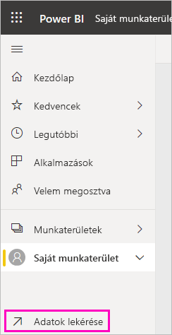
5. A **Fájlok** területen válassza a **Lekérés** lehetőséget.

   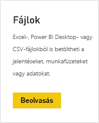
6. Keresse meg a helyet, ahová a Beszerzéselemzési minta Excel-fájlját mentette. Jelölje ki azt, és válassza a **Kapcsolódás** lehetőséget.

   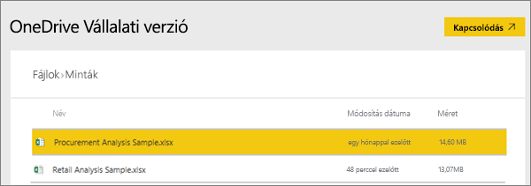
7. Ehhez a gyakorlathoz válassza az **Importálás** lehetőséget.

    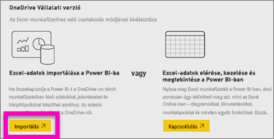
8. A sikert jelző üzenet megjelenésekor az **x** jelre kattintva zárja be azt.

   

> [!TIP]
> Tudta? A navigációs panelt keskenyebbre méretezheti a három vonalból álló felső ikon  kiválasztásával. Így több hely jut magának a jelentésnek.

### A jelentés megnyitása, és csempék rögzítése az irányítópulton
1. Ugyanezen a munkaterületen válassza a **Jelentések** lapot, majd a **Beszerzéselemzési minta** elemet a jelentés megnyitásához.

     A jelentés Olvasó nézetben nyílik meg. Figyelje meg, hogy a bal oldalon két lapfül látható: **Kedvezményelemzés** és **Értékesítés áttekintése**. Minden egyes lap a jelentés egy-egy oldalát jelképezi.

2. Válassza a **További beállítások (...)**  > **Jelentés szerkesztése** lehetőséget, amellyel megnyitja a jelentést Szerkesztés nézetben.

    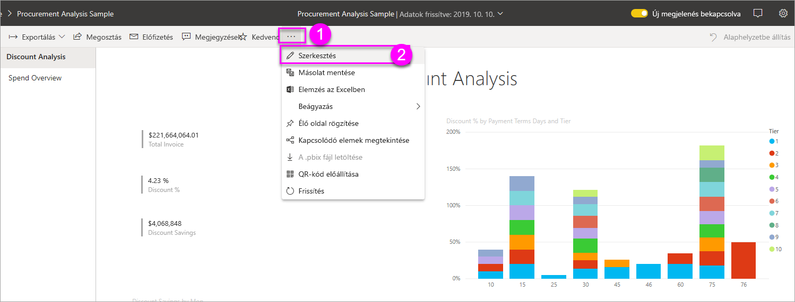
3. A rendelkezésre álló beállítások megjelenítéséhez húzza a mutatót a vizualizáció fölé. A vizualizációnak az irányítópulthoz történő hozzáadásához kattintson a gombostű ikonra .

    
4. Mivel most egy új irányítópultot hozunk létre, válassza az **Új irányítópult** lehetőséget, és adjon meg egy nevet.

    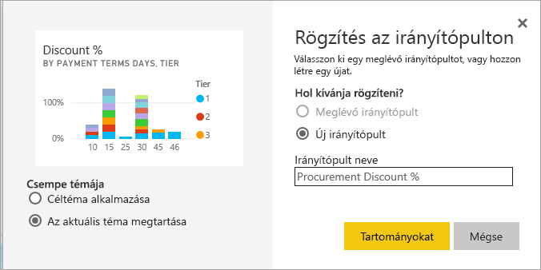
5. A **Rögzítés** lehetőség kiválasztásakor a Power BI az aktuális munkaterületen létrehoz egy új irányítópultot. A **Rögzítve az irányítópulton** üzenet megjelenése után válassza az **Ugrás az irányítópultra** lehetőséget. Ha a rendszer felkéri a jelentés mentésére, válassza a **Mentés** lehetőséget.

    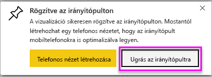

    A Power BI megnyitja az új irányítópultot. Ezen egy csempe található, az imént rögzített vizualizáció.

   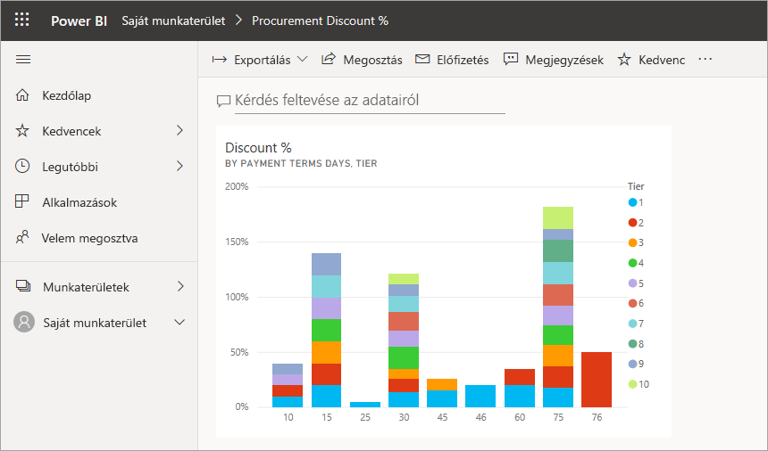
7. A jelentéshez való visszatéréshez kattintson a csempére. Rögzítsen még néhány csempét az irányítópulton. Ha a **Rögzítés az irányítópulton** ablak megjelenik, válassza a **Meglévő irányítópult** lehetőséget.  

   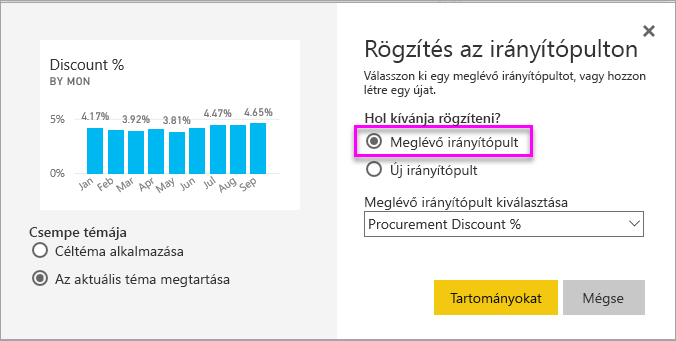

## Teljes jelentésoldal rögzítése irányítópultra
A vizualizációk egyenkénti rögzítése helyett lehetőség van arra is, hogy [teljes jelentésoldalt rögzítsen *élő csempeként*](service-dashboard-pin-live-tile-from-report.md). Nézzük is meg, hogyan.

1. A jelentésszerkesztőben válassza a **Költségek áttekintése** lapot, ezzel megnyitja a jelentés 2. oldalát.

   

2. A jelentés vizualizációinak mindegyikét az irányítópultra szeretnénk rögzíteni. Válassza a menüsáv jobb felső sarkában található **Élő oldal rögzítése** lehetőséget. Az irányítópulton az élő csempék a lap frissítésekor minden alkalommal frissülnek.

   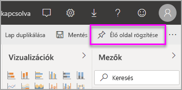

3. Ha a **Rögzítés az irányítópulton** ablak megjelenik, válassza a **Meglévő irányítópult** lehetőséget.

   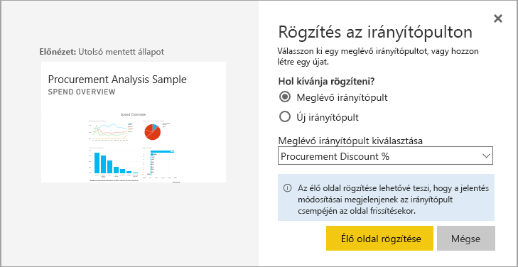

4. Amikor megkapja az értesítést a sikeres műveletről, válassza az **Ugrás az irányítópultra** lehetőséget. Ott jelentésből rögzített összes csempét megtalálja. Az alábbi példában az 1. oldalról két csempét rögzítettünk, és rögzítettük a jelentés 2. oldalát is, amely egy élő csempének felel meg.

   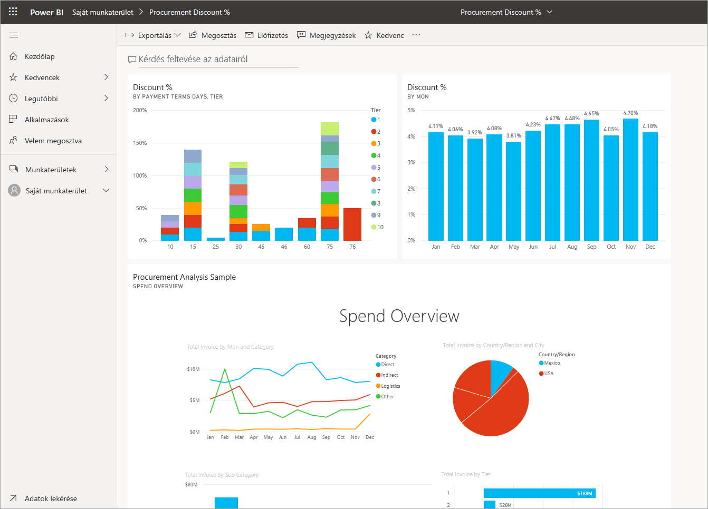

## Következő lépések
Gratulálunk, létrehozta az első irányítópultját! Most, hogy már rendelkezik irányítópulttal, számos további lehetőség nyílik meg. Tekintse át a javasolt cikkek egyikét, vagy próbálkozzon saját maga: 

* [Csempék átméretezése és áthelyezése](service-dashboard-edit-tile.md)
* [Információk az irányítópult csempéiről](service-dashboard-tiles.md)
* [Az irányítópult megosztása alkalmazás létrehozásával](../collaborate-share/service-create-workspaces.md)
* [Power BI – Alapfogalmak](../fundamentals/service-basic-concepts.md)
* [Tippek a tökéletes irányítópult megtervezéséhez](service-dashboards-design-tips.md)

További kérdései vannak? [Kérdezze meg a Power BI közösségét](https://community.powerbi.com/).
