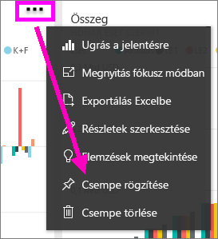
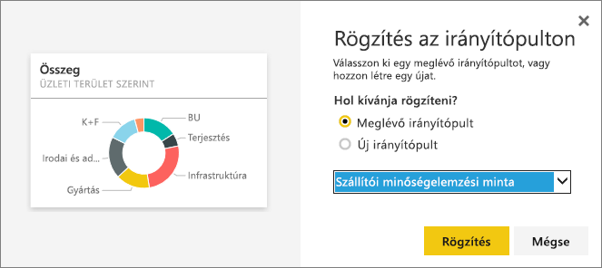
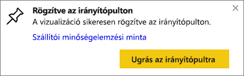

# Csempe rögzítése egy irányítópultról egy másikra
Ha egy új [irányítópult-csempét](../consumer/end-user-tiles.md) szeretne felvenni, egyik módszerként ezt megteheti egy másik irányítópult csempéjének másolásával. Ezek a csempék kattintható hivatkozások, amelyek arra a helyre mutatnak, ahol létrejöttek: vagy a Q&A-ra vagy egy jelentésre. 

> [!NOTE]
> Megosztott irányítópultokról nem tűzhet ki csempéket.

## Csempe kitűzése egy másik irányítópultra
1. [Kérje le az adatokat](../connect-data/service-get-data.md). Ez a példa az [informatikaköltség-elemzési mintát](sample-it-spend.md) használja.
2. Nyisson meg egy [irányítópultot](../consumer/end-user-dashboards.md).
3. Vigye a kurzort a rögzíteni kívánt csempe fölé, és válassza a **További beállítások** (...), majd a **Csempe rögzítése** lehetőséget.  
   
   
4. Tűzze ki a csempét egy meglévő vagy egy új irányítópultra. 
   
   * **Meglévő irányítópult**: válassza ki az irányítópult nevét a legördülő listából.
   * **Új irányítópult**: írja be az új irányítópult nevét.
   
   
5. Kattintson a **Rögzítés** elemre.
   A jobb felső sarokban ekkor megjelenik egy üzenet, amely arról tájékoztat, hogy sikeresen hozzáadta a vizualizációt a kiválasztott irányítópult egy csempéjeként.
   
   
6. Válassza az **Ugrás az irányítópultra** lehetőséget a rögzített csempe megtekintéséhez. A rögzített vizualizációt itt [átnevezheti, átméretezheti, és áthelyezheti, vagy hivatkozást hozhat létre hozzá](service-dashboard-edit-tile.md).

## További lépések
[Csempék a Power BI-ban](../consumer/end-user-tiles.md)  
[Irányítópultok a Power BI-ban](../consumer/end-user-dashboards.md)  
Több kérdése van? [Kérdezze meg a Power BI közösségét](https://community.powerbi.com/)
