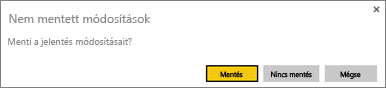
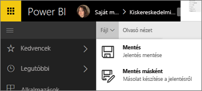
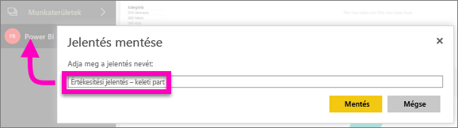

# Jelentések mentése a Power BI szolgáltatásban és a Power BI Desktopban
Miután módosít egy jelentést a Power BI-ban, mentheti, új néven mentheti, vagy bezárhatja a módosítások mentése nélkül. Tegyük fel, hogy megnyitja a jelentést, létrehoz egy vizualizációt, és az irányítópultra tűzi azt. Ha most a módosítások mentése nélkül bezárja a jelentést, a cím az irányítópulton marad, de nem menti a vizualizációt a jelentésbe. Amikor az irányítópulton lévő csempére kattint, megnyílik a jelentés, de a vizualizáció nem létezik a jelentésben.

> [!TIP]
> Figyeljen oda arra, hogy melyik munkaterület aktív, hogy megkereshesse a mentett jelentést. A jelentés mentése az aktív munkaterületre történik.
> 
> 

### Jelentés mentése:
1. Ha megkísérli elhagyni a jelentést, és a jelentésben változások vannak, a Power BI megjelenít egy kérdést.
   
   
2. A jelentés mentésének egy másik módja, ha a **FÁJL** \> **Mentés** vagy **Mentés másként** lehetőséget választja. Ha [Olvasó nézetben](../consumer/end-user-reading-view.md) van, csak a Mentés másként lehetőséget látja. 
   
   
3. Ha ez új jelentés (Mentés), vagy meglévő jelentés új verziója (Mentés másként), adjon meg egy leíró nevet.  **A jelentést az aktív munkaterülethez adja hozzá a rendszer**.
   
    

### Következő lépések
A [Power BI jelentéseiről itt talál](../consumer/end-user-reports.md) további információkat

[A Power BI szolgáltatás alapfogalmai tervezők számára](../fundamentals/service-basic-concepts.md)

További kérdései vannak? [Kérdezze meg a Power BI közösségét](https://community.powerbi.com/)
