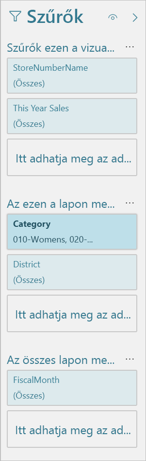

# A Power BI jelentésszerkesztőjének bemutatása

A Power BI Desktopban és a Power BI szolgáltatásban a *jelentésszerkesztőben* tervezheti meg az ügyfelei által látható jelentéseket diagramokkal, táblázatokkal, térképekkel és más vizualizációkkal. Ez mindkét környezetben hasonló. Jelentések létrehozását általában a Power BI Desktopban kezdjük. Ezt követően közzéteheti azokat a Power BI szolgáltatásban, ahol további módosításokat is végezhet rajtuk. Ugyancsak a Power BI szolgáltatásban hozhatja létre a jelentéseken alapuló irányítópultokat.

Ha elkészült az irányítópultok és a jelentések létrehozásával, terjesztheti őket a jelentés felhasználói számára. Attól függően, hogy hogyan osztja meg őket, a végfelhasználók használhatják a jelentéseket a Power BI szolgáltatásban Olvasó nézetében, de nem szerkeszthetik azokat. További információ arról, [mi mindenre használhatják a jelentésfelhasználók a Power BI szolgáltatást](../consumer/end-user-reading-view.md). 

Ez a videó bemutatja a jelentésszerkesztőt a Power BI Desktopban. Ez a cikk is a Power BI Desktopban használható jelentésszerkesztőt mutatja be. 

<iframe width="560" height="315" src="https://www.youtube.com/embed/IkJda4O7oGs" frameborder="0" allowfullscreen></iframe>

A Power BI szolgáltatásban a jelentésszerkesztő csak Szerkesztő nézetben érhető el. Egy jelentés szerkesztési nézetben történő megnyitásához a jelentés tulajdonosának vagy létrehozójának, vagy a jelentést tartalmazó munkaterületen közreműködőnek kell lennie.

A Power BI-jelentésszerkesztő több fő területre van tagolva:  

1. Felső navigációs ablaktábla
1. Jelentésvászon
1. Szűrők panel
1. Vizualizációk panel
1. Mezők ablaktábla

## 1. A felső navigációs ablaktábla
A felső navigációs ablaktábla számos műveletet tartalmaz, és folyamatosan új műveletekkel bővül. Az egyes műveletekről a Power BI-dokumentáció tartalomjegyzéke vagy a keresőmező használatával találhat további információt.

## 2. A jelentésvászon
A jelentésvásznon jelenik meg a munkája. A Mezők, a Szűrők és a Megjelenítések panel használatával létrehozott vizualizációk a jelentésvásznon állítódnak össze és jelennek meg. A vászon alján látható fülek mindegyike a jelentés egy-egy oldalát jelöli. A fület választva megnyílik a hozzá tartozó oldal. 

## A jelentésszerkesztő paneljei

A jelentés első megnyitásakor három panel látható: Szűrők, Vizualizációk és Mezők. A két bal oldali panel, a Szűrők és a Vizualizációk a vizualizációk megjelenését – típusát, színeit, szűrését és formázását – szabályozza. A jobb szélső Mezők panel a vizualizációban felhasználandó adatok kezelésére szolgál. A jelentésszerkesztőben megjelenő tartalom a jelentésvásznon alkalmazott kijelöléstől függően változik. 

Egy külön vizualizáció, például egy oszlopdiagram kijelölésekor például:

A **Szűrők panel** a vizualizációra, az oldalra vagy az összes oldalra vonatkozó valamennyi szűrőt megjeleníti. Ebben az esetben csak oldalszintű szűrők vannak, vizualizációszintűek nincsenek.

**A Vizualizáció panel felső része** a használt vizualizációtípust adja meg. Ez ebben a példában Fürtözött oszlopdiagram. 

**A Vizualizáció panel alján** három fül látható:

 A **Mezők** a vizualizációban szereplő mezőket mutatja meg. Az összes részlet megtekintéséhez esetleg görgetnie kell lefelé. Ez a diagram a StoreNumberName és a ThisYearSales értékeket használja.

 **Formátum** A kijelölt vizualizáció formázási paneljének megnyitásához válassza a festőhenger ikont.

 **Elemzés** Az Elemzés panel megjelenítéséhez válassza a nagyító ikont.

A **Mezők panel** az adatmodellben rendelkezésre álló összes táblát felsorolja. Egy tábla kibontásakor megjelennek az abban a táblában lévő mezők. A sárga pipa jelzi, hogy az adott táblának legalább egy mezője szerepel a vizualizációban.

A folytatásban további részleteket olvashat az egyes panelekkel kapcsolatban.

## 3. A Szűrők panel
A Szűrők panel használatával megtekintheti, beállíthatja és szerkesztheti a jelentés állandó szűrőit az oldal, a jelentés, a részletezés és a vizualizáció szintjén. Igen, végezhet ad-hoc szűrést a jelentésen és a vizualizációkon az elemek kijelölésével vagy szeletelők és más eszközök használatával. A Szűrők panelen végzett szűrés előnye, hogy a szűrők állapota mentve is lesz a jelentésben. 

A Szűrők panelnek egy másik hatékony funkciója is van: képes szűrést végezni olyan mező használatával, *amely még a jelentés egyik vizualizációjában sem szerepel*. Vizsgáljuk ezt meg közelebbről. Vizualizáció létrehozásakor a Power BI automatikusan felveszi a vizualizációkban szereplő összes mezőt a Szűrők panel vizualizációszintű szűrőinek területére. Ha olyan szűrőt szeretne használni a vizualizáció, oldal, részletezés vagy jelentés szintű szűrőkben, amely jelenleg nem szerepel a vizualizációkban, akkor azt át kell húznia a Szűrők gyűjtőinek egyikébe.

Az új szűrési felület nagyobb rugalmasságot kínál. Például formázni tudja a szűrőket, hogy igazodjanak a jelentés megjelenéséhez. A szűrők zárolhatók is, és el is rejthetők a jelentés felhasználói számára. 

További információ az [új szűrési felületről](power-bi-report-filter.md).

## 4. A Vizualizációk panel

A Vizualizációk panel maga is négy részből áll. Kezdjük a panel tetején.

Itt választhat vizualizációtípust. A kis ikonok bemutatják a különböző létrehozható vizualizációtípusokat. A fenti ábrán a buborékdiagram van kijelölve. Ha a mezők kijelölésével kezdi egy vizualizáció készítését anélkül, hogy előbb típust választana, a Power BI választ vizualizációtípust Ön helyett. Megtarthatja a Power BI által választottat, vagy másik ikont választva módosíthatja a típust.

A Power BI Desktopba egyéni vizualizációkat is letölthet. Azok ikonjai is ezen a panelen jelennek meg. 

### Vizualizáció mezőinek kezelése

Az ezen a panelen látható *gyűjtők* a kiválasztott vizualizációtípustól függően változnak.  Ha például sávdiagramot választott, akkor a Tengely, a Jelmagyarázat és az Értékek gyűjtő látható. Egy mező kijelölésekor vagy a vászonra történő húzásakor a Power BI hozzáadja a mezőt az egyik gyűjtőhöz.  A Mezők listából közvetlenül a gyűjtőkbe is húzhat mezőket.  Néhány gyűjtő csak bizonyos adattípusokat tartalmazhat.  Az **Értékek** gyűjtő például nem fogad el nem numerikus mezőket. Ha például egy **Category** mezőt húz az **Értékek** gyűjtőbe, akkor a Power BI azt a **count of Category** (Category mezők darabszáma) értékre változtatja.

További információ: [Vizualizáció hozzáadása Power BI-jelentéshez](../visuals/power-bi-report-add-visualizations-i.md).

A panelnek ezen a részén adhatók meg a [részletezés](desktop-drillthrough.md) és a szűrés viselkedését szabályozó beállítások is.

### Vizualizációk formázása
A festőhenger ikonra kattintva nyissa meg a Formázás panelt. Az elérhető lehetőségek a választott vizualizációtípustól függnek.

Rengeteg formázási lehetőség áll rendelkezésére.  A megismerésükhöz fedezze fel őket saját maga, vagy olvassa el az alábbi cikkeket:

* [Vizualizáció címének, hátterének és jelmagyarázatának testre szabása](../visuals/power-bi-visualization-customize-title-background-and-legend.md)
* [Formázás színekkel](../visuals/service-getting-started-with-color-formatting-and-axis-properties.md)
* [Az X és az Y tengely tulajdonságainak beállítása](../visuals/power-bi-visualization-customize-x-axis-and-y-axis.md)

### Elemzés hozzáadása vizualizációhoz
Az Elemzés panel megnyitásához válassza a nagyító ikont. Az elérhető lehetőségek a választott vizualizációtípustól függnek.

A Power BI szolgáltatás Elemzés paneljével dinamikus referenciavonalak adhatók a vizualizációkhoz, kiemelve a fontos trendeket vagy elemzési eredményeket. További információ: [Az Elemzés panel a Power BI Desktopban](../transform-model/desktop-analytics-pane.md).

## 5. A Mezők panel
A Mezők panel az adatai között található, vizualizációk létrehozásához felhasználható táblákat, mappákat és mezőket sorolja fel.

|  |  |
| --- | --- |
|  |<ul><li>Új vizualizáció létrehozásához húzzon egy mezőt az oldalra.  Mezőt meglévő vizualizációra húzva is felvehet.  </li> <li>A mezők melletti jelölőnégyzet bejelölésekor a Power BI hozzáadja a mezőt az aktív (vagy új) vizualizációhoz. Azt is eldönti, hogy melyik gyűjtőben helyezze el a mezőt.  Így dől el például, hogy a mező jelmagyarázatként, tengelyként vagy értékként lesz felhasználva. A Power BI becslés alapján dönt, de Ön igény szerint áthelyezheti a mezőt egy másik gyűjtőbe.   </li><li>A kijelölt mező mindenképpen hozzáadódik a jelentésszerkesztő Megjelenítések paneljéhez.</li></ul> |

A Power BI Desktopban lehetőség van egyebek között a mezők elrejtésére/felfedésére és számítások hozzáadására is.

## A mezőikonok

A Power BI különböző ikonokat használ a jelentésbeli mezők típusának jelölésére. Ezek ismeretében jobban megértheti, hogyan működnek a különböző vizualizációkban. Az alábbiak a leggyakoribbak között vannak.

|Ikon  |Értelmezés  |
|---------|---------|
|  | Mappa a Mezők listában |
| | Numerikus mező: A numerikus mezők összesítések, amelyek lehetnek például összeadás vagy átlagszámítás eredményei. Az összesítések az adatokkal együtt vannak importálva, és a jelentés alapjául szolgáló adatmodellben vannak meghatározva. További információ: [Összesítések Power BI-jelentésekben](service-aggregates.md). |
| | Számított oszlop nem numerikus adattípussal: Új nem numerikus oszlop, amelyet az oszlopbeli értékeket meghatározó adatelemzési kifejezéssel, DAX-képlettel hozhat létre. További tudnivalók a [számított oszlopokról](../transform-model/desktop-calculated-columns.md). |
|     |   Numerikus számított oszlop: Új oszlop, amelyet az oszlopbeli értékeket meghatározó adatelemzési kifejezéssel, DAX-képlettel hozhat létre. További tudnivalók a [számított oszlopokról](../transform-model/desktop-calculated-columns.md). |
| |  Mérték: A mértékek saját nem módosítható képlettel vannak kiszámítva. A számítás módja nem módosítható, egy összeg például csak összeg lehet. Az értékek nincsenek oszlopban tárolva. Menet közben vannak kiszámítva, egyedül a vizualizáción belüli helyük alapján. További információ: [A mértékek ismertetése](../transform-model/desktop-measures.md). |
|     | Mértékcsoport  |
| |      Fő teljesítménymutató (KPI): Olyan vizuális jel, amely egy mérhető cél terén elért előrehaladás mértékét jelzi. További tudnivalók a [Fő teljesítménymutató (KPI)](../visuals/power-bi-visualization-kpi.md) vizualizációkról |
|     |  Mezőhierarchia: A hierarchiát alkotó mezők a nyíl választásával tekinthetők meg.  További információkhoz juthat, ha megtekinti ezt a Power BI-videót a YouTube-on a [hierarchiák létrehozásáról és használatáról](https://www.youtube.com/watch?v=q8WDUAiTGeU). |
|     | Földrajzi hely adatok: Ezek a földrajzi helyet megadó mezők térképes vizualizációkhoz használhatók. |
|      | Identitás mező: Az ezzel az ikonnal jelölt mezők *egyedi mezők*, és úgy vannak beállítva, hogy minden érték megjelenjen még akkor is, ha duplikált. Az adatok között lehet például két különböző „Szabó János” nevű személyre vonatkozó rekord, és ezek mindegyike egyediként lesz kezelve. Nem lesznek összegezve.   |
|   | Paraméter: Paraméterek beállításával elérheti, hogy a jelentések és adatmodellek egyes részei (például egy lekérdezési szűrő, adatforrás-hivatkozás, mértékdefiníció stb.) egy vagy több paraméter értékétől függjön. A [lekérdezési paraméterekről](https://powerbi.microsoft.com/blog/deep-dive-into-query-parameters-and-power-bi-templates/) ebben a Power BI-blogbejegyzésben talál további információt. |
|  | Naptári dátum mező beépített dátumtáblázattal |

## Következő lépések
[Jelentés létrehozása](service-report-create-new.md)

További információk a jelentésekről használatáról a [Power BI szolgáltatásban](service-report-create-new.md), a [Power BI Desktopban](desktop-report-view.md) és a [Power BI Mobile-alkalmazásokban](../consumer/mobile/mobile-apps-view-phone-report.md).

[Alapfogalmak Power BI-tervezőknek](../fundamentals/service-basic-concepts.md)

További kérdései vannak? [Kérdezze meg a Power BI közösségét](https://community.powerbi.com/)
