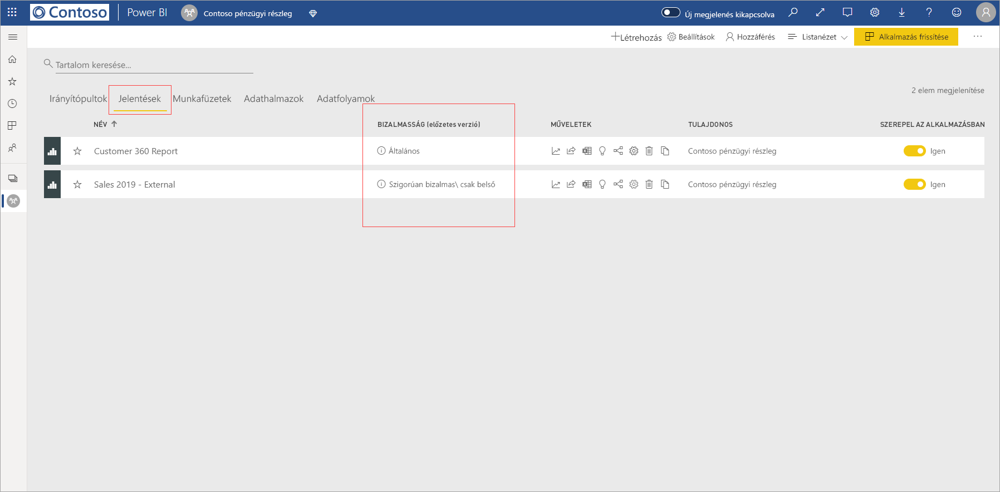
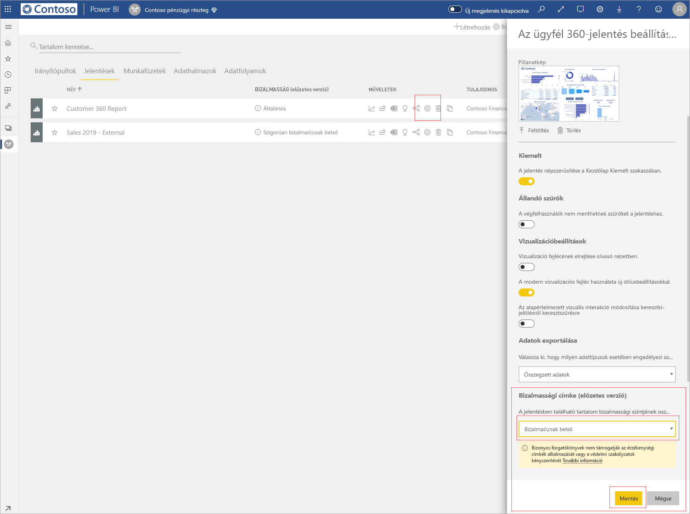
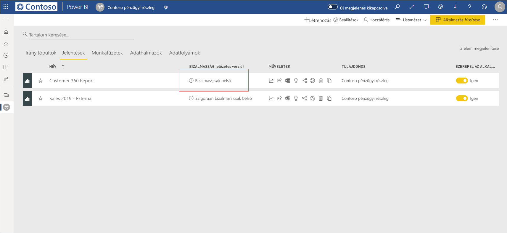
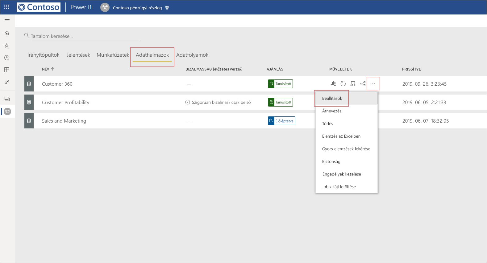
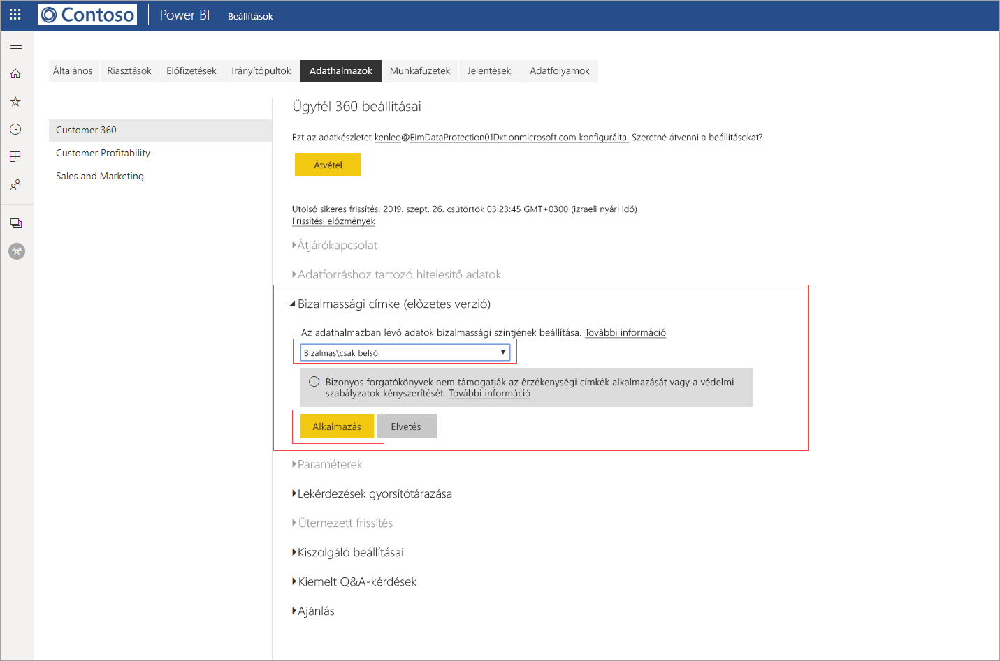
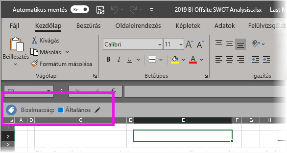

# Bizalmassági címkék alkalmazása a Power BI-ban (előzetes verzió)

Ha a bizalmassági címkék engedélyezve vannak a Power BI szolgáltatásban, az adatérzékeny címkék alkalmazásával biztosíthatja az irányítópultok, a jelentések, az adathalmazok és az adatfolyamok jogosulatlan hozzáférés és adatszivárgás elleni védelmet, ha bizalmasság címkéket alkalmaz rájuk. Az adatok bizalmassági adatcímkékkel való megfelelő címkézése biztosítja, hogy csak a jogosult személyek férhessenek hozzá az adatokhoz.

Ha engedélyezve van az adatvédelem, a bizalmassági címkék megjelennek az irányítópultok, a jelentések, az adathalmazok és az adatfolyamok listanézetének bizalmassági oszlopában.

> [!NOTE]
> Bizonyos licencek és engedélyek szükségesek ahhoz, hogy bizalmassági címkéket tudjon alkalmazni Power BI-irányítópultokra, -jelentésekre, -adathalmazokra és -adatfolyamokra. A részletekért lásd: [Bizalmassági címkék alkalmazása](#applying-sensitivity-labels).

## Bizalmassági címkék alkalmazása

A bizalmassági címkék Power BI-ban való alkalmazásához a következő követelményeknek kell megfelelnie Önnek és a szervezetnek:

* A szervezetnek a [Microsoft 365 Biztonsági központban](https://security.microsoft.com/) vagy a [Microsoft 365 Megfelelőségi központban](https://compliance.microsoft.com/) definiált bizalmassági címkékkel kell rendelkeznie.
* Olyan biztonsági csoportba kell tartoznia, amely rendelkezik a bizalmassági adatcímkék alkalmazásához szükséges engedélyekkel a [Bizalmassági adatcímkézés engedélyezése a Power BI-ban (előzetes verzió)](../admin/service-security-enable-data-sensitivity-labels.md#enable-data-sensitivity-labels) című cikkben leírtak szerint.
* Power BI Pro-licenccel, illetve a címkével ellátni kívánt erőforrásokra vonatkozóan szerkesztési engedéllyel kell rendelkeznie. 
* Azure Information Protection Prémium P1- vagy Prémium P2-licenccel kell rendelkeznie. A Microsoft Azure Information Protection önmagában és a Microsoft licencelési csomagjainak egyikében is megvásárolható. A részletekért tekintse meg az [Azure Information Protection díjszabását](https://azure.microsoft.com/pricing/details/information-protection/).

Egy jelentésre vonatkozó bizalmassági címke alkalmazásához vagy módosításához kattintson a munkaterület listaelemének Jelentésbeállítások ikonjára, majd lépjen az Adatok bizalmassága szakaszra a Beállítások oldalsó ablaktáblán. Válassza ki a megfelelő bizalmassági címkét, és mentse a beállításokat.

A bizalmassági oszlop megjelenik a frissített bizalmassági címke. 

Egy irányítópultra vonatkozó bizalmassági címke a jelentésekre vonatkozóan leírttal megegyező eljárással alkalmazható vagy módosítható. 

Adathalmazokra és adatfolyamokra vonatkozóan is beállíthat bizalmassági címkéket. Az alábbi képen az látható, hogyan állíthat be bizalmassági címkét egy adathalmazhoz; a lépések adatfolyamok esetében is hasonlóak.

Ha egy adathalmazra vonatkozóan szeretne bizalmassági címkét beállítani, válassza az Adathalmazok lapot, kattintson az ahhoz az adathalmazhoz tartozó három pontra, amelyre címkét szeretne alkalmazni, majd válassza a **Beállítások**lehetőséget.

Az adathalmaz Beállítások lapján nyissa meg a Bizalmassági címke szakaszt, válassza ki a kívánt bizalmassági címkét, majd kattintson az **Alkalmazás** lehetőségre.

Egy adathalmazra vonatkozó bizalmassági címke az adathalmazokra vonatkozóan leírttal megegyező eljárással alkalmazható vagy módosítható.

## Bizalmassági címkék eltávolítása
Ha el szeretne távolítani egy biztonsági címkét egy jelentésről, irányítópultról, adathalmazról vagy adatfolyamról, kövesse [ugyanazt az eljárást, mint a címkék alkalmazásakor](#applying-sensitivity-labels), de válassza a **(Nincs)** lehetőséget, amikor a rendszer az adatok bizalmassági besorolására kérdez rá. 

## Adatvédelem exportált fájlokban

Amikor [egy olyan jelentésből exportál adatokat](https://docs.microsoft.com/power-bi/consumer/end-user-export), amely bizalmassági címkével van ellátva, a generált fájl örökli a bizalmassági címkét (Excel, PowerPoint és PDF esetében, a CSV nem támogatott). A bizalmassági címke látható lesz a fájlban, és a fájlhoz való hozzáférés a megfelelő engedélyekkel rendelkezőkre lesz korlátozva.

## Megfontolandó szempontok és korlátozások

A bizalmassági adatcímkék alkalmazása során a következőket kell figyelembe venni:

* A Microsoft Azure Information Protection bizalmassági címkéinek Power BI-ban való alkalmazásához és megtekintéséhez Azure Information Protection Prémium P1- vagy Prémium P2-licenc szükséges. A Microsoft Azure Information Protection önmagában és a Microsoft licencelési csomagjainak egyikében is megvásárolható. A részletekért tekintse meg az [Azure Information Protection díjszabását](https://azure.microsoft.com/pricing/details/information-protection/).
* A bizalmassági címkék csak irányítópultokra, jelentésekre, adathalmazokra és adatfolyamra alkalmazhatók.
* A címkék és védelmi vezérlők exportált fájlokra való érvényesítése csak Excel-, PowerPoint- és PDF-fájlok esetében támogatott. A rendszer nem érvényesíti a címkét és a védelmet, ha az adatokat .CSV-fájlokba, e-mailre való feliratkozással, vizualizációk beágyazásával vagy nyomtatással exportálják.
* A felhasználónak, aki exportál egy fájlt a Power BI-ból, a bizalmassági címke beállításainak megfelelően engedélye van az adott fájl elérésére és szerkesztésére. Az adatokat exportáló felhasználó nem kap tulajdonosi engedélyt a fájlhoz. 
* A bizalmassági címkék jelenleg [oldalakra osztott jelentésekhez]( https://docs.microsoft.com/power-bi/paginated-reports-report-builder-power-bi) és munkafüzetekhez nem érhetők el. 
* A Power BI-objektumok bizalmassági címkéi csak a munkaterületek listájában és az életútnézetekben láthatók; a címkék jelenleg nem láthatók a Kedvencek, a Velem megosztva, a Legutóbbiak vagy az Alkalmazás nézetben. Azt azonban vegye figyelembe, hogy egy Power BI-objektumra alkalmazott címke minden esetben megmarad az Excel-, PowerPoint- vagy PDF-fájlokba exportált adatokon, még akkor is, ha nem látható.
* A bizalmassági címke *fájltitkosítási beállítása*, mely a [Microsoft 365 Biztonsági központban](https://security.microsoft.com/) vagy a [Microsoft 365 Megfelelőségi központban](https://compliance.microsoft.com/) lett konfigurálva, csak a Power BI-ból *exportált* fájlokra érvényes; a Power BI-on *belül* nem érvényesíti a rendszer.
* A [HYOK-védelem](https://docs.microsoft.com/azure/information-protection/configure-adrms-restrictions) a Power BI-ban alkalmazott címkék esetében nem támogatott.
* A címkék Office-alkalmazásokban való megtekintésére és alkalmazására [licencelési követelmények](https://docs.microsoft.com/microsoft-365/compliance/get-started-with-sensitivity-labels#subscription-and-licensing-requirements-for-sensitivity-labels) vonatkoznak.
* A bizalmassági címkék használata csak a globális (nyilvános) felhőben található bérlők esetében támogatott. A bizalmassági címkék használata a más felhőkben található bérlők esetében nem támogatott.
* A bizalmassági címkék nem támogatottak [külső felhasználók (Azure Active Directory B2B vendégfelhasználók)](../service-admin-azure-ad-b2b.md) számára. Ez azt jelenti, hogy külső felhasználók nem tekinthetik meg a címkéket, és tiltott számukra az adatok Excel-, PDF- és PPTX-fájlokba exportálása. [Távolítsa el a címkét](#removing-sensitivity-labels), hogy a külső felhasználók is exportálhassanak adatokat ezekbe a fájlformátumokba.

## Következő lépések

Ez a cikk azt ismertette, hogyan alkalmazhat bizalmasság adatcímkéket a Power BI-ban. A következő cikkek további részleteket tartalmaznak a Power BI-ban alkalmazható adatvédelemről. 

* [A Power BI adatvédelmi lehetőségeinek áttekintése](../admin/service-security-data-protection-overview.md)
* [Bizalmassági adatcímkézés engedélyezése a Power BI-ban](../admin/service-security-enable-data-sensitivity-labels.md)
* [A Microsoft Cloud App Security vezérlőinek használata a Power BI-ban](../admin/service-security-using-microsoft-cloud-app-security-controls.md)