# Klasszikus munkaterületek frissítése az új munkaterületekre a Power BI-ban

Ez a cikk a klasszikus munkaterületek új munkaterületi felületre frissítését ismerteti. Bármelyik klasszikus munkaterületet frissítheti. Az új munkaterületek részletesebb munkaterületi szerepköröket kínálnak, így jobban felügyelhető a tartalomhoz való hozzáférés. A frissített munkaterületek rugalmasabban kezelhetők, mert kevésbé szorosan kötődnek az eredeti Office 365-csoportjukhoz. Itt megismerkedhet az [új munkaterületi felhasználói felülettel](../service-new-workspaces.md). 

>[!NOTE]
>A munkaterület frissítése nyilvános előzetes verzióként érhető el. 

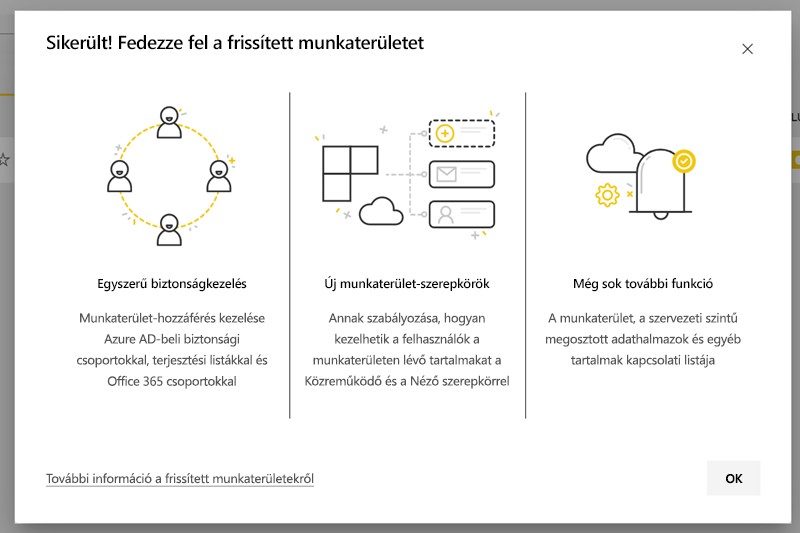

A munkaterületen mindemellett olyan változtatások történhetnek, amelyekkel tisztában kell lennie, és fel kell készülnie. A tartalomcsomagok például nem támogatottak az új munkaterületi felületen. Erről a cikk egy későbbi, [Frissítési szempontok és korlátozások](#upgrade-considerations-and-limitations) című szakasza nyújt tájékoztatást.

## A frissítés utáni teendők

A frissítés *után* több tennivalója is lesz. Ezeket érdemes még a frissítés *előtt* megtervezni:
- Ellenőrizze a hozzáférési listát, és tisztázza a [frissítés utáni engedélyeket](#permissions-after-upgrade).
- Tekintse át a [partnerlistát](#modify-the-contact-list), és ellenőrizze, hogy a kívánt módon van-e beállítva.
- Ha még nem tette meg, tanulmányozza az [új munkaterületi felhasználói felületet](../service-new-workspaces.md).

## Klasszikus munkaterület frissítése

A munkaterületet bármelyik munkaterületi rendszergazda frissítheti. Klasszikus munkaterület esetén az lehet munkaterületi rendszergazda, aki tulajdonosa a mögöttes Office 365-csoportnak. Munkaterület frissítéséhez hajtsa végre a következő lépéseket.

1. A munkaterület tartalomlistájában válassza a **További lehetőségek** ( **...** ) elemet, majd a **Munkaterület szerkesztése** menüpontot.

    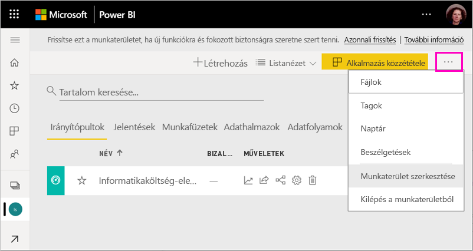

1. Bontsa ki a **Speciális** elemet, majd válassza az **Azonnali frissítés** lehetőséget.

    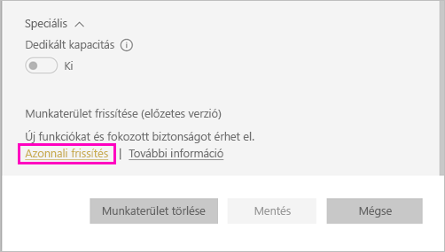

1. Tekintse át a párbeszédpanel információit. Ha a munkaterületen tartalomcsomagokat tett közzé vagy telepített, figyelmeztetés jelenik meg. Ha készen áll, jelölje be a **Készen állok a munkaterület frissítésére** jelölőmezőt, majd válassza a **Frissítés** lehetőséget.

    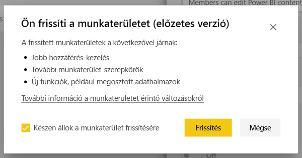

2. A frissítés során a **Frissítés folyamatban** üzenetet fogja látni. A munkaterület frissítése általában egy percnél kevesebbet vesz igénybe.

1. A frissítés befejeződése után megjelenik a **sikerről** értesítő párbeszédpanel. Ajánlott elolvasni a [Munka szervezése az új munkaterületeken a Power BI-ban](../service-new-workspaces.md) című cikket, hogy megismerje az új munkaterületek és a klasszikus munkaterületek közötti különbségeket.

### A munkaterület más felhasználóit érintő változások

A frissítést javasolt munkaidőn kívül végrehajtani, amikor kevesebb aktív felhasználó tekinti meg vagy szerkeszti a munkaterület elemeit.

A munkaterületet aktívan használó felhasználókat a rendszer a böngésző frissítésére fogja kérni. A jelentést szerkesztő felhasználóknak lehetőségük lesz menteni a módosításokat a frissítés előtt.

## Frissítési szempontok és korlátozások

- A munkaterület URL-címei és azonosítói, az itt lévő tartalmak és a munkaterületről közzétett alkalmazások nem változnak. A munkaterületre telepített tartalomcsomagokból származó tartalom másként lesz kezelve. Ennek részleteit a cikk [Tartalomcsomagok a frissítés során](#content-packs-during-upgrade) című szakasza ismerteti.
- A tartalomcsomagok nem támogatottak az új munkaterületi felületen. Arról, hogy ezek hogyan lesznek kezelve a frissítés során, a [Közzétett tartalomcsomagok](#published-content-packs) vagy a [Telepített tartalomcsomagok](#installed-content-packs) című szakaszban tájékozódhat. A munkaterületre telepített vagy közzétett tartalomcsomagokat ajánlott a frissítés előtt törölni.
- A munkaterület Power BI-beli frissítése a klasszikus munkaterülethez tartozó Office 365-csoportot nem érinti. A Teams- vagy SharePoint-webhelyek, postaládák és az Office 365 által felügyelt más erőforrások nem módosulnak. Változatlanul megmaradnak a Power BI-munkaterület frissítése után. Az Office 365-csoport továbbra is létezni fog, mint korábban.
- A munkaterület biztonsága terén változások történnek a frissítés után. Ezek részletes leírását a [munkaterületre vonatkozó frissítés utáni engedélyeket](#permissions-after-upgrade) ismertető szakaszban találhatja meg.
- Szükség esetére rendelkezésre áll a **Visszatérés klasszikus munkaterületre** lehetőség. Ez azonban a munkaterület egyes jellemzőit nem teljesen állítja vissza a frissítés előtti állapotra. Ha használatba veszi a csak az új munkaterületi felületen működő funkciókat, többé nem lesz módja a visszaállításra. A visszatérés lehetősége a frissítés után 30 napig áll rendelkezésére.

## Engedélyek a frissítés után

A frissítés utáni engedélyeket a munkaterület tartalomlistájának felső részén található menüsáv **Hozzáférés** elemét választva tekintheti meg.

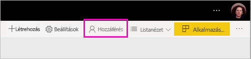

Az Office 365-csoport összes tulajdonosa egyénileg hozzá lesz adva a frissített munkaterület Rendszergazda szerepköréhez. Maga az Office 365-csoport is hozzá lesz adva egy munkaterületi szerepkörhöz. Hogy melyik szerepkörhöz lesz hozzáadva, az attól függ, hogy a klasszikus munkaterület *írásvédett* vagy *írható-olvasható*:

- Ha a munkaterület beállítása **A tagok szerkeszthetik a Power BI-tartalmakat**, akkor a frissítés után az Office 365-csoport a **Tag** szerepkörrel lesz felvéve a munkaterület hozzáférési listájára.
- Ha a munkaterület beállítása **A tagok csak olvashatják a Power BI-tartalmakat**, akkor a frissítés után az Office 365-csoport a **Megtekintő** szerepkörrel lesz felvéve a munkaterület hozzáférési listájára.

Mivel az Office 365-csoport szerepkört kap a munkaterületen, az Office 365-csoportba a frissítés után felvett összes felhasznál rendelkezni fog ezzel a szerepkörrel a munkaterületen. Az Office 365-csoportba a frissítés után felvett új tulajdonosok azonban nem fognak a munkaterület Rendszergazda szerepkörével rendelkezni.

### A frissítés előtti és utáni szerepkörök eltérései

A klasszikus és az új munkaterületeken elérőek a szerepkörök. Az új munkaterületi felület lehetővé teszi, hogy munkaterületi szerepköröket adjon Office 365-csoportoknak, biztonsági csoportoknak vagy terjesztési listáknak.

- A **Tagok** megoszthatnak egyes elemeket, és hozzáférést adhatnak a teljes munkaterülethez a Tag, Közreműködő vagy Megtekintő szerepkörrel
- A **Megtekintők** csak megtekinthetik a tartalmat, és csak akkor exportálhatnak mögöttes adatokat vagy elemezhetik az Excelben a munkaterület adathalmazait, ha Összeállítási engedéllyel rendelkeznek.

Azok a felhasználók, akik a munkaterület elemeihez megosztási vagy alkalmazásengedélyeken keresztül férnek hozzá, továbbra is hozzáférnek ezekhez az elemekhez. Aki a munkaterülethez hozzáfér, az a munkaterületről közzétett alkalmazáshoz is hozzáfér. Ezek a felhasználók nincsenek feltüntetve az alkalmazás hozzáférési listájában.

Ajánlott mérlegelni az új Közreműködő szerepkör használatát. A frissítés után az Office 365-csoport a Hozzáférés panelen módosítható úgy, hogy Közreműködő szerepkörrel rendelkezzen.

A frissítés után érdemes lehet biztonsági vagy Office 365-csoportot vagy terjesztési listát létrehozni a munkaterületi rendszergazdák számára ahelyett, hogy a szerepkör-hozzárendeléseket külön kezelné az egyes felhasználóknál.

További információ az [új munkaterületi szerepkörökről](../service-new-workspaces.md#roles-in-the-new-workspaces).

## Frissítés utáni licencelés

A Rendszergazda, Tag vagy Közreműködő szerepkörrel rendelkező felhasználóknak Power BI Pro-licencre van szükségük a munkaterület eléréséhez.

Ha a munkaterület a megosztott kapacitásban van, a Megtekintő munkaterületi szerepkörben lévő felhasználóknak is Power BI Pro-licenc szükséges a munkaterület eléréséhez. Ha azonban a munkaterület Prémium szintű kapacitásban van, a Megtekintő szerepkörben lévő felhasználók Pro-licenc nélkül is elérhetik a munkaterületet.

## Az új munkaterület egyéb funkciói

Az új munkaterületi felület rendelkezik olyan funkciókkal, amelyekkel a klasszikus munkaterületek nem. Az egyik különbség a munkaterületi rendszergazdákétól vagy tulajdonosokétól különböző partnerlista beállításának lehetősége. Egy hasonlóság, hogy ez továbbra is az Office 365-csoport SharePoint-dokumentumtárához kötődik. 

### Partnerlista módosítása

1. A munkaterület beállításait a munkaterület tartalomlistájának felső részén található menüsáv **Beállítások** elemét választva érheti el.

    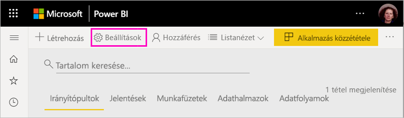

2. A **Speciális** területen a munkaterület **Partnerlistája** konfigurálható úgy, hogy azzal az Office 365-csoporttal egyezzen meg, amelyről a munkaterület frissítve lett. A partnerlistára további felhasználókat és csoportokat is felvehet, vagy átállíthatja azt úgy, hogy a munkaterület rendszergazdáiból álljon.

    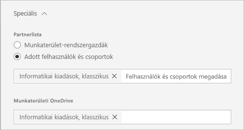

### A munkaterületi OneDrive 

A munkaterületi **OneDrive** a frissítés után az Office 365-csoport SharePoint-dokumentumtárához lesz kapcsolva. Ez a dokumentumtár jelenik meg az **Adatok beolvasása > Fájlok** felület **OneDrive** lehetőségeként. Fontos tudni, hogy a munkaterület felhasználói nem feltétlenül rendelkeznek a dokumentumtárra vonatkozó engedéllyel, ha nem tagjai az Office 365-csoportnak.

## Tartalomcsomagok a frissítés során

Az új munkaterületi felület nem támogatja a tartalomcsomagokat. A tartalom ezek helyett alkalmazásokkal és megosztott adathalmazokkal terjeszthető a munkaterületen. A munkaterületről ajánlott a frissítés előtt eltávolítani a közzétett vagy telepített tartalomcsomagokat. Ha a frissítéskor mégis vannak közzétett vagy telepített tartalomcsomagok, a frissítési folyamat megkísérli az alább bemutatott módon megőrizni a tartalmat.  A tartalomcsomag vagy a tartalomnak a tartalomcsomaghoz rendelése a frissítés után már nem állítható vissza.

### Közzétett tartalomcsomagok

A munkaterületről közzétett tartalomcsomagok a frissítés során el lesznek távolítva. A frissítés után ezeket még akkor sem teheti közzé és nem frissítheti, ha visszatér a klasszikus munkaterületre. Mások, akik az Ön tartalomcsomagját a saját munkaterületükön telepítették, a frissítés után a tartalomcsomag tartalmának egy másolatát fogják látni a saját munkaterületükön. Erről a **Telepített tartalomcsomagok** című szakasz ír részletesen.

### Telepített tartalomcsomagok

Ha frissíti a munkaterületét, vagy azt a munkaterületet frissítik, amelyről a tartalomcsomagot közzétették, a telepített tartalomcsomagokon jelentős módosítások történnek. A frissítés után a munkaterület a tartalomcsomag tartalmának egy másolatát fogja tartalmazni. Ez az eredeti munkaterületen lévő eredeti adathalmazhoz kapcsolódik.

Vannak azonban lényeges változások:

- A tartalom többé nem frissül a tartalomcsomag frissítésekor.
- Az URL-címek és elemazonosítók megváltoznak, ezért a másokkal megosztott könyvjelzőket és hivatkozásokat frissíteni kell.
- A munkaterületről származó eredeti tartalomcsomagon végzett felhasználói módosítások elvesznek. Testreszabásnak számítanak többek között a feliratkozások, riasztások, személyes könyvjelzők, állandó szűrők és kedvencek.
- Az új felhasználók nem feltétlenül férnek hozzá azokhoz az adathalmazokhoz, amelyek a tartalomcsomagban voltak. Az adathalmaz tulajdonosával közösen kell biztosítania, hogy a munkaterület felhasználói hozzáférjenek az adatokhoz.

## Visszatérés klasszikus munkaterületre

A frissítési felületen a frissítés után 30 napig lehetősége van visszatérni egy klasszikus munkaterülethez. Ez a képesség visszaállítja a munkaterületi tartalom és az eredeti Office 365-csoport egymáshoz rendelését. Arra az esetre szolgál, ha a vállalat súlyos problémákat tapasztal az új munkaterületi felület használata során. Vannak azonban korlátai. Először olvassa el ennek a cikknek [A klasszikusra való visszatérés szempontjai](#considerations-for-switching-back-to-classic) című szakaszát.

A visszalépéshez tulajdonosnak kell lennie abban az Office 365-csoportban, amelyhez a munkaterület a frissítés előtt társítva volt. Hajtsa végre az alábbi lépéseket.

1. A munkaterület tartalomlistájában válassza a **További lehetőségek** ( **...** ) elemet, majd a **Munkaterület beállításai** menüpontot.

    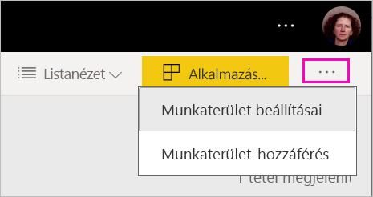

1. Bontsa ki a **Speciális** elemet, majd válassza a **Visszaváltás klasszikusra** lehetőséget. Ha ez a lehetőség nem érhető el, olvassa el ennek a cikknek [A klasszikusra való visszatérés szempontjai](#considerations-for-switching-back-to-classic) című szakaszát.

    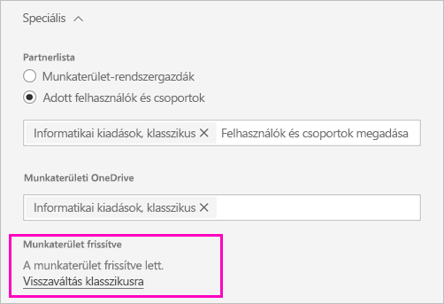

1. Ha készen áll, jelölje be a **Készen állok a klasszikusra való visszaváltásra** jelölőnégyzetet, majd válassza a **Visszaváltás klasszikusra** lehetőséget. Ez a párbeszédpanel figyelmeztetéseket vagy akadályozó tényezőket jeleníthet meg. Ha ilyen problémákba ütközik, olvassa el ennek a cikknek [A klasszikusra való visszatérés szempontjai](#considerations-for-switching-back-to-classic) című szakaszát.

    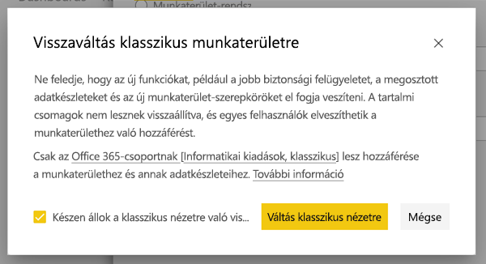

1. Ha a visszaállítás befejeződik, erről egy párbeszédpanel értesíti.

    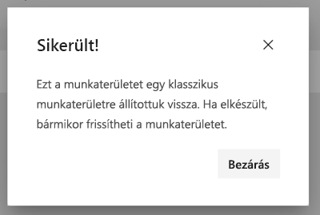

### A klasszikusra való visszatérés szempontjai

A visszaállítás nem hajtható végre, ha a munkaterületre vonatkozó alábbi állítások bármelyike igaz:

- Az Office 365-csoport törölve lett.
- Több, mint 30 nap telt el a frissítés óta.
- A munkaterületen lévő adathalmazokat más munkaterületeken lévő jelentések vagy irányítópultok használják. Ez hogyan történhet meg? Tegyük fel, hogy a frissítés előtt közzétett egy tartalomcsomagot a munkaterületről, és valaki telepítette ezt a tartalomcsomagot egy másik munkaterületen. Az ebben a tartalomcsomagban lévő jelentések és irányítópultok közvetlenül a frissítés után az adathalmazokat használják.
- A munkaterület egy alkalmazás életciklus-kezelési folyamatának része.
- A munkaterület sablonalkalmazásokhoz van használva.
- A munkaterület a nagyméretű modellek képességet használja.
- A munkaterület az új használati metrikák funkciót használja.

A klasszikus munkaterületre való visszatéréskor nem az eredeti munkaterület pontos másolatát állítja helyre. A következő változások történnek:

- A munkaterületre vonatkozó engedélyeket az az Office 365-csoport szabja meg, amelyhez a frissített munkaterület eredetileg csatlakozott.
  - Az Office 365-csoport összes rendszergazdája rendszergazda lesz a klasszikus munkaterületen.
  - Az Office 365-csoport összes tagja tag lesz a klasszikus munkaterületen. Ha a klasszikus terület beállítása **A tagok csak olvashatják a Power BI-tartalmakat** volt, akkor ez a beállítás lesz helyreállítva.
  - A frissítés befejezése után a munkaterületre felvett felhasználók vagy felhasználói csoportok (az Office 365-csoporton kívül) elvesztik a munkaterülethez való hozzáférést. Nekik úgy adhat hozzáférést, hogy felveszi őket az Office 365-csoportba. Lényeges, hogy az Office 365-csoportok nem teszik lehetővé a tagságon belüli biztonsági vagy terjesztési csoportok beágyazását.
  - Azok a felhasználók, akik a munkaterület alkalmazásához kaptak hozzáférést, továbbra is hozzáférnek az alkalmazáshoz.
  - Azok a felhasználók, akik megosztáson keresztül kaptak hozzáférést a munkaterület elemeihez, továbbra is hozzáférnek ezekhez.
- A klasszikus munkaterületről a frissítés előtt közzétett tartalomcsomagok nem lesznek visszaállítva.
- A klasszikus munkaterületről a frissítés előtt telepített tartalomcsomagok nem lesznek visszaállítva.
- A felhasználók által a munkaterületen a frissítés után létrehozott feliratkozások el lesznek távolítva. A frissítés előtt meglévő előfizetések továbbra is az elvárható módon működnek.
- Az adatriasztások nincsenek megőrizve. Ezek el lesznek távolítva.
- Ha a frissítés után átnevezte a munkaterületet, a munkaterület neve vissza lesz állítva az Office 365-csoport nevével egyezőre.
- Az olyan folyamatban lévő műveleteket, mint a frissítések, a munkaterület frissítése nem érinti.

## Az új munkaterületekre való migrálás felügyelete a bérlőnél 

Egyes vállalatok szeretnének több munkaterületet, vagy akár az összeset az új munkaterületi felületre átállítani. A munkaterület-frissítési eszköz rendeltetése, hogy a munkaterületi rendszergazdák végrehajthassák a frissítést. Azok a vállalatok, amelyek ezt a folyamatot szeretnék felügyelni a következő lépéseket hajthatják végre.

1. A Power BI Felügyeleti portál és a megfelelő API munkaterület-listája a munkaterületek teljes felsorolását nyújtja a Power BI-ban. A klasszikus munkaterületek Csoport típusúként jelennek meg a listában.
2. A munkaterületek frissítése az egyes Office 365-csoportok tulajdonosaival vagy az Office 365-rendszergazdával végeztethető el. Ha Ön szeretné frissíteni a munkaterületet, a csoport tulajdonosává kell válnia.

A munkaterület frissítésének képessége nem biztosít eszközöket a csoportos vagy programozott frissítéshez. A vállalatnál létrehozott új Office 365-csoportok továbbra is megjelennek a Power BI-ban. 
   
   
## Ismert problémák

Több ismert probléma merülhet fel:
- Frissítés után előfordulhat, hogy a felhasználók egy, a modell sikertelen betöltésére figyelmeztető párbeszédpanelt látnak. Ez az üzenet egy hiba miatt jelenik meg, és figyelmen kívül hagyható. 
- Frissítés után egyes munkaterületnevek eltérnek a frissítés előttiektől. Ilyen esetben a munkaterület neve visszaáll a munkaterület előző nevére, vagy a munkaterület neve üres lesz. A probléma megoldásához nevezze át a munkaterületet a kívánt névre.
- Ha olyan munkaterületet frissít, amely telepített tartalomcsomaggal rendelkezett, előfordulhat, hogy olyan további irányítópultokat lát a munkaterületen, amelyek a frissítés előtt nem voltak láthatók. Ez olyan esetekben fordul elő, amikor a tartalomcsomag nem frissült a közelmúltban. Ezek az irányítópultok biztonságosan eltávolíthatók.

## További lépések
* [Új munkaterületek létrehozása a Power BI-ban](../service-create-the-new-workspaces.md)
* [A klasszikus munkaterületek létrehozása](../service-create-workspaces.md)
* Kérdései vannak? [Kérdezze meg a Power BI-közösséget](https://community.powerbi.com/)
