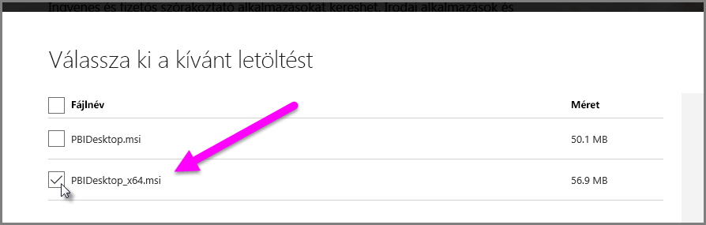

# Access- és Excel .xls-fájlok importálási hibáinak elhárítása a Power BI Desktopban

A Power BI Desktopban az Access-adatbázisok és az Excel-munkafüzetek korai verziói (Excel 97–2003 típusú .XLS-fájlok) az *Access adatbázismotort* használják. Három gyakori helyzet van, amely meggátolhatja az Access adatbázismotor megfelelő működését.

## 1\. helyzet: Nincs telepítve az Access adatbázismotor

Ha a Power BI Desktop hibaüzenete azt jelzi, hogy az Access adatbázismotor nincs telepítve, telepíteni kell a 32 vagy a 64 bites Access adatbázismotort, attól függően, hogy melyik felel meg a Power BI Desktop verziójának. Az Access adatbázismotort a [letöltési oldalról](https://www.microsoft.com/download/details.aspx?id=13255) telepítheti.

>[!NOTE]
>Ha a telepített Access adatbázismotor bitverziója különbözik a Microsoft Office bitverziójától, az Office-alkalmazások nem tudják használni az Access adatbázismotort.

## 2\. helyzet: Az Access adatbázismotor bitverziója (32 vagy 64 bites) különbözik a Power BI Desktop bitverziójától

Ez a helyzet gyakran előfordul, ha a Microsoft Office 32 bites verziója van telepítve, de a Power BI Desktop telepített verziója 64 bites, Ennek az ellenkezője is bekövetkezhet, és a bitverziók eltérése mindkét esetben fennáll. Ha Office 365-előfizetést használ, a [3. helyzetben](#situation-3-trouble-using-access-or-xls-files-with-an-office-365-subscription) találhat információt egy másik problémáról és megoldásról. A következő megoldások közül bármelyik orvosolhatja ezt az eltérő bitverzióból eredő hibát:

### 1\. megoldás

Módosítsa úgy a Power BI Desktop verzióját, hogy megfeleljen a telepített Microsoft Office bitverziójának. 

1. A Power BI Desktop bitverziójának módosításához távolítsa el a Power BI Desktopot, majd egy olyan verzióját, amely megfelel a telepített Office-nak. 

1. A Power BI Desktop verziójának kiválasztásához válassza a **Speciális letöltési beállítások** lehetőséget a Power BI Desktop letöltési oldalán.
   
   
   
1. A megjelenő letöltési oldalon válassza ki a nyelvet, majd kattintson a **Letöltés** gombra. 
 
1. A megjelenő képernyőn jelölje be a PBIDesktop.msi fájl melletti jelölőnégyzetet a 32 bites vagy a PBIDesktop_x64.msi fájl melletti jelölőnégyzetet a 64 bites verzióhoz. 

   A lenti képernyőképen a 64 bites verzió van bejelölve.
   
   
   
   >[!NOTE]
   >Ha a Power BI Desktop 32 bites verzióját használja, a nagy méretű adatmodellek létrehozásakor kifogyhat a memóriából.

### 2\. megoldás

Módosítsa úgy a Microsoft Office bitverzióját, hogy megfeleljen a telepített Power BI Desktop bitverziójának:

1. A Microsoft Office eltávolítása

2. Azt az Office-verziót telepítse, amely megfelel a telepített Power BI Desktopnak.

### 3\. megoldás

Ha a hiba akkor fordul elő, amikor .XLS-fájlt (Excel 97–2003 munkafüzetet) próbál megnyitni, az Access adatbázismotor használatának elkerüléséhez nyissa meg az .XLS-fájlt az Excelben, és mentse XLSX-fájlként.

### 4\. megoldás

Ha az előző három megoldás nem alkalmazható, telepítheti az Access adatbázismotor mindkét verzióját. Ez a megkerülő megoldás azonban nem javasolt. Bár mindkét verzió telepítésével megoldja az Excelhez készült Power Query és a Power BI Desktop hibáját, ez más hibákat és problémákat okoz azoknál az alkalmazásoknál, amelyek automatikusan (alapértelmezés szerint) az Access adatbázismotor először telepített bitverzióját használják. 

Az Access adatbázismotor mindkét bitverziójának telepítéséhez kövesse az alábbi lépéseket:

1. Telepítse az Access adatbázismotor mindkét bitverzióját a [letöltési oldalról](https://www.microsoft.com/download/details.aspx?id=13255). 

1. Futtassa az Access adatbázismotor minden verzióját a */passive* kapcsolóval. Például:
   
       c:\users\joe\downloads\AccessDatabaseEngine.exe /passive
   
       c:\users\joe\downloads\AccessDatabaseEngine_x64.exe /passive

## 3\. helyzet: Probléma az Access- vagy .XLS-fájlok Office 365-előfizetéssel való használatakor

Ha Office 365-előfizetést használ (legyen szó **Office 2013-ról** vagy **Office 2016-ról**), az Access adatbázismotor szolgáltatója olyan virtuális beállításjegyzékbeli helyen van regisztrálva, amely *csak* Microsoft Office-folyamatok számára elérhető. Emiatt az adategyesítési motor (amely a nem Office 365-beli Excel és a Power BI Desktop futtatásáért felelős, és nem Office-folyamat) nem tudja használni az Access adatbázismotor szolgáltatóját.

A helyzet orvoslása érdekében [töltse le és telepítse az Access adatbázismotor azon terjeszthető változatát](https://www.microsoft.com/download/details.aspx?id=13255), amely megfelel a telepített Power BI Desktop bitverziójának. A bitverziókról a cikk korábbi szakaszaiban talál több információt.

## Egyéb helyzetek, amelyek importálási problémákat okozhatnak

Igyekszünk az Access- vagy .XLS-fájlokkal kapcsolatban előforduló lehető legtöbb hibára kitérni. Ha a jelen cikkben nem szereplő hibával találkozik, küldjön el egy rá vonatkozó kérdést a [Power BI ügyfélszolgálatának](https://powerbi.microsoft.com/support/). Rendszeresen vizsgáljuk az olyan hibákat, amelyek több felhasználót is érintenek, és ezeket a cikkeinkben tárgyaljuk.

