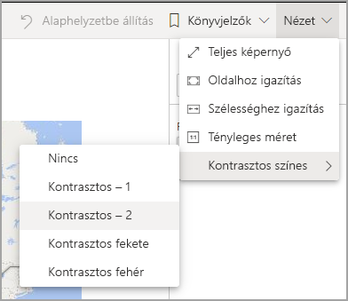
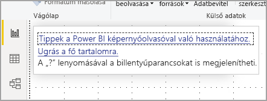
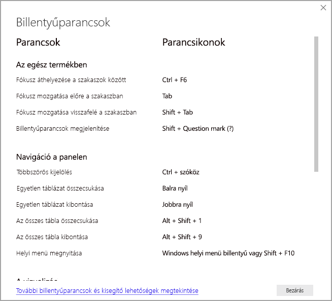
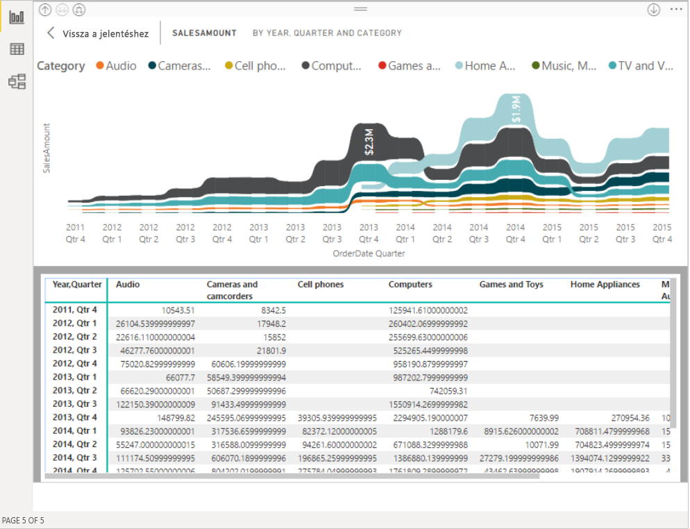

# Akadálymentességi eszközökkel rendelkező Power BI-jelentések használata
A Power BI számos beépített funkciója segíti a fogyatékkal élőket a Power BI-jelentések egyszerűbb felhasználásában és kezelésében. Ezek az eszközök segítenek abban, hogy a felhasználók ugyanazokhoz az információkhoz jussanak hozzá egy jelentésből, mint azok, akik nem használnak segítő technológiát.

A cikk olvasása során hasznos lesz néhány fogalom ismerete:

* A **fókusz** az a hely, ahol az egérmutató van a képernyőn. A fókuszt általában az objektum körüli kék szegély jelzi.
* A **vászon** a jelentésoldal területe.

A következő szakaszok a Power BI-jelentések felhasználásához rendelkezésre álló akadálymentességi eszközöket ismertetik.

## Navigálás billentyűzettel

A Power BI Desktop vagy a Power BI szolgáltatás megnyitása után a **Tab** billentyű lenyomásakor egy eszköztipp jelenik meg a jobb felső sarokban. A **Tippek a Power BI képernyőolvasóval való használatához** hivatkozás erre a cikkre mutat, amely a jelentés akadálymentességi eszközökkel való felhasználásáról nyújt tájékoztatást. Az **Ugrás a fő tartalomra** hivatkozásra kattintva a jelentésvászonhoz léphet.

A **?** lenyomásával a Power BI leggyakrabban használt billentyűparancsait bemutató panelt nyithatja meg. A Power BI-ban használható billentyűparancsok teljes listáját a panel alján lévő hivatkozást követve érheti el a Power BI [billentyűparancsokat](desktop-accessibility-keyboard-shortcuts.md) ismertető dokumentációjában.

Fókuszt válthat a jelentés lapfülei vagy egy adott jelentésoldal objektumai között a **Ctrl+F6** billentyűkombinációval. Ha a fókusz egy betöltött jelentésoldalon van, a **Tab** billentyűvel válthat fókuszt az oldal egyes objektumaira, beleértve a szövegdobozokat, képeket, alakzatokat és diagramokat is. 

A Power BI-ban általában az **Enter** kiválasztásra vagy belépésre, az **Esc** pedig kilépésre szolgál.

### Navigálás billentyűzettel vizualizációkban

A Power BI-jelentések készítői gyakran hoznak létre olyan jelentéseket, amelyek rengeteg adatot tartalmaznak. A vizualizáción belüli mozgás során bosszantó lehet a Tab billentyűvel végiglépkedni a sok elemen. A vizualizációkon belüli, billentyűzettel való navigálás három szintű hierarchiaként lett megtervezve. A következő bekezdések ezt a három szintet ismertetik.

Az első szinten végzett navigáláshoz **Ctrl + jobbra nyíl** billentyűparanccsal léphet be a vizualizációba. A vizualizáción belül a **Tab** billentyűvel lehet lépkedni a vizualizáció fő területei között. Az ennek során érintett fő terület a rajzterület, a tengelykategóriák (ha az adott vizualizációban ez értelmezhető) és a jelmagyarázat (ha ellátták ezzel a vizualizációt).

Az alábbi .gif azt mutatja be, ahogyan egy felhasználó a vizualizáció első szintjén navigál:

A hierarchia második szintjét a fő területek egyikének (rajzterület, X tengely kategóriái, jelmagyarázat) megnyitása jelenti. A jelentés használata közben beléphet az egyik ilyen fő területre, és végiglépkedhet a vizualizáció adott részén található adatpontokon vagy kategóriákon. Ha kiválasztotta a részletesebben vizsgálni kívánt területet, az **Enter** billentyűvel léphet be erre az adott területre.

Ha egy adatsor összes adatpontját ki szeretné jelölni, lépjen a Jelmagyarázatra és nyomja le az **Enter** billentyűt. A jelmagyarázaton belül a **Tab** billentyűvel navigálhat a különböző kategóriák között. Egy adott adatsor kiválasztásához nyomja le az **Enter** billentyűt.

Ha meghatározott adatpontokat szeretne kijelölni, lépjen a rajzterületre, és nyomja le az **Enter** billentyűt. A rajzterületen belül a **Tab** billentyűvel navigálhat az adatpontok között. Ha a vizualizáció több adatsort is tartalmaz, a **Felfelé nyíl** és a **Lefelé nyíl** billentyűkkel ugorhat a különböző adatsorok adatpontjai között.

Ha egy kategóriatengely összes adatpontját ki szeretné jelölni, lépjen a tengelyfeliratokra és nyomja le az **Enter** billentyűt. A tengelyfeliratokon belül a **Tab** billentyűvel navigálhat a címkenevek között. Egy címkenevet az **Enter** billentyűvel választhat ki.

Ha belépett egy rétegbe, az **Esc** billentyű lenyomásával léphet ki ebből a rétegből. Az alábbi .gif azt mutatja be, ahogyan egy felhasználó be- és kiléphet egy vizualizáció szintjei között, kijelölhet adatpontokat vagy az X tengely kategória-feliratait, vagy kijelölheti egy adatsor összes adatpontját.

Ha azt tapasztalja, hogy nem tud egy objektumhoz vagy vizualizációhoz navigálni a billentyűzettel, annak az lehet a magyarázata, hogy a jelentés készítője kizárta ezt az objektum a bejárási sorrendből. A jelentéskészítők többnyire kizárják a dekorációs elemeket a Tab billentyűvel bejárható elemek közül. Ha úgy véli, hogy a Tab billentyű nem logikus sorrendben viszi végig egy jelentésen, akkor érdemes a jelentés készítőjéhez fordulnia. A jelentéskészítők beállíthatják az objektumok és vizualizációk bejárásának sorrendjét.

### Navigálás billentyűzettel szeletelőkben

A szeletelők is rendelkeznek beépített akadálymentességi funkciókkal. Egy kijelölt szeletelő értékének beállításakor a **Ctrl + jobb nyíl** használatával lehet végiglépkedni a szeletelő különböző vezérlőin. Amikor például először nyomja le a **Ctrl+jobb nyílbillentyű** kombinációt, a fókusz a radírra kerül. A **szóköz** billentyű lenyomása ekkor azzal egyenértékű, mintha a radírra kattintott volna. Ezzel minden értéket töröl a szeletelőn.

Egy szeletelő vezérlői között a **Tab** billentyűvel lépkedhet. Ha a radír ikonon állva nyomja le a **Tab** billentyűt, továbblép a legördítő gombra. A **Tab** ismételt lenyomásával továbblép a szeletelő első értékére (ha a szeletelőhöz több érték, például egy tartomány tartozik).

### Oldalváltás

Ha a fókusz a jelentés lapfülein van, a **Tab** vagy a **nyílbillentyűk** használatával válthat fókuszt az egyik jelentésoldalról a következőre. A képernyőolvasó felolvassa a jelentésoldal címét, valamint azt, hogy jelenleg ki van-e választva. A jelenleg fókuszban lévő jelentésoldal betöltéséhez nyomja le az **Enter** vagy a **Szóköz** billentyűt.

### A vizualizáció fejlécének elérése
A vizualizációk között váltogatva az **Alt+Shift+F10** billentyűparanccsal a vizualizáció fejlécére helyezheti a fókuszt. A vizualizáció fejlécén különféle lehetőségek állnak rendelkezésre, például leválogatás, a diagram alapjául szolgáló adatok exportálása és fókusz mód. A vizualizáció fejlécében attól függően jelennek meg ikonok, hogy mely funkciók megjelenítése mellett döntött a jelentés készítője.

## Képernyőolvasó

Egy jelentés megtekintésekor ajánlott kikapcsolva hagyni a vizsgálati módot. A Power BI-t érdemes inkább alkalmazásként kezelni, mint dokumentumként, és egyéni navigációs lehetőségekkel könnyíti meg a navigálást. Ha képernyőolvasót használ a Power BI Desktophoz, a képernyőolvasót mindenképpen a Power BI Desktop megnyitása előtt kell elindítani.

Az objektumok közötti navigáláskor a képernyőolvasó felolvassa az objektum típusát és annak címét (ha van). A képernyőolvasó emellett felolvassa az objektum leírását (helyettesítő szövegét), ha a jelentés szerzője létrehozta azt.

### Adatok megjelenítése
Az **Alt+Shift+F11** billentyűkombinációval megjelenítheti az **Adatok megjelenítése** ablak akadálymentesített verzióját. Ez lehetővé teszi a vizualizációban használt adatok feltárását egy HTML-táblában, ugyanazokkal a billentyűparancsokkal, amelyeket máskor is használni szokott a képernyőolvasóban.

Az **Adatok megjelenítése** funkció egy HTML-táblázat, amely a képernyőolvasóban csak ezzel a billentyűparanccsal érhető el. Ha a vizualizáció fejlécében található lehetőséggel használja az **Adatok megjelenítése** funkciót, akkor a képernyőolvasóval *nem* kompatibilis táblázat jelenik meg.  Ha billentyűparancsokkal használja az **Adatok megjelenítése** funkciót, a vizsgálati mód bekapcsolásával minden olyan billentyűparancsot kihasználhat, amely a képernyőolvasóban elérhető.

Az **Adatok megjelenítése** nézet bezárásához és a jelentéshez való visszatéréshez nyomja le az **Esc** billentyűt.

## Kontrasztos üzemmódok

A Power BI szolgáltatás megkísérli a Windowsban beállított kontrasztos beállítás észlelését. Az észlelés hatékonysága és pontossága a Power BI szolgáltatást megjelenítő böngészőtől függ. Ha manuálisan szeretné beállítani a témát a Power BI szolgáltatásban, kiválaszthatja a **Nézet > Kontrasztos színes** beállítást, majd a témát, amelyet a jelentésre szeretne alkalmazni.

## Következő lépések

A Power BI akadálymentességi lehetőségeit ismertető cikkek gyűjteménye:

* [A Power BI akadálymentességi lehetőségeinek áttekintése](desktop-accessibility-overview.md) 
* [Akadálymentes Power BI-jelentések létrehozása](desktop-accessibility-creating-reports.md) 
* [Power BI-jelentések létrehozása akadálymentességi eszközökkel](desktop-accessibility-creating-tools.md)
* [Akadálymentességi billentyűparancsok Power BI-jelentésekhez](desktop-accessibility-keyboard-shortcuts.md)
* [Ellenőrzőlista jelentések akadálymentesítéséhez](desktop-accessibility-creating-reports.md#report-accessibility-checklist)

