# Akadálymentesített jelentések létrehozása a Power BI-ban
Meggyőző jelentéseket tervezhet és hozhat létre, és egyben gondoskodhat az akadálymentességükről is. Egy jelentés létrehozásakor a célközönségtől függetlenül mindig úgy kell eljárnia, hogy különleges tervezési megoldások nélkül is elérhető legyen a legtöbb felhasználó számára.

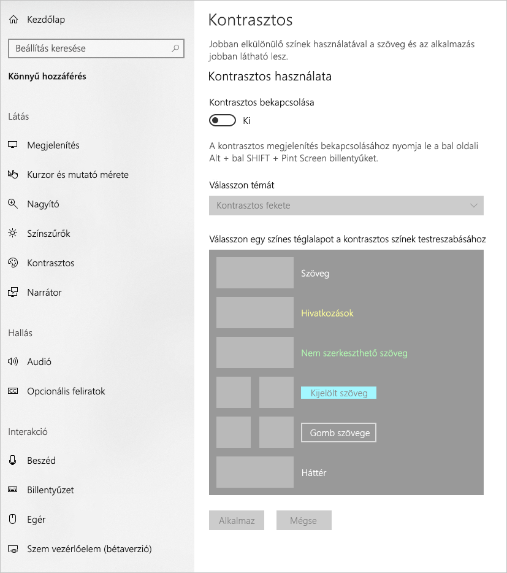

Ez a cikk az akadálymentes Power BI-jelentések létrehozásához felhasználható kisegítő lehetőségeket és eszközöket mutatja be.

Emellett helyi menüt is igénybe vehet, amely megkönnyíti a jelentések képernyőolvasókkal történő létrehozását. A menü lehetővé teszi, hogy a **Mezők** listában felfelé vagy lefelé mozgasson mezőket. Emellett más területre is áthelyezheti a mezőket, például a **Jelmagyarázat** vagy az **Érték** területre.

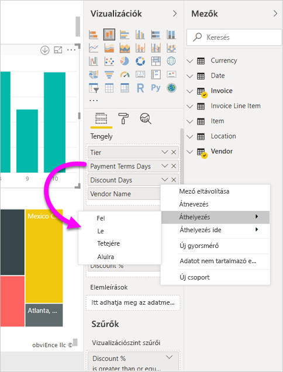

## A kisegítő lehetőségek típusai

A Power BI lehetőséget ad az akadálymentes jelentések létrehozására, de ezeket a funkciókat a jelentés szerzőjének kell hozzáadni. Ez a cikk a kisegítő lehetőségek három típusát írja le:

* Beépített kisegítő lehetőségek (nincs szükség konfigurációra)
* Beépített kisegítő lehetőségek (konfigurációra van szükség)
* További tippek és szempontok

A következő részekben ezen kategóriák részletes leírása található.

## Beépített kisegítő lehetőségek

A Power BI a terméken belül számos olyan kisegítő lehetőséget biztosít, amelyet a jelentés szerzőjének nem kell konfigurálnia. Ezek a lehetőségek a következők:

* Billentyűzettel való navigáció
* Képernyőolvasó kompatibilitás
* Kontrasztos színek
* Fókusz mód
* Adatok megjelenítése tábla

Olyan lehetőségek is rendelkezésre állnak, amelyek a jelentés használatát segítik. Ezeket a lehetőségeket a cikk végén, a [Következő lépések](#next-steps) szakaszban ismertetjük.

Vessünk egy pillantást a beépített kisegítő lehetőségekre. 

### Billentyűzettel való navigáció

A jelentés szerzőjének nem kell aggódnia, hogy a felhasználók a billentyűzet használatával is navigálhatnak-e a jelentésben. A Power BI összes vizualizációja navigálható billentyűzettel; a felhasználó végigjárhatja az adatpontokat, válthat a lapfülek között, és hozzáférhet az olyan interaktív lehetőségekhez, mint a keresztkiemelés, a keresztszűrés és a szeletelés.

Ahogy a felhasználó a jelentés egyes részei között navigál, a fókusz mindig mutatja, hogy hol tart éppen. A használatban lévő böngészőtől függően a fókuszmód eltérően jelenhet meg.

A leggyakrabban használt billentyűparancsok eléréséhez kattintson a *?* elemre, amely megjelenít egy billentyűparancs-párbeszédpanelt. További információkért lásd az akadálymentes felhasználói élményről szóló cikkeket a jelen cikk végén, a [Következő lépések](#next-steps) szakaszban.

### Kompatibilitás a képernyőolvasóval

A Power BI-ban található, billentyűzettel navigálható objektumok általában a képernyőolvasókkal is kompatibilisek. Amikor a jelentés felhasználója megnyit egy vizualizációt, a képernyőolvasó felolvassa a címet, a vizualizáció típusát, és a helyettesítő szöveget, ha be lett állítva.

### Kontrasztos színek

A Power BI támogatja a kontrasztos színmegjelenítést a jelentésekhez. Ha a Windowsban kontrasztos megjelenítésű módot használ, a Power BI Desktop automatikusan észleli, hogy milyen kontrasztos témát használ a Windowsban, és alkalmazza ezeket a beállításokat a jelentésekre. Ezek a kontrasztos színek megmaradnak a jelentésben a Power BI szolgáltatásban vagy máshol való közzétételkor.

A Power BI szolgáltatás megpróbálja a Windowshoz kiválasztott kontrasztos beállításokat is felderíteni, de ennek a felderítésnek a hatékonysága és pontossága a Power BI szolgáltatáshoz használt böngészőbeállításoktól függ. Ha manuálisan szeretné beállítani a témát a Power BI szolgáltatásban, a jobb felső sarokban kiválaszthatja a **Nézet > Kontrasztos színek** beállítást, majd a jelentésre alkalmazandó témát.

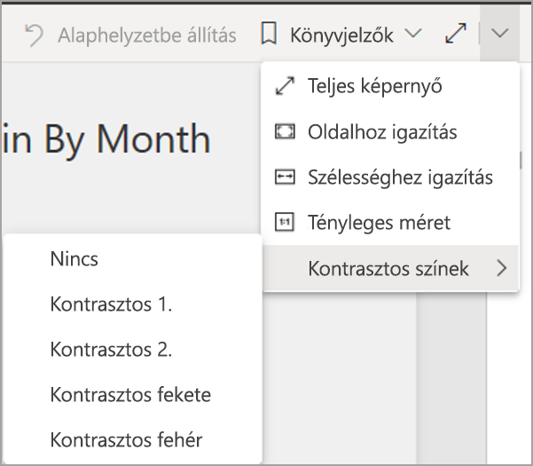

### Fókusz mód
A jelentés felhasználója teljes képernyőre is kiterjesztheti az irányítópulton éppen megtekintett vizualizációt, ha megnyitja a vizualizáció helyi menüjét, és a **Megnyitás fókusz módban** lehetőséget választja.

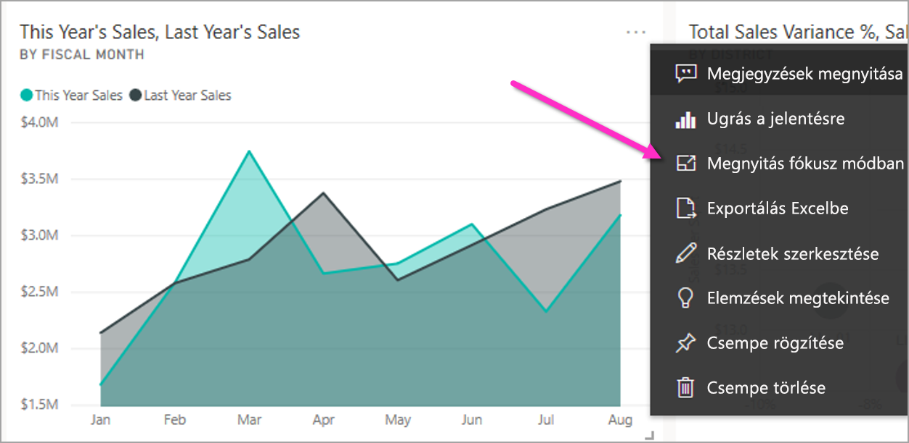

### Adatok megjelenítése tábla
A jelentés felhasználója az **Alt+Shift+F11** billentyűkombináció lenyomásával egy táblázatos formátumban megjelenő vizualizációban is megtekintheti az adatokat. Ez hasonlít a vizualizáció helyi menüjében az **Adat megjelenítése** billentyű lenyomásakor megjelenő táblázathoz, de képernyőolvasó-barát.

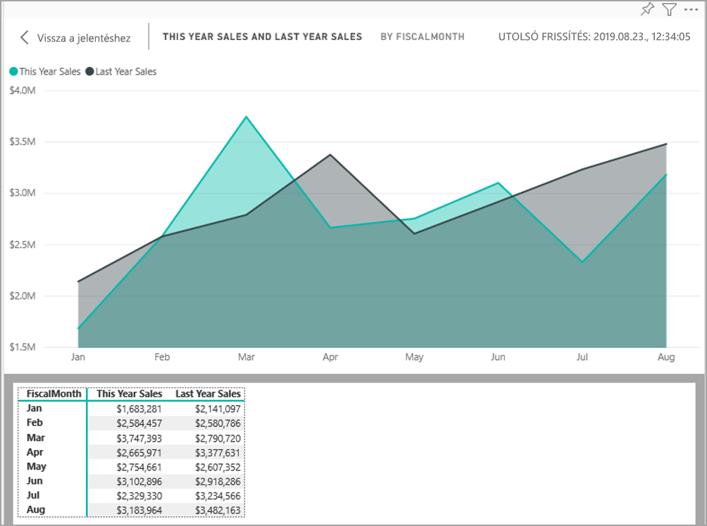

## Konfigurációt igénylő beépített kisegítő lehetőségek

A Power BI a terméken belül olyan kisegítő lehetőségeket is biztosít, amelyeket a jelentés szerzőjének kell konfigurálnia.  Ezek a lehetőségek a következők:

* Helyettesítő szöveg
* Lapsorrend
* Címek és feliratok
* Jelölők
* Jelentéstémák

## Helyettesítő szöveg

A helyettesítő szöveg (alternatív szövegleírás) a képernyőolvasót igénybe vevő felhasználók részére nyújt leírást a jelentésoldalon található vizualizációk és képek megjelenéséről és funkciójáról. A jelentés szerzőjének érdemes helyettesítő szöveget mellékelnie minden fontos információt hordozó objektumhoz. A helyettesítő szöveg révén biztosíthatja, hogy a jelentés felhasználói akkor is értsék a vizualizáció kommunikációs célját, ha nem látják a vizualizációt, a képet, az alakzatot, vagy a szövegdobozt. A Power BI Desktop-jelentés bármely objektumához megadhat helyettesítő szöveget, ha kijelöli az objektumot (például vizualizációt, alakzatot stb.), és a **Vizualizációk** panelen kiválasztja a **Formázás** szakaszt, kibontja az **Általános** elemet, majd legörget az aljára, és kitölti a **Helyettesítő szöveg** szövegdobozt. A **Helyettesítő szöveg** mezőbe legfeljebb 250 karakter írható.

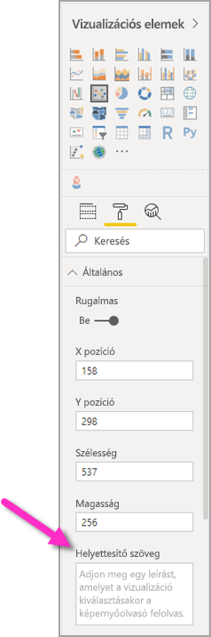

A helyettesítő szöveg arra szolgál, hogy információt adjon a vizualizációból kiolvasható adatelemzési eredményről. A képernyőolvasó felolvassa a vizualizáció címét és típusát, ezért csak a leírást kell kitölteni. Az alábbi vizualizációhoz például ez a helyettesítő szöveg tartozhat: *Nettó felhasználói elégedettség az értékesített termékek színe alapján, és további részletezés termékosztály szerint.*

Az elemzési eredményeket és a konkrét adatpontokat nem szerencsés statikus helyettesítő szövegbe helyezni, mert a Power BI-ban kezelt adatok dinamikusak. Ha dinamikus helyettesítő szöveget szeretne használni, tekintse meg a feltételes formázás leírását a következő szakaszban.

### Helyettesítő szöveg feltételes formázása

A Power BI hatékonyságát többek között a dinamikus adatok segítik. Dinamikus helyettesítő szövegek létrehozásához felhasználhatja a DAX-mértékeket és a feltételes formázást. A képernyőolvasók ezután meghívhatják a jelentés felhasználója által megtekintett adatokhoz tartozó értékeket.

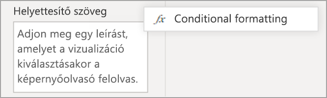

### Lapsorrend
A lapsorrend beállítása révén a billentyűzetet igénybe vevő felhasználók a jelentésben található vizualizációk feldolgozási módjához illő sorrendben navigálhatnak a jelentésben. A jelentésben szereplő dekoratív alakzatokat és képeket el kell távolítani a lapsorrendből. 

A lapsorrend beállításához válassza a menüszalagon található **Nézet** fület, majd kattintson a **Kijelölés panel** gombra a kijelölés panel megjelenítéséhez.

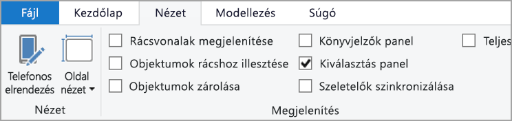

Ha a **Kijelölés panelen** kiválasztja a **Lapsorrend** lehetőséget, megjelenik a jelentéshez jelenleg tartozó lapsorrend. Kiválaszthat egy objektumot, majd a fel- és lefelé mutató nyíl használatával áthelyezheti a hierarchiában, vagy rákattinthat az egérrel, és a választott helyre húzhatja a listában. Az objektum melletti számra kattintva elrejtheti az objektumot a lapsorrendből.

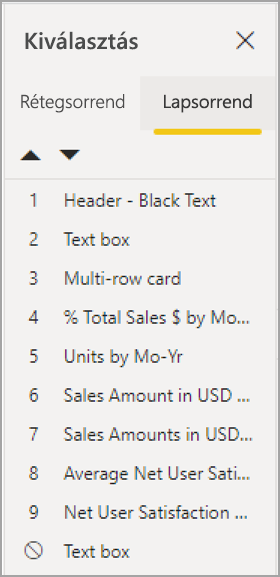

### Címek és feliratok
A vizualizációk és a jelentéslapok címe fontos eszköz a felhasználó tájékoztatására. Új felhasználók vagy cégen kívüli olvasók részére szánt jelentések címében ne használjon mozaikszavakat és zsargont, hiszen ők nem feltétlenül ismerik a jelentésüket. Az alábbi képen egy olyan vizualizáció látható, amelynek a címébe mozaikszó került (balra), jobbra pedig egy jobban érthető cím.

A vizualizáción belül gondoskodjon a könnyen olvasható és érthető címekről, tengelyfeliratokról, jelmagyarázatokról és adatfeliratokról. Hasonlítsa össze az alábbi képeket: az elsőn csak néhány szám és felirat jelzi az adatokat, a másodikon jóval több.

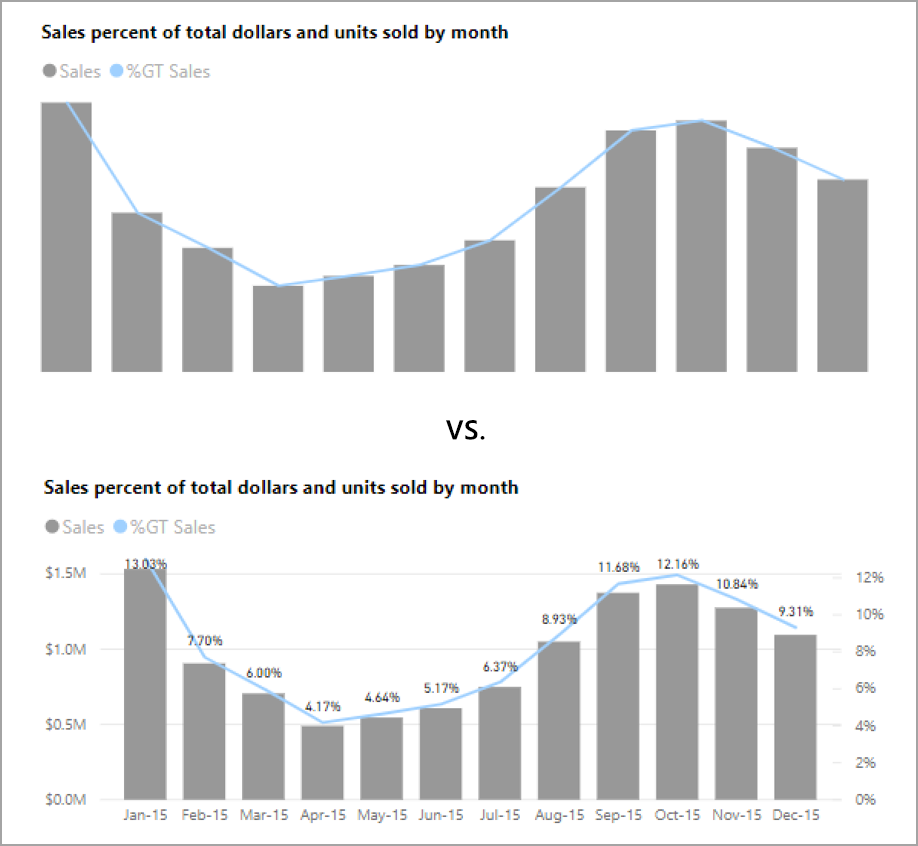

Az adatfeliratokat tetszés szerint be- vagy kikapcsolhatja a vizualizációban látható egyes adatsorozatokhoz, és eldöntheti, hogy az adatsorozat fölé vagy alá kerüljenek. A Power BI igyekszik pontosan a vonalak alá vagy fölé helyezni az adatfeliratokat, de néha nem láthatók tisztán. Az alábbi vizualizációban az adatfeliratok áttekinthetetlenek és nehezen olvashatók.

Sokat segíthet az adatfeliratok sorozat fölé vagy alá helyezése, főleg több vonalat tartalmazó vonaldiagram esetén. Néhány apró igazítás is javíthat az adatfeliratok megjelenésén.

### Jelölők

Ajánlott elkerülni, hogy az információkat kizárólag színek közvetítsék (beleértve a funkciók feltételes formázását is). Ehelyett jelölőket használhat a sorozatok bemutatására.

A jelölőket bekapcsolhatja a Vonal, Terület és Kombinált vizualizációkhoz, valamint a Pont és Buborék vizualizációkhoz, és minden vonalhoz eltérő Jelölőalakzatot használhat.

A Jelölők bekapcsolásához válassza ki a Formátum szakaszt a Vizualizációk panelen, bontsa ki az **Alakzatok** szakaszt, majd görgessen lefelé a **Jelölők mutatása** kapcsolóig, és állítsa **Be** állapotba, az alábbi ábra szerint. 

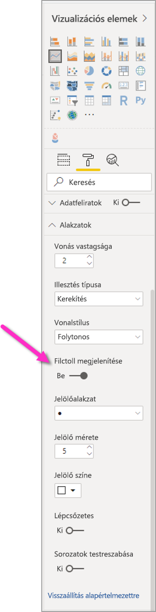

A **Testreszabási sorozattal** is kiválaszthatja az egyes vonalak nevét (vagy a területekét, ha Terület diagramot használ) a legördülő listából az Alakzatok szakaszban. A legördülő lista alatt megadhatja az adott vonalhoz használt jelölő számos beállítását, például az alakját, a színét és a méretét.

Az adatfeliratok és jelölők használatát azzal a kiegészítéssel javasoljuk a szerzőknek, hogy az összes adatfelirat és jelölő bekapcsolása az összes vizualizációhoz zavaró lehet, és nehezítheti a jelentés értelmezését. Az alábbi képen egy összes adatfeliratot és jelölőt tartalmazó vizualizáció látható, mellette pedig egy átláthatóbb verzió, amelyen ki vannak kapcsolva az adatfeliratok.

Ha nem tudja eldönteni, hogy a vizualizáció vagy jelentés túlzsúfolt-e, használja a [kancsal tesztet](https://chrome.google.com/webstore/detail/the-squint-test/gppnipfbappicilfniaimcnagbpfflpg).  Ha jobban vonzzák a tekintetét az adatfeliratok, mint az adatpontok, kapcsolja ki az adatfeliratokat.

### Témák, kontraszt, színvakbarát színek

Gondoskodjon róla, hogy elég kontraszt legyen a jelentéseiben a szöveg és a háttérszínek között. A WCAG 2.1 szabvány 1.4.3 számú sikerességi feltétele előírja, hogy a szöveg és a háttér színe közti kontrasztarány nem lehet kisebb, mint 4.5:1. A jelentés színeinek ellenőrzésére számos eszköz áll rendelkezésre, mint például a [Color Contrast Analyser](https://developer.paciellogroup.com/resources/contrastanalyser/), a [WebAIM](https://webaim.org/resources/contrastchecker/), és az [Accessible Colors](https://accessible-colors.com/).

Érdemes figyelembe vennie, hogy a jelentés megtekintői között színtévesztők is lehetnek. Az olyan eszközök, mint a [Coblis](https://www.color-blindness.com/coblis-color-blindness-simulator/) és a [Vischeck](https://www.vischeck.com/vischeck/vischeckImage.php), a színtévesztő felhasználók számára megjelenő látványt szimulálják.  A kevesebb szín vagy a monokróm paletta használata csökkentheti annak kockázatát, hogy nem akadálymentesített jelentést hoz létre.

Bizonyos színkombinációk különösen nehezen dolgozhatók fel a színtévesztők számára. Ezek többek között a következők: 

* zöld és piros
* zöld és barna
* kék és lila
* zöld és kék
* világoszöld és sárga
* kék és szürke
* zöld és szürke
* zöld és fekete

Ne használja együtt ezeket a színeket ugyanabban a grafikonban vagy jelentésoldalon. A Power BI beépített témákat is tartalmaz a jelentés akadálymentesítéséhez, de az ellenőrzéshez a jelen cikkben felsorolt további eszközök használatát is javasoljuk.

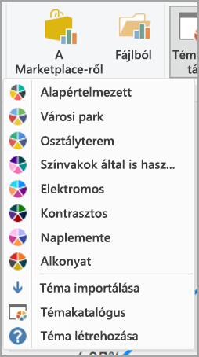

## Tippek és szempontok
Ez a szakasz útmutatást, tippeket és szempontokat nyújt az akadálymentes jelentések elkészítéséhez.

### A célközönség igényeinek megismerése

A jelentéskészítés egy több ismétlésből álló folyamat. Mielőtt a vizualizációkat elhelyezné az oldalon, egyeztessen néhány felhasználóval annak felméréséhez, hogy milyen információkat szeretnének kapni a jelentésből, és milyen formában szeretnék azt látni.  

A folyamatnak ki kell térnie az akadálymentesség beépítésére is. Kiderülhet, hogy az elképzelése nem egyezik a jelentés felhasználóinak elvárásaival. Miután elkészítette a jelentés előzetes vázlatát, mutassa meg egy felhasználónak, és kérjen tőle véleményt. A jelentés szerzőjeként az előzetes felméréssel megelőzheti, hogy később tömeges módosítási kérést kapjon az elégedetlen felhasználóktól.

### Egyszerű és konzisztens jelentés

Igyekezzen a lehető legegyszerűbb formában létrehozni a jelentést. A jelentéskészítők gyakran túl sok információt sűrítenek egyetlen vizualizációba. Ha több vizualizációt hoz létre, megkönnyítheti az információ befogadását. Többféle adat megjelenítése esetén fontolja meg több vizualizáció használatát, illetve használjon szűrőket és vizuális interakciókat a gazdagabb élmény érekében. De arra is ügyeljen, hogy ugyanazon az oldalon a lehető legkevesebb vizualizációt használja. Kerülje a fölösleges redundanciát és a lapok zsúfoltságát. Nincs szükség két vizualizációra ugyanazon információ bemutatásához. Előfordulhat, hogy a jelentés felhasználói nem tudják befogadni a túl sok vizualizációból származó adatokat, vagy egy idő után már nem tudnak kellőképpen összpontosítani. Ha túl sok vizualizáció kerül egy oldalra, nehezebbé válik a jelentés feldolgozása, és maga a jelentés is veszít a hatékonyságából.

A jelentés konzisztenciájának megőrzése érdekében használja minden vizuális elemhez ugyanazt a betűtípust és színt. Használja ugyanazt a betűméretet minden vizualizációcímhez, adatfelirathoz és tengelyfelirathoz. Ha a jelentés több oldalán is szeletelőt használ, helyezze őket ugyanoda az egyes oldalakon.

### Gyengénlátási teszt

A jelentés gyengénlátók számára megjelenő képét könnyen ellenőrizheti, ha lejjebb állítja a fényerőt a képernyőjén vagy a mobileszközén.  Olyan böngésző-bővítmények is rendelkezésre állnak, amelyek a kancsalteszt elvégzését segítik.

## Ellenőrzőlista a jelentés akadálymentesítéséhez

A kisegítő eszközök és lehetőségek mellett a Power BI az alábbi ellenőrzőlistát is rendelkezésre bocsátja a jelentés elkészítéséhez. Az ellenőrzőlista segítségével még a közzététel előtt akadálymentessé és a legszélesebb közönség számára is hozzáférhetővé teheti jelentéseit. 

### Minden vizualizáció

* Legyen legalább 4.5:1 a színkontraszt a címek, a tengelyfeliratok és az adatfeliratok betűi, valamint a háttér között.
* Ne a szín legyen az információközlés egyetlen eszköze. Használjon szöveget vagy ikonokat a színek kiegészítésére vagy helyettesítésére.
* Cserélje le a szükségtelen zsargont és mozaikszavakat.
* Adjon **helyettesítő szöveget** az oldalon található összes nem dekoratív vizualizációhoz.
* Ellenőrizze, hogy a jelentésoldal a színtévesztők számára is kezelhető.

### Szeletelők
* Ha a jelentésoldalakon többféle szeletelőt használ, a megjelenítésük legyen konzisztens minden oldalon. Lehetőség szerint használja ugyanazt a betűtípust, színt és térbeli pozíciót.

### Szövegmező
* A betűk és a háttér színe között legalább 4.5:1 legyen a kontrasztarány.
* Töltse ki a **helyettesítő szöveg** mezőket a képernyőolvasók számára.

### Vizualizációk interakciói
* Csak interakció révén érhetők el a fontos információk? Ha így van, a vizualizációk újrarendezésével és előzetes szűrésével nyilvánvalóbbá teheti a fontos következtetést.
* Könyvjelzőket használ a navigáláshoz? Próbáljon billentyűzettel navigálni a jelentésben, és győződjön meg róla, hogy a folyamat kezelhető a csak billentyűzetet használó felhasználók számára is.

### A rendezés iránya
* Beállította az oldalon lévő összes vizualizáció sorrendjét? Az akadálymentes **Adatok megjelenítése** táblázat a vizualizációhoz beállított sorrendben mutatja az adatokat.

### Elemleírások
* Az elemleírásokat ne használja fontos információk közlésére. Nehezen férhetők hozzá a motoros problémákkal küzdő, vagy egeret nem használó felhasználók számára.
* Az elemleírásokat kiegészítő információként adhatja hozzá a grafikonokhoz. Ez megtalálható minden vizualizáció **Adatok megjelenítése** táblázatában.

### Videó
* Ne használjon az oldal betöltésekor automatikusan elinduló videókat.
* Gondoskodjon róla, hogy a videó feliratozva legyen, vagy biztosítson hozzá átiratot.

### Audió
* Ne használjon az oldal betöltésekor automatikusan elinduló hanganyagokat.
* Biztosítson átiratot a hanganyagokhoz.

### Alakzatok
* A dekoratív alakzatokat rejtettként jelölje a lapsorrendben, így a képernyőolvasó nem olvassa fel őket.
* Ne használjon túl sok dekoratív alakzatot, mert elvonhatják a figyelmet.
* Adatpontok meghívására használt alakzatok esetén használja a **helyettesítő szöveget** a meghívott adat elmagyarázására.

### Képek
* Adatpontok meghívására használt képek esetén használja a **helyettesítő szöveget** a meghívott adat elmagyarázására.
* A dekoratív képeket rejtettként jelölje a lapsorrendben, így a képernyőolvasó nem jelenti be őket.
* Ne használjon túl sok dekoratív képet, mert elvonhatják a figyelmet.

### Egyéni vizualizációk
* Az egyéni vizualizációkat az akadálymentes **Adatok megjelenítése** táblázatban tekintheti meg. Ha a megjelenített információ nem elégséges, keressen másik vizualizációt.
* Ha a *Lejátszási tengely* egyéni vizualizációt használja, gondoskodjon róla, hogy ne induljon automatikusan. Tegye egyértelművé, hogy a felhasználónak a változó értékek indításához/leállításához le kell nyomnia a lejátszás/szüneteltetés gombot.

### Váltás az oldal vizualizációi között
* Állítsa be, és a dekoratív elemeknél kapcsolja ki a lapsorrendet (jelölje rejtettként az elemet).

## Megfontolandó szempontok és korlátozások
Az akadálymentességi funkciók rendelkeznek néhány ismert hibájával és korláttal. Ezek leírását az alábbi lista ismerteti:

* Ha képernyőolvasót használ a **Power BI Desktoppal**, a legjobb élményben új lesz része, ha a képernyőolvasót még azelőtt megnyitja, mielőtt bármilyen fájlt megnyitott volna a **Power BI Desktopban**.

## Következő lépések

A Power BI akadálymentességi lehetőségeit ismertető cikkek gyűjteménye:

* [A Power BI kisegítő lehetőségeinek áttekintése](desktop-accessibility-overview.md) 
* [Power BI-jelentések felhasználása kisegítő eszközökkel](desktop-accessibility-consuming-tools.md)
* [Akadálymentességi eszközökkel rendelkező Power BI-jelentések létrehozása](desktop-accessibility-creating-tools.md)
* [Akadálymentességi billentyűparancsok Power BI-jelentésekhez](desktop-accessibility-keyboard-shortcuts.md)
* [Ellenőrzőlista jelentések akadálymentesítéséhez](#report-accessibility-checklist)
