# Jelentések létrehozása a Power BI-ban akadálymentességi eszközök használatával

A Power BI számos beépített képessége nyújt segítséget azoknak a jelentéskészítőknek, akik akadálymentességi eszközöket használnak a jelentések létrehozásához.

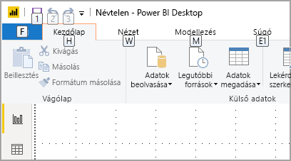

Ez a cikk a Power BI Desktopban a jelentéskészítők rendelkezésére álló akadálymentességi eszközök sokféle típusát ismerteti.

## Alkalmazásszintű navigáció
A Power BI Desktopban való navigálás során a **Ctrl + F6** billentyűkombinációval viheti át a fókuszt az alkalmazás fő területeire. A Power BI Desktop fő területei közötti fókuszváltás az alábbi sorrendet követi:

1. Objektumok a vásznon
2. Oldalfülek
3. Panelek (egyesével, balról jobbra a megnyitottak között)
4. Nézetnavigátor
5. Lábléc
6. Bejelentkezés
7. Sárga figyelmeztetés / hiba / frissítés sáv

A legtöbb esetben, a Power BI-ban megszokott módon az **Enter** billentyűvel lehet egy területet kiválasztani illetve arra belépni, és az **Esc** billentyűvel kilépni.

## Navigálás a menüszalagon

Az **Alt** lenyomásával kis mezők, úgynevezett *gyorsbillentyű-tippek* jelennek meg a szalag aktuális nézetében elérhető parancsok felett. Ekkor lenyomhatja a használni kívánt parancs felett megjelent *gyorsbillentyű-tipp* által mutatott billentyűt. 

Az alábbi ábrán például az **Alt** billentyűvel megjelenített gyorsbillentyű-tippek láthatók, amelyek a rendelkezésre álló elérhető parancsokhoz tartozó betűket mutatják. Az **M** billentyű lenyomása a menüszalag **Modellezés** lapját nyitná meg.

A lenyomott billentyűtől függően újabb gyorsbillentyű-tippek jelenhetnek meg. Ha például a **Kezdőlap** aktív és lenyomja a **W** billentyűt, a **Nézet** lap jelenik meg azokkal a gyorsbillentyű-tippekkel, amelyek a **Nézet** menüszalag-lap csoportjaihoz tartoznak. A tippekként megjelenő további billentyűk lenyomásával eljuthat a használni kívánt parancsig. Az előző gyorsbillentyű-tippeket az **Esc** billentyűvel jelenítheti meg. A végrehajtott művelet megszakításához és a gyorsbillentyű-tippek elrejtéséhez nyomja le az **Alt** billentyűt.

## Navigálás a Vizualizáció panelen

A **Vizualizáció** panelen végzett navigáláshoz először helyezze fókuszba ezt a panelt úgy, hogy a **Ctrl + F6** billentyűkombinációt használja a panel eléréséig. Amikor a felhasználó a vizualizációk paneljén navigál, először a fejlécre kerül a fókusz. A lapozás felülről lefelé halad a következő sorrendben, az ábrának megfelelően:

1. A fejlécbeli cím
2. A kibontás / összecsukás jel
3. Az első vizualizációikon

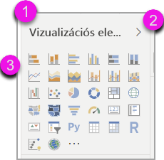

Amikor eljut a vizualizációkig, a nyílbillentyűkkel navigálhat egy adott vizualizációhoz, majd az **Enter** billentyűvel választhatja ki azt. Ha képernyőolvasót használ, az közli, hogy új diagramot hozott létre, és megmondja annak típusát, vagy azt közli, hogy egy adott típusú diagramot egy másik típusra módosított. 

A panel vizualizációkat tartalmazó szakasza után a fókuszsorrend az ábrán látható panelkimutatásokra vált.

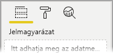

Amíg a fókusz a panelkimutatásokon van, a lapozás csak a kiválasztott panel ikonjára vált. Más panelekre a nyílbillentyűkkel léphet át.

## Mezőterület

Az előző bekezdésnek megfelelően, amíg a panelkimutatások vannak fókuszban, a Tab ismételt lenyomása a **Mezőterületre** lépteti tovább a fókuszt. 

A **Mezőterület** fókuszsorrendje a következő:

* az egyes területek címe (először)
* az egyes területeken belüli adott mező (ez után)
* a mező menüjét megnyitó legördítő gomb (ez után)
* végül az eltávolítás gomb (utoljára)

Az alábbi ábra a fókusz léptetési sorrendjét mutatja be.

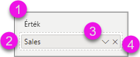

Egy képernyőolvasó a terület nevét és a hozzá tartozó elemleírást olvassa fel. Egy területen belül minden mezőnél a mező nevét és elemleírását olvassa fel. Ha a terület üres, a fókusznak a teljes üres területre kell ugrania. A képernyőolvasónak ekkor a terület nevét, elemleírását, valamint azt kell közölnie, hogy a terület üres.

Ha a mező menüje meg van nyitva, akkor a **Tab** vagy **Shift + Tab**, illetve a **fel** / **le** nyílbillentyűkkel mozoghat benne. Egy képernyőolvasó felolvassa a lehetőségeket.

Ha egy mezőt egy gyűjtőből egy másikba szeretne áthelyezni a területen, erre használhatja a billentyűzetet és a mezőterület **Áthelyezés** lehetőségét, ahogyan az alábbi ábrán látható.

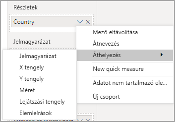

## Formázás ablaktábla

A **Formázás** panel fókuszsorrendje felülről lefelé halad, a kártyák sorrendjében. A fókusz először a kártya nevére kerül, majd annak **Be / Ki** kapcsolójára, ha van ilyen. Amíg a kártya neve van fókuszban, a képernyőolvasó felolvassa a kártya nevét, és hogy a kártya ki van bontva, vagy össze van csukva. A kártyát az **Enter** billentyűvel bonthatja ki és csukhatja össze. Az **Enter** billentyűvel a **Be** és **Ki** váltógomb is működtethető.

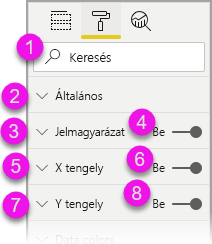

Ha egy kártya meg van nyitva, a **Tab** végiglépked a kártya vezérlőin, mielőtt továbblép a következő kártyára. A kártya vezérlőinél a képernyőolvasó kimondja azok címét, aktuális értékét és a vezérlő típusát.  

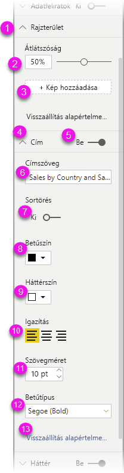

## Navigálás a mezőlistában

A **Mezők** listában a **Tab** billentyűvel navigálhat. A Formázás panelhez hasonlóan, összecsukott táblák esetén a fókuszsorrend a következő:

1. A **Mező** lista fejléce
2. A keresősáv
3. Az egyes táblák neve

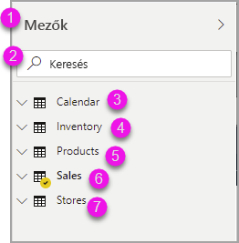

A **Mezők** terület összes táblájának kibontásához nyomja le az **Alt + Shift + 9** billentyűkombinációt. Az összes tábla összecsukásához használja az **Alt + Shift + 1** kombinációt. Egyetlen tábla a **Jobb nyíl** billentyűvel bontható ki. Egyetlen tábla a **Bal nyíl** billentyűvel csukható össze. A Formázás panelhez hasonlóan, kibontott tábla esetén a mezőlistán való lapozás és navigálás a megjelenített mezőket is érinti. A képernyőolvasó közli, ha kibont vagy összecsuk egy táblát.

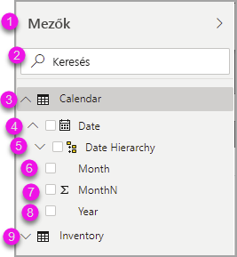

Egy mezőt úgy jelölhet ki, hogy a kívánt mezőre navigál, és lenyomja az **Enter** billentyűt.   A képernyőolvasó kimondja a fókuszban lévő mező nevét, és hogy az be van jelölve, vagy nincs.

Aki egérrel dolgozik, az általában áthúzza a mezőket a vászonra, vagy a kívánt mezőgyűjtőbe. Ha a billentyűzetet szeretné használni, úgy adhat egy mezőt egy mezőgyűjtőhöz, hogy a **Shift + F10** kombinációval megnyitja a mező helyi menüjét, a nyílbillentyűkkel a **Szűrőkhöz adás** lehetőségre navigál, majd lenyomja az **Enter** billentyűt annál a szűrőtípusnál, amelyet a mezőhöz szeretne adni.

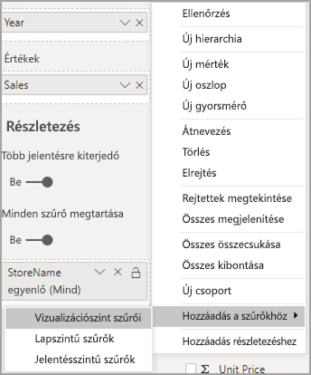

## Navigálás a Kijelölés panelen
A **Kijelölés** panel fókuszsorrendje a következő:

1. Fejlécbeli cím
2. Kilépés gomb
3. Réteg- / lapsorrend váltó
4. Egy réteggel feljebb gomb
5. Egy réteggel lejjebb gomb
6. Megjelenítés gomb
7. Elrejtés gomb
8. Objektumok

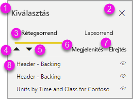

A Tab billentyűvel végighaladhat a fókuszsorrenden, és az **Enter** billentyűvel kiválaszthatja azt az elemet, amely érdekli.  

Ha a réteg- / lapsorrend váltóhoz ér, a bal és jobb nyílbillentyűvel válthat a rétegsorrend és a lapsorrend között.

Ha a **Kijelölés** panelen az objektumokra lép, az **F6** billentyűvel aktiválhatja a **Kijelölés** panelt. A **Kijelölés** panel aktiválása után a fel / le nyílbillentyűkel navigálhat a **Kijelölés** panel különböző objektumai között.
Ha a kívánt objektumra navigált, többféle műveletet is végrehajthat:

* A **Ctrl + Shift + S** kombinációval elrejthet / megjeleníthet egy objektumot
* A **Ctrl + Shift + F** kombinációval feljebb léptethet egy objektumot a rétegek sorrendjében
* A **Ctrl + Shift + B** kombinációval lejjebb léptethet egy objektumot a rétegek sorrendjében
* A **Ctrl + szóköz** kombinációval többszörös kijelölést végezhet

## A Power BI Desktop párbeszédpaneljei

A Power BI Desktop összes párbeszédpanelje elérhető billentyűzettel, és működik képernyőolvasókkal.

A Power BI Desktop párbeszédpaneljei közé tartoznak a következők:

* Gyorsmérők párbeszédpanel
* Feltételes formázás és adatsávok párbeszédpanel
* Q & A Explorer párbeszédpanel
* Első lépések párbeszédpanel
* Fájl menü és Névjegy párbeszédpanel
* Figyelmeztetés sáv
* Fájlvisszaállítás párbeszédpanel
* Rosszallások párbeszédpanel

## Kontrasztos színek támogatása

Ha kontrasztos üzemmódot használ a Windowsban, akkor a rendszer a kiválasztott beállításokat és palettát a Power BI Desktop jelentéseire is alkalmazza.

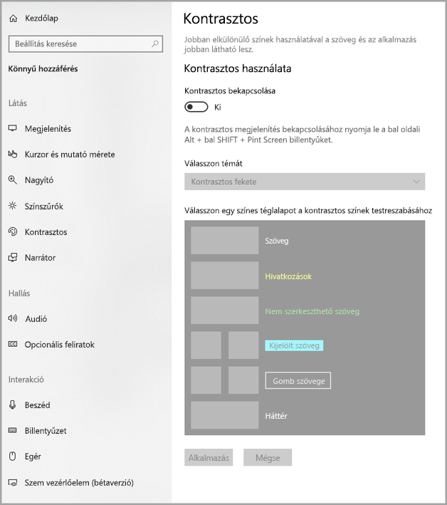

A Power BI Desktop automatikusan észleli, milyen kontrasztos témát használ a Windowsban, és alkalmazza ezeket a beállításokat a jelentésekre. Ezek a kontrasztos színek megmaradnak a jelentésben a Power BI szolgáltatásban vagy máshol való közzétételkor.

## Következő lépések

A Power BI akadálymentességi lehetőségeit ismertető cikkek gyűjteménye:

* [A Power BI akadálymentességi lehetőségeinek áttekintése](desktop-accessibility-overview.md) 
* [Akadálymentes Power BI-jelentések létrehozása](desktop-accessibility-creating-reports.md) 
* [Jelentések felhasználása a Power BI-ban akadálymentességi eszközökkel](desktop-accessibility-consuming-tools.md)
* [Akadálymentességi billentyűparancsok Power BI-jelentésekhez](desktop-accessibility-keyboard-shortcuts.md)
* [Ellenőrzőlista jelentések akadálymentesítéséhez](desktop-accessibility-creating-reports.md#report-accessibility-checklist)

