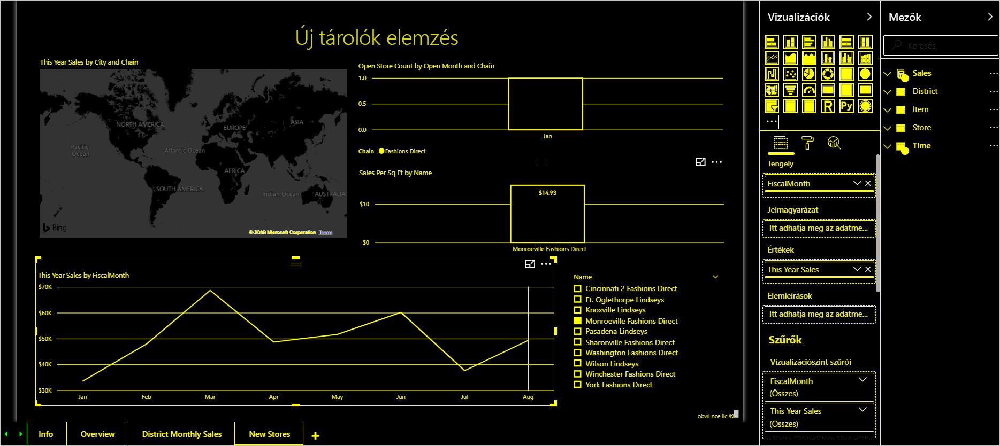

# A Power BI kisegítő lehetőségeinek áttekintése

A Power BI használatakor mindig legyen tekintettel a jelentéseit használó különböző típusú felhasználókra. Létrehozhat olyan jelentéseket, amelyek a csak billentyűzetet, vagy képernyőolvasót használó felhasználók is könnyedén kezelhetnek és megérthetnek. Az ilyen jelentéseknek azok a felhasználók is használt vehetik, akik látási vagy testi fogyatékkal élnek.

Ez a cikk a Power BI és az akadálymentesség áttekintését tartalmazza. A további cikkek olyan útmutatást és eszközöket biztosítanak, amelyekkel az akadálymentességet szem előtt tartva hozhat létre nagyszerű jelentéseket.

## Univerzális tervezés

Az univerzális tervezés az olyan termékek megtervezése, amelyeket ésszerű határokon belül a lehető legtöbb felhasználó tud használni, anélkül, hogy különleges adaptálásra vagy specializált kialakításra lenne szükség. Fontos, hogy figyelembe vegye a felhasználók igényeit, amikor a Power BI-ban jelentéseket vagy felületeket hoz létre. Ha akadálymentes felületet tervez, az nemcsak azon végfelhasználók számára hasznos, akik esetleg hallás-, mozgásszervi vagy látássérüléssel, vagy kognitív zavarokkal küzdenek. A szervezet minden végfelhasználóján segíthet. A Power BI biztosítja az eszközöket az akadálymentes jelentések létrehozásához és felhasználásához. Önön, mint a jelentés készítőjén múlik, hogy mindenki élményét javítja-e ezekkel az eszközökkel.

## Akadálymentességi szabványok

A Power BI a következő akadálymentességi szabványoknak felel meg. A szabványok segítségével biztosíthatja, hogy a Power BI-felületek a lehető legtöbb felhasználó számára legyenek elérhetők. Jelentések vagy irányítópultok készítésekor a tartalom mindenki számára elérhető, aki a Power BI Mobile használatával tekinti meg.

### WCAG 2.1

A webes tartalom akadálymentességi irányelvei (Web Content Accessibility Guidelines, WCAG) révén a webes tartalmak elérhetővé válnak a fogyatékkal élők számára is. Az irányelvek fő kulcsszavai a következők:

1. **Érzékelhető**. Az információkat és a felhasználói felület összetevőit a felhasználók számára észlelhető módon kell tudni bemutatni.
2. **Működtethető**. A felhasználói felület összetevőinek és a navigációnak kezelhetőnek kell lennie.
3. **Megérthető**. Az információknak és a felhasználói felület működésének érthetőnek kell lennie.

### 508. szakasz (USA)

Az 508. szakasz (USA) egy olyan szabvány, amely megköveteli a kormányoktól és a szövetségi ügynökségektől, hogy a fogyatékkal élők számára tegyék elérhetővé az elektronikus és informatikai technológiáikat.

### EN 301 549

Az EN 301 549 az IKT-termékekre és -szolgáltatásokra vonatkozó akadálymentességi harmonizált európai szabvány.  

## Következő lépések

A Power BI akadálymentességéről az alábbi forrásanyagokban talál további információt:

* [Power BI-jelentések tervezése az akadálymentesség szempontjából](desktop-accessibility-creating-reports.md)
* [Power BI-jelentések használata akadálymentességi eszközökkel](desktop-accessibility-consuming-tools.md)
* [Jelentések létrehozása a Power BI-ban akadálymentességi eszközök használatával](desktop-accessibility-creating-tools.md)
* [Billentyűparancsok a Power BI Desktopban](desktop-accessibility-keyboard-shortcuts.md)
* [Ellenőrzőlista jelentések akadálymentesítéséhez](desktop-accessibility-creating-reports.md#report-accessibility-checklist)

