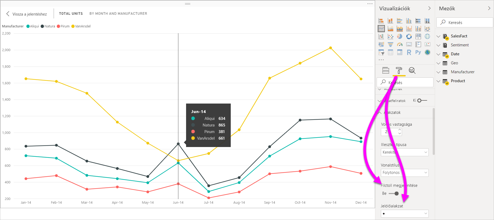
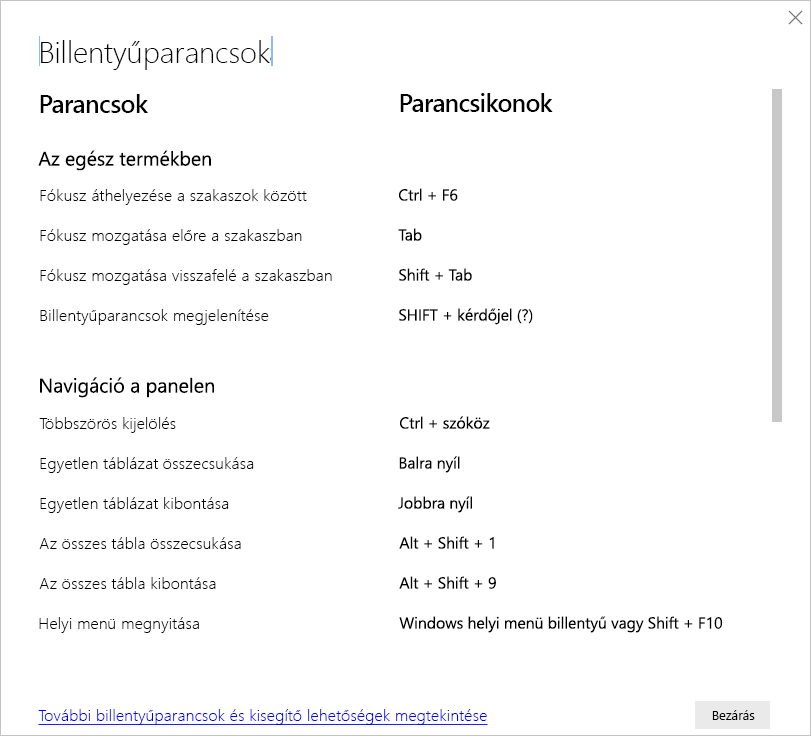
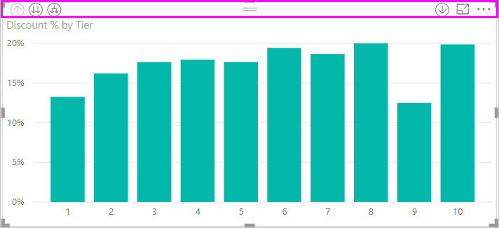
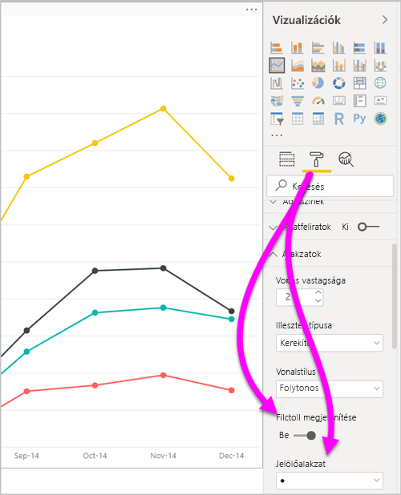
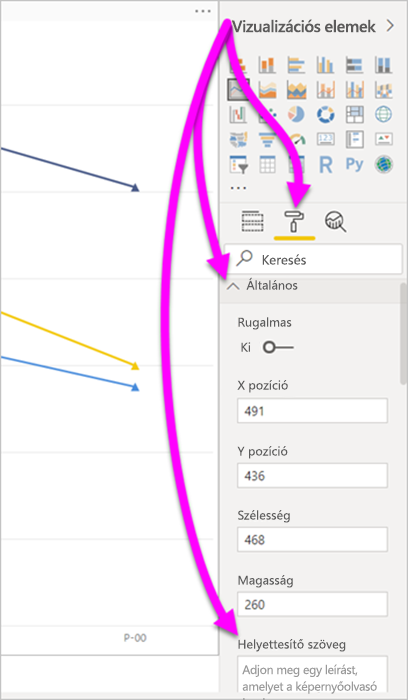
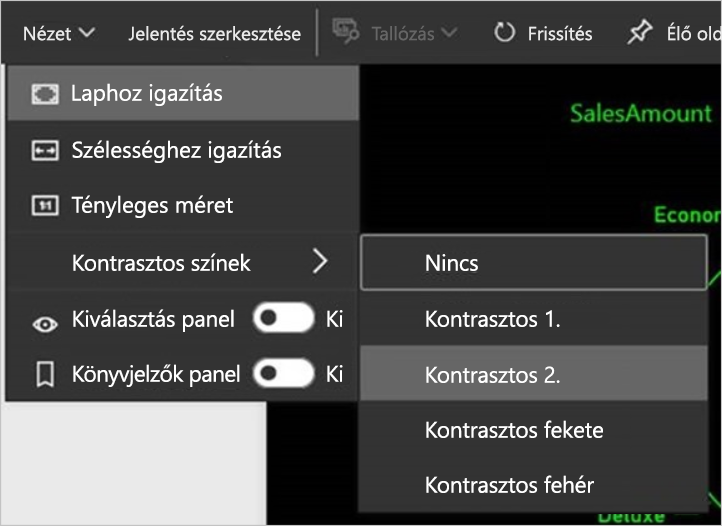

# Akadálymentesség a Power BI Desktop-jelentésekben
A Power BI rendelkezik olyan funkciókkal, amelyek lehetővé teszik a fogyatékkal élők számára, hogy könnyedén használják és kezeljék a Power BI-jelentéseket. A funkciók közé tartozik az a lehetőség, hogy a jelentések billentyűzettel vagy képernyőolvasóval is használhatók legyenek, az oldalak objektumai léptetéssel emelhetők ki, és a jelölők használata átgondolt a vizualizációkban.

## Power BI Desktop-jelentések használata billentyűzet vagy képernyőolvasó segítségével
A **Power BI Desktop** 2017. szeptemberi kiadásával kezdve a **Shift+?** billentyűkombináció lenyomásával megjeleníthet egy ablakot, amely ismerteti a **Power BI Desktopban** elérhető akadálymentességi billentyűparancsokat.

Az akadálymentességi fejlesztéseknek köszönhetően a Power BI-jelentések billentyűzettel vagy képernyőolvasóval is használhatók az alábbi technikák segítségével:

> [!NOTE]
> A jelentések megtekintésekor általában előnyös, ha ki van kapcsolva a vizsgálati mód.

Fókuszt válthat a jelentés lapfülei vagy egy adott jelentésoldal objektumai között a **Ctrl+F6** billentyűkombinációval.

* Ha a fókusz a jelentés lapfülein van, a **Tab** vagy a **nyílbillentyűk** használatával válthat fókuszt az egyik jelentésoldalról a következőre. A képernyőolvasó felolvassa a jelentésoldal címét, valamint azt, hogy jelenleg ki van-e választva. A jelenleg fókuszban lévő jelentésoldal betöltéséhez nyomja le az **Enter** vagy a Szóköz billentyűt.
* Ha a fókusz egy betöltött jelentésoldalon van, a **Tab** billentyűvel válthat fókuszt az oldal egyes objektumaira, beleértve a szövegdobozokat, képeket, alakzatokat és diagramokat is. A képernyőolvasó felolvassa az objektum típusát és annak címét (amennyiben rendelkezik ilyennel). A képernyőolvasó emellett felolvassa az objektum leírását, ha a jelentés szerzője létrehozta azt. 

A vizualizációk között váltogatva az **Alt+Shift+F10** billentyűparanccsal a vizualizáció fejlécére helyezheti a fókuszt. A vizualizáció fejlécén különféle lehetőségek állnak rendelkezésre, például leválogatás, a diagram alapjául szolgáló adatok exportálása és fókusz mód. 

Az **Alt+Shift+F11** billentyűkombinációval megjelenítheti az **Adatok megjelenítése** ablak akadálymentesített verzióját. Ez lehetővé teszi a vizualizációban használt adatok feltárását egy HTML-táblában, ugyanazokkal a billentyűparancsokkal, amelyeket máskor is használni szokott a képernyőolvasóban. 

> [!NOTE]
> Az **Adatok megjelenítése** funkció a képernyőolvasóban csak ezzel a billentyűparanccsal érhető el. Ha az **Adatok megjelenítése** funkciót a vizualizáció fejlécében lévő beállítással nyitja meg, akkor az nem lesz elérhető a képernyőolvasó számára. Ha bekapcsolja a vizsgálati módot az **Adatok megjelenítése** funkció használata alkalmával, minden olyan billentyűparancsot használhat, amely elérhető a képernyőolvasóban.

A **Power BI Desktop** 2018. júliusi verziójától kezdve az akadálymentességi funkciók a szeletelőkbe is be vannak építve. Egy kijelölt szeletelő értékének beállításakor a **Ctrl+jobb nyílbillentyű** használatával lehet végiglépkedni a szeletelő különböző vezérlőin. Amikor például először nyomja le a **Ctrl+jobb nyílbillentyű** kombinációt, a fókusz a radírra kerül. A szóköz billentyű lenyomása ekkor azzal egyenértékű, mintha a radírra kattintott volna. Ezzel minden értéket töröl a szeletelőn. 

Egy szeletelő vezérlőiben a **Tab** billentyűvel lépkedhet. Ha a radír ikonon állva nyomja le a **Tab** billentyűt, továbblép a legördítő gombra. A **Tab** ismételt lenyomásával továbblép a szeletelő első értékére (ha a szeletelőhöz több érték, például egy tartomány tartozik). 

Ezekkel az akadálymentesítési kiegészítésekkel a felhasználók képernyőolvasó és billentyűzetnavigáció segítségével is teljes mértékben használhatják a Power BI-jelentéseket.

## Akadálymentesített jelentések létrehozásával kapcsolatos tippek
Az alábbi tippek segítségével olyan **Power BI Desktop** jelentéseket hozhat létre, amelyek akadálymentesebbek.

### Általános tippek az akadálymentesített jelentésekhez

* A **Vonal**, **Terület** és **Kombinált** vizualizációkhoz, valamint a **Pont** és **Buborék** vizualizációkhoz kapcsolja be a **Jelölők megjelenítése** beállítást, és használjon eltérő **Jelölőalakzatot** minden vonalhoz.
  
  * A **Jelölők megjelenítése** beállítás bekapcsolásához válassza a **Formázás** panel **Vizualizációk** szakaszát, és bontsa ki az **Alakzatok** szakaszt. Görgessen le a **Jelölők megjelenítése** beállításhoz, majd kapcsolja **be**.
  * Az egyes sorok testreszabásához keresse meg a **Sorozatok testreszabása** beállítást, és kapcsolja **be**. Ezután válassza ki az egyes vonalak (vagy területek, ha **Terület** diagramot használ) nevét a legördülő listából az **Alakzatok** szakaszban. A legördülő lista alatt megadhatja az adott vonalhoz használt jelölő számos beállítását, például az alakját, a színét és a méretét.
  
    
  
  * A különböző **jelölőalakzatok** használata az egyes vonalakhoz megkönnyíti a jelentés használóinak a vonalak (vagy területek) elkülönítését egymástól.
* Az előző pontból következik az is, hogy ne használjon színt információ közlésére. Az alakzatok, vonal- és pontdiagramok használatán túl az is fontos, hogy ne alkalmazzon feltételes formázást a táblákban és matricákban a betekintő adatok biztosítására. 
* Válasszon ki egy szándékolt rendezési sorrendet a jelentésben szereplő minden vizualizációhoz. Amikor a képernyőolvasót használók a diagram alapjául szolgáló adatokat böngészik, azok ugyanabban a rendezési sorrendben fognak sorra kerülni, mint a vizualizációban.
* Válasszon olyan témát a témakatalógusból, amely kontrasztos és színvakbarát. Importálja a [**Témák** előzetes verzióként elérhető szolgáltatás](desktop-report-themes.md) segítségével.
* A jelentés minden objektumához adjon meg helyettesítő szöveget. Ezzel biztosíthatja, hogy a jelentése felhasználói megértsék, mi a kommunikációs célja a vizualizációval. Ez akkor is jól jöhet, ha nem látják a vizualizációt, a képet, az alakzatot vagy a szövegdobozt. A **Power BI Desktop**-jelentés bármely objektumához megadhat helyettesítő szöveget, ha kijelöli az objektumot (például vizualizációt, alakzatot stb.), és a **Vizualizációk** panelen kiválasztja a **Formázás** szakaszt. Ezután bontsa ki az **Általános** elemet, görgessen az aljára, és töltse ki a **Helyettesítő szöveg** szövegdobozt.
  
  
  
  Az ALT szöveg egy kifejezéssel dinamikusan is módosítható, például a vizualizációra alkalmazott szűrőket tükrözve. A kifejezést ugyanúgy lehet beállítani, mint ahogyan a vizualizáció címénél. [Vizualizációk címeinek feltételes formázása](desktop-conditional-format-visual-titles.md)
  
* Győződjön meg arról, hogy elég kontraszt legyen a jelentéseiben a szöveg és a háttérszínek között. Többféle eszköz, például a [Color Contrast Analyser](https://developer.paciellogroup.com/resources/contrastanalyser/) (Színkontrasztelemző) is rendelkezésre áll a jelentés színeinek ellenőrzésére. 
* Könnyen olvasható szövegméretet és betűtípusokat használjon. A kis betűméret vagy a nehezen olvasható betűtípusok nehezítik a használatot.
* Adjon meg címet, tengelyfeliratokat és adatfeliratokat minden vizualizációhoz.
* Használjon jelentéssel bíró címeket minden jelentésoldalhoz.
* Ha lehetséges, kerülje a díszítő alakzatok és képek a jelentésben, mert ezek belekerülnek a jelentés lapsorrendjébe. Ha díszítő objektumokat szeretne szerepeltetni a jelentésben, frissítse az objektum helyettesítő szövegét, hogy a képernyőolvasót használók tudják, hogy azok díszítés célját szolgálják.

### Elemek elrendezése mező gyűjtőkbe
A **Power BI Desktop** 2018. októberi kiadásától kezdve a **Mezők** területen navigálhat a billentyűzettel, és képernyőolvasókat használhat. 

Emellett helyi menüt is igénybe vehet, amely megkönnyíti a jelentések képernyőolvasókkal történő létrehozását. A menü lehetővé teszi, hogy a **Mezők** listában felfelé vagy lefelé mozgasson mezőket. Emellett más területre is áthelyezheti a mezőket, például a **Jelmagyarázat** vagy az **Érték** területre.

## Kontrasztos megjelenítés a jelentésekhez

Ha kontrasztos üzemmódot használ a Windowsban, akkor a rendszer a kiválasztott beállításokat és palettát a **Power BI Desktop** jelentéseire is alkalmazza. 

A **Power BI Desktop** automatikusan észleli, milyen kontrasztos témát használ a Windowsban, és alkalmazza ezeket a beállításokat a jelentésekre. Ezek a kontrasztos színek megmaradnak a jelentésben a Power BI szolgáltatásban vagy máshol való közzétételkor.

A Power BI szolgáltatás észleli a Windowsban beállított kontrasztos beállítást. Az észlelés hatékonysága és pontossága a Power BI szolgáltatást megjelenítő böngészőtől függ. Ha manuálisan szeretné beállítani a témát a Power BI szolgáltatásban, kiválaszthatja a **Nézet** > **Kontrasztos színek** beállítást, majd a témát, amelyet a jelentésre szeretne alkalmazni.

## Megfontolandó szempontok és korlátozások
Az akadálymentességi funkciók rendelkeznek néhány ismert hibájával és korláttal. Ezek leírását az alábbi lista ismerteti:

* Ha képernyőolvasót használ a **Power BI Desktoppal**, a legjobb élményben új lesz része, ha a képernyőolvasót még azelőtt megnyitja, mielőtt bármilyen fájlt megnyitott volna a **Power BI Desktopban**.
* Ha narrátort használ, akkor néhány korlátozás van érvényben az **Adatok megjelenítése** adatainak HTML-táblaként való böngészésekor.

## Billentyűparancsok
A billentyűparancsok segítenek a Power BI-jelentésekben a billentyűzettel való navigálásban. Az alábbi táblázatok a Power BI-jelentésekben elérhető billentyűparancsokat ismertetik. Ezek a billentyűparancsok a **Power BI Desktopon** kívül a következő felületeken is működnek:

* **Q&A Explorer** párbeszédpanel
* **Első lépések** párbeszédpanel
* **Fájl** menü és **Névjegy** párbeszédpanel
* **Figyelmeztetés** sáv
* **Fájlvisszaállítás** párbeszédpanel
* **Rosszallások** párbeszédpanel

Az akadálymentesség javítására való folyamatos törekvésünk jegyében a fenti felületek a képernyőolvasókat és a kontrasztos beállításokat is támogatják.

### Gyakran használt billentyűparancsok
| A művelet menete           | Billentyűparancs                |
| :------------------- | :------------------- |
| Fókusz áthelyezése a szakaszok között  | **Ctrl+F6** |
| Fókusz mozgatása előre a szakaszban | **Tab**         |
| Fókusz mozgatása visszafelé a szakaszban | **Shift+Tab** |
| Objektum kijelölése vagy a kijelölés törlése | **Enter** vagy **szóköz** |
| Objektumok többszörös kijelölése | **Ctrl+szóköz** |

### A vizualizációban
| A művelet menete           | Billentyűparancs                |
| :------------------- | :------------------- |
| Fókusz áthelyezése a Vizualizáció menüre | **Alt+Shift+F10** |
| Adatok megjelenítése | **Alt+Shift+F11**  |
| Vizualizáció megadása | **Ctrl+Jobb nyílbillentyű** |
| Réteg megadása | **Enter** |
| Kilépés a rétegből vagy vizualizációból | **Esc** |
| Adatpont kijelölése vagy a kijelölés törlése | **Enter** vagy **szóköz** |
| Többszörös kijelölés | **Ctrl+Enter** vagy **Ctrl+szóköz** |
| Kattintás jobb gombbal | <ul><li>Windows-billentyűzet: **Windows helyi menü billentyű+F10**. A Windows helyi menü billentyű a bal oldali Alt billentyű és a Balra nyílbillentyű között van</li><li>Más billentyűzeten: **Shift+F10**</li></ul> |
| Kijelölés törlése | **Ctrl+Shift+C** |

### Táblázat és mátrix navigációja
| A művelet menete          | Billentyűparancs                |
| :------------------- | :------------------- |
| Fókusz felfelé/lefelé mozgatása egy cellával (az összes cellán belül, minden területen)  | **Fel nyílbillentyű** / **Le nyílbillentyű** |
| Fókusz balra/jobbra mozgatása egy cellával (az összes cellán belül, minden területen)  | **Bal nyílbillentyű** / **Jobb nyílbillentyű** |

### Navigáció a panelen
| A művelet menete           | Billentyűparancs                |
| :------------------- | :------------------- |
| Többszörös kijelölés | **Ctrl+szóköz** |
| Egyetlen táblázat összecsukása | **Bal nyílbillentyű** |
| Egyetlen táblázat kibontása | **Jobb nyílbillentyű** |
| Az összes tábla összecsukása | **Alt+Shift+1** |
| Az összes tábla kibontása | **Alt+Shift+9** |
| Helyi menü megnyitása | <ul><li>Windows-billentyűzet: **Windows helyi menü billentyű+F10**.  A Windows helyi menü billentyű a bal oldali Alt billentyű és a Balra nyílbillentyű között van</li><li>Más billentyűzeten: **Shift+F10**</li></ul> |

### Szeletelő
| A művelet menete         | Billentyűparancs                |
| :------------------- | :------------------- |
| Szeletelő vezérlése | **Ctrl+Jobb nyílbillentyű** |

### Kiválasztás panel
| A művelet menete           | Billentyűparancs                |
| :------------------- | :------------------- |
| A Kiválasztás panel aktiválása | **F6** |
| Objektum feljebb helyezése a rétegekben | **Ctrl+Shift+F** |
| Objektum lejjebb helyezése a rétegekben | **Ctrl+Shift+B** |
| Objektum elrejtése/megjelenítése | **Ctrl+Shift+S** |

### DAX Editor
| A művelet menete          | Billentyűparancs                |
| :------------------- | :------------------- |
| Sor mozgatása felfelé/lefelé | **Alt+Fel nyílbillentyű** / **Le nyílbillentyű** |
| Sor másolása felfelé/lefelé | **Shift+Alt+Fel nyílbillentyű** / **Le nyílbillentyű** |
| Sor beszúrása alá | **Ctrl+Enter** |
| Sor beszúrása fölé | **Ctrl+Shift+Enter** |
| Ugrás az egyező zárójelre | **Ctrl+Shift+**  \ |
| Vonal behúzása/vonal kiterjesztése a margóra | **Ctrl+]**  /  **[** |
| Kurzor beszúrása | **Alt+Kattintás** |
| Aktuális sor kijelölése | **Ctrl+I** |
| Az aktuális kijelölés összes előfordulásának kijelölése | **Ctrl+Shift+L** |
| Az aktuális szó összes előfordulásának kijelölése | **Ctrl+F2** |

### Adatbevitel
| A művelet menete           | Billentyűparancs                |
| :------------------- | :------------------- |
| Kilépés a szerkeszthető rácsból | **Ctrl+Tab** |

## Következő lépések
* [Jelentéstémák használata a Power BI Desktopban (előzetes verzió)](desktop-report-themes.md)

