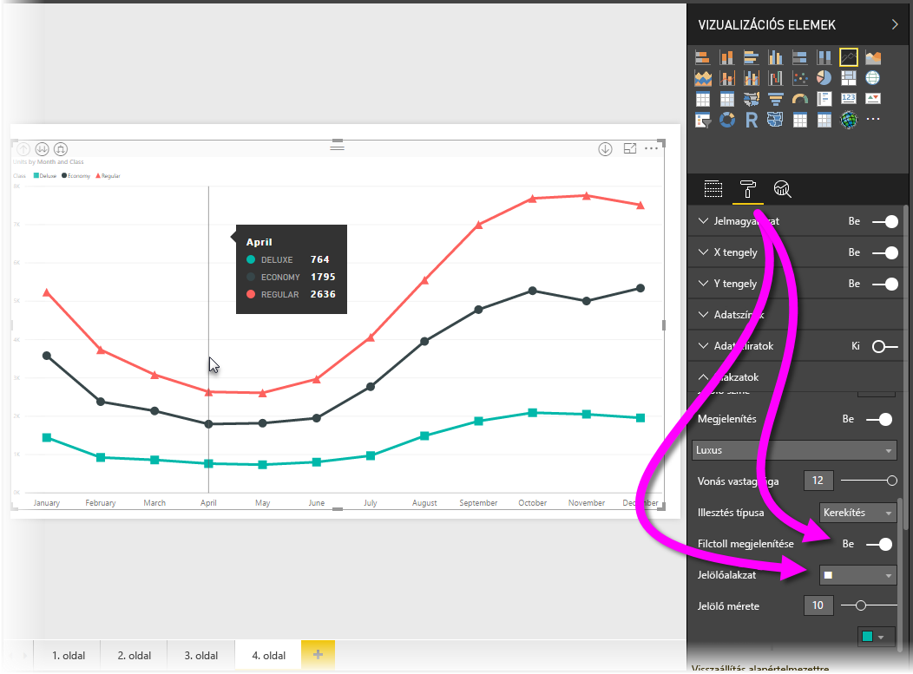
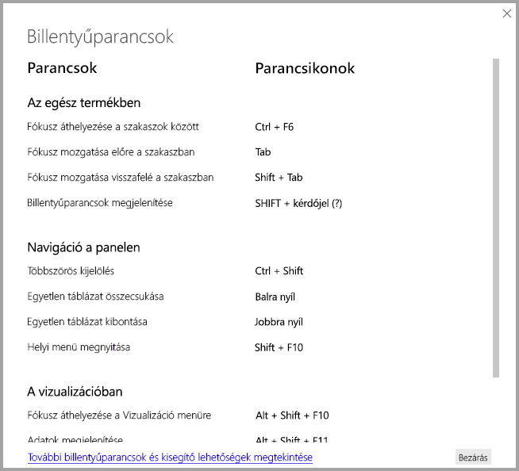
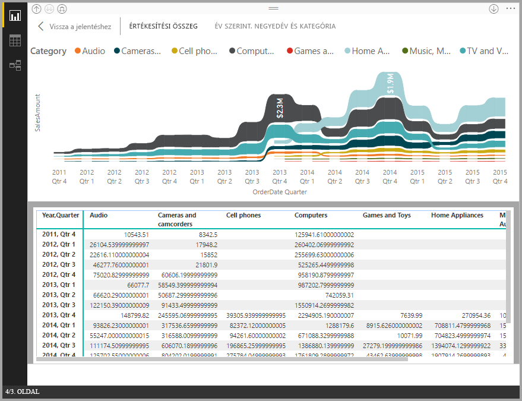
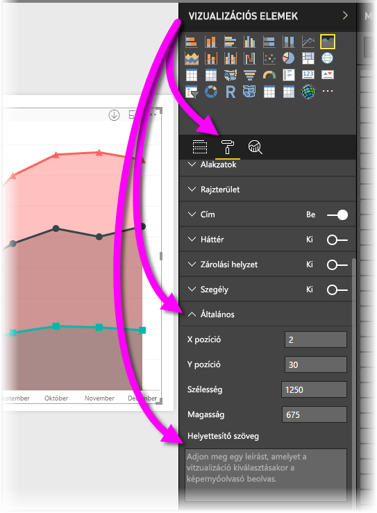
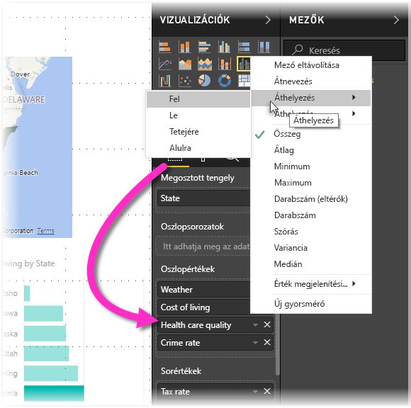

# Akadálymentesség a Power BI Desktop-jelentésekben
A Power BI rendelkezik olyan funkciókkal, amelyek lehetővé teszik a fogyatékkal élők számára, hogy könnyedén használják és kezeljék a Power BI-jelentéseket. A funkciók közé tartozik az a lehetőség, hogy a jelentések billentyűzettel vagy képernyőolvasóval is használhatók legyenek, az oldalak objektumai léptetéssel emelhetők ki, és a jelölők használata átgondolt a vizualizációkban.

> [!NOTE]
> Ezek az akadálymentességi funkciók a **Power BI Desktop** 2017. júniusi és újabb kiadásaiban érthetők el. A jövőbeli kiadásokban további akadálymentességi funkciókat tervezünk bevezetni.
> 
> 

## Power BI Desktop-jelentések használata billentyűzet vagy képernyőolvasó segítségével
A **Power BI Desktop** 2017. szeptemberi kiadásával kezdve a **?** billentyű lenyomásával megjeleníthet egy ablakot, amely ismerteti a **Power BI Desktopban** elérhető akadálymentességi billentyűparancsokat.

Az akadálymentességi fejlesztéseknek köszönhetően a Power BI-jelentések billentyűzettel vagy képernyőolvasóval is használhatók az alábbi technikák segítségével:

A jelentések megtekintésekor általában előnyös, ha ki van kapcsolva a vizsgálati mód.

Fókuszt válthat a jelentés lapfülei vagy egy adott jelentésoldal objektumai között a **Ctrl+F6** billentyűkombinációval.

* Ha a fókusz a *jelentés lapfülein* van, a *Tab* vagy a *nyíl*billentyűk használatával válthat fókuszt az egyik jelentésoldalról a következőre. A képernyőolvasó felolvassa a jelentésoldal címét, valamint azt, hogy jelenleg ki van-e választva. A jelenleg aktív lévő jelentésoldal betöltéséhez nyomja le az *Enter* vagy a *Szóköz* billentyűt.
* Ha a fókusz egy betöltött *jelentésoldalon* van, a *Tab* billentyű használatával válthat fókuszt az oldal egyes objektumaira, beleértve a szövegdobozokat, képeket, alakzatokat és diagramokat. A képernyőolvasó felolvassa az objektum típusát, az objektum címét, ha van címe és az objektum leírását, ha a jelentés szerzője létrehozta azt. 

Ha a vizualizációk között navigálva szeretne további műveleteket is végezni az egyiken, megnyomhatja az **Alt+Shift+F10** billentyűkombinációt, hogy a kurzor a vizualizáció fejlécére kerüljön, ahol különféle lehetőségek állnak rendelkezésre, például leválogatás, a diagram alapjául szolgáló adatok exportálása és fókusz mód. 

Az **Alt+Shift+F11** billentyűkombinációval megjelenítheti az *Adatok megjelenítése* ablak akadálymentesített verzióját. Ez lehetővé teszi a vizualizációban használt adatok feltárását egy HTML-táblában, ugyanazokkal a billentyűparancsokkal, amelyeket máskor is használni szokott a képernyőolvasóban. 

> [!NOTE]
> Az Adatok megjelenítése funkció a képernyőolvasóban csak ezzel a billentyűparanccsal érhető el. Ha az Adatok megjelenítése funkciót a vizualizáció fejlécében lévő beállítással nyitja meg, akkor az nem lesz elérhető a képernyőolvasó számára. Ha bekapcsolja a vizsgálati módot az Adatok megjelenítése funkció használata alkalmával, minden olyan billentyűparancsot használhat, amely elérhető a képernyőolvasóban.

A **Power BI Desktop** 2018. júliusi verziójától kezdve az akadálymentességi funkciók a szeletelőkbe is be vannak építve. Egy kijelölt szeletelő értékének beállításakor a Ctrl+jobb nyíl (a Ctrl és a jobbra mutató nyíl billentyű) használatával lehet végiglépkedni a szeletelő különböző vezérlőin. Ha például először a Ctlr+jobb nyíl kombinációt nyomja le, akkor a radír ikon lesz kiemelve, és a SZÓKÖZ billentyű lenyomása azzal egyenértékű, mintha a radírra kattintott volna. Ezzel minden értéket töröl a szeletelőn. 

Egy szeletelő vezérlőiben a TAB billentyűvel lépkedhet. Ha a radír ikonon állva nyomja le a TAB billentyűt, továbblép a legördítő gombra. A TAB ismételt lenyomásával továbblép a szeletelő első értékére (ha a szeletelőhöz több érték, például egy tartomány tartozik). 

Ezek az akadálymentesítési kiegészítések azért készültek, hogy a felhasználók képernyőolvasó és billentyűzetnavigáció segítségével is teljes mértékben használhassák a Power BI-jelentéseket.

## Akadálymentesített jelentések létrehozásával kapcsolatos tippek
Az alábbi tippek segítségével olyan **Power BI Desktop** jelentéseket hozhat létre, amelyek akadálymentesebbek.

### Általános tippek az akadálymentesített jelentésekhez

* A **Vonal**, **Terület** és **Kombinált** vizualizációkhoz, valamint a **Pont** és **Buborék** vizualizációkhoz kapcsolja be a jelölőket, és használjon eltérő *Jelölőalakzatot* minden vonalhoz.
  
  * A *Jelölők* bekapcsolásához válassza ki a **Formátum** szakaszt a **Vizualizációk** panelen, bontsa ki az **Alakzatok** szakaszt, majd görgessen lefelé a **Jelölők** kapcsolóig, és állítsa *Be* állapotba.
  * Ezután válassza ki az egyes vonalak (vagy területek, ha **Terület** diagramot használ) nevét a legördülő listából az **Alakzatok** szakaszban. A legördülő lista alatt megadhatja az adott vonalhoz használt jelölő számos beállítását, például az alakját, a színét és a méretét.
  
  
  
  * A különböző *jelölőalakzatok* használata az egyes vonalakhoz megkönnyíti a jelentés használóinak a vonalak (vagy területek) elkülönítését egymástól.
* Az előző pontból következik az is, hogy ne használjon színt információ közlésére. Az alakzatok, vonal- és pontdiagramok használatán túl az is fontos, hogy ne alkalmazzon feltételes formázást a táblákban és matricákban a betekintő adatok biztosítására. 
* Válasszon ki egy szándékolt rendezési sorrendet a jelentésben szereplő minden vizualizációhoz. Amikor a képernyőolvasót használók a diagram alapjául szolgáló adatokat böngészik, azok ugyanabban a rendezési sorrendben fognak sorra kerülni, mint a vizualizációban.
* Válasszon olyan *témát* a témakatalógusból, ami kontrasztos és színvakbarát, és importálja a [**Témák** előzetes verzióként elérhető szolgáltatás](desktop-report-themes.md) segítségével.
* A jelentés minden objektumához adjon meg *helyettesítő szöveget*. Ezzel biztosíthatja, hogy a jelentése felhasználói megértsék, mi a kommunikációs célja a vizualizációval, akkor is, ha nem látják a vizualizációt, a képet, az alakzatot vagy a szövegdobozt. A **Power BI Desktop** jelentés bármely objektumához megadhat *helyettesítő szöveget*, ha kijelöli az objektumot (például vizualizációt, alakzatot stb.), és a **Vizualizációk** panelen kiválasztja a **Formázás** szakaszt, kibontja az **Általános** elemet, majd legörget az aljára, és kitölti a **Helyettesítő szöveg** szövegdobozt.
  
  
* Győződjön meg arról, hogy elég kontraszt legyen a jelentéseiben a szöveg és a háttérszínek között. Többféle eszköz, például a [Colour Contrast Analyser](https://developer.paciellogroup.com/resources/contrastanalyser/) (Színkontrasztelemző) is rendelkezésre áll a jelentés színeinek ellenőrzésére. 
* Könnyen olvasható szövegméretet és betűtípusokat használjon. A kis betűméret vagy a nehezen olvasható betűtípusok nehezítik a használatot.
* Adjon meg címet, tengelyfeliratokat és adatfeliratokat minden vizualizációhoz.
* Használjon jelentéssel bíró címeket minden jelentésoldalhoz.
* Ha lehetséges, kerülje a díszítő alakzatok és képek a jelentésben, mert ezek belekerülnek a jelentés lapsorrendjébe. Ha díszítő objektumokat szeretne szerepeltetni a jelentésben, frissítse az objektum helyettesítő szövegét, hogy a képernyőolvasót használók tudják, hogy azok díszítés célját szolgálják.

### Elemek elrendezése mező gyűjtőkbe
A **Power BI Desktop** 2018. októberi kiadásától kezdve a **Mezők** területen navigálhat a billentyűzettel, és képernyőolvasókat használhat. 

A jelentések képernyőolvasókkal való létrehozási folyamatának javítása érdekében elérhető egy helyi menü, amely lehetővé teszi a területen lévő mezők felfelé vagy lefelé mozgatását a **Mezők** listában, vagy a mező más területekre (például a **Jelmagyarázat**, az **Érték** vagy más területekre) mozgatását.

## Kontrasztos megjelenítés a jelentésekhez

Ha kontrasztos üzemmódot használ a Windowsban, akkor a rendszer a kiválasztott beállításokat és palettát a **Power BI Desktop** jelentéseire is alkalmazza. 

A **Power BI Desktop** automatikusan észleli, milyen kontrasztos témát használ a Windowsban, és alkalmazza ezeket a beállításokat a jelentésekre. Ezek a kontrasztos színek megmaradnak a jelentésben a Power BI szolgáltatásban vagy máshol való közzétételkor.

A Power BI szolgáltatás megpróbálja a Windowshoz kiválasztott kontrasztos beállításokat is felderíteni, de ennek a felderítésnek a hatékonysága és pontossága a Power BI szolgáltatáshoz használt böngészőbeállításoktól függ. Ha manuálisan szeretné beállítani a témát a Power BI szolgáltatásban, kiválaszthatja a **Nézet > Kontrasztos színes** beállítást, majd a témát, amelyet a jelentésre szeretne alkalmazni.

Miután megnyitotta a **Power BI Desktop** alkalmazást, vegye észere, hogy bizonyos területek, például a **Vizualizációk** és a **Mezők** nem a kiválasztott kontrasztos Windows-színsémákat használják.

## Megfontolandó szempontok és korlátozások
Az akadálymentességi funkciók néhány ismert hibáját és korlátait az alábbi lista ismerteti:

* Ha képernyőolvasót használ a **Power BI Desktoppal**, a legjobb élményben új lesz része, ha a választott képernyőolvasót még azelőtt megnyitja, mielőtt bármilyen fájlt megnyitott volna a Power BI Desktopban.
* Ha narrátort használ, akkor néhány korlátozás van érvényben az Adatok megjelenítése adatainak HTML-táblaként való böngészésekor.

## Billentyűparancsok
### Gyakran használt billentyűparancsok
| Cél           | Billentyűparancs                |
| :------------------- | :------------------- |
| Fókusz áthelyezése a szakaszok között  | Ctrl + F6 |
| Fókusz mozgatása előre a szakaszban | Tab         |
| Fókusz mozgatása visszafelé a szakaszban | Shift + Tab |

### A vizualizációban
| Cél           | Billentyűparancs                |
| :------------------- | :------------------- |
| Fókusz áthelyezése a Vizualizáció menüre | Alt + Shift + F10 |
| Adatok megjelenítése | Alt + Shift + F11  |

### Navigáció a panelen
| Cél           | Billentyűparancs                |
| :------------------- | :------------------- |
| Helyi menü megnyitása | <ul><li>Windows-billentyűzet: Windows helyi menü billentyű + F10.  A Windows helyi menü billentyű a bal oldali Alt billentyű és a Balra nyílbillentyű között van</li><li>Más billentyűzeten: Shift + F10</li></ul> |

### Szeletelő
| Cél           | Billentyűparancs                |
| :------------------- | :------------------- |
| Szeletelő vezérlése | CTRL + Jobbra nyíl |

### Kiválasztás panel
| Cél           | Billentyűparancs                |
| :------------------- | :------------------- |
| A Kiválasztás panel aktiválása | F6 |
| Objektum feljebb helyezése a rétegekben | Ctrl + Shift + F |
| Objektum lejjebb helyezése a rétegekben | Ctrl + Shift + B |
| Objektum elrejtése/megjelenítése | Ctrl + Shift + S |

### DAX Editor
| Cél           | Billentyűparancs                |
| :------------------- | :------------------- |
| Sor mozgatása felfelé/lefelé | Alt + Felfelé nyíl/Lefelé nyíl |
| Sor másolása felfelé/lefelé | Shift + Alt + Felfelé nyíl/Lefelé nyíl |
| Sor beszúrása alá | Ctrl + Enter |
| Sor beszúrása fölé | Ctrl + Shift + Enter |
| Ugrás az egyező zárójelre | Ctrl + Shift + \ |
| Sor behúzása/behúzásának csökkentése | Ctrl + ] / [ |
| Kurzor beszúrása | Alt + kattintás |
| Aktuális sor kijelölése | Ctrl + I |
| Az aktuális kijelölés összes előfordulásának kijelölése | Ctrl + Shift + L |
| Az aktuális szó összes előfordulásának kijelölése | Ctrl + F2 |

## Következő lépések
* [Jelentéstémák használata a Power BI Desktopban (előzetes verzió)](desktop-report-themes.md)

