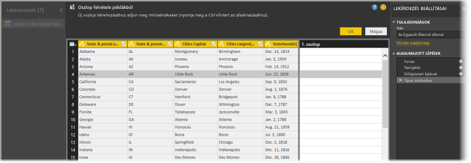
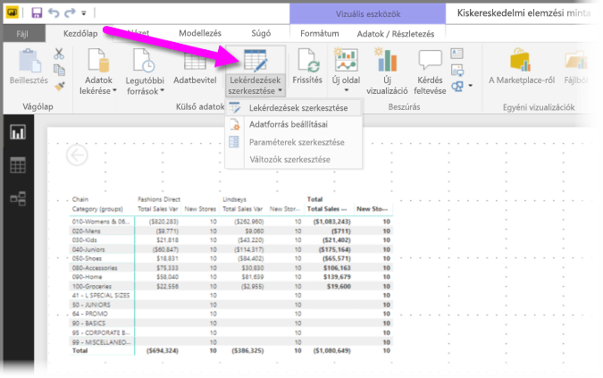
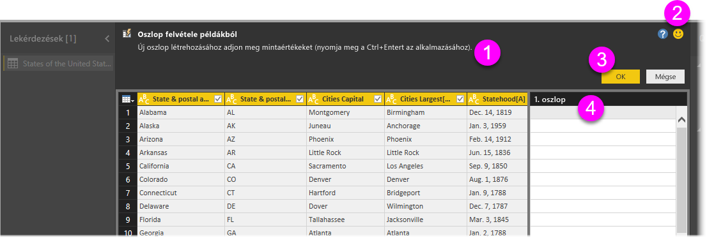
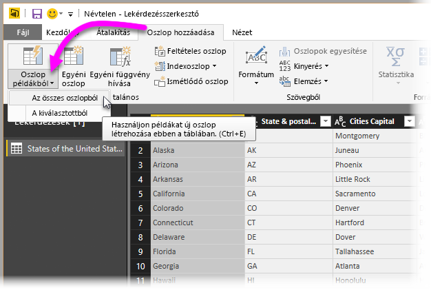
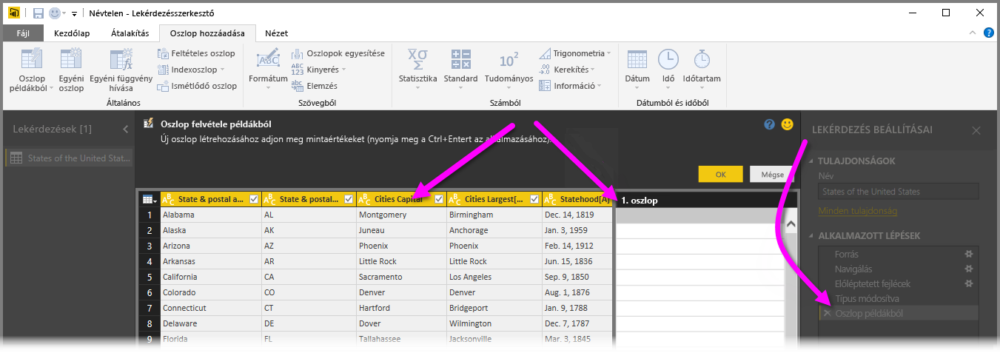
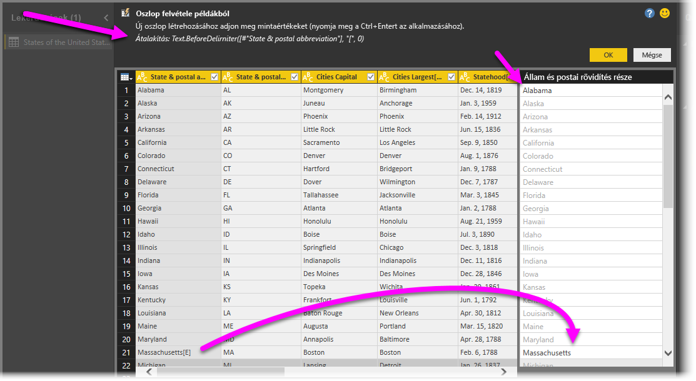

# Oszlop hozzáadása példák alapján a Power BI Desktopban
A Power Query-szerkesztőben *új oszlop példák alapján történő hozzáadásával* egyszerűen adhat új oszlopokat az adatmodellhez úgy, hogy megad egy vagy több példát az új oszlopok értékeire. Az új oszlop példaértékei megadhatók kijelölésből, vagy a tábla összes meglévő oszlopán alapuló bementként.

Az *oszlop hozzáadása példából* funkcióval gyorsan és egyszerűen hozhat létre új oszlopokat, ami a következő helyzetekben lehet igazán hasznos:

- Ismeri az új oszlopba kívánt adatokat, de nem tudja, hogy mely átalakítással vagy átalakításegyüttessel érheti el azt.
- Tudja, hogy melyik átalakításra van szüksége, de nem biztos abban, hogy a felhasználói felület melyik elemét kell kiválasztania ennek eléréséhez.
- Mindent tud az *M* nyelven megírt *Egyéni oszlop* kifejezés használatával végrehajtható szükséges átalakításokról, de e kifejezések közül egy (vagy több) nem érhető el a felhasználói felületen.

Egy oszlop példa alapján történő hozzáadása egyszerű és magától értetődő. A következő szakaszok bemutatják, mennyire egyszerű.

## Új oszlop felvétele példák alapján

A Wikipediáról származó példaadatok beszerzéséhez válassza az **Adatok beolvasása** > **Web** lehetőséget a Power BI Desktop menüszalagjának **Kezdőlapján**. 

A megjelenő párbeszédablakba illessze be az alábbi URL-címet, majd kattintson az **OK** gombra: 

*https:\//wikipedia.org/wiki/List_of_states_and_territories_of_the_United_States*

A **Navigátor** párbeszédpanelen jelölje ki a **States of the United States of America** táblázatot, majd válassza az **Adatok átalakítása** lehetőséget. A táblázat megnyílik a Power Query-szerkesztőben.

Azt is megteheti, hogy a Power BI Desktopba már betöltött adatok megnyitásához a menüszalag **Kezdőlapján** a **Lekérdezések szerkesztése** lehetőséget választja. Az adatok megnyílnak a Power Query-szerkesztőben. 

Miután a mintaadatok megnyílnak a Power Query-szerkesztőben, válassza az **Oszlop hozzáadása** lapot a menüszalagon, majd válassza az **Oszlop példákból** lehetőséget. Magát az **Oszlop példákból** ikont választva az összes meglévő oszlop alapján hozhatja létre az oszlopot, a legördítő nyíllal pedig választhat az **Összes oszlopból** és a **Kijelölésből** lehetőségek közül. Ehhez a bemutatóhoz használja az **Összes oszlopól** lehetőséget.

## Az Oszlop hozzáadása példákból panel
Az **Oszlop hozzáadása** > **Példákból** menüpont kiválasztása után a tábla felett megnyílik az **Oszlop hozzáadása példákból** panel. Az új **1. oszlop** a meglévő oszlopoktól jobbra jelenik meg (az összes megtekintéséhez esetleg görgetnie kell). Amikor megadja a példa értékeket az **1. oszlop** üres celláiban, a Power BI a példáknak megfelelő szabályokat és átalakításokat hoz létre, amelyeket az oszlop többi részének kitöltéséhez használ.

Figyelje meg, hogy az **Oszlop példákból** a **Lekérdezés beállításai** panel **Alkalmazott lépések** területén is megjelenik. Mint mindig, a Power Query-szerkesztő rögzíti az átalakítás lépéseit, és sorrendben alkalmazza azokat a lekérdezésen.

A példának az oszlopba történő beírása során a Power BI a létrehozott átalakítások alapján megjeleníti az oszlop többi részének előnézetét. Ha például az első sorba az *Alabama* kifejezést írja be, az a tábla első oszlopában az **Alabama** értékének felel meg. Az Enter lenyomása után a Power BI az oszlop első értéke alapján kitölti az oszlop többi részét, és a **Name & postal abbreviation[12] - Másolat** nevet adja az oszlopnak.

Most lépjen az új oszlop **Massachusetts[E]** sorához, és törölje a sztring **[E]** részét. A Power BI észleli a változást, és a példát használja egy átalakítás létrehozására. A Power BI megadja az átalakítás leírását az **Oszlop hozzáadása példákból** panelen, és átnevezi az oszlopot a **Határolójel előtti szöveg** névre. 

Újabb példák megadásakor a Power Query-szerkesztő újabb átalakításokat végez. Ha elégedett az eredménnyel, véglegesítse a módosításokat az **OK** lehetőség kiválasztásával. 

Az új oszlopot tetszés szerint átnevezheti, ha duplán az oszlopfejlécre kattint, vagy a jobb gombbal kattint rá, majd az **Átnevezés** lehetőséget választja. 

Tekintse meg az **Oszlop hozzáadása példákból** funkció működését a minta-adatforrással bemutató videót: 

[Power BI Desktop: Oszlop hozzáadása példákból](https://www.youtube.com/watch?v=-ykbVW9wQfw). 

## A támogatott átalakítások listája
Az **Oszlop hozzáadása példákból** funkció használatához sokféle átalakítás érhető el, de nem az összes. A támogatott átalakításokat az alábbi lista tartalmazza:

**Általános**

- Feltételes oszlop

**Referencia**
  
- Hivatkozás egy adott oszlopra beleértve a levágást, a törlést, valamint a kis- és nagybetűkre vonatkozó átalakításokat is

**Szövegátalakítások**

- Egyesítés (támogatja a sztringliterálok és a teljes oszlop értékeinek egyesítését)
- Csere
- Hossz
- Kinyerés   
  - Első karakterek
  - Utolsó karakterek
  - Tartomány
  - Határolójel előtti szöveg
  - Határolójel utáni szöveg
  - Határolójelek közötti szöveg
  - Hossz
  - Karakterek eltávolítása
  - Karakterek megtartása

> [!NOTE]
> Valamennyi *szöveg*átalakítás figyelembe veszi az oszlop értékének levágására, törlésére vagy a kis- és nagybetűkre vonatkozó lehetséges átalakítási igényét.

**Dátumátalakítások**

- Nap
- Hét napja
- Hét napjának neve
- Év napja
- Hónap
- Hónap neve
- Év negyedéve
- Hónap hete
- Év hete
- Év
- Kor
- Év kezdete
- Év vége
- Hónap kezdete
- Hónap vége
- Negyedév kezdete
- Hónap napjainak száma
- Negyedév vége
- Hét kezdete
- Hét vége
- Hónap napja
- Nap kezdete
- Nap vége

**Időpont-átalakítások**

- Hour
- Minute
- Second  
- Helyi időre

> [!NOTE]
> Valamennyi *dátum*- és *időpont*átalakítás figyelembe veszi az oszlop értékének *Dátum*, *Idő* vagy *Dátum/idő* értékre történő konvertálásának lehetséges igényét.

**Számátalakítások** 

- Abszolút érték
- Arkusz koszinusz
- Arkusz szinusz
- Arkusz tangens
- Konvertálás számmá
- Koszinusz
- Köbre emelés
- Osztás
- Kitevő
- Faktoriális
- Egész szám osztása
- Páros
- Páratlan
- Természetes logaritmus
- 10-es alapú logaritmus
- Moduló
- Szorzás
- Kerekítés lefelé
- Kerekítés felfelé
- Előjel
- Szinusz
- Négyzetgyök
- Négyzetre emelés
- Kivonás
- Összeg
- Tangens
- Gyűjtés/Tartományok

