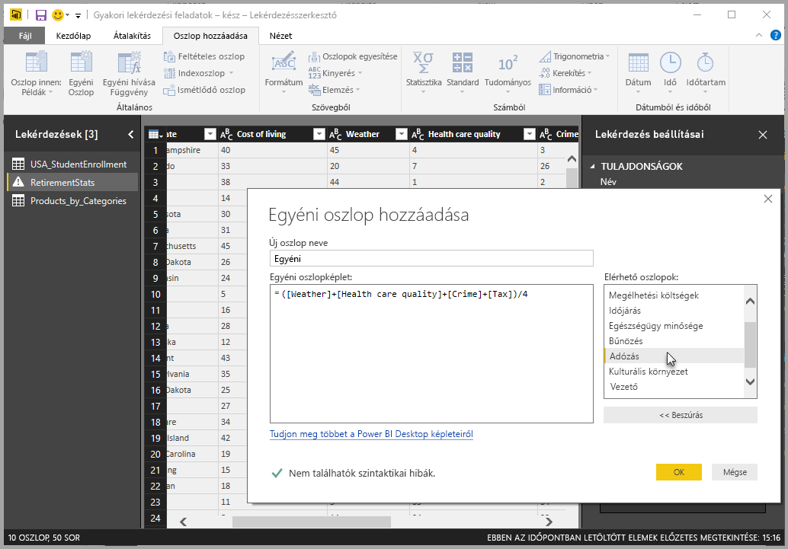
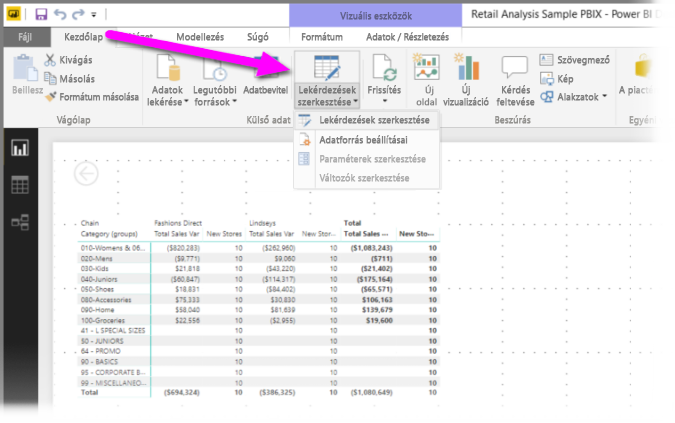
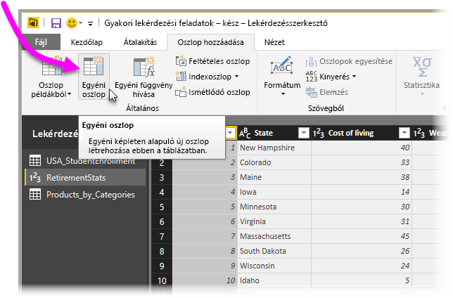
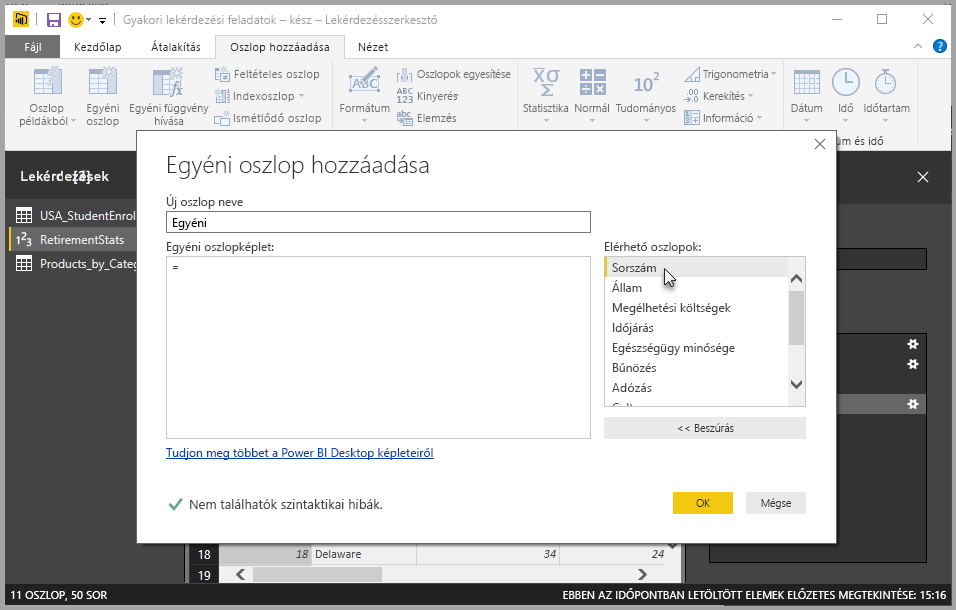
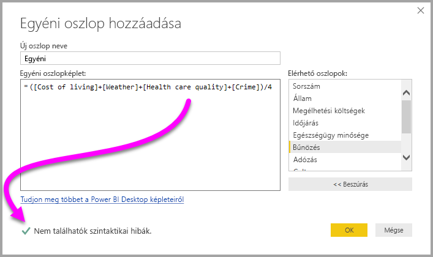
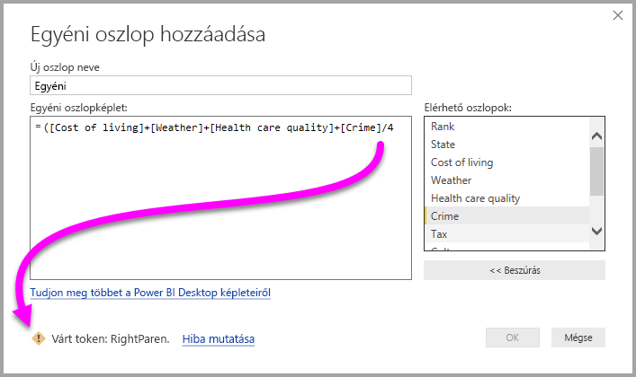
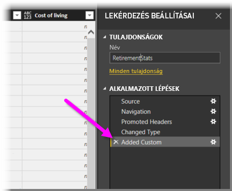
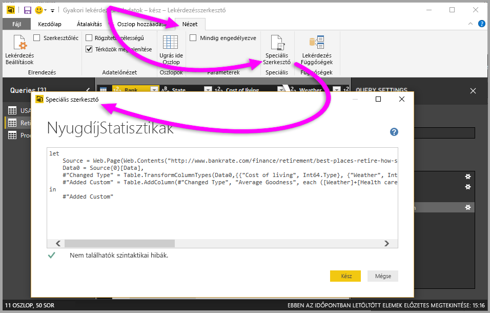

# Egyéni oszlop hozzáadása a Power BI Desktopban

A Power BI Desktop Lekérdezésszerkesztőjével egyszerűen adhat hozzá új egyéni adatoszlopokat a modellekhez. A Lekérdezésszerkesztővel hozhat létre és nevezhet át egyéni oszlopot az egyéni oszlopot definiáló, [M-képleteket használó PowerQuery-lekérdezések](https://docs.microsoft.com/powerquery-m/quick-tour-of-the-power-query-m-formula-language) létrehozásához. Az M-képleteket használó PowerQuery-lekérdezések [átfogó függvényreferencia-tartalomkészlettel](https://docs.microsoft.com/powerquery-m/power-query-m-function-reference) rendelkeznek. 

Amikor egyéni oszlopot hoz létre a Lekérdezésszerkesztőben, a Power BI Desktop ezt **Alkalmazott lépésként** vesz fel a **Lekérdezés beállításaiban**. Ez bármikor megváltoztatható, áthelyezhető és módosítható.

## Egyéni oszlop hozzáadása a Lekérdezésszerkesztő használatával

Egy egyéni oszlop létrehozásának első lépései a következők:

1. Indítsa el a Power BI Desktopot, és töltsön be adatokat.

2. A menüszalag **Kezdőlapján** válassza a **Lekérdezések szerkesztése** lehetőséget, majd a **Lekérdezések szerkesztése** menüpontot.

   

   Megnyílik a **Lekérdezésszerkesztő** ablaka. 

2. A menüszalag **Oszlop hozzáadása** lapján válassza az **Egyéni oszlop** lehetőséget.

   

   Megnyílik az **Egyéni oszlop hozzáadása** ablak.

## Az Egyéni oszlop hozzáadása ablak

Az **Egyéni oszlop hozzáadása** ablak funkciói a következők: 
- Tartalmazza az elérhető oszlopok listáját a jobb oldali **Elérhető oszlopok:** listában.

- Az egyéni oszlop kezdeti neve az **Új oszlop neve** mezőben látható. Az oszlop nevét megváltoztathatja.

- [M-képletet használó PowerQuery-lekérdezések](https://docs.microsoft.com/powerquery-m/power-query-m-function-reference) az **Egyéni oszlop képlete** mezőben. Ezeket a lekérdezéseket annak a képletnek a megírásával hozza létre, amellyel az új oszlopot definiálja. 

   

## Képletek létrehozása az egyéni oszlopokhoz

1. Jelöljön ki egy oszlopot a jobb oldali **Elérhető oszlopok:** listában. Ezt a lista alatti **Beszúrás** gombbal szúrhatja be az egyéni oszlop képletébe. Oszlopot úgy is beszúrhat, hogy duplán kattint rá a listában.

2. A képlet bevitele és az oszlop elkészítése során tartsa szemmel az **Egyéni oszlop hozzáadása** ablak alján lévő kijelzőt. 

   Ha nincs hiba, akkor itt egy zöld pipa és a *Nem észlelhető szintaktikai hiba* üzenet látható.

   

   Szintaktikai hiba esetén sárga figyelmeztető ikon jelenik meg a hiba képletbeli helyére mutató hivatkozással.

   

3. Kattintson az **OK** gombra. 

   A Power BI Desktop felveszi az egyéni oszlopot a modellbe, és a **Lekérdezés beállításaiban** felveszi az **Egyéni hozzáadva** lépést az **Alkalmazott lépések** listájára.

   

4. Az egyéni oszlop módosításához kattintson duplán az **Egyéni hozzáadva** lépésre az **Alkalmazott lépések** listájában. 

   Megjelenik az **Egyéni oszlop hozzáadása** ablak a létrehozott egyéni oszlopképlettel.

## A Speciális szerkesztő használata egyéni oszlopokhoz

A lekérdezés létrehozása után a **Speciális szerkesztő** használatával is módosíthatja a lekérdezés bármelyik lépését. Ehhez kövesse az alábbi lépéseket:

1. A **Lekérdezésszerkesztő** ablakban válassza a menüszalag **Nézet** lapját. 

2. Válassza az **Advanded Editor** (Speciális szerkesztő) lehetőséget.

   Megnyílik a **Speciális szerkesztő** oldal, amelyen tetszőlegesen módosíthatja a lekérdezést. 

   

   
## Következő lépések

- Egyéni oszlopot más módokon is létrehozhat, például a Lekérdezésszerkesztőben megadott példák alapján. További információ: [Oszlop hozzáadása példából a Power BI Desktopban](desktop-add-column-from-example.md).

- Power Query M-referenciákat a [Power Query M-függvények referenciája](/powerquery-m/power-query-m-function-reference) tartalmaz.

