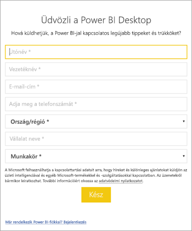

# <a name="how-administrators-can-manage-the-power-bi-desktop-sign-in-form"></a>A Power BI Desktop bejelentkezési űrlapjának rendszergazdák általi kezelése
A Power BI Desktop első indításakor megjelenik egy bejelentkezési űrlap. A folytatáshoz ezt ki kell tölteni, vagy be kell jelentkezni a Power BI szolgáltatásba. A rendszergazdák egy beállításkulccsal kezelik ezt az űrlapot. 



A rendszergazdák az alábbi beállításkulccsal tilthatják le a bejelentkezési űrlapot. Ez globális szabályzatok használatával az egész vállalatra kiterjeszthető.

```
Key: HKEY_CURRENT_USER\SOFTWARE\Policies\Microsoft\Microsoft Power BI Desktop
valueName: ShowLeadGenDialog
```
Emellett kipróbálhatja a következő kulcsot is, amely a konfigurációk alapján sikeresen bevált néhány ügyfélnél a konfigurációk alapján:

```
Key: HKEY_CURRENT_USER\SOFTWARE\Microsoft\Microsoft Power BI Desktop
valueName: ShowLeadGenDialog
```

A 0 érték kikapcsolja a párbeszédpanelt.


További kérdései vannak? [Kérdezze meg a Power BI közösségét](http://community.powerbi.com/)

