# Aggregációk a Power BI Desktopban

A Power BI-ban az **aggregációk** olyan big data-elemzéseket tesznek lehetővé, amelyekre korábban nem volt lehetőség. Az **aggregációk** nagymértékben csökkenthetik a nagyméretű adatkészletek döntéshozáshoz szükséges feloldásának költségeit.

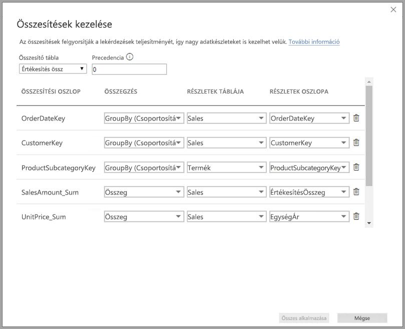

Az alábbi lista az **aggregációk** használatának előnyeit tartalmazza:

* **Lekérdezési teljesítmény big data típusú adatok esetén** – amikor a felhasználók Power BI-jelentések vizualizációival dolgoznak, DAX-lekérdezések lesznek továbbítva az adathalmazhoz. Az adatok gyorsítótárazását az aggregált szinten végezheti, így a részletességi szinten szükséges erőforrásoknak töredékét felhasználva gyorsíthatja fel a lekérdezéseket. Úgy oldhat fel big data jellegű adatokat, ahogy korábban nem volt lehetséges.
* **Adatfrissítés optimalizálása** – az adatok gyorsítótárazása az aggregált szinten történik, így csökkentheti a gyorsítótárak méretét és a frissítések időigényét. Gyorsabban teheti elérhetővé az adatokat a felhasználók számára.
* **Kiegyensúlyozott architektúrák megvalósítása** – engedélyezheti, hogy az aggregált lekérdezések kezelése hatékonyan, a Power BI memóriában tárolt gyorsítótárában történjen. Korlátozhatja az adatforrásokhoz DirectQuery-módban érkező lekérdezéseket, hogy az egyidejűségi korláton belül maradhasson. Azok a lekérdezések, amelyek átjutnak, többnyire szűrt tranzakciószintű lekérdezések, amelyeket az adattárházak és a big data-rendszerek általában könnyen kezelnek.

### Táblaszintű tárolás
A táblaszintű tárolás használata általában az aggregációk funkcióval együtt történik. További információkért tekintse meg a [Tárolási mód a Power BI Desktopban](desktop-storage-mode.md) című cikket.

### Adatforrástípusok
Az aggregációk használata dimenziós modellek adatforrásaival történik, például adattárházakkal, data martokkal, és Hadoop-alapú big data-forrásokkal. Ez a cikk azt ismerteti, hogy miben különbözik az egyes adatforrások modellezése a Power BI-ban.

A Power BI összes Importált forrásán és (nem többdimenziós) DirectQuery-forrásán használhatók aggregációk.

## Kapcsolatokon alapuló aggregációk

A kapcsolatokon alapuló **aggregációk** használata általában dimenziós modellekkel történik. Az adattárházakból vagy data martokból származó Power BI-adatkészletek csillag vagy hópehely sémájúak, és kapcsolatok találhatók a dimenziós és a ténytáblák között.

Tekintsük meg az alábbi modellt, amely egyetlen adatforrásból származik. Tegyük fel, hogy kezdetben a modell minden táblája DirectQueryt használ. A **Sales** (Értékesítések) ténytáblában több milliárd sor található. Ha a **Sales** (Értékesítések) tárolási módját **Importált** lehetőségre állítanánk, akkor a gyorsítótárazás számottevő memóriahasználatot és munkaterhelést eredményezne.

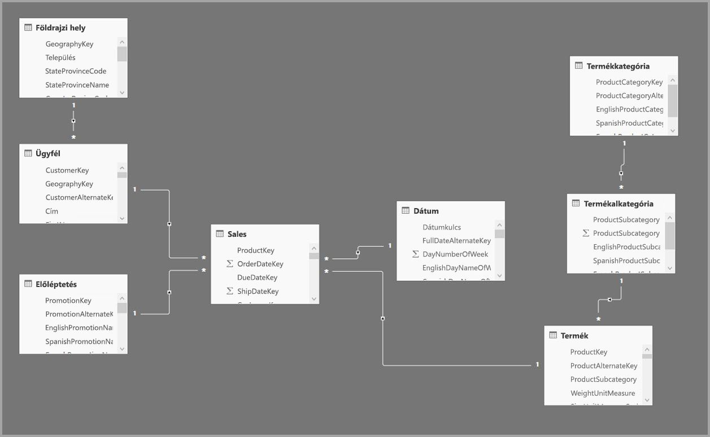

Ehelyett inkább létrehozunk egy **Sales Agg** (Aggr. értékesítések) nevű aggregációs táblát. Ez részletesebb, mint a **Sales** (Értékesítések) tábla, ezért sokkal kevesebb sort fog tartalmazni. A sorok száma meg fog egyezni a **SalesAmount** (Értékesítési összeg) **CustomerKey** (ÜgyfélAzonosító), **DateKey** (DátumAzonosító) és **ProductSubcategoryKey** (TermékAlkategóriaAzonosító) attribútumok szerint csoportosított összegével. A több milliárd sor helyett így csak több millió sor lesz, ami sokkal könnyebben kezelhető.

Tegyük fel, hogy az üzleti értékek szempontjából fontos lekérdezések a következő dimenziós táblákat használják a leggyakrabban. Ezek azok a táblák, amelyek a **Sales Agg** (Aggr. értékesítések) táblát a *one-to-many* (egy-a-többhöz) vagy a *many-to-one* (több-az-egyhez) kapcsolattal tudják szűrni.

* Földrajzi hely
* Ügyfél
* Dátum
* Termékalkategória
* Termékkategória

Az alábbi képen ez a modell látható.

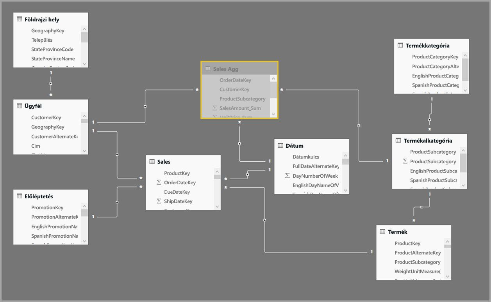

> [!NOTE]
> A **Sales Agg** (Aggr. értékesítések) tábla is egy tábla, ezért ez is rugalmasan, többféle módon tölthető be. Az aggregáció elvégezhető például ETL/ELT-folyamatokkal a forrásadatbázisban, vagy a táblára vonatkozó [M-kifejezéssel](/powerquery-m/power-query-m-function-reference). A tábla használhat Importált tárolási módot a [Power BI Premium növekményes frissítése](service-premium-incremental-refresh.md) lehetőséggel vagy anélkül, vagy akár DirectQueryt is, amely az [oszlopcentrikus indexeket](https://docs.microsoft.com/sql/relational-databases/indexes/columnstore-indexes-overview) használó gyors lekérdezésekre van optimalizálva. Ez a rugalmasság kiegyensúlyozott architektúrákat tesz lehetővé, amelyek a lekérdezési terhelés elosztásával elkerüli a szűk keresztmetszetek kialakulását.

### Tárolási mód 
Folytassuk a példánkkal. A lekérdezések felgyorsításához a **Sales Agg** (Aggr. értékesítések) tárolási módját **Importált** lehetőségre állítottuk.

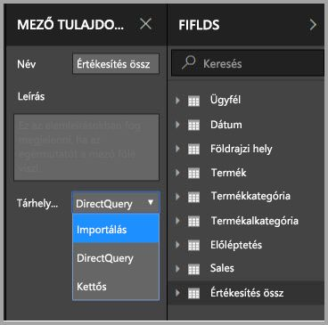

Ekkor megjelenik az alábbi párbeszédablak, amely arról tájékoztat, hogy a kapcsolódó dimenziós táblák beállíthatók **Dual** (Kettős) tárolási módra. 

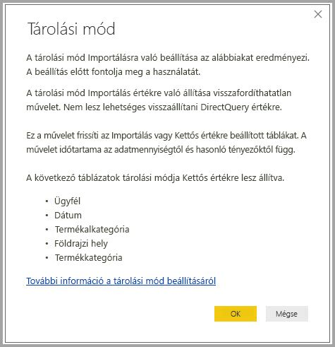

Ha a kapcsolódó dimenziós tábláknak **Dual** (Kettős) a tárolási módjuk, akkor a beágyazott lekérdezésnek megfelelően vagy Importált vagy DirectQuery tárolási módú táblaként működhetnek.

* Azoknak a lekérdezéseknek az eredményei, amelyek az Importált tárolási módú **Sales Agg** (Aggr. értékesítések) táblából aggregálják a metrikákat, illetve a kapcsolódó Dual (Kettős) táblákból származó csoportosítási attribútum(ok) a memóriában tárolt gyorsítótárából adhatók vissza.
* Azoknak a lekérdezéseknek az eredményei, amelyek a DirectQuery tárolási módú **Sales** (Értékesítések) táblából kérdezik le a metrikákat, illetve a kapcsolódó Dual (Kettős) táblákból származó csoportosítási attribútum(ok) DirectQuery módban adhatók vissza. A csoportosítási műveletet tartalmazó lekérdezési logikák le lesznek küldve a forrásadatbázishoz.

A **Dual** (Kettős) tárolási módról további információt a [tárolási mód](desktop-storage-mode.md) cikkében találhat.

### Erős és gyenge kapcsolatok összehasonlítása
A kapcsolatokon alapuló aggregációs találatok erős kapcsolatokat igényelnek.

Erős kapcsolatok többek között az alábbi kombinációk, amennyiben mindkét tábla *egyetlen forrásból* származik.

| Tábla a *több oldalon | Tábla az *egy* oldalon |
| ------------- |----------------------| 
| Kettős          | Kettős                 | 
| Importálás        | Importálás vagy kettős       | 
| DirectQuery   | DirectQuery vagy kettős  | 

A *források közötti* kapcsolatok csak abban az esetben számítanak erősnek, ha mindkét tábla tárolási módja Importált. A több-a-többhöz kapcsolatok mindig gyengének minősülnek.

Az olyan, *források közötti* aggregációs találatokat, amelyek nem függnek kapcsolatoktól, az oszlop szerinti csoportosításon alapuló aggregációról szóló későbbi bekezdés ismerteti.

### Az összesítési táblák nem címezhetők
Az adatkészlethez csak olvasási jogosultsággal rendelkező felhasználók nem kérdezhetik le az aggregációs táblákat. Ezzel elkerülhetők a biztonsági problémák az RLS használatánál. A felhasználók és a lekérdezések nem az aggregációs, hanem a részlettáblára hivatkoznak, így nem is kell tudniuk arról, hogy létezik aggregációs tábla.

Ezért a **Sales Agg** táblának rejtettnek kell lennie. Ha nem rejtett, akkor az Aggregációk kezelése párbeszédpanel rejtettre állítja, amikor az Alkalmaz gombra kattint.

### Az Aggregációk kezelése párbeszédablak
A következő lépésben meghatározzuk az aggregációkat. Kattintson a jobb gombbal a **Sales Agg** (Aggr. értékesítések) táblára, majd válassza ki a helyi menüjéből az **Aggregációk kezelése** lehetőséget.

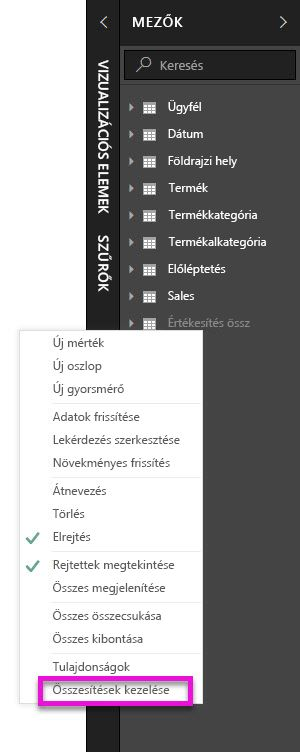

Ekkor megjelenik az **Aggregációk kezelése** párbeszédablak. A **Sales Agg** (Aggr. értékesítések) tábla minden egyes sorához megjelenít egy sort, amelyben megadhatjuk az aggregáció működését. A Power BI-adatkészlethez beküldött olyan lekérdezések, amelyek a **Sales** (Értékesítések) táblára irányulnak, automatikusan a **Sales Agg** (Aggr. értékesítések) táblára lesznek átirányítva. Az adatkészlet felhasználóinak nem is kell tudniuk arról, hogy létezik a **Sales Agg** (Aggr. értékesítések) tábla.

Az alábbi táblázat a **Sales Agg** (Aggr. értékesítések) tábla aggregációit jeleníti meg.

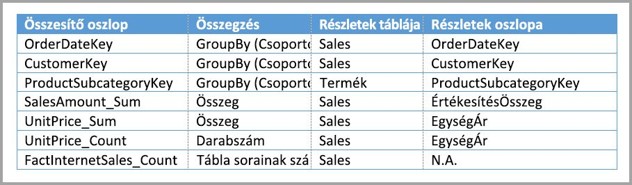

#### Összegzési funkció

Az Összegzés legördülő menüjéből a következő értékek választhatók ki.
* Darabszám
* GroupBy (Csoportosítási szempont)
* Max.
* Min.
* Összeg
* Tábla sorainak száma

#### Ellenőrzések

A párbeszédablak a következő jelentősebb ellenőrzéseket kényszeríti ki:

* A kiválasztott részletoszlop adattípusának meg kell egyeznie az aggregációs oszlopéval, a Darabszám és a Tábla sorainak száma összegzési függvények kivéve. A Darabszám és a Tábla sorainak száma függvényeket csak egész szám típusú oszlopok esetén kínálja fel a rendszer, és nem kell megadni hozzájuk megfelelő adattípust.
* Három vagy több táblát lefedő láncolt aggregációk nem engedélyezettek. Nem lehetséges például beállítani egy olyan aggregációt az **A táblára**, amely a **B táblára** hivatkozik, ha ebben a táblában találhatók **C táblára** hivatkozó aggregációk.
* Nem engedélyezettek duplikált aggregációk, amelyek ugyanazt az összegzési funkciót használják, és ugyanarra a részlettáblára vagy részletoszlopra hivatkoznak.
* A részlettábla tárolási módja csak DirectQuery lehet, Importált nem.

A legtöbb ilyen ellenőrzés kikényszerítése a legördülő menü elemeinek letiltásával és egy magyarázó elemleírás megjelenítésével történik, ahogyan a következő ábra mutatja.

### Csoportosítás oszlopok szerint

Ebben a példában nem kötelező a három GroupBy (Csoportosítási szempont) bejegyzés, ugyanis az aggregációs működésre nincsenek hatással (kivéve a DISTINCTCOUNT (Eltérő értékek száma) példalekérdezésben, amely a következő képen látható). Ezek elsősorban a könnyebb olvashatóságot szolgálják. Az aggregációk a kapcsolatok alapján ezek nélkül a GroupBy (Csoportosítási szempont) bejegyzések nélkül is adnának vissza találatokat. Ez egy másfajta működés, mint a kapcsolatok nélküli aggregációk esetén, amelyet a cikk egy későbbi, a big data-példával foglalkozó része ismertet.

### Inaktív kapcsolatok
Nem támogatott az inaktív kapcsolat által használt külsőkulcs-oszlop szerinti csoportosítás és a USERELATIONSHIP függvényre való támaszkodás az aggregációnál.

### Annak észlelése, hogy a lekérdezések az aggregációkból adnak-e vissza találatot vagy nem

További információkat arról, hogyan észlelheti, hogy a lekérdezések a memóriában tárolt gyorsítótárból (tárolási motorból) vagy a DirectQueryből (az adatforrásba történő küldéssel) SQL Profiler használatával adnak-e vissza eredményt, a [tárolási mód](desktop-storage-mode.md) cikkében találhat. Ezzel a folyamattal az is észlelhető, hogy a lekérdezések az aggregációkból adnak-e vissza találatokat.

A következő bővített esemény SQL Profilerben van megadva.

    Query Processing\Aggregate Table Rewrite Query

A következő JSON-részlet egy olyan esemény kimenetére mutat példát, amely egy aggregációt használt.

* A **matchingResults** (egyezőTalálatok) azt mutatja, hogy a beágyazott lekérdezés egy aggregációt használt.
* A **dataRequest** (adatIgénylés) azt mutatja, hogy a beágyazott lekérdezés mely csoportosítási és aggregációs oszlopokat használta.
* A **mapping** (leképezés) az aggregációs tábla hozzárendelt oszlopait mutatja.

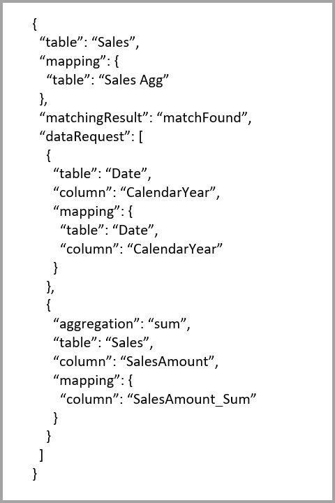

### Példák lekérdezésekre
A következő lekérdezés az aggregációból ad vissza találatot, mert a *Data* (Dátum) tábla részletessége ezt lehetővé teszi. A **SalesAmount** (Értékesítési összeg) **Sum** (Összeg) aggregációját fogjuk használni.

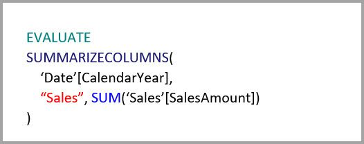

A következő lekérdezés nem az aggregációból ad vissza találatot. Bár a **SalesAmount** (Értékesítési összeg) összegét kéri le, végrehajt egy csoportosítási műveletet is a **Product** (Termék) tábla egy oszlopán, amelynek nincs elegendő részletessége ahhoz, hogy a lekérdezés az aggregációból adjon vissza találatot. Ha megfigyeli a modellben található kapcsolatokat, akkor láthatja, hogy egy termék alkategóriája több **Product** (Termék) sorral is rendelkezhet, így a lekérdezés nem tudja eldönteni, hogy mely termékre aggregáljon. Ebben az esetben a lekérdezés visszalép a DirectQueryre, és egy SQL-lekérdezést küld be az adatforrásba.

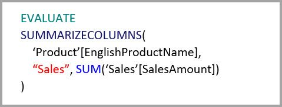

Az aggregációk nem csupán egyszerű összegzések elvégzésére használt alapvető számítások lehetnek. Az összetett számításoknak is megvannak az előnyeik. Elvi síkon nézve egy összetett számítás a SUM (Összeg), MIN (Minimum), MAX (Maximum) és COUNT (Darabszám) funkciók alapján beágyazott lekérdezésekre bontható szét, és mindegyik ilyen lekérdezés esetén kiértékelhető, hogy az aggregációból ad-e vissza találatot. Ez a gondolatmenet a lekérdezésterv optimalizálása miatt nem minden esetben állja meg a helyét, azonban általánosságban alkalmazható. A következő példa az aggregációból ad vissza találatot:

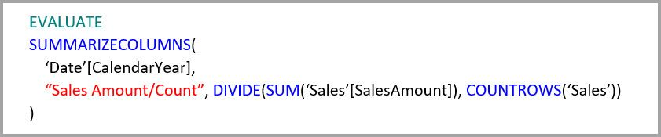

Az aggregációk hasznosak a COUNTROWS (Sorok száma) funkció használata esetén. A következő lekérdezés azért az aggregációból ad vissza találatot, mert meg van határozva a **Sales** (Értékesítések) tábla soraihoz egy **Count** (Darabszám) aggregáció.

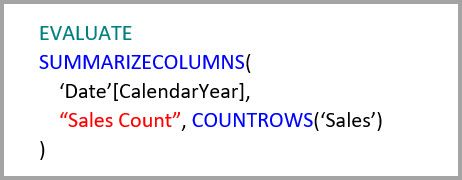

Az aggregációk hasznosak az AVERAGE (Átlag) függvény használata esetén. A következő lekérdezés azért az aggregációból ad vissza találatot, mert az AVERAGE (Átlag) belsőleg egy SUM (Összeg) és egy COUNT (Darabszám) hányadosából áll össze. Mivel a **UnitPrice** (Egységár) oszlop rendelkezik SUM (Összeg) és COUNT (Darabszám) aggregációkkal is, az aggregáció ad vissza találatot.

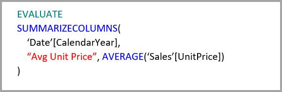

Az aggregációk bizonyos esetekben hasznosak a DISTINCTCOUNT (Eltérő értékek száma) funkció használata esetén. A következő lekérdezés azért az aggregációból ad vissza találatot, mert a **CustomerKey** (ÜgyfélAzonosító) attribútumnak van egy GroupBy (Csoportosítási szempont) bejegyzése, amely fenntartja a **CustomerKey** (ÜgyfélAzonosító) eltérő értékeit az aggregációs táblában. A technika esetén még mindig megtalálható egy teljesítménybeli küszöb, ugyanis körülbelül 2–5 milliónál több eltérő érték negatívan befolyásolhatja a lekérdezés teljesítményét. Hasznos lehet azonban olyan forgatókönyvek esetén, ahol a részlettábla több milliárd sort tartalmaz, az oszlopban pedig 2–5 millió eltérő érték található. Ebben az esetben az eltérő értékek száma függvény gyorsabban hajtható végre, mint a több milliárd sor vizsgálata, még akkor is, ha azok a memória gyorsítótárában találhatók.

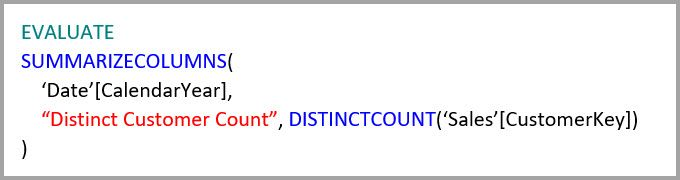

### RLS
A sorszintű biztonsági (RLS) kifejezéseknek a megfelelő működéshez mind az aggregációs táblát, mind a részletező táblát szűrniük kell. A példát követve az RLS-kifejezés működni fog a **Geography** táblán, mert a Geography a kapcsolatok szűrési oldalán van mind a **Sales**, mind a **Sales Agg** táblánál. Azok a lekérdezések, amelyek az aggregációs táblából kérnek le találatokat és azok, amelyek nem, sikeresen alkalmazzák az RLS-t.

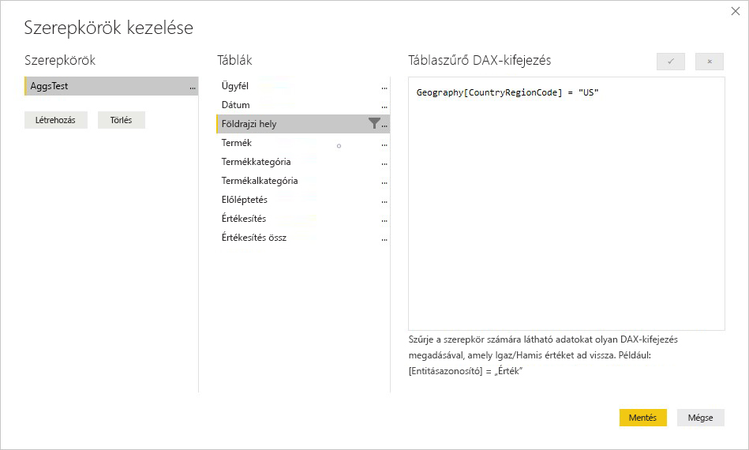

A **Product** táblán egy RLS-kifejezés csak a **Sales** táblát fogja szűrni, de nem szűri a **Sales Agg** táblát. Ez nem ajánlott. Azok a lekérdezések, amelyeket olyan felhasználók küldenek be, akik az adatkészletet ennek a szerepkörnek a használatával érik el, nem fogják tudni kihasználni az aggregációs találatokat. Mivel az aggregációs tábla a részletek tábla adatainak egy újabb reprezentációja, nem lenne biztonságos lekérdezésekre választ adni az aggregációs táblából, mert az RLS-szűrő nem alkalmazható.

Magán a **Sales Agg** táblán futtatott RLS-kifejezés csak az aggregációs táblát szűrné, és nem a részletek táblát. Ez nem engedélyezett.

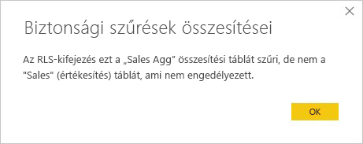

## Oszlopok szerinti csoportosításon alapuló aggregációk 

A Hadoop-alapú big data-modellek a dimenziós modellektől eltérő tulajdonságokkal rendelkeznek. Hogy elkerülhető legyen a nagy méretű táblák összekapcsolása, ezek legtöbbször nem függenek a kapcsolatok használatától. Helyette a dimenziós attribútumokat gyakran ténytáblákká denormalizálják. Az ilyen big data-modelleket oszlopok szerinti csoportosításon alapuló **aggregációkkal** lehet feloldani az interaktív elemzésekhez.

Az alábbi tábla tartalmazza az aggregálandó **Movement** (Mozgás) numerikus oszlopot. Minden más oszlop attribútumokat tartalmaz, amelyek csoportosítás alapját képezhetik. IoT-adatokat és nagy mennyiségű sort tartalmaz. A tárolási mód DirectQuery. A hatalmas mennyiség miatt lassúak lesznek az adatforrásra irányuló olyan lekérdezések, amelyek az egész adatkészletben végeznek aggregációt.

Ahhoz, hogy lehetővé tegyük ennek az adatkészletnek az interaktív elemzését, felveszünk egy aggregációs táblát, amely csoportosítást végez a legtöbb attribútum szerint, azonban kizárja a nagy számosságú földrajzi hosszúság és szélesség attribútumokat. Ez nagymértékben lecsökkenti a sorok számát, és elég kis méretű ahhoz, hogy kényelmesen elférjen a memóriában tárolt gyorsítótárban. A **Driver Activity Agg** (Aggr. sofőrtevékenység) tábla Importált tárolási módú.

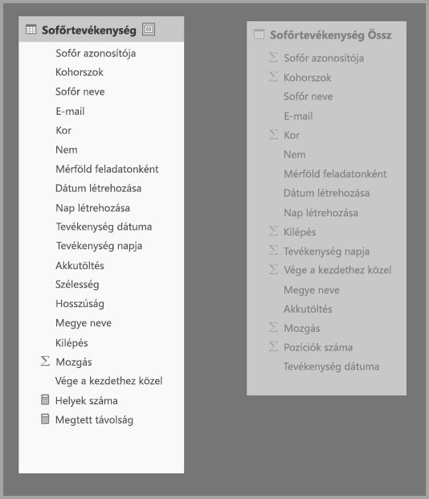

Ezután meghatározzuk az aggregációleképezéseket az **Aggregációk kezelése** párbeszédablakban. Ez a **Driver Activity Agg** (Aggr. sofőrtevékenység) minden oszlopához megjelenít egy sort, amelyben megadható az aggregáció működése.

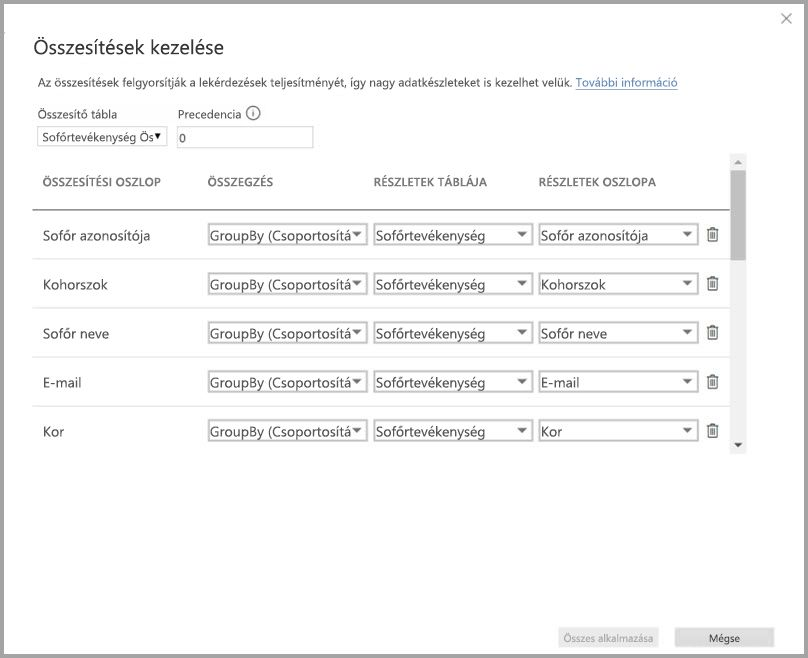

Az alábbi táblázat a **Driver Activity Agg** (Aggr. sofőrtevékenység) tábla aggregációit jeleníti meg.

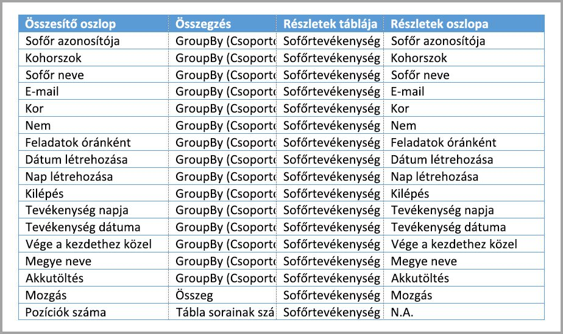

### Csoportosítás oszlopok szerint

Ebben a példában **kötelezőek** a **GroupBy** (Csoportosítási szempont) bejegyzések, ugyanis ezek nélkül nem az aggregációk adnának találatokat. Ez a működés eltér a kapcsolatokon alapuló aggregációk használatától, ezt már a cikk egy korábbi szakaszában ismertettük egy dimenziós modell példájával.

### Példák lekérdezésekre

A következő lekérdezés azért az aggregációból ad vissza találatot, mert az **Activity Date** (Tevékenység dátuma) oszlopot lefedi az aggregációs tábla. A Tábla sorainak száma aggregációt a COUNTROWS (Sorok száma) funkció használja.

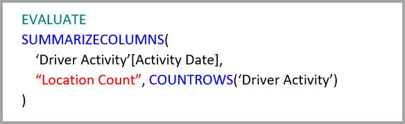

Érdemes a Tábla sorainak száma aggregációkat használni, különösképpen az olyan modellek esetén, amelyek a ténytáblában szűrő attribútumokat tartalmaznak. Előfordulhat, hogy a Power BI még akkor is a COUNTROWS (Sorok száma) funkció használatával küld lekérdezéseket az adatkészlethez, ha a felhasználó ezt nem igényelte explicit módon. A szűrő párbeszédablak például a sorok számát mutatja minden érték esetén.

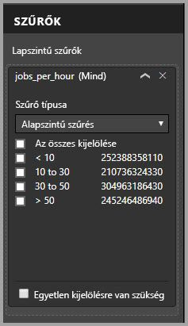

### RLS

Az aggregációkhoz használható fent bemutatott, kapcsolatokon alapuló RLS-szabályok az oszlopok szerinti csoportosításon alapuló aggregációkra is alkalmazhatóak függetlenül attól, hogy az RLS-kifejezés az aggregációs táblát, a részletező táblát vagy mindkettőt szűri-e. A példában a **Driver Activity** táblára alkalmazott RLS-kifjezés használható a **Driver Activity Agg** tábla szűrésére is, mert az aggregációs táblában az összes oszloponkénti csoportosítást lefedi a részletező tábla. A **Driver Activity Agg** táblára alkalmazott RLS-szűrő azonban nem alkalmazható a **Driver Activity** táblára, ezért ez nem engedélyezett.

## Aggregációk prioritása

Az aggregációk prioritásának köszönhetően egyetlen beágyazott lekérdezés több aggregációs táblát is figyelembe vehet.

Tekintse meg a következő példát. Ez egy több DirectQuery-forrást is tartalmazó [összetett modell](desktop-composite-models.md).

* A **Driver Activity Agg2** (Aggr. sofőrtevékenység2) Importált tábla magas részletességre van állítva, mert a csoportosítási szempont alapját képező attribútumokból kevés van, és kicsi a számosságuk is. A sorok száma mindössze néhány ezer, így könnyedén elfér a memóriában tárolt gyorsítótárban. Ezeket az attribútumokat történetesen egy, a figyelem központjában álló vezetői irányítópult használja, így a rájuk irányuló lekérdezéseknek a lehető leggyorsabbnak kell lenniük.
* A **Driver Activity Agg** (Aggr. sofőrtevékenység) tábla egy DirectQuery módú köztes aggregációs tábla. Több milliárd sort tartalmaz az Azure SQL Data Warehouse-ban, és az oszlopcentrikus indexek használatával a forrásban van optimalizálva.
* A **Driver Activity** (Sofőrtevékenység) tábla DirectQuery módú, és több billiárd sornyi IoT-adatot tartalmaz, amelyek forrása egy big data-rendszer. Részletezési lekérdezéseket szolgált ki, hogy az IoT-adatok egy kezelhető és szűrt környezetben legyenek megtekinthetők.

> [!NOTE]
> Azok a DirectQuery-aggregációs táblák, amelyek a részletező táblától eltérő adatforrást használnak, csak akkor vannak támogatva, ha az aggregációs tábla forrása egy SQL Server-, egy Azure SQL- vagy Azure SQL DW-forrás.

Ez a modell viszonylag kicsi memóriaigényű, mégis egy hatalmas adatkészletet old fel. Ez egy kiegyensúlyozott architektúrát képvisel, mert az architektúra egyes komponenseinek erősségét kihasználva osztja szét a lekérdezési terhelést.

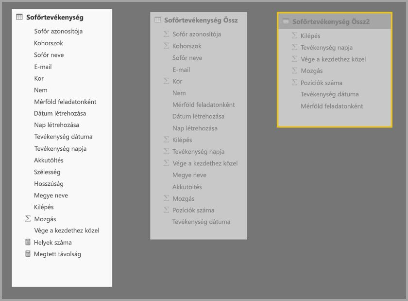

A **Driver Activity Agg2** (Aggr. sofőrtevékenység2) tábla **Aggregációk kezelése** párbeszédablakán látható a 10-es értékű *Prioritás* mező, amely magasabb a **Driver Activity Agg** (Aggr. sofőrtevékenység) prioritásánál, ami azt jelenti, hogy az aggregációkat használó lekérdezések előbb veszik figyelembe. Azok a beágyazott lekérdezések, amelyek nem rendelkeznek olyan részletességgel, hogy a **Driver Activity Agg2** (Aggr. sofőrtevékenység2) táblából kaphassanak választ, a **Driver Activity Agg** (Aggr. sofőrtevékenység) táblát fogják figyelembe venni. Azok a részletlekérdezések, amelyek egyik aggregációs táblából sem kaphatnak választ, a **Driver Activity** (Sofőrtevékenység) táblához lesznek irányítva.

A **Részlettáblán** megadott oszlop azért a **Driver Activity** (Sofőrtevékenység), nem pedig a **Driver Activity Agg** (Agg. sofőrtevékenységek), mert a láncolt aggregációk nem engedélyezettek (lásd az [ellenőrzéseket](#validations) a cikk korábbi szakaszában).

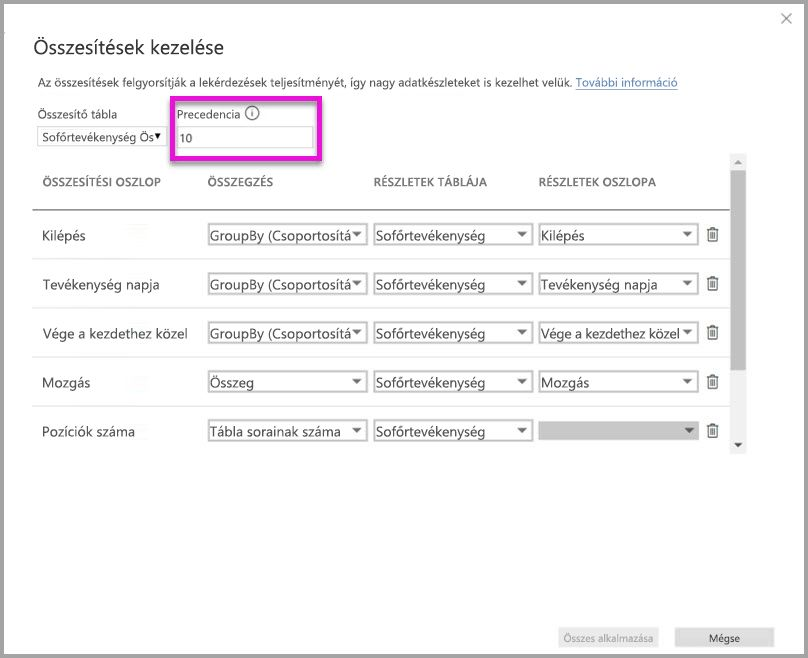

Az alábbi táblázat a **Driver Activity Agg2** (Aggr. sofőrtevékenység2) tábla aggregációit jeleníti meg.

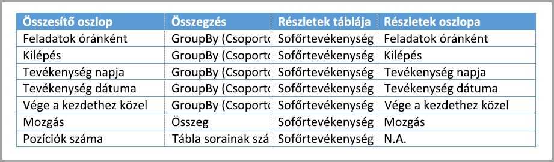

## Oszlopok szerinti csoportosításon alapuló aggregációk kapcsolatokkal

A cikk korábbi szakaszaiban ismertetett két aggregációs technikát kombinálni is lehet. A kapcsolatokon alapuló **aggregációk** esetén előfordulhat, hogy a denormalizált dimenziós táblákat több táblára kell felosztani. Ha ez bizonyos dimenziós táblák esetén költséges vagy nem praktikus, akkor a szükséges attribútumok egyes dimenziók esetén annak aggregációs táblájában, más dimenziók esetén pedig az általuk használt kapcsolatokban replikálhatók.

A következő modell a *Month* (Hónap), *Quarter* (Negyedév), *Semester* (Félév) és *Year* (Év) dimenziókat replikálja a **Sales Agg** (Agg. értékesítések) táblába. A **Sales Agg** (Aggr. értékesítések) és a **Date** táblák között nincsenek kapcsolatok. A **Customer** (Ügyfél) és a **Product Subcategory** (Termék alkategória) táblák között vannak kapcsolatok. A **Sales Agg** (Aggr. értékesítések) tábla Importált tárolási módú.

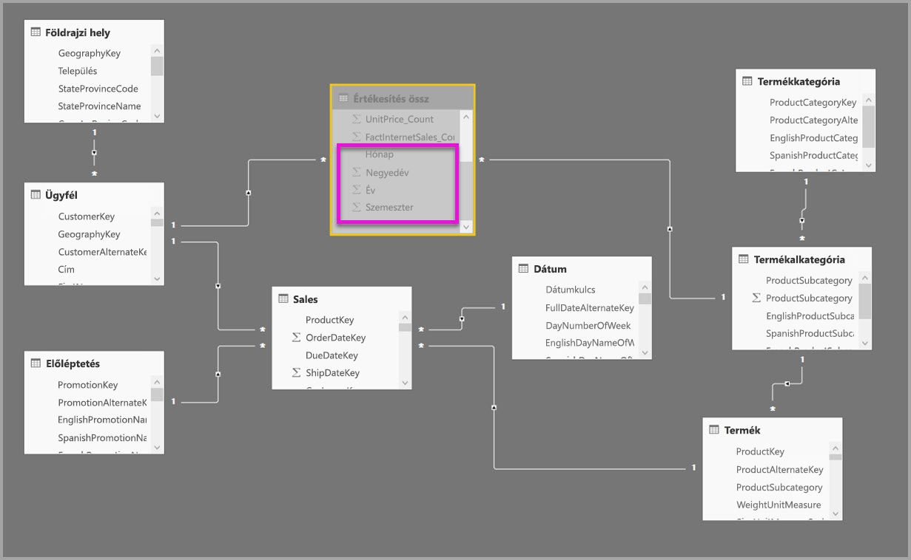

Az alábbi táblázatban a **Sales Agg** (Aggr. értékesítések) tábla **Aggregációk kezelése** párbeszédablaka látható. Ahhoz, hogy a dátum attribútum alapján csoportosító lekérdezések az aggregációból adjanak vissza találatokat, kötelező a **Date** (Dátum) részlettáblára irányuló GroupBy (Csoportosítási szempont) bejegyzések használata. Ahogyan az előző példában is, a CustomerKey (ÜgyfélAzonosító) és a ProductSubkategoryKey (TermékAlkategóriaAzonosító) attribútumokon alapuló GroupBy (Csoportosítási szempont) bejegyzések a kapcsolatok megléte miatt nincsenek hatással arra, hogy a lekérdezés az aggregációból ad-e vissza találatot (szintén a DISTINCTCOUNT (Eltérő értékek száma) kivételével).

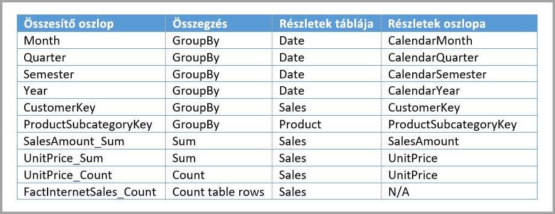

### Példák lekérdezésekre

A következő lekérdezés azért az aggregációból ad vissza találatot, mert a CalendarMonth (NaptáriHónap) attribútumot lefedi az aggregációs tábla, és a CategoryName (KategóriaNév) elérhető one-to-many (egy-a-többhöz) kapcsolatokkal. A **SalesAmount** (Értékesítési összeg) Sum (Összeg) aggregációja van használatban.

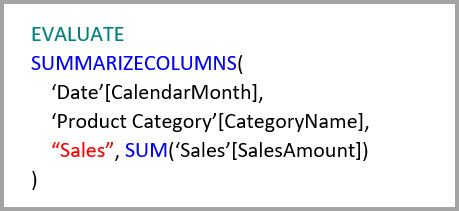

A következő lekérdezés azért nem az aggregációból ad vissza találatot, mert a CalendarDay (NaptáriNap) attribútumot nem fedi le az aggregációs tábla.

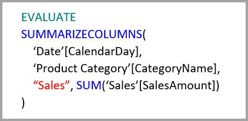

A következő időintelligenciás lekérdezés azért nem az aggregációból ad vissza találatot, mert a DATESYTD függvény egy CalendarDay (NaptáriNap) értékekből álló táblát hoz létre, és ezt nem fedi le az aggregációs tábla.

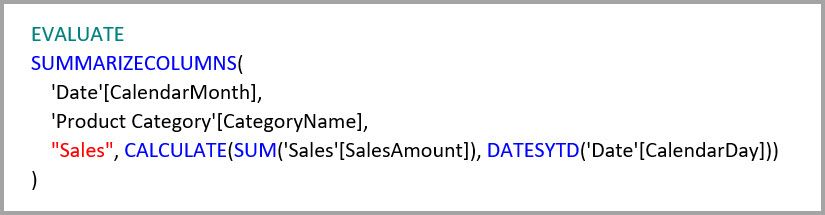

## A gyorsítótárakat szinkronizálva kell tartani

Azok az **aggregációk**, amelyek kombinálják a DirectQuery és az Importált és/vagy a Dual (Kettős) tárolási módot, más adatokat adhatnak vissza, ha a memóriában tárolt gyorsítótár nincs szinkronban a forrásadatokkal. A lekérdezések végrehajtása nem kísérli meg elfedni az adatokkal kapcsolatos problémákat például azzal, hogy a DirectQuery-eredményeket a gyorsítótárazott értékekkel való egyezés alapján szűri. Ezek teljesítményoptimalizáló funkciók, amelyeket csak abban az esetben érdemes használni, ha nincsenek negatív hatással az üzleti követelmények teljesítésére. Önnek kell ismernie a saját adatfolyamait, ezért kérjük, azok alapján tervezzen. Léteznek bevált módszerek az ilyen problémáknak a forrásnál való kezelésére, ha szükséges.

## Következő lépések

Az alábbi cikkek bővebben ismertetik az összetett modelleket, és a DirectQuery részletes leírását is tartalmazzák.

* [Összetett modellek a Power BI Desktopban](desktop-composite-models.md)
* [Több a többhöz kapcsolatok a Power BI Desktopban](desktop-many-to-many-relationships.md)
* [Tárolási mód a Power BI Desktopban](desktop-storage-mode.md)

A DirectQuery-vel kapcsolatos cikkek:

* [DirectQuery használata a Power BI-ban](desktop-directquery-about.md)
* [A DirectQuery által támogatott adatforrások a Power BI-ban](desktop-directquery-data-sources.md)