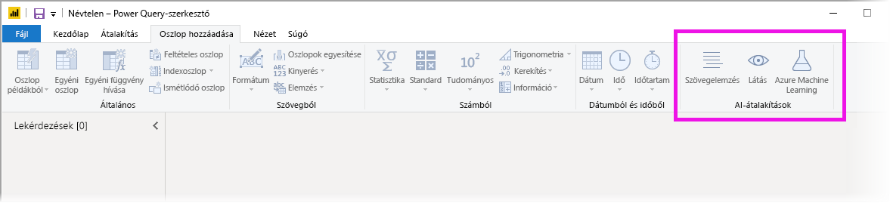
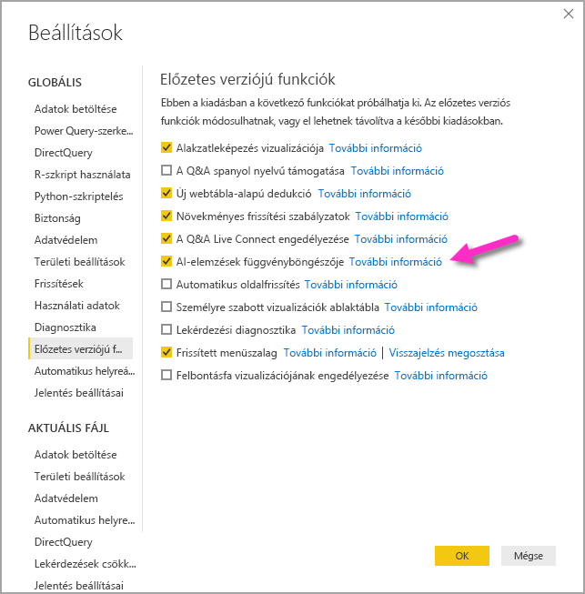
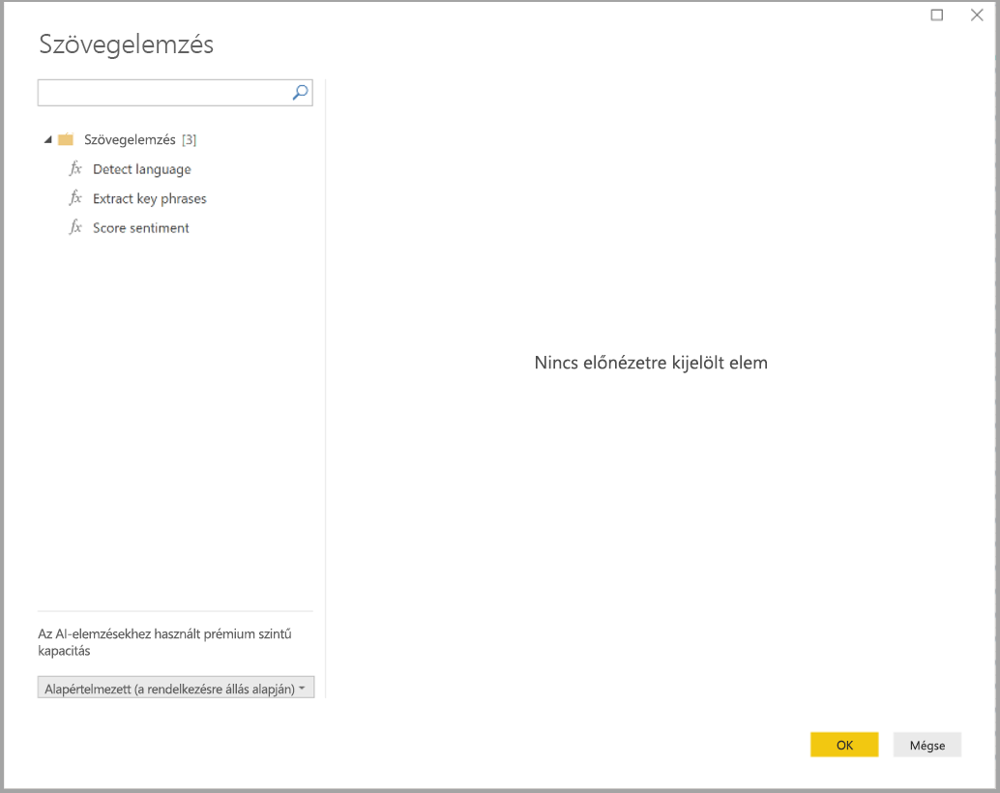
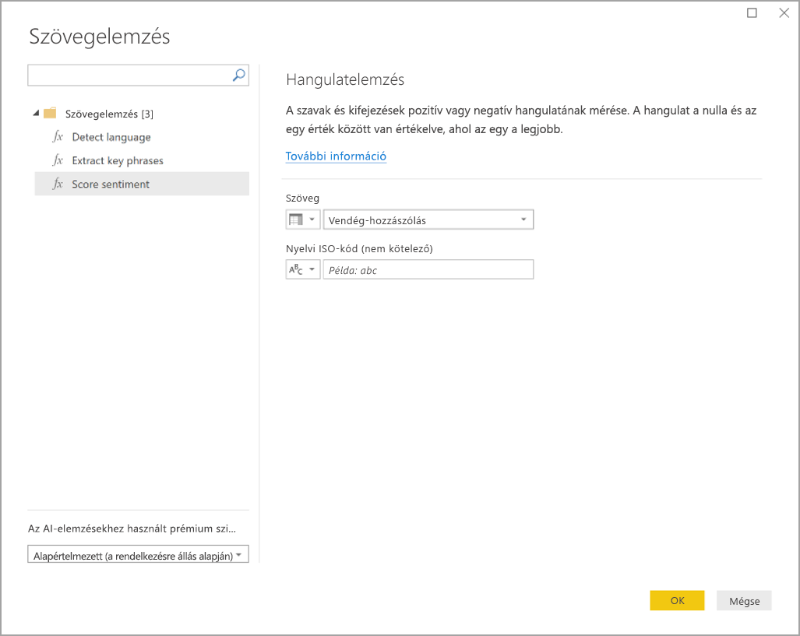
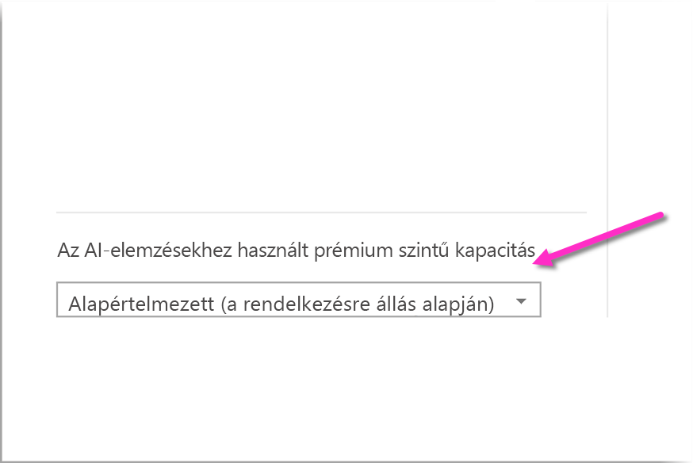
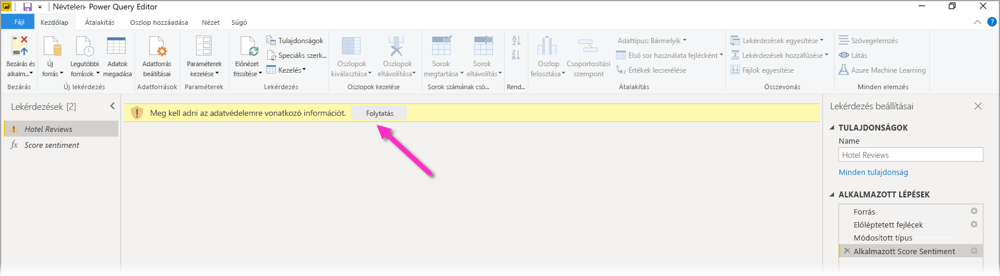
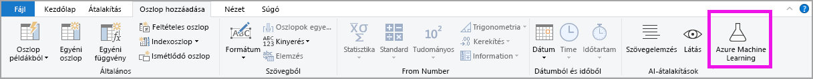
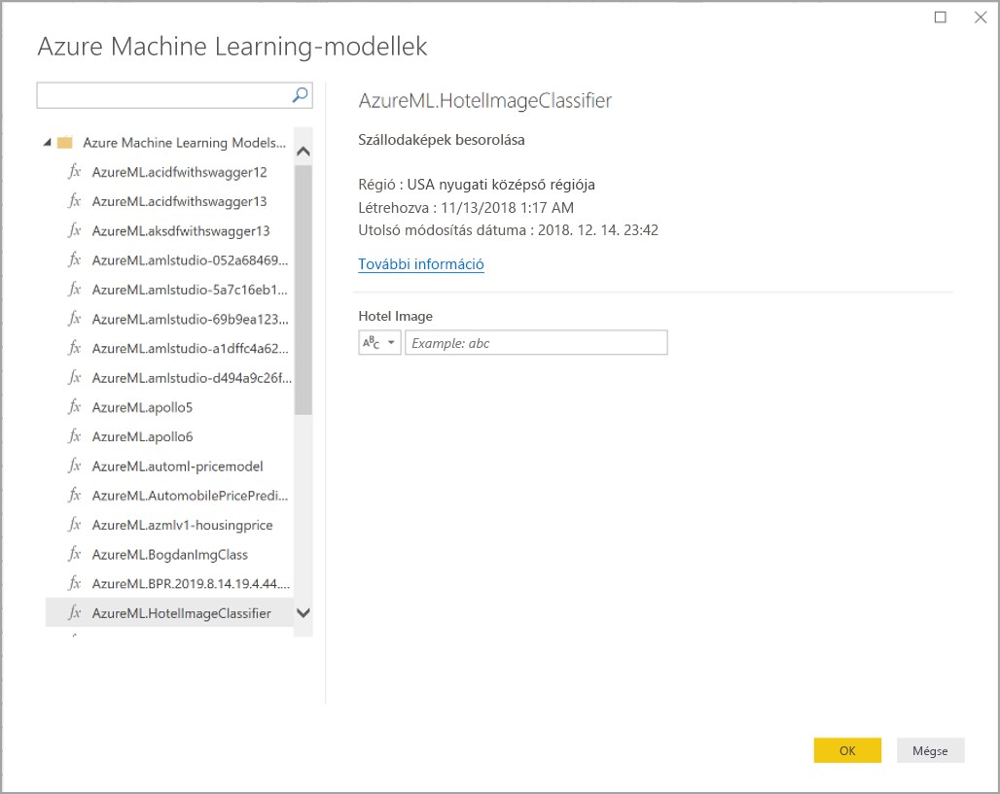

# AI-elemzések használata a Power BI Desktopban (előzetes verzió)

A Power BI-ban AI-elemzések használatával előre betanított gépi tanulási modellek gyűjteményéhez férhet hozzá, amelyek segítik az adatok előkészítését. Az AI-elemzések a **Power Query-szerkesztőben** érhetők el, a hozzájuk tartozó szolgáltatások és funkciók pedig a **Power Query-szerkesztő** **Kezdőlap** és **Oszlop hozzáadása** lapján. 

Ez a cikk az Azure Cognitive Services Text Analytics és Vision szolgáltatásához tartozó funkciókat ismerteti. A cikk egy szakasza azokat az egyéni Azure Machine Learning-funkciókat is ismerteti, amelyek a Power BI-ban elérhetők.

## Az AI-elemzések engedélyezése

A Power BI-beli AI-elemzés előzetes funkció, amelyet engedélyezni kell. Az engedélyezéshez válassza a **Fájl > Lehetőségek és beállítások > Lehetőségek** menüpontot, majd a bal oldali oszlop **Előzetes funkciók** elemét. A jobb oldali panelen található egy **AI-elemzések szolgáltatástallózója** jelölőnégyzet. Az előzetes funkció engedélyezéséhez jelölje be az **AI-elemzések szolgáltatástallózója** melletti jelölőnégyzetet. Ahhoz, hogy az előzetes funkció módosítása érvénybe lépjen, újra kell indítania a Power BI Desktopot.

## A Text Analytics és a Vision használata

A Power BI-beli Text Analytics és Vision segítségével az [Azure Cognitive Services](https://azure.microsoft.com/services/cognitive-services/) különböző algoritmusait használhatja fel az adatok gazdagítására a Power Queryben.

A jelenleg támogatott szolgáltatások a következők:

* [Hangulatelemzés](https://docs.microsoft.com/azure/cognitive-services/text-analytics/how-tos/text-analytics-how-to-sentiment-analysis)
* [Kulcsszókeresés](https://docs.microsoft.com/azure/cognitive-services/text-analytics/how-tos/text-analytics-how-to-keyword-extraction)
* [Nyelvfelismerés](https://docs.microsoft.com/azure/cognitive-services/text-analytics/how-tos/text-analytics-how-to-language-detection)
* [Képcímkézés](https://docs.microsoft.com/azure/cognitive-services/computer-vision/concept-tagging-images). 

Az átalakítások a Power BI szolgáltatásban vannak végrehajtva, és nem igényelnek Azure Cognitive Services-előfizetést. 

> [!IMPORTANT]
> 
> A Text Analytics és a Vision szolgáltatás használatához Power BI Premium szükséges.

### A Text Analytics és a Vision engedélyezése Prémium szintű kapacitásokban

A Cognitive Services prémium szintű kapacitásbeli EM2, A2 vagy P1 és magasabb csomópontokhoz támogatott. A kapacitáson külön AI-számítási feladat szolgál a Cognitive Services-szolgáltatások futtatására. Ezen szolgáltatások nyilvános előzetes verziójának időtartama alatt (2019. június előtt) ez a számítási feladat alapértelmezés szerint le volt tiltva. Ahhoz, hogy a Cognitive Services használható legyen a Power BI-ban, a mesterségesintelligencia-számítási feladatot engedélyezni kell a felügyeleti portál **kapacitásbeállításai** között. Az **AI-számítási** feladat a **Számítási feladatok** szakaszban kapcsolható be, és itt adható meg a számítási feladat által maximálisan felhasználható memória mennyisége. A javasolt memóriakorlát 20%. Ennek a korlátnak a túllépése lelassítja a lekérdezést.

### Elérhető funkciók

Ez a szakasz a Power BI-beli Cognitive Servicesben elérhető funkciókat ismerteti.

#### Nyelvfelismerés

A nyelvfelismerő függvény szöveges bemenetet értékel ki, és minden mezőhöz a nyelv megnevezését és ISO-azonosítóját adja vissza. Ez a függvény a tetszőleges szövegeket gyűjtő adatoszlopoknál hasznos, ahol a nyelv nem ismert. A függvény szöveges formátumú adatokat vár bemenetként.

A Text Analytics akár 120 nyelvet is felismer. További információt a [támogatott nyelvek](https://docs.microsoft.com/azure/cognitive-services/text-analytics/text-analytics-supported-languages) ismertetésében talál.

#### Kulcsszókeresés

A **kulcsszókeresési** funkció strukturálatlan szöveget elemez, és minden szövegmezőhöz kulcsszavak listáját adja vissza. A függvény szövegmezőt vár el bemeneteként, és nem kötelező bemenetként elfogadja a **Kulturális környezet** megadását.

A kulcsszókeresés akkor a leghatékonyabb, ha nagyobb összefüggő szövegeken dolgozhat. Ez éppen fordítva van a hangulatelemzésnél, amely kisebb szövegblokkokkal működik hatékonyabban. Annak érdekében, hogy mindkét művelet a legjobb eredményt hozza, érdemes lehet ennek megfelelően átszervezni a bemeneteket.

#### Hangulatelemzés

A **hangulatértékelő** függvény szöveges bemenetet értékel ki, és minden dokumentumhoz egy 0 (negatív) és 1 (pozitív) közötti hangulat-pontszámot ad vissza. Ez a függvény a közösségi médiában, ügyfelek véleményében és vitafórumokon megnyilvánuló pozitív és a negatív érzelmek észleléséhez hasznos.

A Text Analytics gépi tanulási besorolási algoritmus használatával generál egy 0 és 1 közötti hangulat-pontszámot. Az 1-hez közelebbi pontszám pozitív, a 0-hoz közelebbi pontszám negatív érzelmeket jelez. A modell érzelmeket kifejező szövegek bőséges gyűjteményével van előre betanítva. Saját betanítási adatokat jelenleg nem lehet megadni. A modell több technika kombinációját használja a szövegelemzés során, köztük szövegfeldolgozást, szövegrész-elemzést, szóhelyzeteket és szótársításokat. Az algoritmusról [A Text Analytics bemutatása](https://blogs.technet.microsoft.com/machinelearning/2015/04/08/introducing-text-analytics-in-the-azure-ml-marketplace/) című cikkben talál további információt.

A hangulatelemzés a teljes bemeneti mezőn van végrehajtva, szemben a szöveg egy adott entitása érzelmeinek kinyerésével. A gyakorlatban az értékelés pontossága általában javul, ha a dokumentumok nem nagy szövegblokkokat, hanem egy-két mondatot tartalmaznak. Az objektivitásfelmérési szakaszban a modell azt határozza meg, hogy a bemeneti mező egésze objektív, vagy érzelmet fejez ki. Az inkább objektív bemeneti mezők nem haladnak tovább a hangulatelemzési fázisba, hanem további feldolgozás nélkül 0,5 pontot eredményeznek. A folyamatban továbblépő bemeneti mezőkhöz a következő fázis 0,5 feletti vagy alatti pontszámot generál attól függően, hogy milyen érzelmeket észlel a bemeneti mezőben.

A hangulatelemzés jelenleg az angol, a német, a spanyol és a francia nyelvet támogatja. További nyelvek érhetők el előzetes verzióban. További információt a [támogatott nyelvek](https://docs.microsoft.com/azure/cognitive-services/text-analytics/text-analytics-supported-languages) ismertetésében talál.

#### Képcímkézés

A **Képcímkézés** funkció címkéket ad vissza több mint kétezer felismerhető tárgy, élőlény, táj és tevékenység alapján. Ha a címkék nem egyértelműek vagy nem közismertek, a kimenet a címke jelentését egy ismert környezetben megvilágító *tippeket* ad. A címkék nincsenek rendszerezve, és nincs öröklési hierarchiájuk. Egy kép ember által olvasható nyelven, teljes mondatokban megfogalmazott *leírásának* alapját tartalomcímkék gyűjteménye képezi.

Egy kép feltöltése vagy URL-címének megadása után Computer Vision-algoritmusok adnak meg címkéket a képeken felismert tárgyak, élőlények és tevékenységek alapján. A címkézés nem korlátozódik a fő témára, például az előtérben lévő személyre, hanem a (beltéri vagy kültéri) környezetre, bútorokra, eszközökre, növényekre, állatokra, kellékekre, kisebb tárgyakra és sok másra is kiterjed.

Ez a függvény képre mutató URL-címet vagy Base64-mezőt vár bemeneteként. A képcímkézés jelenleg az angol, a spanyol, a japán, a portugál és az egyszerűsített kínai nyelvet támogatja. További információt a [támogatott nyelvek](https://docs.microsoft.com/rest/api/cognitiveservices/computervision/tagimage/tagimage#uri-parameters) ismertetésében talál.

### Text Analytics- vagy Vision-függvények hívása a Power Queryben

Az adatok Text Analytics- vagy Vision-függvényekkel való gazdagításához nyissa meg a **Power Query-szerkesztőt**. Ez a példa egy szöveg hangulatának elemzésén vezeti végig. Ugyanezek a lépések használhatók a kulcsszavak keresésére, a nyelv észlelésére és a képek címkézésére.

Válassza a **Kezdőlap** vagy az **Oszlop hozzáadása** lap **Szövegelemzés** gombját. A rendszer felszólítja, hogy jelentkezzen be.

Bejelentkezés után válassza ki a használni kívánt funkciót és az átalakítandó adatoszlopot a felugró ablakban.

A Power BI kiválaszt egy prémium szintű kapacitást a funkció futtatásához, és visszaküldi az eredményeket a Power BI Desktopnak. A választott kapacitás csak az alkalmazás és a Power BI Desktopban történő frissítések idejére lesz a Text Analytics és a Vision szolgáltatáshoz használva. A jelentés közzététele után a frissítések már annak a munkaterületnek a prémium szintű kapacitásán futnak, amelyre a jelentést közzétették. A Cognitive Services szolgáltatáshoz használt kapacitás a felugró ablak bal alsó sarkában található legördülő listában módosítható.

A **kulturális környezet** a szöveg nyelvének megadásához választható bemenet. Ez a mező egy ISO-kód. A kulturális környezet bemenetként egy oszlop vagy egy statikus mező is használható. Ebben a példában az angol (en) nyelv van megadva az egész oszlophoz. Ha ezt a mezőt üresen hagyja, a Power BI automatikusan észleli a nyelv a függvény alkalmazása előtt. Ez után válassza az **Alkalmaz** lehetőséget.

Amikor először használ AI-elemzéseket egy új adatforráson, a rendszer felszólítja az adatok adatvédelmi szintjének beállítására.

> [!NOTE]
> Az adathalmaz frissítései a Power BI-ban csak olyan adatforrásokkal működnek, ahol az adatvédelmi szint nyilvánosra vagy vállalatira van beállítva.

A függvény hívása után az eredmény új oszlopként lesz a táblához fűzve. Az átalakítás is be lett szúrva a lekérdezésbe, mint alkalmazott lépés.

A képcímkézés és a kulcsszókeresés esetében az eredmények több értéket is visszaadhatnak. Az egyes eredmények az eredeti sor másolataiban vannak visszaadva.

### Text Analytics- vagy Vision-funkciókat tartalmazó jelentés közzététele

A Power Queryben végzett szerkesztés és a Power BI Desktopban végrehajtott frissítések során a Text Analytics és a Vision a Power Query-szerkesztőben választott prémium szintű kapacitást használja. A jelentés a Power BI-ban történő közzététele után annak a munkaterületnek a prémium szintű kapacitását használja, amelyben közzé lett téve.

Az alkalmazott Text Analytics- és Vision-funkciókat tartalmazó jelentéseket olyan munkaterületen kell közzétenni, amely nem prémium szintű kapacitásban van, különben az adathalmaz frissítése sikertelen lesz.

### Prémium szintű kapacitás terhelésének kezelése

A következő bekezdések a Text Analytics és a Vision kapacitásra gyakorolt hatásának kezelését ismertetik.

#### Kapacitás kiválasztása

A jelentéskészítők kiválaszthatják az a prémium szintű kapacitást, amelyen az AI-elemzések futnak. A Power BI alapértelmezés szerint az elsőként létrehozott kapacitást választja, amelyhez a felhasználó hozzáfér.

#### Figyelés a Kapacitásmetrikák alkalmazással

A prémium szintű kapacitás tulajdonosai figyelni tudják a Text Analytics és a Vision kapacitásra gyakorolt hatásait a [Power BI Premium Kapacitásmetrikák alkalmazással](service-admin-premium-monitor-capacity.md). Az alkalmazás részletes mérőszámokat biztosít a kapacitások AI-számítási feladatainak állapotáról. A felső diagram az AI-számítási feladatok memóriahasználatát ábrázolja. A prémium szintű kapacitás rendszergazdái kapacitásonként korlátozhatják az AI-számítási feladat memóriahasználatát. Ha a memóriahasználat eléri a beállított korlátot, mérlegelni kell a memóriakorlát emelését, vagy egyes munkaterületek áthelyezését más kapacitásba.

### A Power Query és a Power Query Online összehasonlítása

A Power Queryben és a Power Query Onlineban használt Text Analytics- és Vision-funkciók megegyeznek. A két felület csak a következőkben tér el egymástól:

* A Power Queryben külön gomb van a Text Analytics, a Vision és az Azure Machine Learning szolgáltatáshoz. A Power Query Onlineban ezek egyetlen menüben vannak egyesítve.
* A Power Queryben a jelentés készítője kiválaszthatja a funkciók futtatásához használandó prémium szintű kapacitást. Ez a Power Query Onlineban nem szükséges, mivel az adatfolyam már egy meghatározott kapacitásban van.

### A Text Analytics szolgáltatásra vonatkozó szempontok és korlátozások

A Text Analytics használatakor figyelembe kell vennie néhány tényezőt és korlátozást.

* A növekményes frissítés támogatott, de AI-elemzéseket tartalmazó lekérdezésekben használva teljesítményproblémákat okozhat.
* A DirectQuery nem támogatott.

## Az Azure Machine Learning használata

Számos szervezet használja a **Machine Learning** modelljeit hatékonyabb üzleti elemzések és előrejelzések készítéséhez. A modellekből kinyerhető információk (valamint ezek megjelenítése) a jelentésekben, irányítópultokban és egyéb elemzésekben segít az üzleti felhasználóknak értelmezni ezeket az adatokat. A Power BI maguktól értetődő, egérrel végezhető műveletekkel egyszerűen beépíthetővé teszi az Azure Machine Learning szolgáltatásban üzemeltetett modellek elemzéseit.

A funkció használatához egy adattudós egyszerűen hozzáférést biztosíthat az Azure ML-modellhez egy BI-elemzőnek az Azure Portalon. Innentől kezdve a Power Query minden munkamenet elején felismeri azokat az Azure ML-modelleket, amelyekhez a felhasználó hozzáfér, és dinamikus Power Query-függvényként jeleníti meg őket. A felhasználó ezután meghívhatja ezeket a függvényeket a Power Query-szerkesztő menüszalagjáról vagy közvetlenül az M-függvénnyel. A Power BI a jobb teljesítmény érdekében automatikusan kötegeli a hozzáférési kéréseket, amikor meghívja az Azure ML-modellt egy sorkészlethez.

Ez a funkció a Power BI Desktopban és a Power BI-adatfolyamokban, valamint a Power BI szolgáltatás Power Query Online felületén működik.

További információ az adatfolyamokról: [Önkiszolgáló adat-előkészítés a Power BI-ban](service-dataflows-overview.md).

A Azure Machine Learning szolgáltatásról az alábbi cikkekben talál további információt:

- Áttekintés: [Mi az Azure Machine Learning?](https://docs.microsoft.com/azure/machine-learning/service/overview-what-is-azure-ml)
- Rövid útmutatók és oktatóanyagok az Azure Machine Learning szolgáltatáshoz: [Azure Machine Learning-dokumentáció](https://docs.microsoft.com/azure/machine-learning/)

### Hozzáférés megadása egy Azure Machine Learning-modellhez

Egy Azure ML-modell a Power BI-ból való eléréséhez a felhasználónak **olvasási** hozzáféréssel kell rendelkeznie az Azure-előfizetésben. Ezen felül rendelkezniük kell a következőkkel:

- Machine Learning Studio (klasszikus) modellek esetén **Olvasó** hozzáférés a Machine Learning Studio (klasszikus) webszolgáltatáshoz
- Machine Learning-modellek esetén **Olvasó** hozzáférés a Machine Learning-munkaterülethez

Az ebben a szakaszban leírt lépések azt ismertetik, hogyan adhat hozzáférést egy Power BI-felhasználónak egy Azure Machine Learning Service-modellhez, hogy azt Power Query-függvényként használhassa. További részletekért tekintse meg a [Hozzáférés-kezelés az RBAC és az Azure Portal segítségével](https://docs.microsoft.com/azure/role-based-access-control/role-assignments-portal) című témakört.

1. Jelentkezzen be az [Azure Portalra](https://portal.azure.com/).
2. Lépjen az **Előfizetések** oldalra. Az **Előfizetések** oldalt az Azure Portal bal oldali navigációs menüjének **Minden szolgáltatás** listájában találhatja.
3. Az előfizetés kiválasztása
4. Válassza a **Hozzáférés-vezérlés (IAM)** , majd a **Hozzáadás** lehetőséget.
5. Szerepkörként válassza az **Olvasó** lehetőséget. Válassza ki azt a Power BI-felhasználót, akinek hozzáférést szeretne adni az Azure ML-modellhez.
6. Válassza a **Mentés** lehetőséget.
7. Ismételje meg a 3–6. lépést, így **Olvasó** hozzáférést adhat a felhasználónak az adott Machine Learning Studio (klasszikus) webszolgáltatáshoz *vagy* a modellt tartalmazó Machine Learning-munkaterülethez.

### Machine Learning-modellek sémafeltárása

Az adattudósok elsősorban Pythont használnak a Machine Learning gépi tanulási modelljeinek fejlesztéséhez és üzembe helyezéséhez. A (klasszikus) Machine Learning Studióval ellentétben (amely automatizálja a modell sémafájljainak létrehozását) a Machine Learning esetében az adattudósnak explicit módon kell generálnia a sémafájlt a Pythonnal.

Ezt a sémafájlt bele kell foglalni a Machine Learning-modellekhez üzembe helyezett webszolgáltatásba. Ahhoz, hogy a séma automatikusan generálva legyen a webszolgáltatásban, meg kell adnia a bemenet/kimenet mintáját az üzembe helyezett modell belépési szkriptjében. Olvassa el a [Modellek üzembe helyezése az Azure Machine Learning szolgáltatással című dokumentáció (választható) Automatikus Swagger-séma létrehozása](https://docs.microsoft.com/azure/machine-learning/how-to-deploy-and-where#optional-define-model-web-service-schema) című fejezetét. A hivatkozás egy példát is tartalmaz a belépési szkriptre a sémageneráló utasításokkal.

A belépési szkript _@input\_schema_ és _@output\_schema_ függvénye az _input\_sample_ és az _output\_sample_ változóban hivatkozik a bemeneti és kimeneti mintaformátumokra, és ezeket a mintákat használja a webszolgáltatás egy OpenAPI- (Swagger-) specifikációjának generálására az üzembe helyezés során.

A belépési szkript módosításakor ezeket a sémagenerálási utasításokat kell alkalmazni az Azure Machine Learning SDK-val végzett automatizált gépi tanulási kísérletek használatával létrehozott modellekre is.

> [!NOTE]
> Az Azure Machine Learning vizuális interfészének használatával létrehozott modellek jelenleg nem támogatják a sémagenerálást, de a későbbi kiadásokban már fogják.
> 
### Azure Machine Learning-modell meghívása a Power Queryben

A Power Query-szerkesztőben közvetlenül meghívhat minden olyan Azure ML-modellt, amelyhez hozzáféréssel rendelkezik. Az Azure Machine Learning-modellekhez való hozzáféréshez válassza a Power Query-szerkesztő **Kezdőlap** vagy **Oszlop hozzáadása** lapjának **Azure Machine Learning** gombját.

Itt Power Query-függvényként láthat minden olyan Azure ML-modellt, amelyhez hozzáférhet. Az Azure ML-modell bemeneti paraméterei automatikusan le vannak képezve a megfelelő Power Query-függvény paramétereiként.

Az Azure ML-modell meghívásához bemenetként a kijelölt entitás bármelyik oszlopát megadhatja. Emellett megadhat egy állandó értéket is, amelyet bemenetként használhat. Ehhez a bemeneti párbeszédpanelen be kell kapcsolnia az oszlop ikont.

Az **OK** lehetőséggel megtekintheti az Azure ML-modell kimenetét új oszlopként az entitástáblában. Láthatja, hogy a modell meghívása a lekérdezés lépéseként is megjelenik.

Ha a modell több kimeneti paramétert eredményez, azok egy rekordként lesznek csoportosítva a kimeneti oszlopban. Az oszlop kibontásával több egyéni kimeneti paramétert kaphat különálló oszlopokban.

### Az Azure Machine Learningre vonatkozó szempontok és korlátozások

A Power BI Desktopban használt Azure Machine Learningre a következő szempontok és korlátozások érvényesek.

* Az Azure Machine Learning vizuális interfészének használatával létrehozott modellek jelenleg nem támogatják a sémagenerálást. Ennek támogatása a későbbi kiadásokban várható.
* A növekményes frissítés támogatott, de AI-elemzéseket tartalmazó lekérdezésekben használva teljesítményproblémákat okozhat.
* A DirectQuery nem támogatott.

## Következő lépések

Ez a cikk a Machine Learning a Power BI Desktopba való integrálásáról nyújtott áttekintést. Az alábbi cikkek is érdekesek és hasznosak lehetnek.

- [Oktatóanyag: (Klasszikus) Machine Learning Studio-modell meghívása a Power BI-ban](service-tutorial-invoke-machine-learning-model.md)
- [Oktatóanyag: A Cognitive Services használata a Power BI-ban](service-tutorial-use-cognitive-services.md)
- [Cognitive Services-szolgáltatások a Power BI-ban](service-cognitive-services.md)
- [Az Azure Machine Learning integrálása a Power BI-jal](service-machine-learning-integration.md)
- [Prémium szintű kapacitások figyelése az alkalmazással](service-admin-premium-monitor-capacity.md)
- [AI-metrikák a Premium-kapacitásmetrikák alkalmazásban](https://powerbi.microsoft.com/blog/ai-metrics-now-available-in-power-bi-premium-capacity-metrics-app/)
