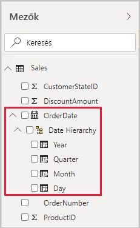
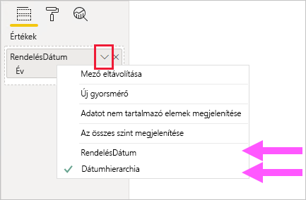
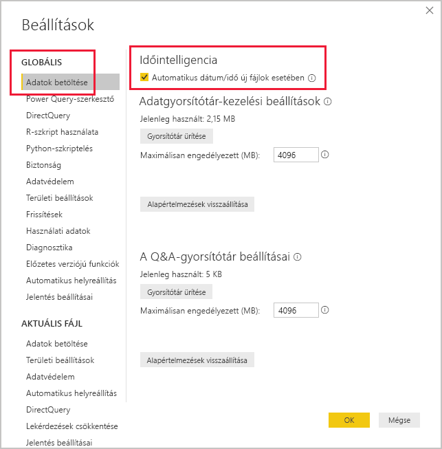

# <a name="auto-datetime-in-power-bi-desktop"></a>Automatikus dátum/idő a Power BI Desktopban

Ez a cikk azoknak az adatmodellezőknek szól, akik importálási vagy összetett modelleket fejlesztenek a Power BI Desktopban.

## <a name="background"></a>Háttér

Az _automatikus dátum/idő_ egy adatbetöltési beállítás a Power BI Desktopban. A beállítás célja, hogy segítse a megfelelő időintelligencia-jelentéskészítést a modellbe betöltött dátumoszlopok alapján. Pontosabban szólva lehetővé teszi a jelentések szerzői számára, hogy naptári időszakokkal végezzenek szűrést, csoportosítást és részletes elemzést, anélkül, hogy a modellezőnek külön ki kellene fejlesztenie őket. A naptári időszakok a következők lehetnek: évek, negyedévek, hónapok és napok.

Ha engedélyezve van a beállítás, a Power BI Desktop minden dátumoszlophoz létrehoz egy rejtett automatikus dátum/idő táblát, amennyiben az alábbi feltételek mindegyike teljesül:

- A tábla tárolási módja Importálás
- Az oszlop adattípusa dátum vagy dátum/idő
- Az oszlop nem a modellkapcsolat „több” oldala

## <a name="how-it-works"></a>Működés

Az automatikus dátum/idő táblák valójában [számított táblák](desktop-calculated-tables.md), amelyek adatsorokat hoznak létre a DAX [CALENDAR](/dax/calendar-function-dax) függvény használatával. Emellett minden tábla hat számított oszlopot tartalmaz: **Day**, **MonthNo**, **Month**, **QuarterNo**, **Quarter** és **Year**.

> [!NOTE]
> Az oszlopok nevének és értékeinek fordítása és formázása a [modell nyelve](supported-languages-countries-regions.md#choose-the-language-for-the-model-in-power-bi-desktop) alapján történik.

Ezenkívül egy kapcsolat is létrejön az automatikus dátum/idő tábla **Date** oszlopa és a modell dátumoszlopa között.

Az automatikus dátum/idő tábla teljes naptári évekkel töltődik be, amelyek a modell dátumoszlopában tárolt összes dátumértéket tartalmazzák. Például ha a dátumoszlop legkorábbi értéke 2016. március 20., a legutolsó értéke 2019. október 23. lenne, a tábla 1461 sort tartalmazna. Minden sor a négy naptári év (2016–2019) egy-egy dátumát jelöli. A modell frissítésekor a rendszer az automatikus dátum/idő táblákat is frissíti, hogy mindig tartalmazzák a dátumoszlop értékeire kiterjedő dátumokat.

Ha meg lehetne tekinteni egy automatikus dátum/idő tábla sorait, a következőképpen nézhetnének ki:


> [!NOTE]
> Az automatikus dátum/idő táblák még a modellezők elől is véglegesen el vannak rejtve. Nem jelennek meg a **Mezők** panelen és a Modellnézet diagramon, és a sorai nem láthatók az Adatnézetben. Emellett a DAX-kifejezések nem hivatkozhatnak közvetlenül a táblára és az oszlopaira.

A tábla egy hierarchiát is meghatároz, amely vizualizációkat biztosít az év, negyedév, hónap és nap szintek részletes elemzési útvonaláról.

Ha meg lehetne tekinteni egy automatikus dátum/idő táblát a Modellnézet diagramon, a következőképpen nézhetnének ki (a kapcsolódó oszlopok ki vannak emelve):


## <a name="work-with-auto-datetime"></a>Az automatikus dátum/idő használata

Ha már létezik egy automatikus dátum/idő tábla a dátumoszlophoz (és az oszlop látható), a jelentés szerzői nem fogják megtalálni azt az oszlopot mezőként a **Mezők** panelen. Egy kibontható objektumot fognak találni helyette, a dátumoszlop nevével. Ezt könnyen meg lehet találni, mivel egy naptár ikonnal van díszítve. Amikor a jelentés szerzői kibontják a naptárobjektumot, egy **Date Hierarchy** nevű hierarchiát fognak találni. A hierarchia kibontása után négy szintet találnak: **Year**, **Quarter**, **Month** és **Day**.



Az automatikus dátum/idő által létrehozott hierarchiával ugyanúgy lehet vizualizációkat konfigurálni, mint a normál hierarchiákkal. A vizualizációkat a teljes **Date Hierarchy** hierarchiával vagy a hierarchia adott szintjeivel lehet konfigurálni.

A normál hierarchiák azonban nem támogatnak egy hozzáadott képességet. Ha az automatikus dátum/idő hierarchia – vagy a hierarchia egyik szintje – hozzá van adva a vizualizációhoz, akkor a jelentés szerzője válthat a hierarchia és a dátumoszlop használata között. Ennek a megközelítésnek azoknál a vizualizációknál van értelme, amikor szükség van a dátumoszlopra, de nincs szükség a hierarchiára és a szintjeire. Első lépésként konfigurálja a vizualizáció mezőt (kattintson a jobb gombbal a vizualizáció mezőre, vagy kattintson a lefelé mutató nyílra), majd váltson a dátumoszlop és a dátumhierarchia között a helyi menü segítségével.



Végezetül pedig a DAX nyelven írt modellszámítások közvetlenül hivatkozhatnak a dátumoszlopra, vagy közvetve a rejtett automatikus dátum/idő táblára.

A Power BI Desktopban írt képletek a szokásos módon hivatkozhatnak a dátumoszlopokra. Az automatikus dátum/idő tábla oszlopaira azonban egy speciális kiterjesztett szintaxissal kell hivatkozni. Először hivatkozzon a dátumoszlopra, majd írjon utána egy pontot (.). A képletsáv automatikus kiegészítése ezután lehetővé teszi, hogy kiválassza az automatikus dátum/idő tábla egy oszlopát.

![Példa egy DAX-mértékkifejezés képletsávba való beírására. A képlet eddig: Date Count = COUNT(Sales[OrderDate]. Az automatikus kiegészítési lista a rejtett automatikus dátum/idő tábla mind a hét oszlopát megjeleníti. Ezek az oszlopok a következők: Date, Day, Month, MonthNo, Quarter, QuarterNo és Year.](media/desktop-auto-date-time/auto-date-time-dax-auto-complete.png)

A Power BI Desktopban az érvényes mértékkifejezések a következőképpen nézhetnek ki:

```dax
Date Count = COUNT(Sales[OrderDate].[Date])
```

> [!NOTE]
> Ez a mértékkifejezés érvényes a Power BI Desktopban, viszont helytelen DAX-szintaxis. A Power BI Desktop belsőleg transzponálja a kifejezést, hogy a valódi (rejtett) automatikus dátum/idő tábla oszlopra hivatkozzon.

## <a name="configure-auto-datetime-option"></a>Automatikus dátum/idő beállítás konfigurálása

Az automatikus dátum/idő konfigurálható _globálisan_, vagy az _aktuális fájlhoz_. A globális beállítás az új Power BI Desktop-fájlokra vonatkozik, és bármikor be- és kikapcsolható. A Power BI Desktop új telepítése esetén alapértelmezés szerint mindkét beállítás be van kapcsolva.

Az aktuális fájl beállítást is bármikor be- és ki lehet kapcsolni. Ha be van kapcsolva, a rendszer automatikus dátum/idő táblákat hoz létre. Ha ki van kapcsolva, a rendszer az összes automatikus dátum/idő táblát eltávolítja a modellből.

> [!CAUTION]
> Az aktuális fájl beállítás kikapcsolásakor körültekintően járjon el, mivel ez eltávolítja az automatikus dátum/idő táblákat. Ne felejtse el kijavítani a használatukra konfigurált hibás jelentésszűrőket vagy vizualizációkat.

A Power BI Desktopban válassza a _Fájl > Lehetőségek és beállítások > Beállítások_ lehetőséget, majd válassza ki a **Globális** vagy az **Aktuális fájl** oldalt. A beállítás mindkét oldalon az **Időintelligencia** szakaszban található.



## <a name="next-steps"></a>Következő lépések

Az automatikus dátum/idővel és a kapcsolódó témakörökkel kapcsolatos további információért tekintse meg az alábbi forrásanyagokat:

- [Dátumtáblák beállítása és használata a Power BI Desktopban](desktop-date-tables.md)
- Kérdése van? [Kérdezze meg a Power BI közösségét](https://community.powerbi.com/)
