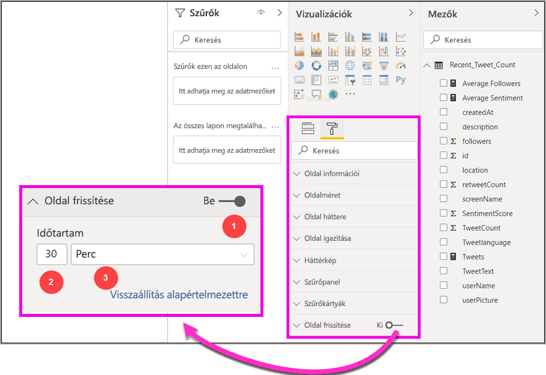
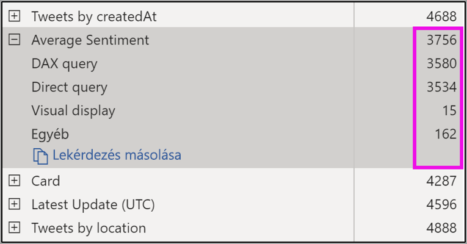
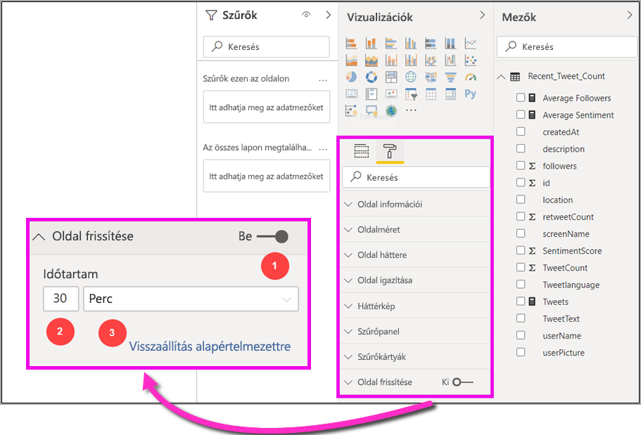

# Automatikus lapfrissítés Power BI Desktopban (előzetes verzió)

Kritikus események figyelése esetén fontos, hogy a forrásadatok frissítése után azonnal frissüljenek az adatok. A feldolgozóiparban például fontos értesülni arról, ha meghibásodik a gép, vagy ha hamarosan meghibásodás várható nála.

A Power BI automatikus oldalfrissítési (APR) funkciója lehetővé teszi, hogy az aktív jelentésoldal lekérdezze az új adatokat a [DirectQuery-forrásokból](https://docs.microsoft.com/power-bi/desktop-directquery-about) egy előre meghatározott gyakorisággal.

## Az automatikus oldalfrissítés használata

Ebben az előzetes verzióban engedélyeznie kell az automatikus oldalfrissítési funkciót a Power BI Desktopban. A **Fájl > Lehetőségek és beállítások** területen válassza a **Lehetőségek** elemet, majd válassza a bal oldali panelen az **Előzetes funkciók** lehetőséget. A funkciót az *Automatikus oldalfrissítés* melletti jelölőnégyzet bejelölésével engedélyezheti. Az automatikus oldalfrissítés csak a DirectQuery-adatforrások esetén érhető el.

Az automatikus oldalfrissítés használatához válassza ki azt a jelentésoldalt, amelyhez engedélyezni szeretné a frissítést. A **Vizualizációk** panelen válassza a **Formázás** ikont (a festőhengert), és keresse meg az **Oldalfrissítés** elemet a panel alján. 

Az alábbi ábrán az **Oldalfrissítés** kártya látható. A számozott elemek magyarázatait a következő néhány bekezdés ismerteti:

1.  Automatikus oldalfrissítési csúszka – az oldalfrissítés bekapcsolása vagy kikapcsolása
2.  Az oldalfrissítés időközének értéke – a frissítési időköz értéke
3.  Az oldalfrissítés időközének egysége – az oldalfrissítés időközének egysége

Itt bekapcsolhatja az oldalfrissítést, és kiválaszthatja a frissítés időtartamát. Az alapértelmezett érték 30 perc, a minimális frissítési időköz egy másodperc). A jelentés a beállított időközönként megkezdi a frissítést. 

## Az oldalfrissítés időközének meghatározása

Ha engedélyezve van az automatikus oldalfrissítés, a Power BI Desktop folyamatosan küld lekérdezéseket a DirectQuery-forrásnak. A lekérdezés elküldése és az adatok megérkezése között késleltetés lesz, ezért a rövid frissítési időközök esetében ellenőrizze, hogy a lekérdezések sikeresen visszaadják-e a lekérdezett adatokat a beállított idő alatt. Ha az adott idő alatt nem érkezik vissza adat, akkor a vizualizációk a konfiguráltnál kevesebb alkalommal fognak frissülni.

Ajánlott eljárásként javasoljuk, hogy a frissítési időköz egyezzen meg legalább az új adatok érkezési gyakoriságával:

* Ha 20 percenként érkeznek új adatok a forráshoz, akkor a frissítési gyakoriság ne legyen 20 percnél rövidebb. 

* Ha másodpercenként érkezik új adat, akkor a gyakoriságot 1 másodpercre érdemes beállítani. 

Az alacsony frissítési időközök (például egy másodperc) esetében érdemes figyelembe venni a Direct Query-adatforrás típusát, hogy a lekérdezések milyen terhelést okoznak rajta, a jelentés megtekintőinek a kapacitás adatközpontjától való távolságát és így tovább. 

Ezt a Power BI Desktop teljesítményelemzője segítségével becsülheti meg, amellyel ellenőrizheti, hogy az egyes vizualizációs lekérdezéseknek elegendő ideje van-e arra, hogy eredményekkel térjenek vissza az adatforrásból, és azt is felmérheti, hogy mire mennyi idő szükséges. A teljesítményelemző eredményei alapján módosíthatók az adatforrások, vagy kísérletezhet a jelentés más vizualizációival és mértékeivel is.

Az alábbi képen a DirectQuery eredményei láthatók a Teljesítményelemzőben:

Tekintsünk át az adatforrásra vonatkozó néhány egyéb jellemzőt is. 

1.  Az adatok két másodpercenként érkeznek. 
2.  A Teljesítményelemző a maximális lekérdezési + megjelenítési időt körülbelül 4,9 másodpercként (4688 ezredmásodperc) adja meg. 
3.  Az adatforrás úgy van konfigurálva, hogy másodpercenként körülbelül 1000 egyidejű lekérdezést kezeljen. 
4.  Az Ön becslése szerint egyidejűleg mintegy 10 felhasználó fogja megnézni a jelentést.

Ez az alábbi eredményeket adja:

* **5 vizualizáció x 10 felhasználó = körülbelül 50 lekérdezés**

Ez a számítás sokkal nagyobb terhelést eredményez, mint amit az adatforrás támogatni tud. Az adatok két másodperces gyakorisággal érkeznek, így a frissítési gyakoriságnak is ennek kell lennie. Mivel azonban a lekérdezés körülbelül öt másodpercet vesz igénybe, azt öt másodpercnél nagyobb értékre kell beállítani. 

Azt is vegye figyelembe, hogy ez az eredmény eltérő lehet, amikor a jelentést közzéteszi a szolgáltatásban, mivel a jelentés a felhőben üzemeltetett Analysis Services-példányt fogja használni. Érdemes lehet módosítani a frissítési gyakoriságot. 

A lekérdezések és a frissítési gyakoriság megfelelő kezelése érdekében a Power BI csak akkor fogja futtatni a következő frissítési lekérdezést, ha az összes hátralévő frissítési lekérdezés befejeződik. Tehát ha a frissítési időköz rövidebb, mint a lekérdezések feldolgozásának hossza, a Power BI akkor is csak akkor frissül újra, ha a hátralévő lekérdezések befejeződnek. 

Most nézzük meg, hogyan kapacitás-rendszergazdaként hogyan észlelheti és diagnosztizálhatja a teljesítménnyel kapcsolatos problémákat. A jelen cikk későbbi részében található **Automatikus oldalfrissítés – GYIK** című szakasza további kérdéseket és válaszokat is tartalmaz a teljesítményről és a hibaelhárításról.

## Automatikus oldalfrissítés a Power BI szolgáltatásban

Automatikus oldalfrissítési gyakoriságot olyan jelentésekhez is beállíthat, amelyeket a Power BI Desktopban hoztak létre, és a Power BI szolgáltatásban tettek közzé. 

A Power BI szolgáltatás jelentéseinek automatikus oldalfrissítését a Power BI Desktopban használatos konfigurációhoz hasonlóan lehet beállítani. Ha a Power BI szolgáltatásban van konfigurálva, az automatikus oldalfrissítés a [beágyazott Power BI-tartalmat](developer/embedding.md) is támogatja. Az alábbi kép a Power BI szolgáltatásban az **Oldalfrissítés** konfigurációját mutatja:

1.  Automatikus oldalfrissítési csúszka – az oldalfrissítés bekapcsolása vagy kikapcsolása
2.  Az oldalfrissítés időközének értéke – a frissítési időköz értéke, egész számnak kell lennie
3.  Az oldalfrissítés időközének egysége – az oldalfrissítés időközének egysége

### Oldalfrissítési időközök

A Power BI szolgáltatásban az oldalfrissítési időközökre hatással van a jelentés munkaterületének típusa. Ez vonatkozik az összes alábbi jelentésre:

* Jelentés közzététele egy olyan munkaterületen, amelyen engedélyezve van az automatikus oldalfrissítés
* Oldalfrissítés időközének módosítása már a munkaterületen
* Jelentés létrehozása közvetlenül a szolgáltatásban

A Power BI Desktop nem korlátozza a frissítési időközöket; a frissítési időköz lehet akár másodpercenkénti is. Ha azonban a jelentések a Power BI szolgáltatásban közzé vannak téve, akkor bizonyos korlátozások lesznek érvényesek, amelyeket a következő szakaszokban ismertetünk.

### A frissítési időközökre vonatkozó korlátozások

A Power BI szolgáltatásban korlátozások vonatkoznak az automatikus oldalfrissítésre olyan tényezők alapján, mint a munkaterület, vagy hogy használatban vannak-e prémium szintű szolgáltatások.

A működésének tisztázásához kezdjük a kapacitások és munkaterületek hátterével:

A **kapacitások** egy alapvető Power BI-fogalom, amely a Power BI-tartalmak üzemeltetéséhez és elérhetővé tételéhez használt erőforrások (tárolás, processzor és memória) egy adott készletét jelöli. A kapacitások lehetnek megosztottak vagy dedikáltak. A **megosztott kapacitás** más Microsoft-ügyfelekkel is meg van osztva, míg a **dedikált kapacitás** teljes mértékben egyetlen ügyfél számára van fenntartva. A dedikált kapacitásokat a [prémium szintű kapacitások kezeléséről](service-premium-capacity-manage.md) szóló cikkben mutatjuk be.

Megosztott kapacitással munkafolyamatai más ügyfelekkel megosztott számítási erőforrásokon futnak. Mivel a kapacitásnak meg kell osztania az erőforrásokat, korlátozásokat kell bevezetni a *tisztességes játék* érdekében, például hogy a maximális modellméretet (1 GB) és a maximális napi frissítési gyakoriságot (naponta nyolc alkalommal) lehessen használni.

A Power BI **munkaterületei** a kapacitásokon belül találhatók, és biztonsági, együttműködési és üzembe helyezési tárolókat jelentenek. Minden Power BI-felhasználó rendelkezik **Saját munkaterülettel**. Az együttműködéshez és a fejlesztéshez további munkaterületek is létrehozhatók, ezeket **munkaterületeknek** nevezzük. Alapértelmezés szerint a munkaterületek, így a személyes munkaterületek is a **megosztott kapacitásban** lesznek létrehozva.

Néhány információ a kétféle munkaterület használatáról:

**Megosztott munkaterületek** – a normál munkaterületek (a prémium szintű kapacitás részét nem képező munkaterületek) esetében az automatikus oldalfrissítésnél a legalacsonyabb alkalmazható időköz 30 perc (azaz ennél rövidebb időköz nem alkalmazható).

**Prémium szintű munkaterületek** – a prémium szintű munkaterületek automatikus oldalfrissítésének elérhetősége attól függ, hogy a prémium rendszergazda milyen beállításokat alkalmazott a számítási feladatokra a Power BI Premium kapacitáshoz. Két változó befolyásolhatja, hogy hogyan állíthatja be az automatikus oldalfrissítést:

 1. *Funkció be-/kikapcsolása*: ha a kapacitásadminisztrátor letiltotta a funkciót, akkor nem fog tudni beállítani semmilyen oldalfrissítést a közzétett jelentésben.

 2. *Minimális frissítési időköz*: ha engedélyezi a funkciót, a kapacitásadminisztrátornak be kell állítania egy minimális frissítési időközt. Ha az időköz kisebb a minimálisnál, a Power BI szolgáltatás felülbírálja az időközt, hogy betarthassa a kapacitásadminisztrátor által beállított minimális időközt.

Az alábbi táblázat részletesebben ismerteti a funkció elérhetőségét, valamint az egyes kapacitási típusok és [tárolási mód](service-dataset-modes-understand.md) korlátozásait.

| Tárolási mód | Dedikált kapacitás | Megosztott kapacitás |
| --- | --- | --- |
| Közvetlen lekérdezés | **Támogatott** – Igen.  **Minimális frissítési időköz** – 1 másodperc  **Kapacitásadminisztrátori felülbírálás** – Igen. | **Támogatott** – Igen.  **Minimális frissítési időköz** – 30 perc  **Kapacitásadminisztrátor felülbírálása** – Nem. |
| Importálás | **Támogatott** – Nem.  **Minimális frissítési időköz** – N/A.  **Kapacitásadminisztrátori felülbírálás** – N/A. | **Támogatott** – Nem.  **Minimális frissítési időköz** – N/A.  **Kapacitásadminisztrátori felülbírálás** – N/A. |
| Kevert mód (DQ + egyebek) | **Támogatott** – Igen.  **Minimális frissítési időköz** – 1 másodperc  **Kapacitásadminisztrátori felülbírálás** – Igen. | **Támogatott** – Igen.  **Minimális frissítési időköz** – 30 perc  **Kapacitásadminisztrátor felülbírálása** – Nem. |
| Élő kapcsolat AS | **Támogatott** – Nem.  **Minimális frissítési időköz** – N/A.  **Kapacitásadminisztrátori felülbírálás** – N/A. | **Támogatott** – Nem.  **Minimális frissítési időköz** – N/A.  **Kapacitásadminisztrátori felülbírálás** – N/A. |
| Élő kapcsolat PBI | **Támogatott** – Nem.  **Minimális frissítési időköz** – N/A.  **Kapacitásadminisztrátori felülbírálás** – N/A. | **Támogatott** – Nem.  **Minimális frissítési időköz** – N/A.  **Kapacitásadminisztrátori felülbírálás** – N/A. |

> [!NOTE]
> Amikor közzéteszi az automatikus oldalfrissítéssel rendelkező jelentését Power BI Desktopból a szolgáltatásba, meg kell adnia a DirectQuery-adatforráshoz tartozó hitelesítő adatokat az adatkészlet-beállítási menüben.

## Megfontolandó szempontok és korlátozások

Az automatikus oldalfrissítés használatakor figyelembe kell venni néhány dolgot a Power BI Desktopban és a Power BI szolgáltatásban.

* Az importálási, a LiveConnect és a leküldéses tárolási módok nem támogatottak az automatikus oldalfrissítésnél.  
* A legalább egy DirectQuery-adatforrással rendelkező összetett modellek támogatottak.
* A Power BI Desktop nem korlátozza a frissítési időközt, így az lehet akár másodpercenkénti is. Ha a jelentéseket a Power BI szolgáltatásban teszi közzé, érvényesek lesznek bizonyos korlátozások, ahogy azt ebben a dokumentumban már korábban ismertettük.

### Teljesítmény-diagnosztika

Az automatikus oldalfrissítés hasznos lehet a forgatókönyvek figyeléséhez és a gyorsan változó adatok feltárásához. Ez azonban olykor indokolatlan terhelést okoz a kapacitás vagy az adatforrás számára.

Az adatforrások indokolatlan terhelésének megakadályozása érdekében a Power BI a következő garanciákat nyújtja:

1. Az összes automatikus oldalfrissítési lekérdezés **alacsonyabb** prioritással rendelkezik, így biztosítva, hogy az interaktív lekérdezések (például az oldalak betöltése és a keresztszűrési vizualizációk) elsőbbséget élvezzenek.
2. Ha a lekérdezés nem fejeződött be a következő frissítési ciklus előtt, a Power BI addig nem küld el új frissítési lekérdezéseket, amíg az előző lekérdezés be nem fejeződik. Ha például egy másodperces frissítési időközt használ, és a lekérdezések átlagosan négy másodpercig tartanak, a Power BI gyakorlatilag csak négy másodpercenként indít lekérdezést.

Két terület van, ahol továbbra is előfordulhatnak teljesítménnyel kapcsolatos szűk keresztmetszetek:

1. **A kapacitás:** A lekérdezés először a prémium kapacitást veszi fel, amely optimalizálódik, és kiértékeli a jelentés vizualizációi alapján létrehozott DAX-lekérdezést a forrás lekérdezésekben.
2. **A Direct Query-adatforrás:** Ezután az előző lépésben lefordított lekérdezések a forráson lesznek futtatva. Ezek lehetnek az SQL-kiszolgálók, az SAP Hana-források és így tovább.

A rendszergazdák számára elérhető [Prémiummetrikák alkalmazás](service-admin-premium-monitor-capacity.md) használatával vizuálisan is megjelenítheti, hogy a kapacitás milyen hányadát használják az alacsony prioritású lekérdezések.

Az alacsony prioritású lekérdezések automatikus oldalfrissítési lekérdezésekből és modellfrissítési lekérdezésből állnak. Jelenleg nem lehet megkülönböztetni az automatikus oldalfrissítési és a modellfrissítési lekérdezésekből származó terheléseket.

Ha azt tapasztalja, hogy az alacsony prioritású lekérdezések túlterhelik a kapacitást, elvégezhet néhány műveletet:

1. Igényeljen nagyobb méretű prémium termékváltozatot.
2. Lépjen kapcsolatba a jelentés tulajdonosával, és kérje meg, hogy csökkentse a frissítési időközt.
3. A kapacitás-felügyeleti portálon a következőket teheti:
  1. Kikapcsolhatja az automatikus oldalfrissítést a kapacitáshoz
  2. Megnövelheti a minimális frissítési időközt, amely hatással lesz az adott kapacitásra vonatkozó összes jelentésre.

### Gyakori kérdések

Ez a szakasz gyakori kérdéseket és válaszokat tartalmaz a következőhöz: 

1. Jelentés szerzője vagyok. A Desktopban a jelentésfrissítés időközét 1 másodpercre állítottam, de a jelentés a közzététele után nem frissül a szolgáltatásban.

    * Ellenőrizze, hogy az oldal automatikus oldalfrissítés be van-e kapcsolva. Mivel ez a beállítás oldalakra van beállítva, ügyeljen arra is, hogy az a jelentés minden olyan oldalára vonatkozzon, amelyet frissíteni szeretne.
    * Ellenőrizze, hogy prémium kapacitású munkaterületre töltötte-e fel a jelentést, mert ellenkező esetben a frissítési időköz 30 percben lesz meghatározva.
    * Ha a jelentés prémium munkaterületen található, ellenőrizze, hogy a rendszergazda engedélyezte-e ezt a funkciót a csatlakoztatott kapacitáshoz. Arra is ügyeljen, hogy a kapacitás minimális frissítési időköze a jelentéssel megegyező vagy annál alacsonyabb legyen.

2. Kapacitás-rendszergazda vagyok. Módosítottam az automatikus oldalfrissítés időközének beállításait, de ez nem vált ki hatást. Azaz a jelentések még mindig a nem kívánt gyakorisággal frissülnek vagy nem is frissülnek, noha be van kapcsolva a frissítés.

    * A kapacitás-rendszergazdai felhasználói felületen az automatikus oldalfrissítésre vonatkozó módosítások érvénybe lépése akár 5 percet is igénybe vehet.
    * Amellett, hogy bekapcsolja az automatikus oldalfrissítést a kapacitáshoz, azt azokon a jelentésoldalakon is be kell kapcsolnia, ahol azokat látni szeretné.

3. A jelentésem vegyes módban működik (DQ + importálás). Nem minden vizualizáció frissül.

    * Ha a vizualizációk a táblázatok importálására hivatkoznak, akkor ez várható viselkedés. az automatikus oldalfrissítés nem támogatott az importáláshoz.
    * Lásd a jelen szakasz 1. kérdését.

4. A jelentés frissítése a szolgáltatásban megfelelően működött, majd hirtelen leállt.

    * Próbálja meg frissíteni az oldalt, és ellenőrizze, hogy megoldódik-e így a probléma.
    * Kérdezze meg a kapacitás-rendszergazdát, mivel az is előfordulhat, hogy közben kikapcsolta a funkciót, vagy megemelte a minimális frissítési időközt (lásd a 2. kérdést)

5. Jelentés szerzője vagyok. A vizualizációk nem frissülnek a megadott gyakorisággal. A frissítés lassabban történik.

    * Ha a lekérdezések végrehajtása több időt vesz igénybe, akkor a frissítési időköz is hosszabb lesz. az automatikus oldalfrissítés megvárja, amíg az összes lekérdezés befejeződik, mielőtt újakat futtatna.
    * Előfordulhat, hogy a kapacitás-rendszergazda olyan minimális frissítési időközt állított be, amely magasabb a jelentéshez Ön által beállított értéknél. Forduljon a kapacitás-rendszergazdához, és kérje meg, hogy csökkentse azt.

6. Az automatikus oldalfrissítési lekérdezések gyorsítótárat használnak?

    * Nem, az összes automatikus oldalfrissítés figyelmen kívül hagyja a gyorsítótárba helyezett adatokat.

## Következő lépések

További információért tekintse át a következő cikkeket:

* [DirectQuery használata a Power BI-ban](desktop-directquery-about.md)
* [A Teljesítményelemző használata a jelentéselem teljesítményének vizsgálatához](desktop-performance-analyzer.md)
* [Power BI Premium-kapacitások üzembe helyezése és kezelése](whitepaper-powerbi-premium-deployment.md)
* [Adatforrások a Power BI Desktopban](desktop-data-sources.md)
* [Adatok formázása és kombinálása a Power BI Desktoppal](desktop-shape-and-combine-data.md)
* [Kapcsolódás az Excelhez a Power BI Desktopban](desktop-connect-excel.md)   
* [Adatok közvetlen bevitele a Power BI Desktopba](desktop-enter-data-directly-into-desktop.md)   
