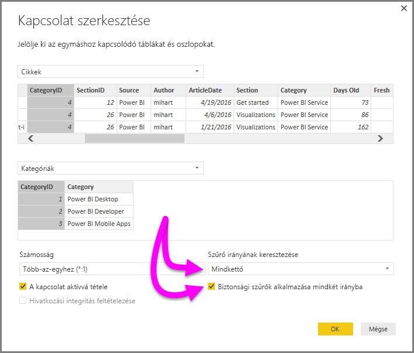

# Kétirányú keresztszűrés a DirectQuery használatával a Power BI Desktopban

Amikor táblák szűrését alkalmazzuk a megfelelő adatnézetek létrehozásához, a jelentéskészítők (és adatmodellezők) különböző kihívásokkal találkoznak, amikor el kell dönteniük, hogy milyen szűrést alkalmazzanak egy jelentésen. A táblák szűrőkontextusa a kapcsolatok egyik oldalán megmarad, de a másikon nem, így gyakran összetett DAX-képletek szükségesek a kívánt eredmények eléréséhez.

A kétirányú keresztszűrésnek köszönhetően a jelentéskészítők (és adatmodellezők) jobban tudják szabályozni a szűrők alkalmazását a kapcsolódó táblák használatakor, mivel engedélyezhetik a szűrők alkalmazását a táblakapcsolatok *mindkét* oldalán. Ezt úgy érik el, hogy a szűrő kontextusát propagálják egy másik kapcsolódó táblára egy táblakapcsolat másik oldalán.

## Részletes tanulmány a kétirányú keresztszűrésről
Egy [részletes tanulmány](http://download.microsoft.com/download/2/7/8/2782DF95-3E0D-40CD-BFC8-749A2882E109/Bidirectional%20cross-filtering%20in%20Analysis%20Services%202016%20and%20Power%20BI.docx) ismerteti a Power BI Desktopban elérhető kétirányú keresztszűrést (valamint az SQL Server Analysis Services 2016 működését, amely ugyanígy viselkedik).

* A [Power BI Desktopban használható kétirányú keresztszűrést ismertető](http://download.microsoft.com/download/2/7/8/2782DF95-3E0D-40CD-BFC8-749A2882E109/Bidirectional%20cross-filtering%20in%20Analysis%20Services%202016%20and%20Power%20BI.docx) tanulmány letöltése

## Kétirányú keresztszűrés engedélyezése DirectQueryhez

A keresztszűrés engedélyezéséhez egy kapcsolat **Kapcsolat szerkesztése** párbeszédpaneljén a következőket kell választani:

* A **Szűrő irányának keresztezése** beállításnál a **Mindkettő** értéket kell beállítani
* Emellett ki kell választani a **Biztonsági szűrők alkalmazása mindkét irányba** lehetőséget

  

> [!NOTE]
> A Power BI Desktopban a keresztszűrési DAX-képletek létrehozásakor használja a *UserPrincipalName* paramétert (ami általában ugyanaz, mint a felhasználó bejelentkezési neve, például <em>joe@contoso.com</em>) a *UserName* helyett. Ehhez lehet, hogy létre kell hozni egy kapcsolódó táblát, amely egymáshoz rendeli a *UserName* (vagy például EmployeeID) és a *UserPrincipalName* paramétereket.

További információkért és a kétirányú keresztszűrés működési példáiért tekintse át a jelen cikkben korábban említett [tanulmányt](http://download.microsoft.com/download/2/7/8/2782DF95-3E0D-40CD-BFC8-749A2882E109/Bidirectional%20cross-filtering%20in%20Analysis%20Services%202016%20and%20Power%20BI.docx).

