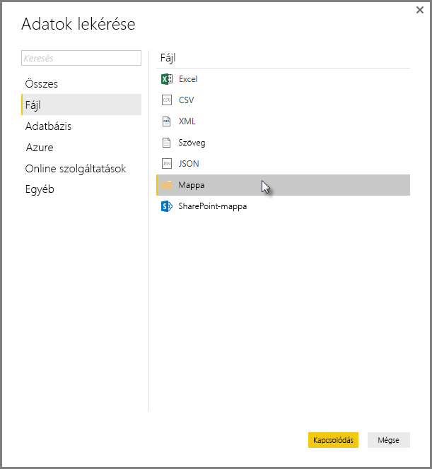
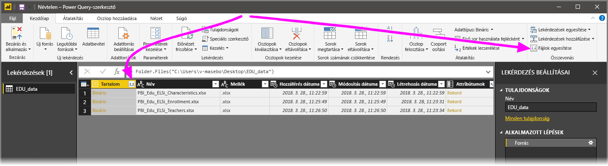
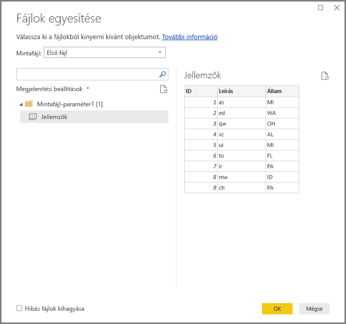
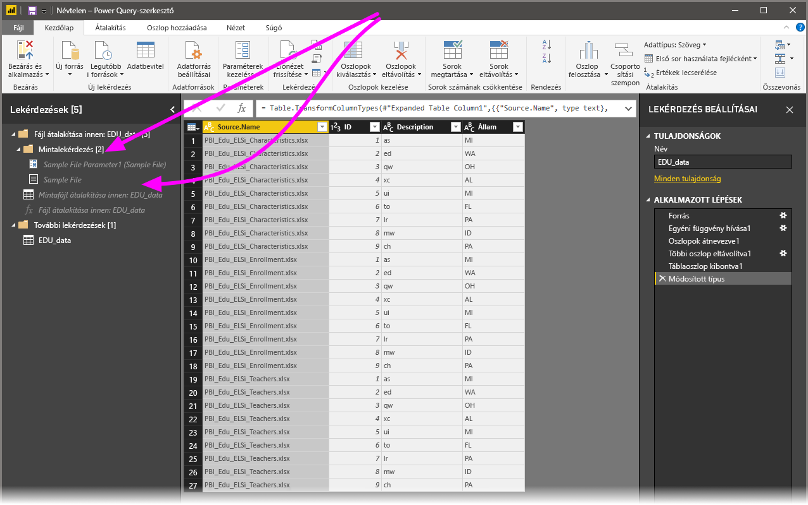

# Fájlok (bináris fájlok) egyesítése a Power BI Desktopban
Az adatok a **Power BI Desktopba** való importálásának egy igen hatékony módja, ha az azonos sémájú fájlokat egyetlen logikai táblában egyesíti. Ez a kényelmes és népszerű megközelítés még kényelmesebbé és szélesebb körben alkalmazhatóvá vált, amint azt ez a cikk is ismerteti.

Az egyazon mappában lévő fájlok ötvözéséhez válassza az **Adatok lekérése > Fájl > Mappa** lehetőséget.

## A fájlok egyesítésének működése
A **(bináris) fájlok egyesítéséhez** a **Lekérdezésszerkesztő** menüszalagján a **Kezdőlapról**, vagy magából az oszlopból is kiválaszthatja a **Fájlok egyesítése** lehetőséget.

A **fájlok egyesítése** átalakítás az alábbiak szerint működik:

* A **fájlok egyesítése** átalakítás kielemzi az egyes bemeneti fájlokat, és meghatározza a megfelelő fájlformátumot (például: *szövegfájl*, *Excel-munkafüzet* vagy *JSON*-fájl).
* Az átalakítással kiválaszthat egy adott objektumot az első fájlból, például egy *Excel-munkafüzetből*, amelyet ki szeretne nyerni.
  
  
* A **fájlok egyesítése** ekkor automatikusan végrehajtja a következők lekérdezéseket:
  
  * Létrehoz egy példalekérdezést, amely végrehajtja a kinyeréshez szükséges lépéseket egyetlen fájlban.
  * Létrehoz egy *függvénylekérdezést*, amely felparaméterezi a fájl/bináris fájl bemenetet a *példalekérdezéshez*. A példalekérdezés és a függvénylekérdezés össze van kapcsolva, így a példalekérdezésen végrehajtott módosítások a függvénylekérdezésben is megjelennek.
  * Alkalmazza a *függvénylekérdezést* az eredeti lekérdezésre a bemeneti bináris fájlokkal (például a *Mappa* lekérdezést), azaz a bináris fájlbemenetek függvénylekérdezéseit mindegyik soron alkalmazza, majd az így kinyert adatokat felsőszintű oszlopokká bontja ki.
    
    

> [!NOTE]
> A Excel-munkafüzetben végzett kijelölés befolyásolja a bináris fájlok egyesítésének folyamatát. Kijelölhet például egy munkalapot, hogy csak azt a munkalapot egyesítse, vagy a gyökeret, hogy a teljes fájl egyesítve legyen. Egy mappa kijelölésével a mappában található fájlok egyesíthetők. 

A **fájlok egyesítésének** működése révén könnyedén egyesítheti az egy adott mappában lévő összes fájlt, amennyiben egyazon fájltípussal és szerkezettel (azaz ugyanazokkal az oszlopokkal) rendelkeznek.

Emellett további átalakítási és kinyerési műveleteket is könnyen alkalmazhat az automatikusan létrehozott *példalekérdezés* módosításával anélkül, hogy módosítania kellene a *függvénylekérdezés* lépéseit, vagy újakat kellene létrehoznia. A *példalekérdezés* bármilyen módosítása automatikusan létrejön a vele összekapcsolt *függvénylekérdezésben*.

## Következő lépések
A Power BI Desktop használatával számos adatforráshoz csatlakozhat. Az adatforrásokkal kapcsolatos információkért lásd az alábbi forrásanyagokat:

* [Mi az a Power BI Desktop?](desktop-what-is-desktop.md)
* [Adatforrások a Power BI Desktopban](desktop-data-sources.md)
* [Adatok formázása és kombinálása a Power BI Desktoppal](desktop-shape-and-combine-data.md)
* [Csatlakozás CSV-fájlokhoz a Power BI Desktopban](desktop-connect-csv.md)   
* [Adatok közvetlen bevitele a Power BI Desktopba](desktop-enter-data-directly-into-desktop.md)   

