# Gyakori lekérdezési feladatok végzése a Power BI Desktopban

A Power BI Desktop Lekérdezésszerkesztő ablakában elérhető néhány gyakran használt feladat. Ez a cikk ezeket a gyakori feladatokat mutatja be, és további információkra mutató hivatkozásokat is tartalmaz.

A bemutatott gyakori lekérdezési feladatok a következők:

* Csatlakozás adatokhoz
* Adatok formázása és egyesítése
* Sorok csoportosítása
* Oszlopok forgatása
* Egyéni oszlopok létrehozása
* Lekérdezési képletek

A feladatok végrehajtásához néhány adatkapcsolatot fogunk használni. Az adatokat Ön is szabadon letöltheti vagy csatlakozhat hozzájuk, amennyiben szeretné maga is végrehajtani a feladatokat.

Az első adatkapcsolat egy [Excel-munkafüzet](https://download.microsoft.com/download/5/7/0/5701F78F-C3C2-450C-BCCE-AAB60C31051D/PBI_Edu_ELSi_Enrollment_v2.xlsx) amelyet letölthet és elmenthet. A másik egy webes erőforrás, amelyet más Power BI Desktop-cikkek is használnak:

<https://www.bankrate.com/retirement/best-and-worst-states-for-retirement/>

A két adatforráshoz való kapcsolódáshoz szükséges lépésekkel kezdődnek a gyakori lekérdezési feladatok.

## Csatlakozás adatokhoz

Power BI Desktopban lévő adatokhoz való csatlakozáshoz válassza a **Kezdőlap**, majd az **Adatok lekérése** lehetőséget. Ekkor megjelenik a Power BI Desktop leggyakoribb adatforrásokat tartalmazó menüje. Az adatforrások teljes listájához, amelyekhez a Power BI Desktop csatlakoztatható, válassza a menü végén a **Továbbiak** lehetőséget. További információ: [Adatforrások a Power BI Desktopban](desktop-data-sources.md).

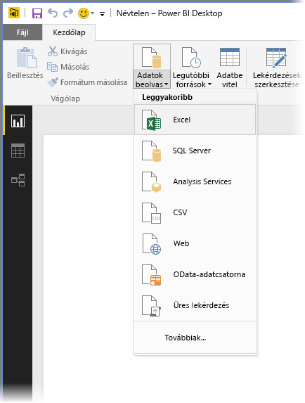

A kezdéshez válassza az **Excel** elemet, adja meg a korábban említett Excel-munkafüzetet, majd válassza a **Megnyitás** lehetőséget. A lekérdezés átvizsgálja a munkafüzetet, majd a talált adatokat a **Kezelő** párbeszédpanelen jeleníti meg egy tábla kiválasztása után.

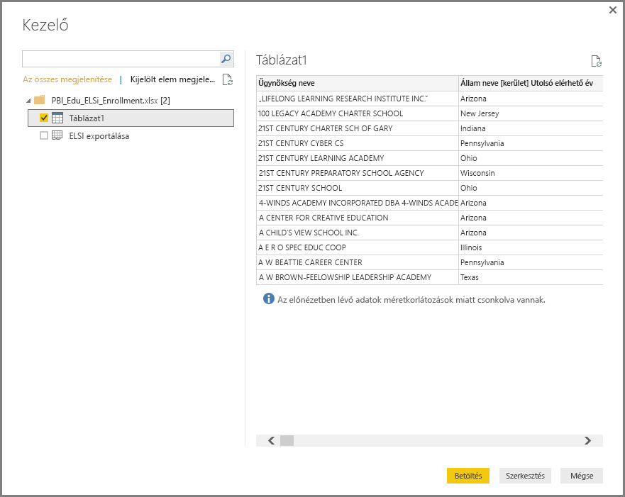

Az **Adatok átalakítása** lehetőséggel szerkesztheti, más néven *alakíthatja* az adatokat, mielőtt betöltené azokat a Power BI Desktopba. A szerkesztés különösen akkor hasznos, ha nagyméretű adatkészletekkel dolgozik, amelyeket le szeretne szűkíteni a betöltés előtt.

Más típusú adatokhoz is ugyanilyen egyszerűen kapcsolódhat. Célszerű egy webes erőforráshoz is kapcsolódni. Válassza az **Adatok lekérése** > **Továbbiak**, majd a **Továbbiak** > **Web** > **Csatlakozás** lehetőséget.

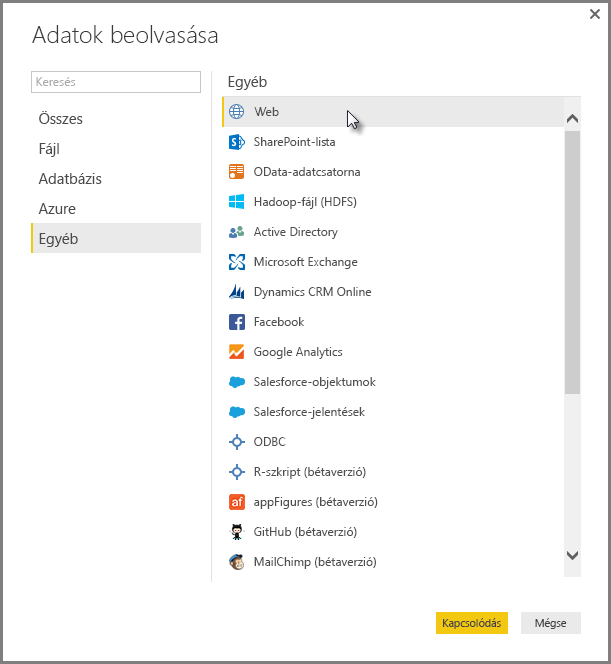

Megnyílik a **Webes tartalomból** párbeszédpanel, amelyben megadhatja a weboldal URL-címét.

Válassza az **OK** lehetőséget. A fentiekhez hasonlóan a Power BI Desktop megvizsgálja a weblapok adatait, és előnézeti lehetőségeket jelenít meg a **Kezelő** párbeszédpanelen. Amikor Ön kiválaszt egy táblázatot, az megjeleníti az adatelőnézetet.

A többi adatkapcsolat is hasonlóan működik. Ha valamely adatkapcsolat létrehozásához hitelesítés szükséges, a Power BI Desktop megkéri, hogy adja meg a megfelelő hitelesítő adatokat.

A Power BI Desktop-adatkapcsolatok létrehozásával kapcsolatos lépésenkénti útmutatóért lásd a témakört, amely azzal foglalkozik, [hogyan kapcsolódhat adatokhoz a Power BI Desktopban](desktop-connect-to-data.md).

## Adatok formázása és egyesítése

A Power Query-szerkesztővel egyszerűen formázhatja és egyesítheti az adatokat. Ebben a szakaszban bemutatunk néhány példát az adatok formázására. Az adatok formázásának és egyesítésének részletesebb bemutatása: [Adatok formázása és egyesítése a Power BI Desktoppal](desktop-shape-and-combine-data.md).

Az előző szakaszban két adatkészletet csatlakoztattunk, egy Excel-munkafüzetet és egy webes erőforrást. Miután betöltötte az adatokat Power Query-szerkesztőbe, válassza ki a weblaplekérdezést az elérhető lekérdezések közül a **Lekérdezések** panelen, az alábbi módon:

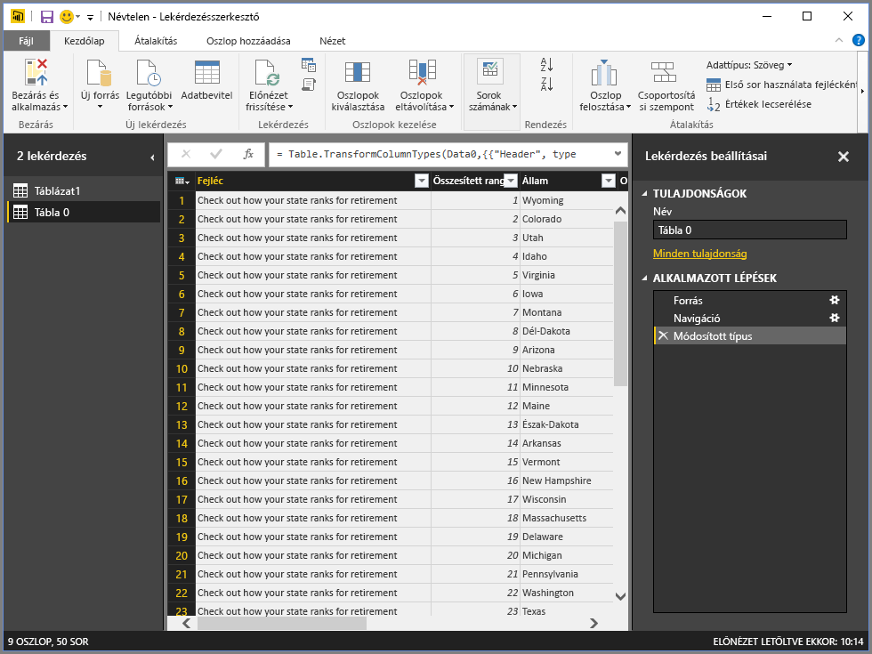

Az adatok formázása során az adatokat olyan formába és formátumba alakítjuk, amely megfelel az igényeinknek.

A Power Query-szerkesztőben számos parancs található a menüszalagon és a helyi menüben is. Például a jobb gombbal egy oszlopra kattintva a megjelenő menü megfelelő elemével törölheti az oszlopot. Azt is megteheti, hogy kijelöli az oszlopot, majd a menüszalag **kezdőlapjának** **Oszlopok eltávolítása** gombjával töröli.

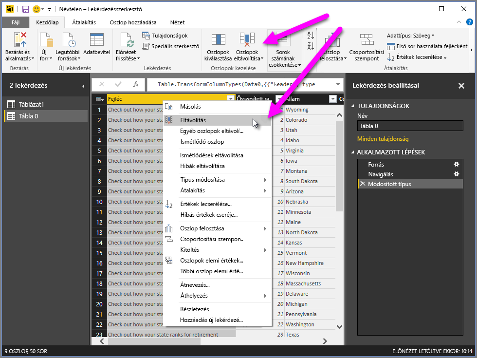

A lekérdezésben számos más módon is formázhatja az adatokat. Eltávolíthat tetszőleges számú sort a szerkesztő tetejéről vagy aljáról. Emellett oszlopokat adhat hozzá, oszthat ketté, értékeket cserélhet le, és alakzatformáló feladatokat végezhet. Ezekkel a funkciókkal igény szerint kérheti le az adatokat a Power Query-szerkesztővel.

## Sorok csoportosítása

A Power Query-szerkesztőben több sor értékét csoportosítással egyetlen értékké vonhatja össze. Ez hasznos lehet például akkor, ha összesíteni szeretné az árajánlatokban szereplő termékek darabszámát, az összes értékesítést vagy a diákok számát.

Ebben a példában egy oktatási regisztrációs adatkészlet sorait csoportosítjuk. Az adatok az Excel-munkafüzetből származnak. A Power Query-szerkesztőben úgy alakítottuk, hogy csak a szükséges oszlopok szerepeljenek, valamint módosítottuk a nevet és néhány egyéb átalakítást végeztünk.

Nézzük meg, hogy hány ügynökség tartozik az egyes államokhoz. (Az ügynökségek lehetnek iskolai körzetek, más oktatási szervek, például regionális szolgáltatási körzetek, és hasonlók.) Válassza ki az **Agency ID - NCES Assigned \[District\] Latest available year** oszlopot, majd kattintson a menüszalagon az **Átalakítás** vagy a **Kezdőlap** **Csoportosítási szempont** gombjára. (A **Csoportosítási szempont** mindkét lapon elérhető.)

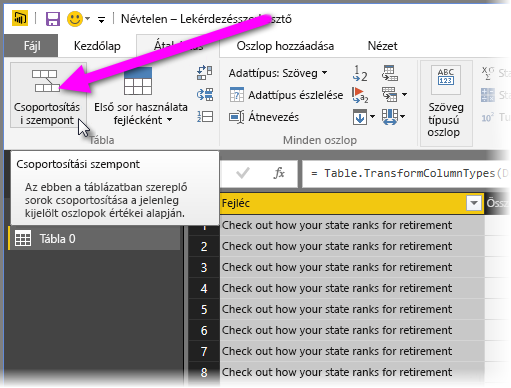

Megjelenik a **Csoportosítási szempont** párbeszédpanel. A sorok csoportosításakor a Power Query-szerkesztő egy új oszlopot hoz létre, amelyben a **Csoportosítási szempont** eredményeit helyezi el. A **Csoportosítási szempont** művelet a következők szerint állítható be:

1. A címke nélküli legördülő lista határozza meg a csoportosítani kívánt oszlopot. A Power Query-szerkesztő ezt az oszlopot adja meg alapértelmezett értékként, azonban ezt Ön bármelyik oszlopra módosíthatja.
2. **Új oszlop neve**: A Power Query-szerkesztő javaslatot tesz az új oszlop nevére a csoportosított oszlopon végrehajtott művelet alapján. Az új oszlopot ettől függetlenül bármilyen névre átnevezheti.
3. **Művelet**: Kiválaszthatja, hogy a Power Query-szerkesztő milyen műveletet alkalmazzon, például **Összeg**, **Középérték**, vagy **Eltérő sorok darabszáma**. Az alapértelmezett érték a **Sorok darabszáma**.
4. **Csoportosítás hozzáadása** és **Összesítés hozzáadása**: Ezek a gombok csak akkor érhetők el, ha a **Speciális** lehetőséget választja. Egyetlen műveletben több oszlopon végezhet csoportosítási (**Csoportosítási szempont**) műveleteket, és ezekkel a gombokkal több összesítést is készíthet. A Power Query-szerkesztő létrehoz egy új oszlopot (az ezen a párbeszédpanelen kiválasztott beállítások szerint), amely több oszlopot kezel majd.

Válassza a **Csoportosítás hozzáadása** vagy az **Összesítés hozzáadása** lehetőséget, ha további csoportosításokat vagy összesítéseket szeretne hozzáadni a **Csoportosítási szempont** művelethez. Csoportosítás vagy összesítés eltávolításához válassza a sor melletti három pontot ( **...** ), majd a **Törlés** lehetőséget. Próbálja ki a **Csoportosítási szempont** műveletet az alapértelmezett értékekkel, és figyelje meg az eredményt.

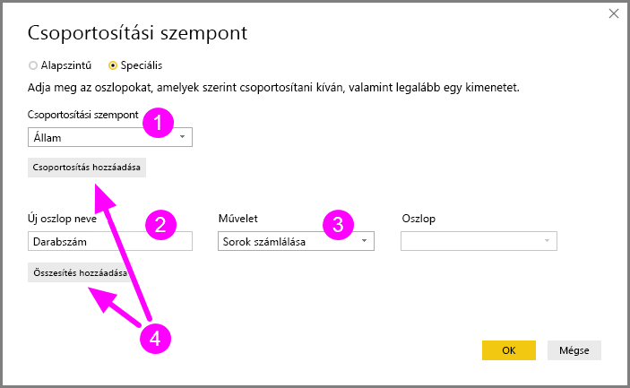

Az **OK** gombra kattintva a Query végrehajtja a **Csoportosítási szempont** műveletet, és visszaadja az eredményeket. Az a helyzet, hogy Ohióban, Texasban, Illinoisban és Kaliforniában is most már több mint ezer ügynökség található!

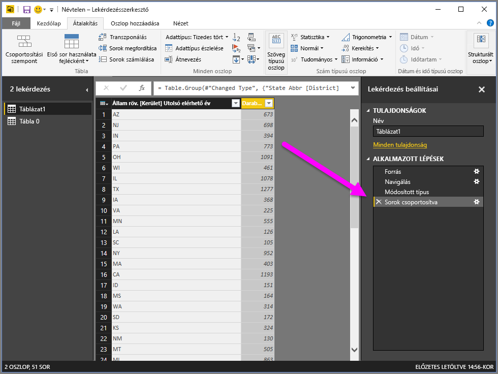

Power Query-szerkesztővel bármikor eltávolíthatja az utolsó formázási műveletet. A **Lekérdezési beállítások** panel **Alkalmazott lépések** területén válassza a legutóbb befejezett lépések melletti **X** gombot. Lásson hozzá a kísérletezéshez! Ha nem elégedett az eredményekkel, újra és újra megismételhet egy lépést a Power Query-szerkesztővel, amíg az adatok el nem érik a kívánt formát.

## Oszlopok forgatása

Az oszlopok forgatásával olyan táblákat hozhat létre, amelyek összesített értékeket tartalmaznak egy adott oszlop minden egyedi értékére vonatkozóan. Például ha tudni szeretné, hogy hány különböző termék van az egyes termékkategóriákban, gyorsan létrehozhat egy táblát, amely ezt mutatja ki.

Lássunk erre egy példát. Az alábbi **Products_by_Categories** (Termékek_kategória_szerint) tábla úgy lett kialakítva, hogy csak az egyes egyedi termékeket jelenítse meg (név alapján), illetve azt, hogy melyik termék melyik kategóriába tartozik. Egy olyan új tábla létrehozásához, amely az egyes kategóriákban lévő termékek számát mutatja (a **CategoryName** oszlop alapján), jelölje ki az oszlopot, majd válassza az **Átalakítás** > **Forgatott oszlop** lehetőséget.

Megjelenik a **Forgatott oszlop** párbeszédpanel, amelyből megtudhatja, hogy mely oszlop értékei lesznek felhasználva új oszlopok létrehozásához (1). (Ha a **CategoryName** oszlopnév nem látható, válassza ki a legördülő listából.) Amikor kibontja a **Speciális beállítások** (2) területet, kiválaszthatja az összesített értékekre alkalmazni kívánt függvényt (3).

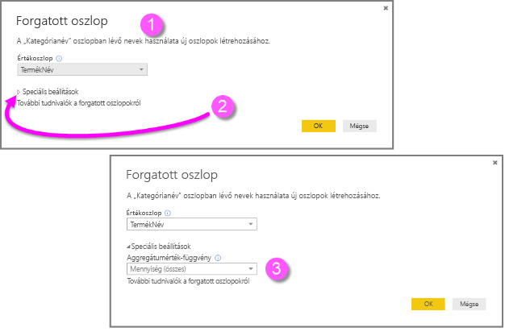

Az **OK** gombra kattintva a Lekérdezésszerkesztő megjeleníti a táblát a **Forgatott oszlop** párbeszédpanelen megadott átalakítási utasítások alapján.

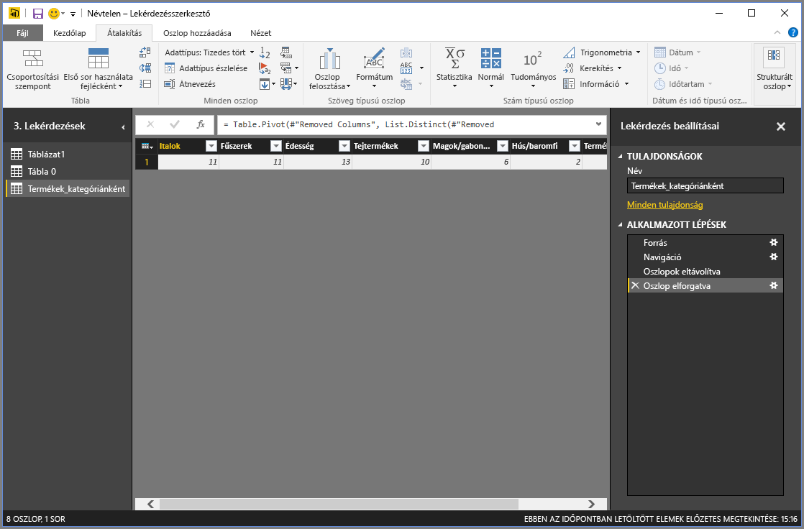

## Egyéni oszlopok létrehozása

A Power Query-szerkesztőben létrehozhat olyan egyéni képleteket, amelyek a tábla több oszlopán is működnek. Ezután az ilyen képletek eredményeit egy új (egyéni) oszlopba helyezheti. A Power Query-szerkesztő segítségével egyszerűen hozhat létre egyéni oszlopokat.

A Power Query-szerkesztő Excel-munkafüzet adatainál lépjen a menüszalag **Oszlop hozzáadása** lapjára, majd válassza az **Egyéni oszlop**lehetőséget.

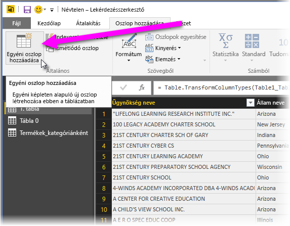

Megnyílik a következő párbeszédpanel. Ebben a példában egy *Percent ELL* nevű egyéni oszlopot hozunk létre, amely az angol nyelvet tanuló (English Language Learners, ELL) diákok százalékos arányát számítja ki.

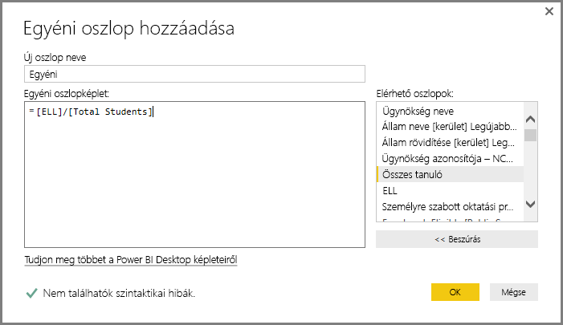

Mint minden más alkalmazott Power Query-szerkesztőbeli lépésnél, ha az új egyéni oszlop nem adja ki a keresett adattípust, akkor törölheti a lépést. A **Lekérdezési beállítások** panel **Alkalmazott lépések** területén válassza a **Hozzáadott egyéni oszlop** melletti **X** gombot.

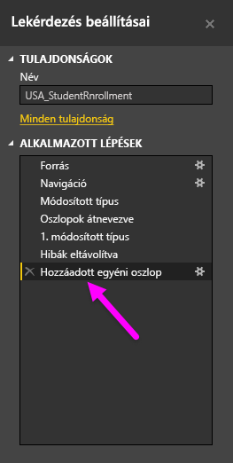

## Lekérdezési képletek

A Power Query-szerkesztő által létrehozott lépéseket szerkesztheti. Létrehozhat egyéni képleteket is, amelyekkel csatlakozhat az adatokhoz, és azokat pontosabban alakíthatja. Amikor a Power Query-szerkesztő valamilyen műveletet hajt végre az adatokon, az alkalmazott képlet megjelenik a képletsávban. A képletsáv megjelenítéséhez jelölje ki a **Képletsáv** elemet a menüszalag **Nézet** lapján.

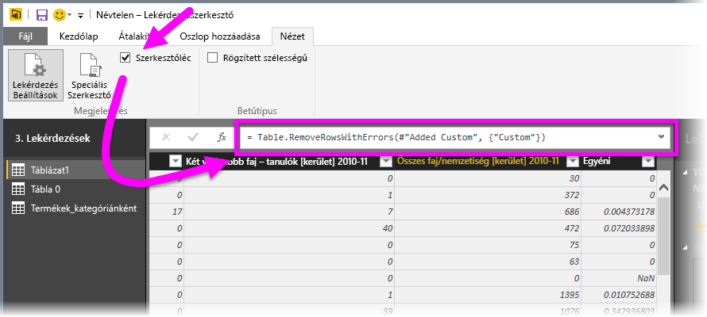

A Power Query-szerkesztő az egyes lekérdezések alkalmazott lépéseit szövegként megőrzi, amely megtekinthető és módosítható. A **Speciális szerkesztővel** bármilyen lekérdezés szövegét módosíthatja. Egyszerűen válassza a **Nézet** > **Speciális szerkesztő** lehetőséget.

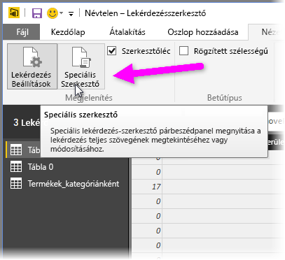

A **Speciális szerkesztő** a következőképpen néz ki, amikor éppen az **USA\_StudentEnrollment** lekérdezés lépéseit jeleníti meg. Ezek a lépések a Power Query képletnyelv – gyakori nevén az *M* – használatával íródtak. További információ: [További tudnivalók a Power Query-képletekről](https://support.office.com/article/learn-about-power-query-formulas-6bc50988-022b-4799-a709-f8aafdee2b2f). A nyelvi specifikációt [A Power Query M nyelv specifikációi](/powerquery-m/power-query-m-language-specification) című cikkben tekintheti meg.

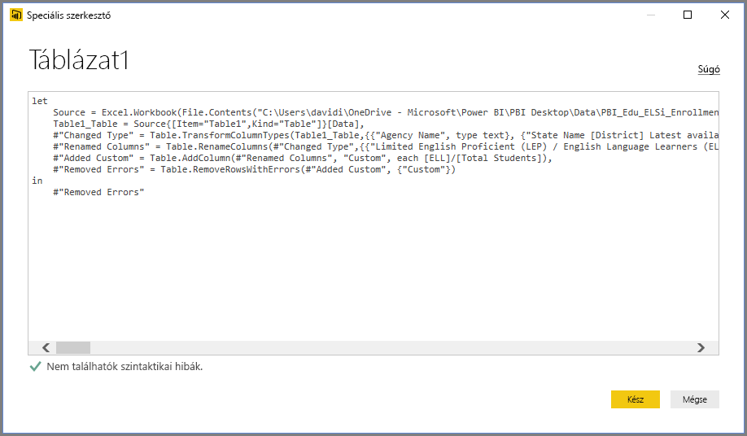

A Power BI Desktop számos képletkategória használatát teszi lehetővé. További információkért és a Power Query-szerkesztő képleteinek teljes referenciájáért tekintse meg [A Power Query M-függvényének referenciája](/powerquery-m/power-query-m-function-reference) című cikket.

## Következő lépések

A Power BI Desktop műveletek és lehetőségek széles tárházát tartalmazza. A program képességeivel kapcsolatos további információkért tekintse meg az alábbi forrásanyagokat:

* [Mi az a Power BI Desktop?](desktop-what-is-desktop.md)
* [Lekérdezések áttekintése a Power BI Desktopban](desktop-query-overview.md)
* [Adatforrások a Power BI Desktopban](desktop-data-sources.md)
* [Csatlakozás adatokhoz a Power BI Desktopban](desktop-connect-to-data.md)
* [Adatok formázása és kombinálása a Power BI Desktoppal](desktop-shape-and-combine-data.md)
