# Feltételes formázás használata táblázatokban 

A Power BI Desktop-táblázatok feltételes formázásával a mezőértékek alapján határozhat meg egyéni cellszíneket (akár színátmeneteket is). A cellák értékeit adatsávokkal vagy KPI-ikonokkal, illetve aktív webhivatkozásként is ábrázolhatja. Bármilyen szöveg- vagy adatmezőre alkalmazhat feltételes formázást, ha a mező formázását egy olyan mezőre alapozza, amelynek értéke numerikus, színnév vagy hexadecimális kód, vagy egy webes URL-cím. 

A feltételes formázás alkalmazásához válasszon ki egy **Táblázat** vagy **Mátrix** típusú vizualizációt a Power BI Desktopban. A **Vizualizációk** panel **Mezők** szakaszában kattintson a jobb gombbal a formázni kívánt mezőre, vagy válassza a mellette lévő lefelé mutató nyilat az **Értékek** gyűjtőben. Válassza a **Feltételes formázás** lehetőséget, majd válassza ki az alkalmazni kívánt formázási típust.

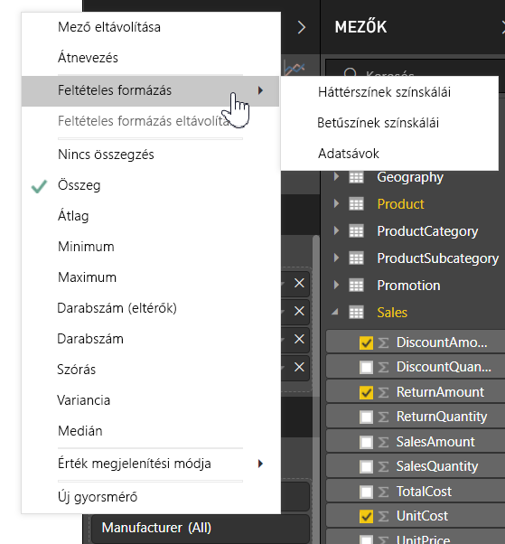

> [!NOTE]
> A feltételes formázás felülbírálja a feltételesen formázott cellára esetlegesen alkalmazott egyéni háttérszínt vagy betűszínt.

A vizualizációk feltételes formázásának eltávolításához válassza a **Feltételes formázás eltávolítása** lehetőséget a mező legördülő menüjében, majd válassza ki az eltávolítandó formázástípust.

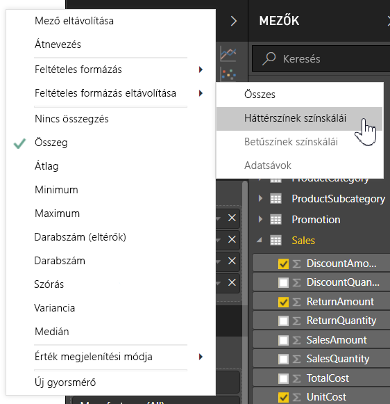

A következő bekezdések az egyes feltételes formázási lehetőségeket ismertetik. Egy adott táblázatoszlopban több lehetőséget is kombinálhat.

## Háttér- vagy betűszín formázása

A cella háttér- vagy betűszínének formázásához válassza a  **Feltételes formázás** lehetőséget egy mezőnél, majd a legördülő menüben válassza a **Háttérszín** vagy a **Betűszín** lehetőséget. 

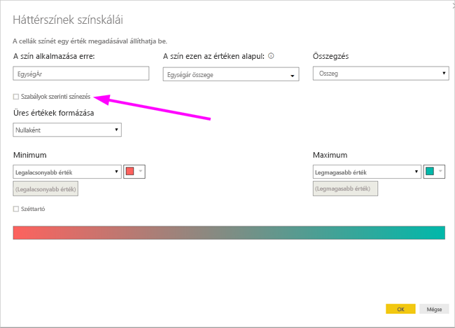

Megnyílik a **Háttérszín** vagy a **Betűszínt** párbeszédpanel, és a címben szerepel a formázott mező neve. A feltételes formázási beállítások kiválasztása után válassza az **OK** gombot. 

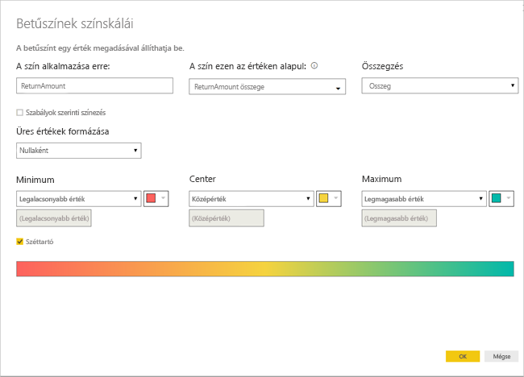

A **Háttérszín** és a **Betűszín** lehetőségei azonosak, de előbbi a cella háttérszínét, utóbbi annak betűszínét befolyásolja. Egy mező betűszínére és háttérszínére megegyező vagy eltérő feltételes formázást is alkalmazhat. Ha egy mező betű- és háttérszínét azonosra állítja, a betűk beleolvadnak a háttérbe, így a táblázatoszlopban csak a színek jelennek meg.

## Szín színskála alapján

Ha a cella háttér- vagy betűszínét színskála alapján szeretné formázni, akkor a **Háttérszín** vagy a **Betűszín** párbeszédpanel **Formázás a következő szerint** mezőjében válassza a **Színskála** lehetőséget. **A mező alapján** szakaszban válassza ki azt a mezőt, amelyre alapozni szeretné a formázást. A formázást alapozhatja az aktuális mezőre vagy a modell bármely olyan mezőjére, amely numerikus vagy színadatokat tartalmaz. 

Az **Összesítés** szakaszban adja meg a kiválasztott mezőhöz használni kívánt aggregációtípust. Az **Alapértelmezett formázás** szakaszban válassza az üres értékekre alkalmazni kívánt formázást. 

A **Minimum** és a **Maximum** szakaszban adja meg, hogy kíván-e színsémát alkalmazni a legkisebb és a legnagyobb mezőértékek vagy a megadott egyéni értékek alapján. Nyissa le és válassza ki a színpalettákat, amelyeket alkalmazni szeretne a minimális és a maximális értékekre. A **Széttartó** jelölőnégyzet bejelölésével egy **Középső** értéket és színt is megadhat. 

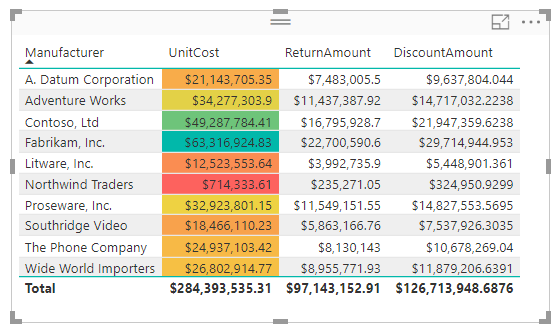

Példatáblázat a **Megfizethetőség** oszlopra alkalmazott színskálás háttérformátummal:

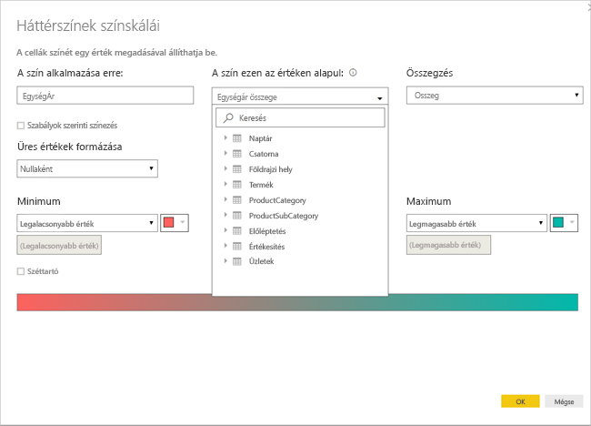

A **Megfizethetőség** oszlopra alkalmazott színskálás betűformátumú példatáblázat a következőképpen néz ki:

## Szabályok szerinti színezés

Ha a cella háttér- vagy betűszínét szabályok alapján szeretné formázni, akkor a **Háttérszín** vagy a **Betűszín** párbeszédpanel **Formázás a következő szerint** mezőjében válassza a **Szabályok** lehetőséget. Ebben az esetben is **A mező alapján** szakaszban látható az a mező, amelyre alapozni szeretné a formázást, és az **Összesítés** szakaszban látható a mező aggregációtípusa. 

A **Szabályok** szakaszban adjon meg egy vagy több értéktartományt, és mindhez állítson be egy színt. Minden értéktartományban szerepel egy *Ha az érték* feltétel, egy *és* értékfeltétel és egy szín. Az egyes értéktartományokba tartozó cellák háttere vagy betűkészlete a megadott színű lesz. A következő példa három szabályt tartalmaz:

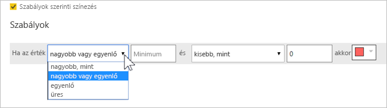

Példatáblázat a **Megfizethetőség** oszlopra alkalmazott szabályalapú háttérszínformátummal:

## Szín színértékek alapján

Ha egy színnevek vagy hexadecimális értékek adatait tartalmazó mezővel vagy mértékkel rendelkezik, akkor feltételes formázással automatikusan alkalmazhatja ezeket a színeket egy oszlop háttér- vagy betűszínére. Egyéni logikával is alkalmazhat színeket a betűkészletre vagy a háttérre.

A mezőben bármely olyan szín használható, amely szerepel a CSS színspecifikációjában [https://www.w3.org/TR/css-color-3/](https://www.w3.org/TR/css-color-3/). Ilyen színértékek lehetnek a következők:
- 3, 6 vagy 8 számjegyű hexadecimális kódok. Példa: #3E4AFF. A kód első karaktereként mindig írja be a # jelet. 
- RGB- vagy RGBA-értékek. Példa: RGBA(234, 234, 234, 0.5).
- HSL- vagy HSLA-értékek. Példa: HSLA(123, 75%, 75%, 0.5).
- Színnevek. Példa: Green (Zöld), SkyBlue (Égkék) vagy PeachPuff (Barackszínű). 

Az alábbi táblázatban minden állapothoz hozzá van rendelve egy szín: 

Ha a **Szín** oszlopot a mezőértékei alapján szeretné formázni, válassza a **Szín** mezőhöz tartozó **Feltételes formázás** lehetőséget, majd a **Háttérszín** vagy a **Betűszín** lehetőséget. 

A **Háttérszín** vagy a **Betűszín** párbeszédpanelen válassza a **Mező értéke** lehetőséget a **Formázás a következő szerint** legördülő mezőben.

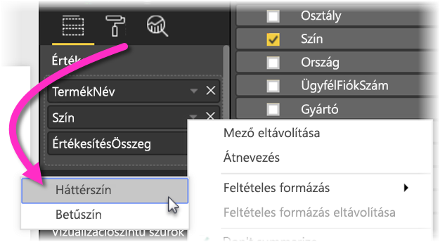

A színmező értékén alapuló **Háttérszín**-formátumú **Szín** mezővel rendelkező példatáblázat a következőképpen néz ki:

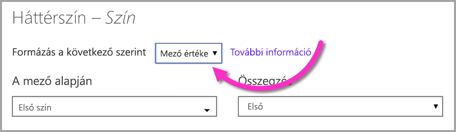

Ha a **Mező értéke** lehetőséggel formázza az oszlop **Betűszínét**, akkor ennek hatására a **Szín** oszlop teli színű lesz:

## Szín számítás alapján

Létrehozhat olyan DAX-számítást, amely a megadott üzleti logikai feltételeknek megfelelően más-más értékeket ad vissza. Általában gyorsabb létrehozni egy DAX-képletet, mint több szabályt létrehozni a feltételes formázási párbeszédpanelen. 

A következő DAX-képlet például hexadecimális színértékeket alkalmaz egy új **Megfizethetőségi rang** oszlopra a meglévő **Megfizethetőség** oszlop értékei alapján:

A színek alkalmazásához válassza a **Háttérszín** vagy a **Betűszín** feltételes formázási lehetőséget a **Megfizethetőség** oszlophoz, és a formázás alapja legyen a **Megfizethetőségi rang** oszlop **Mezőértéke**. 

A példatáblázat, amelyben a **Megfizethetőség** háttérszíne a kiszámított **Megfizethetőségi rangon** alapszik, a következőképpen néz ki:

A fantáziáját és egy kis DAX-ot felhasználva számtalan egyéb változatot is létrehozhat.

## Adatsávok hozzáadása

Ha adatsávokat szeretne megjeleníteni a cellaértékek alapján, válassza a **Megfizethetőség** mezőhöz tartozó **Feltételes formázás** lehetőséget, majd válassza az **Adatsávok** lehetőséget a legördülő menüben. 

Az **Adatsávok** párbeszédpanelen a **Csak sávok megjelenítése** lehetőség alapértelmezés szerint nincs bejelölve, így a cellákban az adatsávok és a tényleges értékek is láthatók. Ha csak az adatsávokat szeretné megjeleníteni, jelölje be a **Csak sávok megjelenítése** jelölőnégyzetet.

Megadhatja a **Minimum** és a **Maximum** értéket, az adatsávok színét és irányát, valamint a tengely színét. 

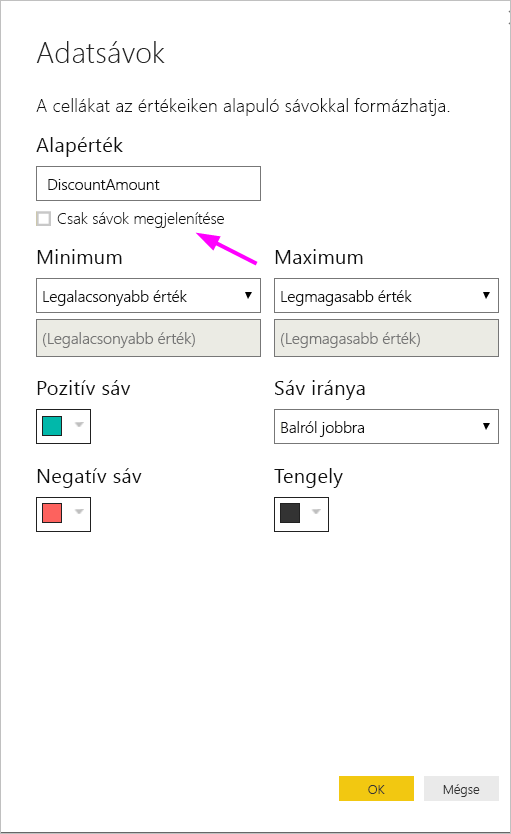

A példatáblázat a következőképpen néz ki a **Megfizethetőség** oszlopra alkalmazott adatsávokkal:

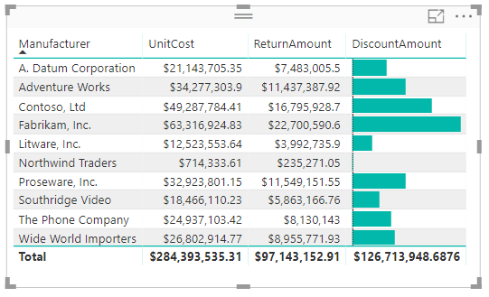

## Ikonok hozzáadása

Ha ikonokat szeretne megjeleníteni a cellaértékek alapján, válassza a mezőhöz tartozó **Feltételes formázás** lehetőséget, majd válassza az **Ikonok** lehetőséget a legördülő menüben. 

Az **Ikonok** párbeszédpanelen, a **Formázás a következő szerint** mezőben válassza a **Szabályok** vagy a **Mező értéke** lehetőséget. 

A szabályok szerinti formázáshoz adja meg **A mező alapján** értékét, az **Összesítés** módszerét, az **Ikonok elrendezését**, az **Ikonok igazítását**, az ikonok **Stílusát**, és egy vagy több **Szabályt**. A **Szabályok** területen adjon meg egy vagy több szabályt egy *Ha az érték* feltétellel és egy *és* értékfeltétellel, és minden szabályhoz válassza ki az alkalmazni kívánt ikont. 

A mezőértékek szerinti formázáshoz adja meg **A mező alapján** értékét, az **Összesítés** módszerét, az **Ikonok elrendezését** és az **Ikonok igazítását**.

Az alábbi példában három szabály alapján vannak ikonok hozzáadva:

Kattintson az **OK** gombra. A példatáblázat a következőképpen néz ki a **Megfizethetőség** oszlopra szabályok alapján alkalmazott ikonokkal:

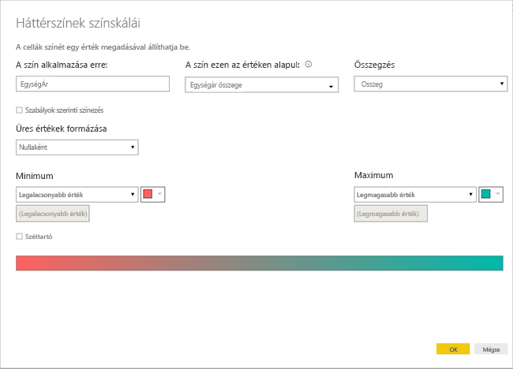

## Formázás webes URL-címként

Ha egy olyan oszloppal vagy mértékkel rendelkezik, amely webhelyek URL-címeit tartalmazza, akkor feltételes formázással aktív hivatkozásokként alkalmazhatja ezeket az URL-címeket a mezőkre. Az alábbi táblázatban például szerepel egy **Webhely** oszlop, amely az egyes állapotok webhely-URL-címeit tartalmazza:

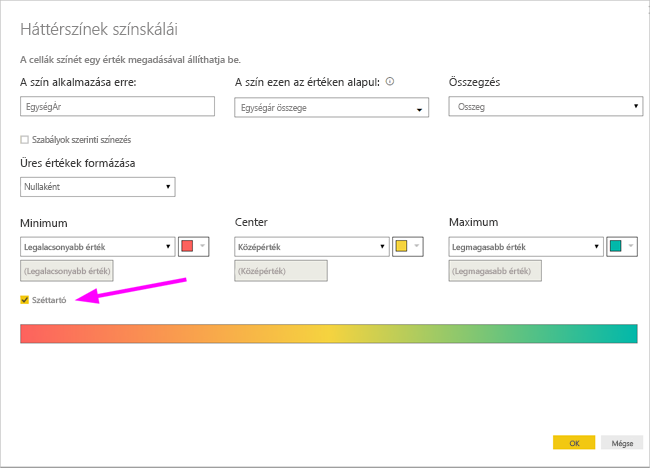

Ha a webhelyük élő hivatkozásaként szeretné megjeleníteni az egyes állapotok neveit, válassza az **Állapot** mezőhöz tartozó **Feltételes formázás** lehetőséget, majd a **Webes URL-cím** lehetőséget. A **Webes URL-cím** párbeszédpanelen **A mező alapján** területen válassza a **Webhely**lehetőséget, majd az **OK** gombot. 

Ha az **Állapot** mezőre a **Webes URL-cím** formázás van alkalmazva, az egyes állapotok nevei a webhelyükre mutató aktív hivatkozások. Az alábbi példatáblázatban a **Webes URL-cím** formázás van alkalmazva az **Állapot** oszlopra, illetve feltételes **Adatsávok** és **Háttérformázás** van alkalmazva a **Megfizethetőség** oszlopra. 

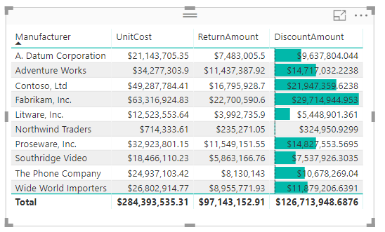

## Megfontolandó szempontok és korlátozások
A feltételes táblázatformázás használatakor érdemes figyelembe venni néhány szempontot:

- A feltételes formázás csak a Táblázat vagy Mátrix típusú vizualizációk értékeire érvényes, és nem vonatkozik a részösszegekre, a végösszegekre vagy az **Összesen** sorra. 
- Minden olyan táblázat, amely nem rendelkezik csoportosítással, egyetlen sorban jelenik meg, amely nem támogatja a feltételes formázást.
- Nem alkalmazhat színátmenetes formázást automatikus maximális/minimális értékekkel vagy százalékos szabályokat alkalmazó szabályalapú formázással, ha az adatokban *NaN* értékek szerepelnek. A NaN jelentése „nem szám” (angolul „Not a number”), amit leggyakrabban a nullával osztás hibája okoz. Ezeket a hibákat a [DIVIDE() DAX-függvény](https://docs.microsoft.com/dax/divide-function-dax) használatával kerülheti el.
- A feltételes formázáshoz szükség van egy aggregálásra vagy egy mértékre, amelyet az értékre kell alkalmazni. Ezért jelenik meg az Első vagy az Utolsó kifejezés az **Érték szerinti színezés** lehetőséget használó példában. Ha egy Analysis Service-beli többdimenziós adatkockán hozza létre a jelentést, akkor nem fog tudni attribútumot használni a feltételes formázáshoz, kivéve, ha az adatkocka tulajdonosa létrehozott egy olyan mértéket, amely megadja az értéket.

## További lépések

A színformázással kapcsolatos további információ: [Tippek és trükkök a színformázáshoz a Power BI-ban](visuals/service-tips-and-tricks-for-color-formatting.md)  

