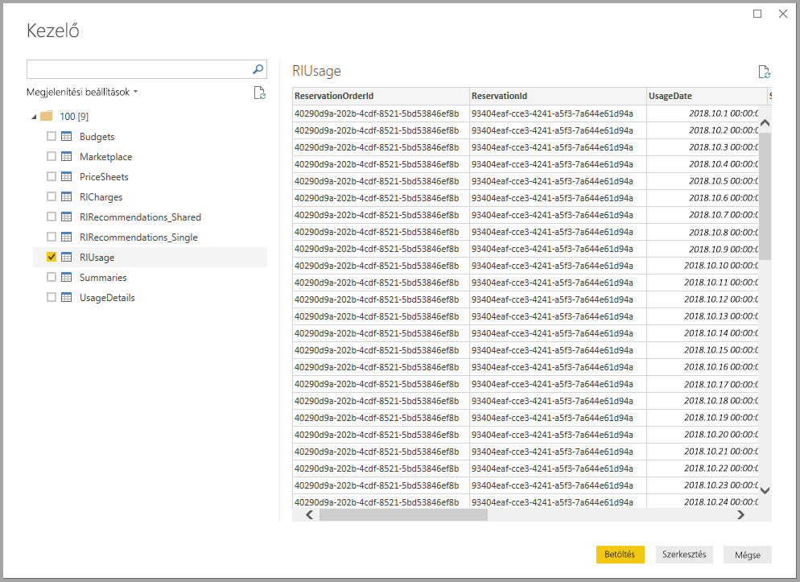
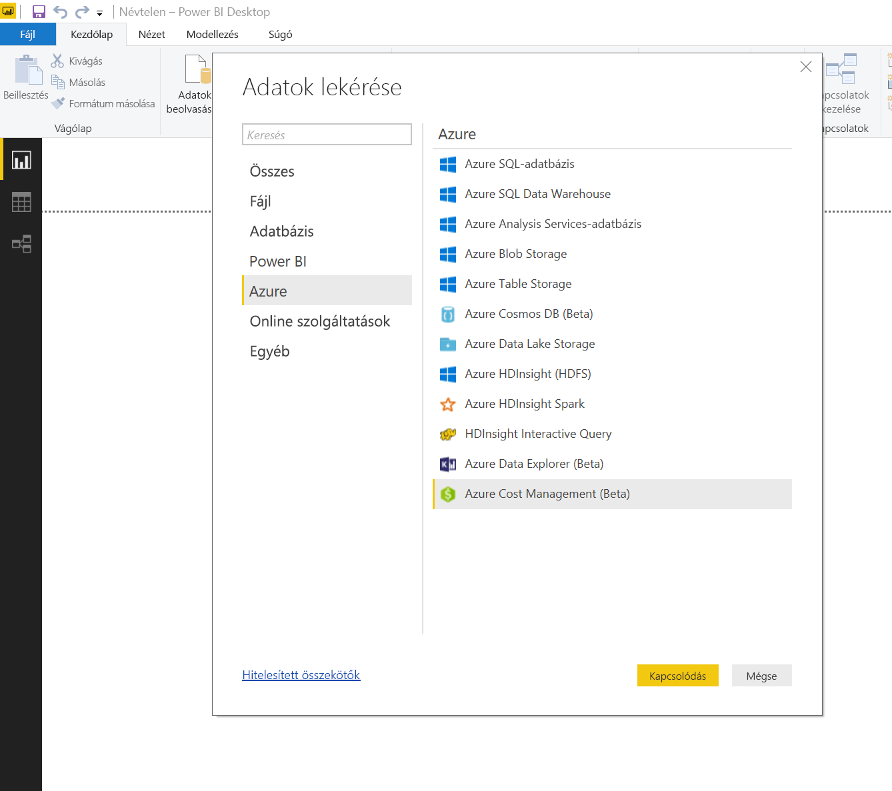
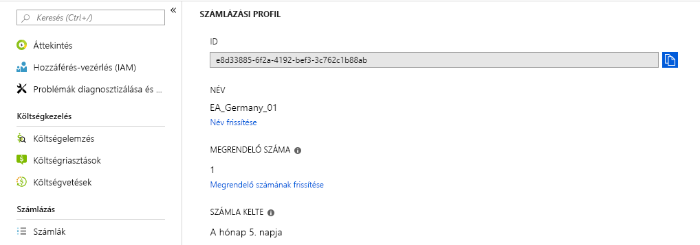
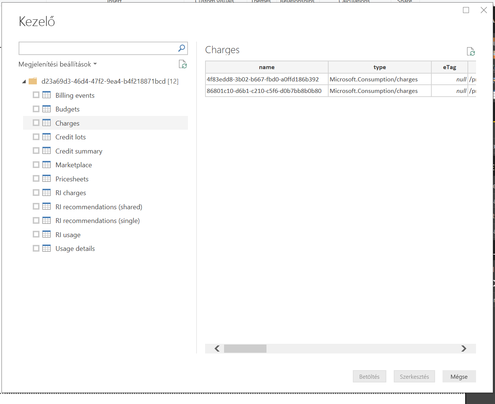
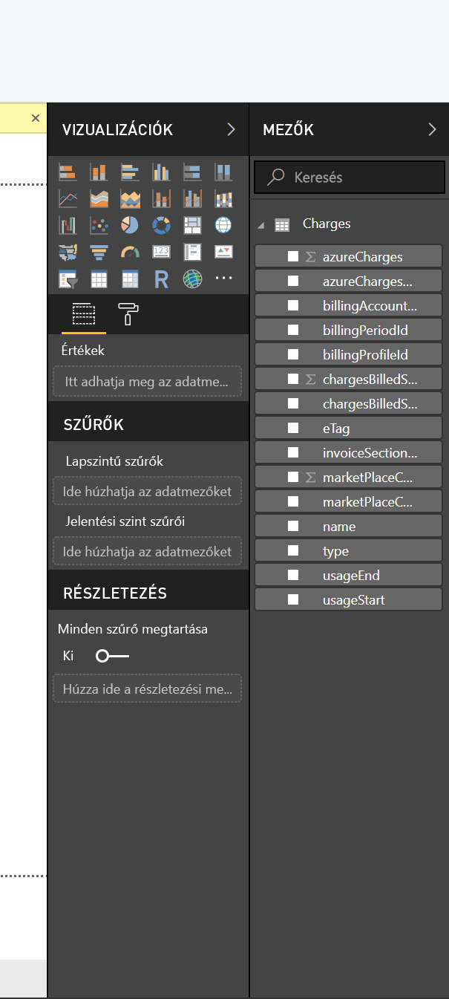

# <a name="analyze-azure-cost-and-usage-data-in-power-bi-desktop"></a>Az Azure költség- és használati adatainak elemzése a Power BI Desktopban

A Power BI Desktopban csatlakozhat az Azure-hoz és részletes adatokat kaphat a szervezete Azure-szolgáltatásainak használatáról. Így egyéni jelentéseket és mértékeket hozhat létre, amelyekkel jobban megértheti és elemezheti az Azure-beli kiadásait.

A Power BI jelenleg a Nagyvállalati Szerződés és az Ügyfélszerződés típusú számlázási fiókokhoz való csatlakozást támogatja.

* **Nagyvállalati szerződés** a felhasználók csatlakozni a **Azure Consumption Insights-összekötő**.

* **Ügyfélszerződéséhez** a felhasználók csatlakozni a **Azure Cost Management-összekötő**.

## <a name="connect-with-azure-consumption-insights"></a>Kapcsolódás az Azure Consumption Insights segítségével

Azure Consumption Insights lehetővé teszi, Azure Nagyvállalati Szerződéses számlázási fiókokhoz csatlakozzon.

Ebben a szakaszban megtudhatja, hogyan kérheti le a kívánt adatokat, hogyan migrálhat az Azure Enterprise Connector használatáról, valamint megtalálhatja az **ACI** (Azure Consumption Insights) API-ban elérhető *használatiadat-oszlopok* térképét.

Az **Azure Consumption Insights** összekötővel történő sikeres kapcsolódáshoz hozzáféréssel kell rendelkeznie a Vállalati szolgáltatásokhoz az Azure Portalon.

Az **Azure Consumption Insights** összekötővel való kapcsolódáshoz kattintson a **Lekérdezés** gombra a **Power BI Desktop** **Kezdőlap** menüszalagján. A bal oldali kategóriák közül válassza az **Online szolgáltatások** lehetőséget, ekkor megjelenik a **Microsoft Azure Consumption Insights (Béta)** . Kattintson a **Csatlakozás** gombra.


A megjelenő párbeszédablakban adja meg a *beléptetési számát*.


* A beléptetési számot az [Azure Enterprise Portalról](https://ea.azure.com) kérheti le, a következő képen látható helyről:
  
  
  
  Az összekötő ezen verziója csak a https://ea.azure.com címről érkező vállalati belépéseket támogatja. A Kínából történő belépések jelenleg nem támogatottak.

Következő lépésként adja meg a *Hozzáférési kulcsát* a csatlakozáshoz.


* A beléptetéshez használatos hozzáférési kulcsát az [Azure Enterprise Portalon](https://ea.azure.com) kérheti le.
  
  

Miután megadta *hozzáférési kulcsát*, és kiválasztotta a **Csatlakozás** lehetőséget, megjelenik a **Kezelő** ablak, rajta az Ön számára elérhető kilenc táblával: 
* **Budgets**: Költségvetési részleteket tartalmaz a tényleges költségek vagy használat és a költségkeret összehasonlításához. 
* **MarketPlace**: Használatalapú Azure Marketplace-díjakat tartalmaz.
* **PriceSheets**: Egy regisztráció mérőnként érvényesíthető díjait tartalmazza.
* **RICharges**: A fenntartott példányaival kapcsolatos utolsó 24 havi díjakat tartalmazza.
* **RIRecommendations_Single**: Fenntartott példányok vásárlására vonatkozó javaslatokat tartalmaz az egy előfizetésen belül 7, 30 vagy 60 napon át tapasztalt használati trendek alapján.
* **RIRecommendations_Shared**: Fenntartott példányok vásárlására vonatkozó javaslatokat tartalmaz az összes előfizetésen belül 7, 30 vagy 60 napon át tapasztalt használati trendek alapján.
* **RIUsage**: Az utolsó hónapra vonatkozó fogyasztási részleteket tartalmaz meglévő fenntartott példányairól.
* **Summaries**: Havi összegzést nyújt az egyenlegekről, új vásárlásokról, az Azure Marketplace-szolgáltatások díjairól, módosításokról és kerettúllépési díjakról.
* **UsageDetails**: Egy előfizetés fogyasztott mennyiségeinek és a becsült díjainak részletezését tartalmazza.

Ha valamelyik tábla jelölőnégyzetét bejelöli, megjelenik egy előnézet. Több táblát is kiválaszthat a nevek melletti jelölőnégyzetekkel, majd kattintson a **Betöltés** gombra.



> [!NOTE]
> A *Summary* és *PriceSheet* táblák csak a beléptetési szintű API-kulcsokkal elérhetők. A táblák alapértelmezés szerint az aktuális havi *használat* és *árlista* adatait tartalmazzák. A *Summary* és a *Marketplace* táblák nem korlátozódnak az aktuális hónapra.
> 
> 

Ha a **Betöltés** gombra kattint, a rendszer betölti az adatokat a **Power BI Desktopba**.


A kiválasztott adatok betöltése után a kiválasztott táblák és mezők láthatók lesznek a **Mezők** panelen.


## <a name="using-azure-consumption-insights"></a>Az Azure Consumption Insights használata
Az **Azure Consumption Insights** összekötő használatához hozzáféréssel kell rendelkeznie a Vállalati szolgáltatásokhoz az Azure Portalon.

Miután sikeresen betöltötte az adatokat az **Azure Consumption Insights** összekötő használatával, létrehozhatja a saját mértékeit és oszlopait a **Lekérdezésszerkesztő** segítségével, és létrehozhat vizualizációkat, jelentéseket és irányítópultokat, amelyeket megoszthat a **Power BI szolgáltatásban**.

Az Azure néhány egyéni mintalekérdezést is tartalmaz, amelyeket üres lekérdezésekkel lehet lekérni. Ehhez a **Power BI Desktop** **Kezdőlap** menüszalagján kattintson a **Lekérdezés** gomb alatti a legördülő nyílra, majd az **Üres lekérdezés** lehetőségre. Ezt a **Lekérdezésszerkesztőben** is megteheti, ha a jobb gombbal rákattint a **Lekérdezések** elemre a bal oldali panelen, majd a megjelenő menüből kiválasztja az **Új lekérdezés > Üres lekérdezés** lehetőséget.

A **képletsávban** gépelje be a következőt:

    = MicrosoftAzureConsumptionInsights.Contents

Megjelenik néhány minta, ahogy az a következő képen látható:


A jelentések használatakor és lekérdezések létrehozásakor használja a következőt:

* A jelenlegi dátumtól számított hónapok számának meghatározásához használja a *numberOfMonth* paramétert
  * Használjon egy 1 és 36 közti értéket, amely az importálni kívánt hónapok számát jelöli, a jelenlegi dátumtól számítva. Javasoljuk, hogy ne kérjen le 12 hónapnál több adatot, hogy elkerülje az importálási korlátozások és a lekérdezésekhez a Power BI-ban engedélyezett adatmennyiségek küszöbértékeit.
* Egy több hónapos múltbéli időszak meghatározásához használja a *startBillingDataWindow* és *endBillingDataWindow* paramétereket
* *Ne* használja egyszerre a *numberOfMonth* paramétert a *startBillingDataWindow* vagy *endBillingDataWindow* paraméterekkel

## <a name="migrating-from-the-azure-enterprise-connector"></a>Migrálás az Azure Enterprise Connectorból
Egyes ügyfelek az *Azure Enterprise Connector (bétaverzió)* használatával hoztak létre vizualizációkat. Ez a szoftver idővel meg fog szűnni, és az **Azure Consumption Insights** veszi át a helyét. Az **Azure Consumption Insights** összekötő funkciói és fejlesztési közé tartoznak a következők:

* További elérhető adatforrások az *Egyenleg összesítése* és a *Marketplace vásárlások* esetében
* Új és speciális paraméterek, pl. *startBillingDataWindow* és *endBillingDataWindow*
* Jobb teljesítmény és válaszképesség

Az ügyfelek átválthatnak az újabb **Azure Consumption Insights**-összekötőre, és megőrizhetik az elkészült egyéni irányítópultjaikat és jelentéseiket. Az új összekötőre a következő lépésekkel állhatnak át.

### <a name="step-1-connect-to-azure-using-the-new-connector"></a>1. lépés: Csatlakozás az Azure-hoz az új összekötővel
Az első lépés a csatlakozás az **Azure Consumption Insights**-összekötővel, amit jelen cikk korábbi része ismertetett részletesen. Ebben a lépésben a **Power BI Desktop** **Kezdőlap** szalagján válassza a **Lekérdezés > Üres lekérdezés** lehetőséget.

### <a name="step-2-use-the-advanced-editor-to-create-a-query"></a>2. lépés: Lekérdezés létrehozása a Speciális szerkesztő használatával
A **Lekérdezésszerkesztőben** válassza a **Speciális szerkesztőt** a **Kezdőlap** menüszalag **Lekérdezés** szakaszában. A megjelenő **Speciális szerkesztő** ablakban adja meg az alábbi lekérdezést:

    let    
        enrollmentNumber = "100",
        optionalParameters = [ numberOfMonth = 6, dataType="DetailCharges" ],
        data = MicrosoftAzureConsumptionInsights.Contents(enrollmentNumber, optionalParameters)   
    in     
        data


Az *enrollmentNumber* értékének helyére be kell helyettesítenie a saját beléptetési számát, amelyet az [Azure Enterprise Portalról](https://ea.azure.com) kérhet le. A *numberOfMonth* paraméter adja meg, hány hónapot szeretne visszamenni az aktuális adatoktól számítva. A nulla (0) érték az aktuális hónapot jelöli.

Miután rákattintott a **Kész** gombra a **Speciális szerkesztőben**, az előnézet frissül és a táblában megjelennek a megadott hónaptartományra vonatkozó adatok. Kattintson a **Bezárás és alkalmazás** gombra a visszalépéshez.

### <a name="step-3-move-measures-and-custom-columns-to-the-new-report"></a>3. lépés: Mértékek és egyéni oszlopok áthelyezése az új jelentésbe
Ezután át kell helyezni minden létrehozott egyéni oszlopot és mértéket a részleteket tartalmazó új táblába. A lépések a következők.

1. Nyissa meg a Jegyzettömböt (vagy egy másik szövegszerkesztőt).
2. Válassza ki az áthelyezni kívánt mértéket, másolja ki a *Képlet* mező szövegét, és illessze be a Jegyzettömbben.
   
   
3. Nevezze át a *Lekérdezés1* táblát a részleteket tartalmazó tábla eredeti nevére.
4. Hozzon létre úgy mértékeket és egyéni oszlopokat a táblában úgy, hogy jobb gombbal a táblára kattint, és az **Új mérték** lehetőséget választja, majd kivágja és beilleszti az áruházzal kapcsolatos mértékeket és oszlopokat, amíg mindegyikükkel nem végez.

### <a name="step-4-re-link-tables-that-had-relationships"></a>4. lépés: A kapcsolatokkal rendelkezett táblák újrakapcsolása
Számos irányítópult rendelkezik kereséshez vagy szűréshez használt táblákkal, dátumtáblákkal és egyéni projektekhez használt táblákkal. Ezen kapcsolatok ismételt megadása megoldja a fennmaradó problémák nagy részét. Ennek menete a következő.

- A **Power BI Desktop** **Modellezés** lapján kattintson a **Kapcsolatok kezelése** lehetőségre. Ekkor megnyílik egy ablak, amelyben a modellen belüli kapcsolatok kezelhetők. Kapcsolja újra a táblákat szükség szerint.
   
    

### <a name="step-5-verify-your-visuals-and-adjust-field-formatting-as-needed"></a>5. lépés: Vizualizációk ellenőrzése, mezők formázásának igazítása
Ha eddig eljutott, akkor az eredeti vizualizációk, táblák és részletezések többségének már megfelelő módon működnie kell. Azonban még szükség lehet néhány kisebb igazításra a formázásban, hogy minden pontosan úgy nézzen ki, ahogy Ön szeretné. Szánjon egy kis időt az egyes irányítópultok és vizualizációk áttekintésére.

## <a name="using-the-azure-consumption-and-insights-aci-api-to-get-consumption-data"></a>Az Azure Consumption Insights (ACI) API használata a használati adatok lekéréséhez
Az Azure biztosítja az [**Azure Consumption Insights (ACI) API**](https://azure.microsoft.com/blog/announcing-general-availability-of-consumption-and-charge-apis-for-enterprise-azure-customers/)-t is. Létrehozhatja a saját egyéni megoldásait az Azure-használati adatok gyűjtéséhez, a jelentéskészítéshez és a vizualizáláshoz az ACI API használatával.

### <a name="mapping-names-and-usage-details-between-the-portal-the-connector-and-the-api"></a>Nevek és használati adatok társítása a portál, az összekötő és az API között
Az Azure Portal adatainak oszlopai és nevei hasonlóak az API-éhoz és az összekötőéhez, de nem mindig azonosak. A tisztánlátás érdekében az alábbi tábla tartalmazza az API, az összekötő és az Azure Portal oszlopainak társításait. A táblázat azt is jelzi, ha egy oszlop elavult. Ezen kifejezések definícióit és további információkat az [Azure-számlázási adatok szótárában](https://docs.microsoft.com/azure/billing/billing-enterprise-api-usage-detail) találja meg.

| ACI összekötő/tartalomcsomag oszlopneve | ACI API oszlopneve | EA oszlopneve | Elavult/visszamenőleges kompatibilitási célból érhető el |
| --- | --- | --- | --- |
| AccountName |accountName |Account Name |Nem |
| AccountId |accountId | |Igen |
| AcccountOwnerId |accountOwnerEmail |AccountOwnerId |Nem |
| AdditionalInfo |additionalInfo |AdditionalInfo |Nem |
| AdditionalInfold | | |Igen |
| Consumed Quantity |consumedQuantity |Consumed Quantity |Nem |
| Consumed Service |consumedService |Consumed Service |Nem |
| ConsumedServiceId |consumedServiceId | |Igen |
| Cost |cost |ExtendedCost |Nem |
| Cost Center |costCenter |Cost Center |Nem |
| Date |date |Date |Nem |
| Day | |Day |Nem |
| DepartmentName |departmentName |Department Name |Nem |
| DepartmentID |departmentId | |Igen |
| Instance ID | | |Igen |
| InstanceId |instanceId |Instance ID |Nem |
| Location | | |Igen |
| Meter Category |meterCategory |Meter Category |Nem |
| Meter ID | | |Igen |
| Meter Name |meterName |Meter Name |Nem |
| Meter Region |meterRegion |Meter Region |Nem |
| Meter Sub-Category |meterSubCategory |Meter Sub-Category |Nem |
| MeterId |meterId |Meter ID |Nem |
| Month | |Month |Nem |
| Product |product |Product |Nem |
| ProductId |productId | |Igen |
| Resource Group |resourceGroup |Resource Group |Nem |
| Resource Location |resourceLocation |Resource Location |Nem |
| ResourceGroupId | | |Igen |
| ResourceLocationId |resourceLocationId | |Igen |
| ResourceRate |resourceRate |ResourceRate |Nem |
| ServiceAdministratorId |serviceAdministratorId |ServiceAdministratorId |Nem |
| ServiceInfo1 |serviceInfo1 |ServiceInfo1 |Nem |
| ServiceInfo1Id | | |Igen |
| ServiceInfo2 |serviceInfo2 |ServiceInfo2 |Nem |
| ServiceInfo2Id | | |Igen |
| Store Service Identifier |storeServiceIdentifier |Store Service Identifier |Nem |
| StoreServiceIdentifierId | | |Igen |
| Subscription Name |subscriptionName |Subscription Name |Nem |
| Tags |tags |Tags |Nem |
| TagsId | | |Igen |
| Unit Of Measure |unitOfMeasure |Unit Of Measure |Nem |
| Year | |Year |Nem |
| SubscriptionId |subscriptionId |SubscriptionId |Igen |
| SubscriptionGuid |subscriptionGuid |SubscriptionGuid |Nem |

## <a name="connect-with-azure-cost-management"></a>Kapcsolódás az Azure Cost Management segítségével

Ebben a szakaszban megtudhatja, hogyan csatlakozhat az Ügyfélszerződéses számlázási fiókhoz.

> [!NOTE]
> Az Azure Cost Management-összekötő jelenleg támogatja az ügyfelek a **Ügyfélszerződéséhez**.  **Nagyvállalati szerződés** ügyfelek kell használnia a Microsoft Azure Consumption Insights-összekötő.
> 
> 

Az **Azure Cost Management** összekötővel való csatlakozáshoz kattintson az **Adatok lekérése** gombra a **Power BI Desktop** **Kezdőlap** menüszalagján.  Válassza a bal oldali kategóriák közül az **Azure** elemet. Ekkor megjelenik az **Azure Cost Management (Beta)** elem. Kattintson a **Csatlakozás** gombra.



A megjelenő párbeszédpanelen adjon meg a *számlázási profil azonosítóját*.


Az számlázási profil azonosítóját [Azure Portalról](https://portal.azure.com) kérheti le.  Lépjen a **Költségkezelés + számlázás** területre, válassza ki a számlázási fiókot, majd az oldalsávon a **Számlázási profilok** lehetőséget.  Válassza ki a számlázási profilját, majd válassza az oldalsávon a **Tulajdonságok** elemet.  Másolja a vágólapra a számlázási profilazonosítót.



Be kell jelentkeznie az Azure-os e-mail-címével és jelszavával.  A hitelesítést követően megjelenik egy **navigátor** ablak, amelyben tizenkét tábla található:

* **Számlázási események**: Új számlák, kreditvásárlások és egyebek naplói.
* **Budgets**: Költségvetési részleteket tartalmaz a tényleges költségek vagy használat és a költségkeret összehasonlításához. 
* **Díjak**: Az Azure-használat, a Marketplace-díjak és a külön számlázott díjak havi szintű összefoglalása.
* **Kreditek**: Az Azure-kreditek vásárlási részletei az adott számlázási profilhoz.
* **Kreditösszegzés**: Az adott számlázási profil kreditösszegzése.
* **Marketplace**: Használatalapú Azure Marketplace-díjakat tartalmaz.
* **PriceSheets**: Az adott számlázási profil mérőnként érvényesíthető díjait tartalmazza.
* **RI-díjak**: A fenntartott példányaival kapcsolatos utolsó 24 havi díjakat tartalmazza.
* **RI-javaslatok (önálló)** : Fenntartott példányok vásárlására vonatkozó javaslatokat tartalmaz az egy előfizetésen belül 7, 30 vagy 60 napon át tapasztalt használati trendek alapján.
* **RI-javaslatok (megosztott)** : Fenntartott példányok vásárlására vonatkozó javaslatokat tartalmaz az összes előfizetésen belül 7, 30 vagy 60 napon át tapasztalt használati trendek alapján.
* **RI-használat**: Az utolsó hónapra vonatkozó fogyasztási részleteket tartalmaz meglévő fenntartott példányairól.
* **Használat részletei**: Az adott számlázási profilazonosító fogyasztott mennyiségeinek és a becsült díjainak részletezését tartalmazza.

Ha valamelyik tábla jelölőnégyzetét bejelöli, megjelenik egy előnézet.  Több táblát is kiválaszthat a nevek melletti jelölőnégyzetekkel, majd a **Betöltés** gombra kattintással.



Ha a **Betöltés** gombra kattint, a rendszer betölti az adatokat a **Power BI Desktopba**.


A kiválasztott adatok betöltése után a kiválasztott táblák és mezők láthatók lesznek a **Mezők** panelen.



## <a name="writing-custom-queries"></a>Egyéni lekérdezések írása

Ha testre szeretné szabni a hónapok számát, módosítani szeretné az API-verziót, vagy speciális logikát szeretne futtatni a visszaadott adatokon, hozzon létre egy egyéni M-lekérdezést.

Ehhez a **Power BI Desktop** **Kezdőlap** menüszalagján kattintson az **Adatok lekérése** gomb alatti legördülő menüre, majd az **Üres lekérdezés** lehetőségre.  Ezt a **Lekérdezésszerkesztőben** is megteheti, ha a jobb gombbal rákattint a **Lekérdezések** elemre a bal oldali panelen, majd a megjelenő menüből kiválasztja az **Új lekérdezés > Üres menü** lehetőséget.

A **szerkesztőlécen** írja be a következőt kifejezést, a `billingProfileId` elemet cserélje le a valós azonosítóra, a „charges” kifejezést pedig bármelyik érvényes táblanévre (a listát fent találhatja).

```
let
    Source = AzureCostManagement.Tables(billingProfileId, [ numberOfMonths = 3 ]),
    charges = Source{[Key="charges"]}[Data]
in
    charges
```

A `numberOfMonths` bármilyen, 1 és 36 közötti értékre történő módosítása mellett a következőket is megadhatja:

* Az `apiVersion` megszabja, hogy a lekérdezés az API mely verzióját hívja meg.
* A `lookbackWindow` önálló vagy megosztott RI-javaslatok esetén módosítja a javaslatok létrehozásának ablakát (érvényes beállítások: 7, 30 vagy 60 nap)


## <a name="next-steps"></a>Következő lépések
A Power BI Desktop használatával számos adatforráshoz csatlakozhat. Az adatforrásokkal kapcsolatos információkért lásd az alábbi forrásanyagokat:

* [Mi az a Power BI Desktop?](desktop-what-is-desktop.md)
* [Adatforrások a Power BI Desktopban](desktop-data-sources.md)
* [Adatok formázása és kombinálása a Power BI Desktoppal](desktop-shape-and-combine-data.md)
* [Kapcsolódás az Excelhez a Power BI Desktopban](desktop-connect-excel.md)   
* [Adatok közvetlen bevitele a Power BI Desktopba](desktop-enter-data-directly-into-desktop.md)   

