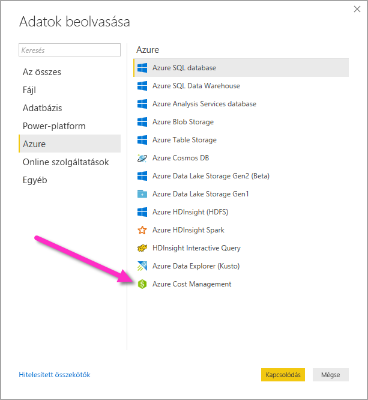
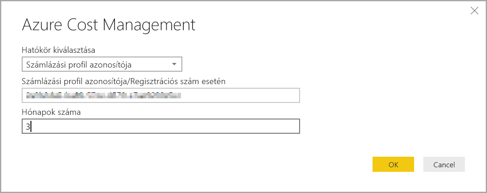
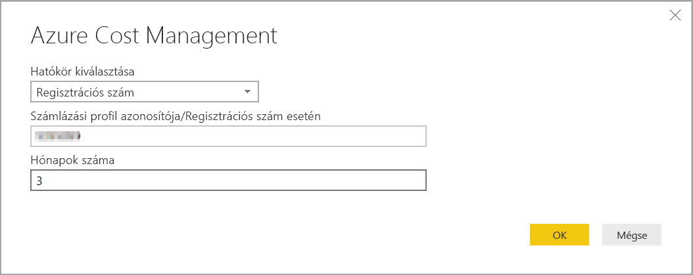
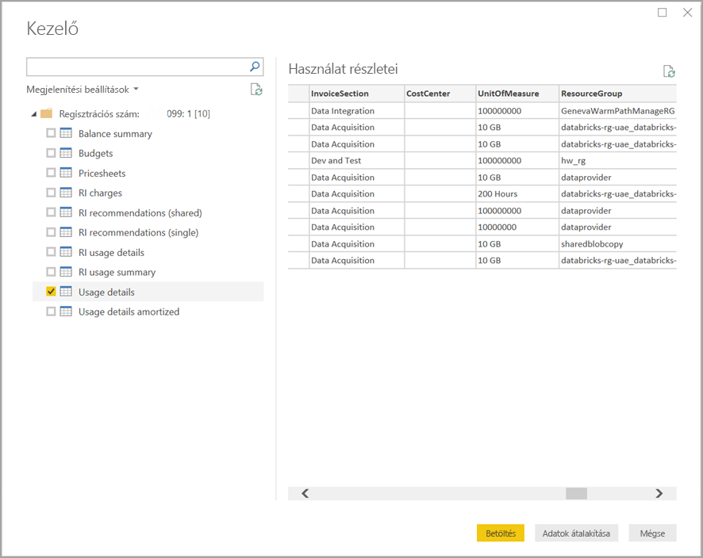

# Vizualizációk és jelentések létrehozása az Azure Cost Management-összekötővel a Power BI Desktopban

A Power BI Desktop Azure Cost Management összekötőjével hatékony, testreszabott vizualizációkat és jelentéseket készíthet, amelyek segítségével jobban megismerheti az Azure-t. Az Azure Cost Management-összekötő jelenleg a [Microsoft Ügyfélszerződéssel](https://azure.microsoft.com/pricing/purchase-options/microsoft-customer-agreement/) vagy a [Nagyvállalati Szerződéssel (EA)](https://azure.microsoft.com/pricing/enterprise-agreement/) rendelkező ügyfeleket támogatja.  

Az Azure Cost Management-összekötő OAuth 2.0 hitelesítést használ az Azure-hoz, és azonosítja az összekötőt használó felhasználókat. Az ebben a folyamatban generált jogkivonatok meghatározott időtartamra érvényesek. A Power BI megőrzi a jogkivonatot a következő bejelentkezéshez. Az OAuth 2.0 annak a folyamatnak a szabványa, amely a háttérben gondoskodik ezeknek az engedélyeknek a biztonságos kezeléséről. A kapcsolódáshoz egy [Nagyvállalati rendszergazdai](https://docs.microsoft.com/azure/billing/billing-understand-ea-roles) fiókot kell használnia a Nagyvállalati Szerződéshez, vagy egy [Számlázási fióktulajdonosi](https://docs.microsoft.com/azure/billing/billing-understand-mca-roles) fiókot a Microsoft Ügyfélszerződéshez. 

> [!NOTE]
> Ez az összekötő felváltja a korábban elérhető [Azure Consumption Insights és Azure Cost Management (bétaverzió)](desktop-connect-azure-consumption-insights.md) összekötőjét. Az előző összekötővel létrehozott jelentéseket újra létre kell hozni ennek az összekötőnek a használatával.

## Kapcsolódás az Azure Cost Management segítségével

Ha az **Azure Cost Management-összekötő** szeretné használni a Power BI Desktopban, az alábbi lépéseket kell elvégeznie:

1.  A **Kezdőlap** menüszalagon válassza az **Adatok lekérése** lehetőséget.
2.  Az adatkategóriák listájában válassza az **Azure-t**.
3.  Válassza az **Azure Cost Management** lehetőséget.

    

4. A megjelenő párbeszédpanelen adja meg vagy a **Microsoft Ügyfélszerződéshez** tartozó **Számlázási profil azonosítóját**, vagy a **Nagyvállalati Szerződéshez (EA)** tartozó **Regisztrációs számot**. 

## Kapcsolódás a Microsoft Ügyfélszerződés-fiókhoz 

Ha kapcsolódni szeretne a **Microsoft Ügyfélszerződési** fiókjához, a **Számlázási profil azonosítóját** az Azure Portalon szerezheti be:

1.  Az [Azure Portalon](https://portal.azure.com/) lépjen a **Költségkezelés + Számlázás** területre.
2.  Jelölje ki a számlázási profilját. 
3.  A **Beállítások** menüterületen az oldalsávon válassza a **Tulajdonságok** lehetőséget.
4.  A **Számlázási profil** területen másolja az **Azonosítót**. 
5.  A **Hatókör kiválasztása** területen válassza a **Számlázási profil azonosítója** lehetőséget, és illessze be az előző lépésben másolt számlázásiprofil-azonosítót. 
6.  Adja meg a hónapok számát, és válassza az **OK** lehetőséget.

    

7.  Ha a rendszer kéri, jelentkezzen be az Azure-beli felhasználói fiókjával és jelszavával. 

## Kapcsolódás Nagyvállalati Szerződéses fiókhoz

Ha Nagyvállalati Szerződéses (EA-) fiókkal szeretne csatlakozni, a regisztrációs azonosítót a Azure Portalon kérheti le:

1.  Az [Azure Portalon](https://portal.azure.com/) lépjen a **Költségkezelés + Számlázás** területre.
2.  Válassza ki számlafiókját.
3.  Az **Áttekintés** oldalon másolja ki a **Számlázási fiók azonosítóját**.
4.  A **Hatókör kiválasztása** területen válassza a **Regisztráció száma** lehetőséget, és illessze be az előző lépésben másolt számlázásiprofil-azonosítót. 
5.  Adja meg a hónapok számát, és válassza az **OK** lehetőséget.

    

6.  Ha a rendszer kéri, jelentkezzen be az Azure-beli felhasználói fiókjával és jelszavával. 

## Az összekötőn keresztül elérhető adatok

Miután sikeresen elvégezte a hitelesítést, megjelenik egy **Navigátor** ablak a következő elérhető adattáblákkal:

| **Tábla** | **Leírás** |
| --- | --- |
| **Egyenleg összegzése** | A Nagyvállalati Szerződések (EA) egyenlegének összefoglalása. |
| **Billing events** | Új számlák, kreditvásárlások és egyebek eseménynaplói. Csak Microsoft Ügyfélszerződésre vonatkozik. |
| **Budgets** | Költségvetési részletek a tényleges költségek megtekintéséhez vagy a használat és a költségkeret összehasonlításához. |
| **Charges** | Az Azure-használat, a Marketplace-díjak és a külön számlázott díjak havi szintű összefoglalása. Csak Microsoft Ügyfélszerződésre vonatkozik. |
| **Credit lots** | Az Azure-kreditek vásárlási részletei az adott számlázási profilhoz. Csak Microsoft Ügyfélszerződésre vonatkozik. |
| **Pricesheets** | Az adott számlázási profil vagy az EA-regisztráció alkalmazható mérődíjait tartalmazza. |
| **RI charges** | A fenntartott példányaival kapcsolatos utolsó 24 havi díjak. |
| **RI recommendations (shared)** | Fenntartott példányok vásárlására vonatkozó javaslatok az összes előfizetésen belül 7, 30 vagy 60 napon át tapasztalt használati trendek alapján. |
| **RI recommendations (single)** | Fenntartott példányok vásárlására vonatkozó javaslatok az egy előfizetésen belül 7, 30 vagy 60 napon át tapasztalt használati trendek alapján. |
| **Fenntartott példányok felhasználási adatai** | Az utolsó hónapra vonatkozó fogyasztási részletek a meglévő fenntartott példányairól. |
| **Fenntartott példányok felhasználási összefoglalása** | Napi Azure-foglalás százalékos kihasználtsága. |
| **Usage details** | A Nagyvállalati Szerződéses regisztrációhoz tartozó adott számlázási profilazonosító fogyasztott mennyiségeinek és a becsült díjainak részletezése. |
| **Felhasználási adatok visszatérítésről** | A Nagyvállalati Szerződéses regisztrációhoz tartozó adott számlázási profilazonosító fogyasztott mennyiségeinek és a becsült visszatérített díjainak részletezése. |

Előnézetet jeleníthet meg egy tábla párbeszédpaneljének kiválasztásával. Több táblát is kiválaszthat a nevek melletti jelölőnégyzetekkel, majd kattintson a **Betöltés** gombra.

Ha a **Betöltés** gombra kattint, a rendszer betölti az adatokat a Power BI Desktopba. 

A kiválasztott adatok betöltése után az adattáblák és mezők láthatók lesznek a **Mezők** panelen.

## Következő lépések

A Power BI Desktop használatával számos különböző adatforráshoz csatlakozhat. További információért tekintse át a következő cikkeket:

* [Mi az a Power BI Desktop?](desktop-what-is-desktop.md)
* [Adatforrások a Power BI Desktopban](desktop-data-sources.md)
* [Adatok formázása és kombinálása a Power BI Desktoppal](desktop-shape-and-combine-data.md)
* [Kapcsolódás az Excelhez a Power BI Desktopban](desktop-connect-excel.md)   
* [Adatok közvetlen bevitele a Power BI Desktopba](desktop-enter-data-directly-into-desktop.md)   
