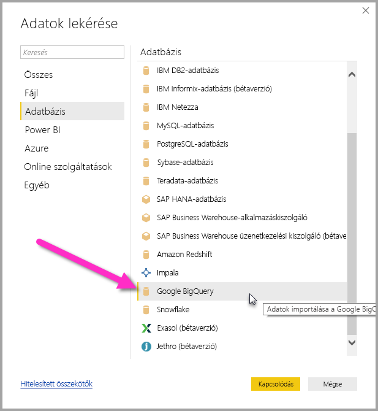
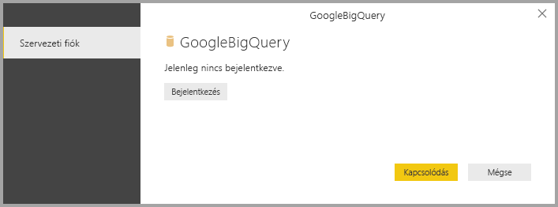
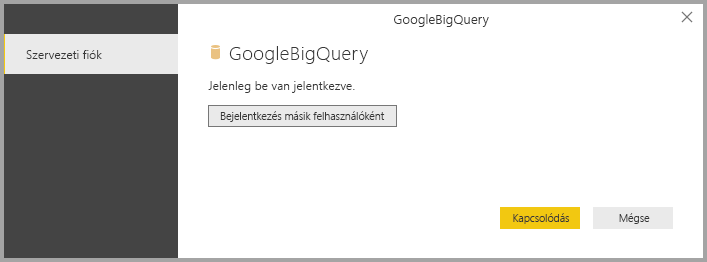
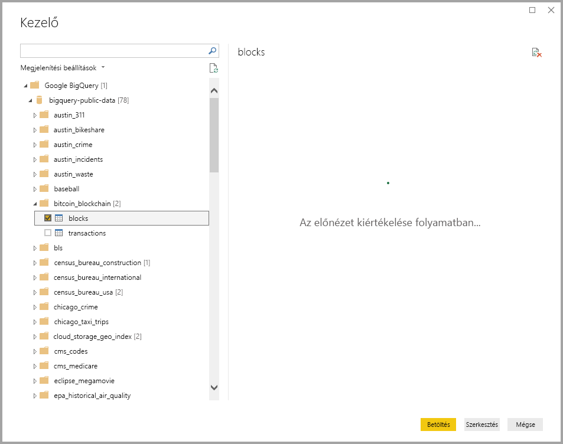

# <a name="connect-to-a-google-bigquery-database-in-power-bi-desktop"></a>Csatlakozás Google BigQuery-adatbázishoz a Power BI Desktopban
A Power BI Desktopban csatlakozhat egy Google **BigQuery**-adatbázishoz, és úgy használhatja az alapul szolgáló adatokat, mint a Power BI Desktop bármely más adatforrását.

## <a name="connect-to-google-bigquery"></a>Csatlakozás a Google BigQueryhez
Ha csatlakozni kíván egy Google **BigQuery**-adatbázishoz, válassza az **Adatok lekérése** lehetőséget a Power BI Desktop **Kezdőlap** menüszalagján. A bal oldali kategóriák közül válassza az **Adatbázis** lehetőséget. Ekkor megjelenik a **Google BigQuery**.



A megnyíló **Google BigQuery**-ablakban jelentkezzen be a Google BigQuery-fiókjába, és kattintson a **Csatlakozás** gombra.



A bejelentkezést követően ez az ablak jelenik meg, jelezve, hogy sikeres volt a hitelesítés. 



Ha sikeresen csatlakozott, megjelenik a **Kezelő** ablaka, és megjeleníti a kiszolgálón elérhető adatokat. Ezek közül kiválaszthat egy vagy több importálni kívánt elemet, és használhatja őket a **Power BI Desktopban**.



## <a name="considerations-and-limitations"></a>Megfontolandó szempontok és korlátozások
A Google **BigQuery**-összekötő használatára vonatkozik néhány korlátozás és egyéb szempont:

* A Google BigQuery-összekötő a Power BI Desktopban és a Power BI szolgáltatásban is elérhető. A Power BI szolgáltatásban az összekötőt a Power BI- és a Google BigQuery-felhő közötti kapcsolaton keresztül érheti el.

A Power BI a Google BigQuery **Billing Project** szolgáltatásával is együttműködik. Alapértelmezés szerint a Power BI a felhasználónak visszaadott listán található első projektet használja. A Billing Project működését a következő módon szabályozhatja, amikor a Power BI-jal használja azt:

 * Adja meg a következő lehetőséget a Forrás lépés alapul szolgáló M beállításában, amelyet a Power BI Desktop **Power Query-szerkesztőjében** lehet testreszabni:

    ```Source = GoogleBigQuery.Database([BillingProject="Include-Billing-Project-Id-Here"])```

## <a name="next-steps"></a>Következő lépések
A Power BI Desktop használatával számos adatforráshoz csatlakozhat. Az adatforrásokkal kapcsolatos információkért lásd az alábbi forrásanyagokat:

* [Mi az a Power BI Desktop?](desktop-what-is-desktop.md)
* [Adatforrások a Power BI Desktopban](desktop-data-sources.md)
* [Adatok formázása és kombinálása a Power BI Desktoppal](desktop-shape-and-combine-data.md)
* [Kapcsolódás az Excelhez a Power BI Desktopban](desktop-connect-excel.md)   
* [Adatok közvetlen bevitele a Power BI Desktopba](desktop-enter-data-directly-into-desktop.md)   

