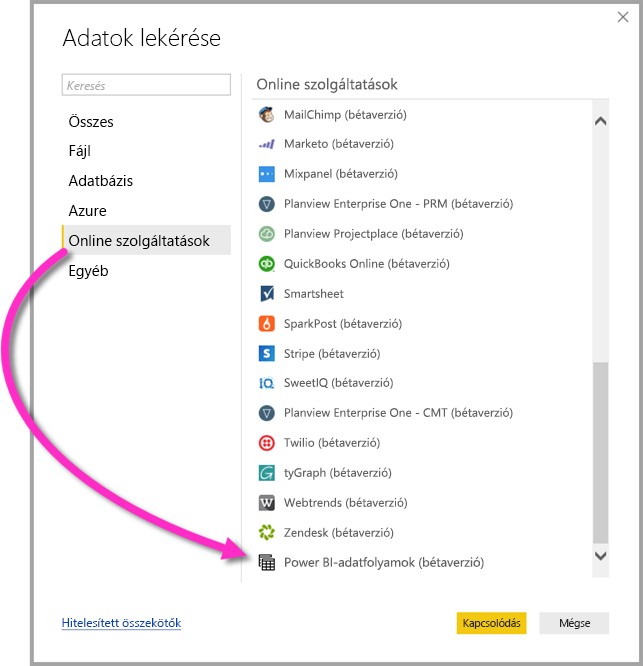

# Csatlakozás Power BI-adatfolyamok által létrehozott adatokhoz a Power BI Desktopban (bétaverzió)
A **Power BI Desktopban** ugyanúgy csatlakozhat a **Power BI-adatfolyamok** által létrehozott adatokhoz, mint bármely más adatforráshoz.

A **Power BI-adatfolyamok (bétaverzió)** összekötője lehetővé teszi az adatfolyamok által létrehozott entitásokhoz való csatlakozást a Power BI szolgáltatásban. 

## Megfontolandó szempontok és korlátozások

A **Power BI-adatfolyamok összekötője** ezen verziójának használatához a **Power BI Desktop** legújabb verzióját kell futtatnia. Bármikor [letöltheti a Power BI Desktopot](desktop-get-the-desktop.md), és telepítheti a számítógépére, hogy mindig a legújabb verzióval rendelkezzen.  

> [!NOTE]
> A Power BI-adatfolyamok összekötőjének előző verziójához szükséges volt letölteni egy .MEZ-fájlt, és elhelyezni azt egy mappában. A **Power BI Desktop** aktuális verziója tartalmazza a Power BI-adatfolyamok összekötőjét, így ez a fájl már nem szükséges, és az összekötő mellékelt verziójával való ütközést okozhat. Ha manuálisan a mappába helyezte ezt a . MEZ-fájlt, akkor törölnie *kell* a letöltött .MEZ-fájlt a **Dokumentumok > Power BI Desktop > Egyéni összekötők** mappából az ütközések elkerülése érdekében. 

## Asztali teljesítmény
A **Power BI Desktop** helyben fut azon a számítógépen, amelyen telepítve van. Az adatfolyamok adatbetöltési teljesítményét számos tényező befolyásolja. Ezen tényezők közé tartozik az adatok mérete, a számítógép CPU-ja és RAM-ja, a hálózati sávszélesség, az adatközponttól való távolság és más tényezők.

Javíthatja az adatfolyamok adatbetöltési teljesítményét. Ha például a feldolgozott adatok mérete túl nagy a **Power BI Desktop** számára a számítógépen való kezeléshez, használhat csatolt és számított entitásokat az adatfolyamokban az adatok összesítéséhez (az adatfolyamokon belül), és betöltheti csak az előkészített, összegyűjtött adatokat. Ennek megfelelően a nagyméretű adatok feldolgozása online adatfolyamokban történik, nem pedig a **Power BI Desktop** helyben futtatott példányában. Ezt a megközelítés lehetővé teszi, hogy a Power BI Desktop kisebb mennyiségű adatot töltsön be, valamint gyors és jól reagáló marad az adatfolyamok kezelése.

## Következő lépések
A Power BI-adatfolyamokkal mindenféle érdekes dolgot végezhet. További információkért tekintse meg az alábbi forrásanyagokat:

* [Önkiszolgáló adatelőkészítés adatfolyamokkal](service-dataflows-overview.md)
* [Adatfolyamok létrehozása és használata a Power BI-ban](service-dataflows-create-use.md)
* [Számított entitások használata a Power BI Premiumban (előzetes verzió)](service-dataflows-computed-entities-premium.md)
* [Adatfolyamok használata helyszíni adatforrásokkal (előzetes verzió)](service-dataflows-on-premises-gateways.md)
* [Fejlesztői erőforrások a Power BI-adatfolyamokhoz (előzetes verzió)](service-dataflows-developer-resources.md)

Vannak még a **Power BI Desktop** alkalmazással kapcsolatos cikkek, amelyeket hasznosnak találhat:

* [Adatforrások a Power BI Desktopban](desktop-data-sources.md)
* [Adatok formázása és kombinálása a Power BI Desktoppal](desktop-shape-and-combine-data.md)
* [Adatok közvetlen bevitele a Power BI Desktopba](desktop-enter-data-directly-into-desktop.md)   

