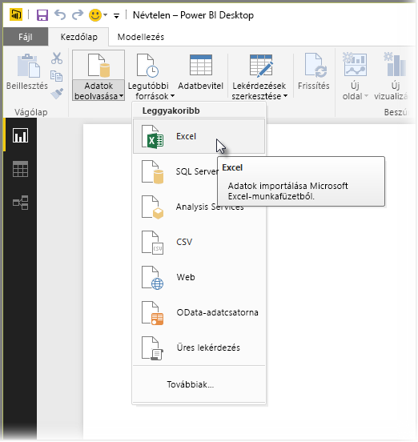
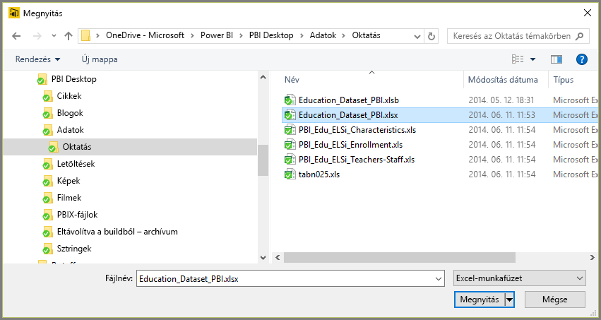
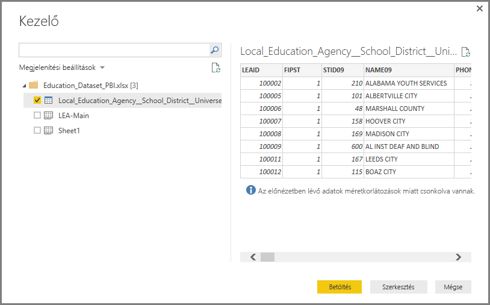
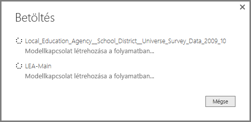
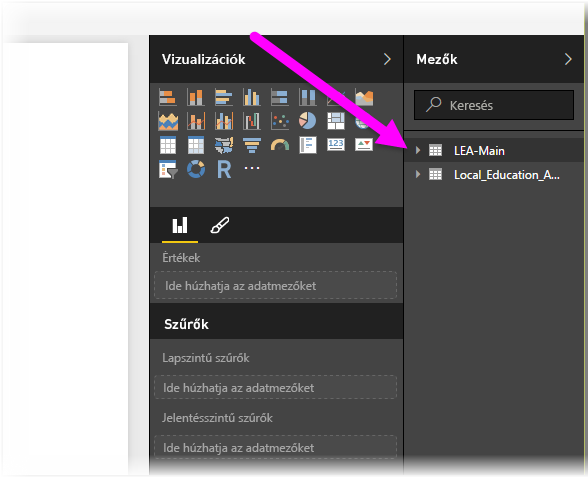

# Kapcsolódás az Excelhez a Power BI Desktopban
A Power BI Desktopban az Excel-munkafüzetek csatlakoztatása nem jelent gondot. Ez a cikk végigvezeti a szükséges lépéseken.

A Power BI Desktop **Kezdőlap** szalagján válassza az **Adatok lekérése > Excel** lehetőséget.

A megjelenő **Megnyitás** párbeszédablakban válassza ki a munkafüzetet.

A Power BI Desktop a munkafüzet tábláit és egyéb adatelemeit a **Kezelő** ablakban jeleníti meg. Ha kiválasztja valamelyik táblát a bal oldali panelen, az adatok előnézete megjelenik a jobb oldalon.

A Betöltés gombra kattintva importálhatja az adatokat a Power BI Desktopba, vagy ha a **Lekérdezésszerkesztőben** előbb szerkeszteni szeretné őket, kattintson a **Szerkesztés** gombra.

Az adatok betöltésekor a Power BI Desktop megjeleníti a **Betöltés** ablakot, amelyen a folyamatban lévő adatbetöltési műveletek láthatóak.  

A betöltés végeztével a Power BI Desktop az Excel-munkafüzetből importált táblákat és mezőket megjeleníti a **Mezők** panelen, a Desktop alkalmazás jobb oldalán.

Ennyi az egész!

Azonnal fel is használhatja az Excel-munkafüzet importált adatait a Power BI Desktopban vizualizációk és jelentések készítéséhez, valamint kombinálhatja őket más csatlakoztatott és importált adatokkal, amelyek például egyéb Excel-munkafüzetekből, adatbázisokból vagy más adatforrásokból származnak.

## További lépések
A Power BI Desktop használatával számos adatforráshoz csatlakozhat. Az adatforrásokkal kapcsolatos információkért lásd az alábbi forrásanyagokat:

* [Mi az a Power BI Desktop?](desktop-what-is-desktop.md)
* [Adatforrások a Power BI Desktopban](desktop-data-sources.md)
* [Adatok formázása és kombinálása a Power BI Desktoppal](desktop-shape-and-combine-data.md)
* [Csatlakozás CSV-fájlokhoz a Power BI Desktopban](desktop-connect-csv.md)   
* [Adatok közvetlen bevitele a Power BI Desktopba](desktop-enter-data-directly-into-desktop.md)   

