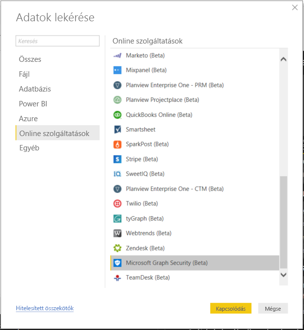
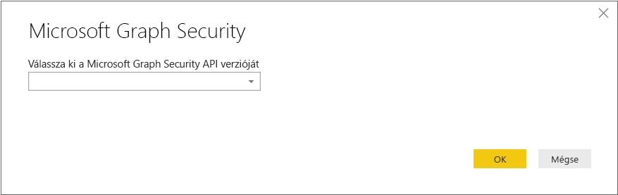
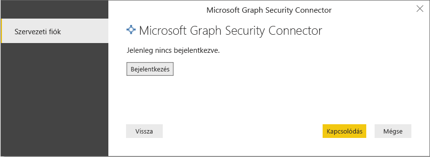
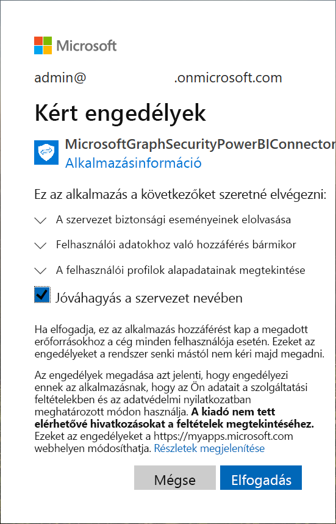
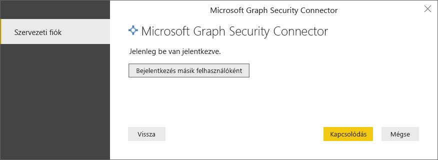
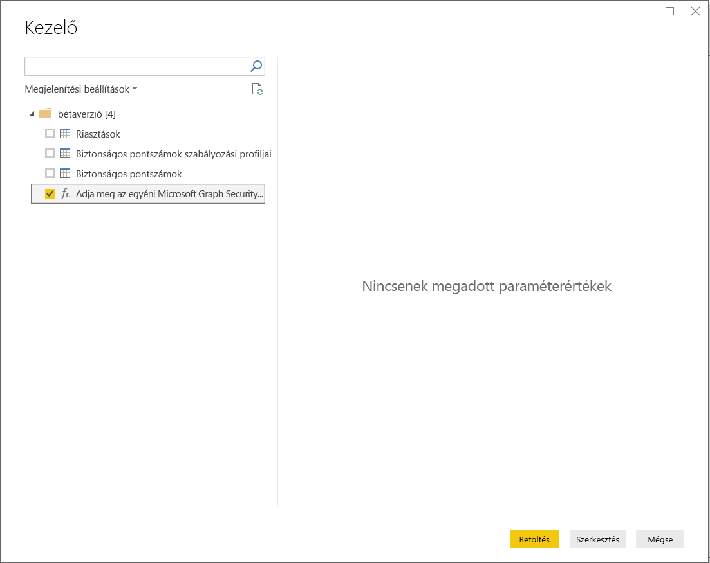
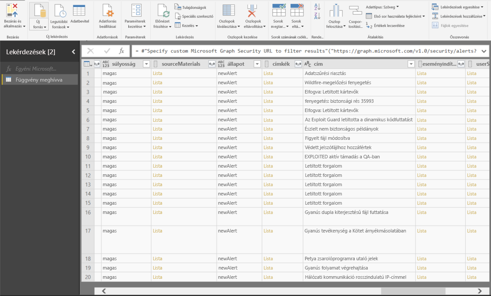

# Csatlakozás a Microsoft Graph Security API-hoz a Power BI Desktopban

Csatlakozzon a Power BI Desktop Microsoft Graph Security-összekötőjével a [Microsoft Graph Security API-hoz](https://aka.ms/graphsecuritydocs). Ezután irányítópultokat és jelentéseket hozhat létre, így biztonsági [riasztásokkal](https://docs.microsoft.com/graph/api/resources/alert?view=graph-rest-1.0) és [biztonsági pontszámokkal](https://docs.microsoft.com/graph/api/resources/securescores?view=graph-rest-beta) kapcsolatos elemzéseket végezhet.

A Microsoft Graph Security API a Microsoft és az ökoszisztéma-partnerei [több biztonsági megoldását](https://aka.ms/graphsecurityalerts) összekapcsolja a riasztások korrelációjának egyszerűsítéséhez. Ez a kombináció gazdag környezeti információkhoz biztosít hozzáférést, és egyszerűsíti az automatizációt. Lehetővé teszi, hogy a szervezetek gyorsan elérhessék a betekintő adatokat, és több biztonsági termékben is műveleteket hajthassanak végre, ugyanakkor csökkenti a költségeket és a bonyolultságot.

## A Microsoft Graph Security-összekötő használatának előfeltételei

A Microsoft Graph Security-összekötő használatához *kifejezetten* kérnie kell az Azure Active Directory (Azure AD) bérlőrendszergazdájának hozzájárulását. Tekintse át a [Microsoft Graph Security hitelesítési követelményeit](https://aka.ms/graphsecurityauth).
A jóváhagyáshoz szükséges az összekötő alkalmazásazonosítója és neve, amelyet itt idézünk, és amely elérhető az [Azure Portalon](https://portal.azure.com):

| Tulajdonság | Érték |
|----------|-------|
| **Alkalmazás neve** | `MicrosoftGraphSecurityPowerBIConnector` |
| **Alkalmazásazonosító** | `cab163b7-247d-4cb9-be32-39b6056d4189` |
|||

Az összekötő jóváhagyásához az Azure AD bérlői rendszergazdája az alábbi módszerek egyikét alkalmazhatja:

* [Hozzájárulás adása az Azure AD-alkalmazásokhoz](https://docs.microsoft.com/azure/active-directory/develop/v2-permissions-and-consent)

* Válaszadás a logikai alkalmazás által az első futtatásakor küldött kérelemre az [alkalmazás-hozzájárulási felületen](https://docs.microsoft.com/azure/active-directory/develop/application-consent-experience)
   
A Microsoft Graph Security-összekötőbe bejelentkező felhasználói fióknak a Biztonsági olvasó korlátozott rendszergazdai szerepkör tagjának kell lennie az Azure AD-ben *Biztonsági olvasóként* vagy *Biztonsági rendszergazdaként*. Lásd: [Azure AD-szerepkörök hozzárendelése a felhasználókhoz](https://docs.microsoft.com/graph/security-authorization#assign-azure-ad-roles-to-users).

## A Microsoft Graph Security-összekötő használata

Kövesse az alábbi lépéseket az összekötő használatához:

1. A Power BI Desktop **Kezdőlap** szalagján válassza az **Lekérdezés** > **Egyebek** lehetőséget.
2. Az ablak bal oldali kategórialistájában válassza az **Online szolgáltatások** lehetőséget.
3. Válassza a **Microsoft Graph Security (bétaverzió)** lehetőséget.

    
    
4. A **Microsoft Graph Security** ablakban válassza ki a lekérdezni kívánt Microsoft Graph API-verziót: **v1.0** vagy **bétaverzió**.

    
    
5. Amikor a rendszer kéri, jelentkezzen be az Azure Active Directory-fiókjába. Ennek a fióknak rendelkeznie kell a *biztonsági olvasó* vagy a *biztonsági rendszergazda* szerepkörrel, amint azt az előző szakaszban említettük.

     
    
6. Ha Ön a bérlői rendszergazda *és* még nem hagyta jóvá a Microsoft Graph Security Power BI-összekötőt (alkalmazást) akkor a következő párbeszédpanel fog megjelenni. Válassza a **Jóváhagyás a szervezet nevében** lehetőséget.

    
    
7. A bejelentkezést követően ez párbeszédpanel jelenik meg, jelezve, hogy sikeres volt a hitelesítés. Kattintson a **Csatlakozás** gombra.

    
    
8. A csatlakozás után a **Kezelő** ablakban megjelennek a riasztások, a biztonsági pontszámok és a [Microsoft Graph Security API-ban](https://aka.ms/graphsecuritydocs) a 4. lépésben kiválasztott verzióhoz elérhető más entitások. Válasszon egy vagy több entitás az importáláshoz és a Power BI Desktopban való használathoz. Ezután válassza a **Betöltés** lehetőséget a 9. lépés után megjelenő eredményablak betöltéséhez.

    
    
9. Ha speciális lekérdezést szeretne használni a Microsoft Graph Security API-val, válassza az **Egyéni Microsoft Graph Security URL-cím megadása az eredmények szűréséhez** lehetőséget. Ezzel a funkcióval [OData.Feed](https://docs.microsoft.com/power-bi/desktop-connect-odata) típusú lekérdezést hozhat létre a Microsoft Graph Security API-ban, a hozzáféréshez szükséges engedélyekkel.

   Az alábbi példában a `https://graph.microsoft.com/v1.0/security/alerts?$filter=Severity eq 'High'` *serviceUri* lehetőséget használjuk. Ha szeretné megtekinteni, hogyan hozhat létre lekérdezéseket a legutóbbi eredmények szűréséhez, sorba rendezéséhez vagy lekéréséhez, tekintse át az [OData rendszerlekérdezési beállításait](https://docs.microsoft.com/graph/query-parameters).

   
    
   Ha kijelöli a **Meghívás** lehetőséget, az **OData.Feed** függvény hívást intéz az API-hoz, amely megnyitja a Lekérdezésszerkesztőt. Szűrnie és finomítani kell a használni kívánt adathalmazt. Ez után töltse be az adatokat a Power BI Desktopba.

Az alábbi a Microsoft Graph Security-entitások eredményablaka, amelyet lekérdeztünk:

   
    

Most már készen áll a Microsoft Graph-Security-összekötő importált adatainak használata a Power BI Desktopban. Létrehozhat grafikonokat vagy jelentéseket. Vagy kezelheti a Excel-munkafüzetekből, adatbázisokból vagy más adatforrásokból importált adatokat.

## Következő lépések
* A [Microsoft Graph Security GitHub Power BI-mintaadattárában](https://aka.ms/graphsecuritypowerbiconnectorsamples) megtekintheti az ezt az összekötőt használó Power BI-mintákat és -sablonokat.

* A [Microsoft Graph Security Power BI-összekötő blogbejegyzésében](https://aka.ms/graphsecuritypowerbiconnectorblogpost) felhasználói forgatókönyveket és további információt találhat.

* A Power BI Desktop használatával sokféle adatforráshoz csatlakozhat. További információkért tekintse meg az alábbi forrásanyagokat:

    * [Mi az a Power BI Desktop?](desktop-what-is-desktop.md)
    * [Adatforrások a Power BI Desktopban](desktop-data-sources.md)
    * [Adatok formázása és kombinálása a Power BI Desktoppal](desktop-shape-and-combine-data.md)
    * [Kapcsolódás az Excelhez a Power BI Desktopban](desktop-connect-excel.md)
    * [Adatok közvetlen bevitele a Power BI Desktopba](desktop-enter-data-directly-into-desktop.md)
