# Csatlakozás a LinkedIn Sales Navigatorhöz a Power BI Desktopban

A **Power BI Desktopban** a **LinkedIn Sales Navigatorhöz** kapcsolódva ugyanúgy kereshet és alakíthat ki kapcsolatokat, mint bármely más Power BI Desktopbeli adatforrással, és kész jelentéseket hozhat létre az előrehaladásról.

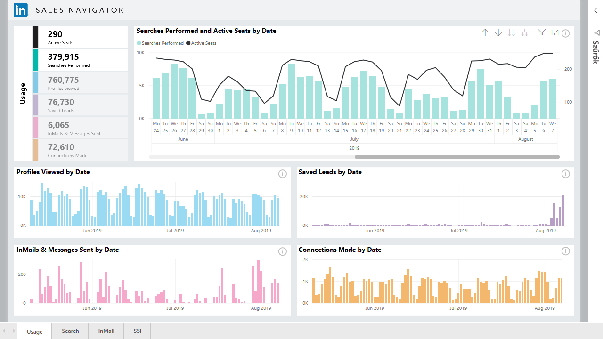

Ahhoz, hogy LinkedIn-adatokhoz csatlakozhasson a **LinkedIn Sales Navigator** használatával, rendelkeznie kell egy LinkedIn Sales Navigator Enterprise csomaggal, és Rendszergazdának vagy Jelentéskészítő felhasználónak kell lennie a Sales Navigator-szerződés szerint.

A következő videó a **LinkedIn Sales Navigator** sablonalkalmazáshoz kínál gyors bemutatót és oktatóanyagot, amelyet a [cikk későbbi szakasza](#using-the-linkedin-sales-navigator-template-app) ír le részletesen. 

> [!VIDEO https://www.youtube.com/embed/ZqhmaiORLw0]

## Csatlakozás a LinkedIn Sales Navigatorhöz

A **LinkedIn Sales Navigator** adataihoz való csatlakozáshoz válassza a Power BI Desktop **Kezdőlap** menüszalagjának **Adatok lekérése** elemét. A bal oldali kategóriák közül válassza az **Online szolgáltatások** lehetőséget, majd görgessen lefelé, amíg meg nem jelenik a **LinkedIn Sales Navigator (bétaverzió)** elem.

A rendszer figyelmezteti, hogy külső szolgáltatáshoz csatlakozik, amely még fejlesztés alatt áll. 

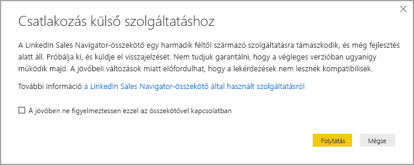

Ha a **Folytatás** lehetőséget választja, a rendszer arra kéri, hogy adja meg, mely adatokat szeretné megkapni.

A megjelenő **LinkedIn Sales Navigator** ablak első legördülő menüjében válassza ki, hogy *Minden kapcsolat*, vagy a *Kijelölt kapcsolatok* adatait szeretné megkapni. Ez után a kezdő és befejező dátum megadásával egy meghatározott időtartományra korlátozhatja a visszaadott adatokat.

Az információk megadása után a Power BI Desktop csatlakozik a LinkedIn Sales Navigator-szerződéshez társított adatokhoz. Használja ugyanazt az e-mail-címet, amelyet a LinkedIn Sales Navigator webhelyen használ a bejelentkezéshez. 

Sikeres csatlakozás esetén a rendszer egy **Navigator** ablakot kínál fel a LinkedIn Sales Navigator-szerződésből kiválasztható adatokkal.

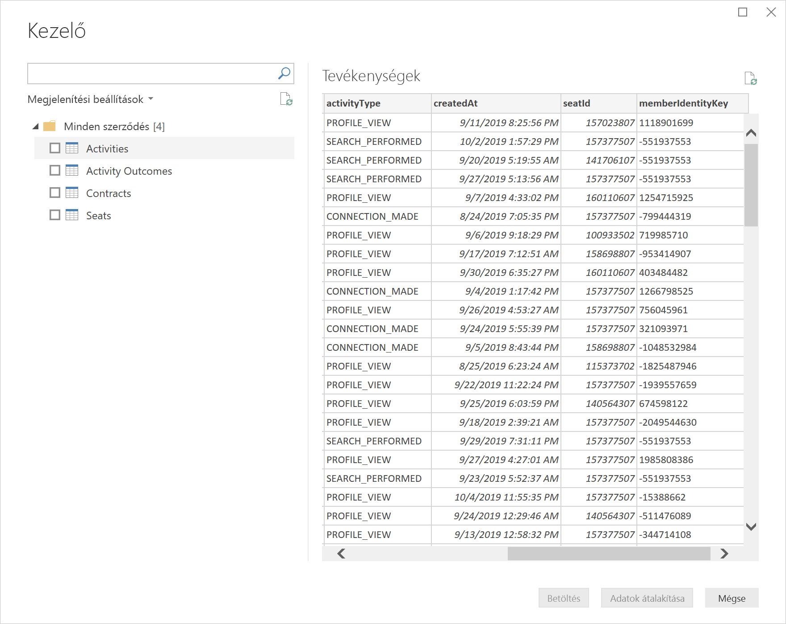

A LinkedIn Sales Navigator adataival tetszőleges jelentést létrehozhat. A feladatot még egyszerűbbé teszi egy letölthető LinkedIn Sales Navigator .PBIX-fájl, amelyben már vannak mintaadatok, így úgy ismerkedhet meg az adatokkal és jelentésekkel, hogy nem kell a nulláról indulnia.

A PBIX-fájlt a következő helyről töltheti le:
* [PBIX-fájl a LinkedIn Sales Navigatorhöz](service-template-apps-samples.md)

A LinkedIn Sales Navigator a PBIX-fájlon kívül egy sablonalkalmazással is rendelkezik, amelyet szintén letölthet és használhat. A következő szakasz részletesen ismerteti a sablonalkalmazást.

## A LinkedIn Sales Navigator sablonalkalmazás használata

A **LinkedIn Sales Navigator** használatának megkönnyítésére használhatja a [sablonalkalmazást](service-template-apps-overview.md), amely automatikusan létrehoz egy előre elkészített jelentést a LinkedIn Sales Navigator-adatokból.

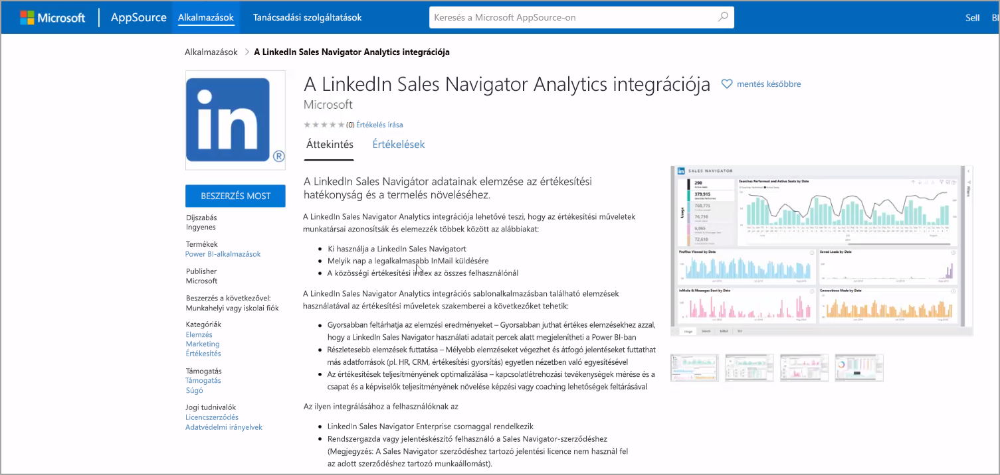

Az alkalmazás letöltésekor választhat, hogy csatlakozik az adatokhoz, vagy a mintaadatokkal ismeri meg az alkalmazást. A mintaadatokkal való ismerkedés után bármikor visszatérhet, és csatlakozhat a saját LinkedIn Sales Navigator-adataihoz. 

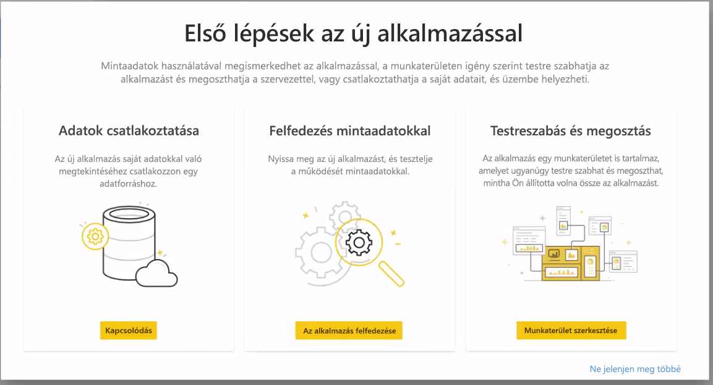

A **LinkedIn Sales Navigator**-sablonalkalmazás az alábbi hivatkozáson tölthető le:
* [LinkedIn Sales Navigator-sablonalkalmazás](https://appsource.microsoft.com/product/power-bi/pbi-contentpacks.linkedin_navigator-preview?flightCodes=17ad4c68-fbc5-4925-a351-139fd384ec33)

A sablonalkalmazás négy lapot kínál az információk elemzéséhez és megosztásához:

* Használat
* Keresés
* InMail
* SSI

A **Használat** lap a LinkedIn Sales Navigator-adatok áttekintését kínálja.

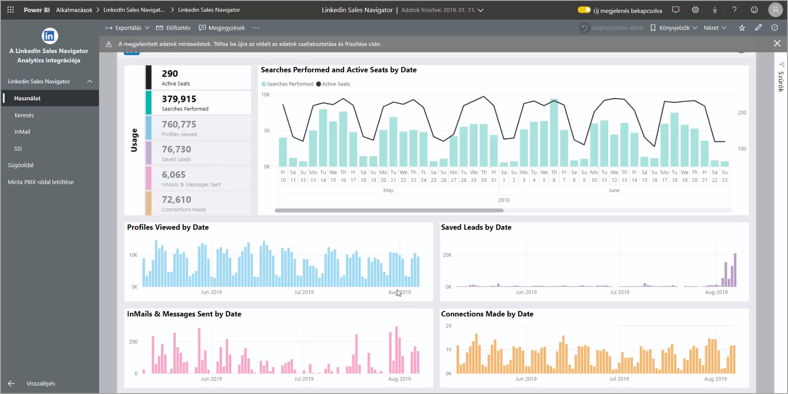

A **Keresés** lapon mélyebbre fúrhat a keresési eredmények között:

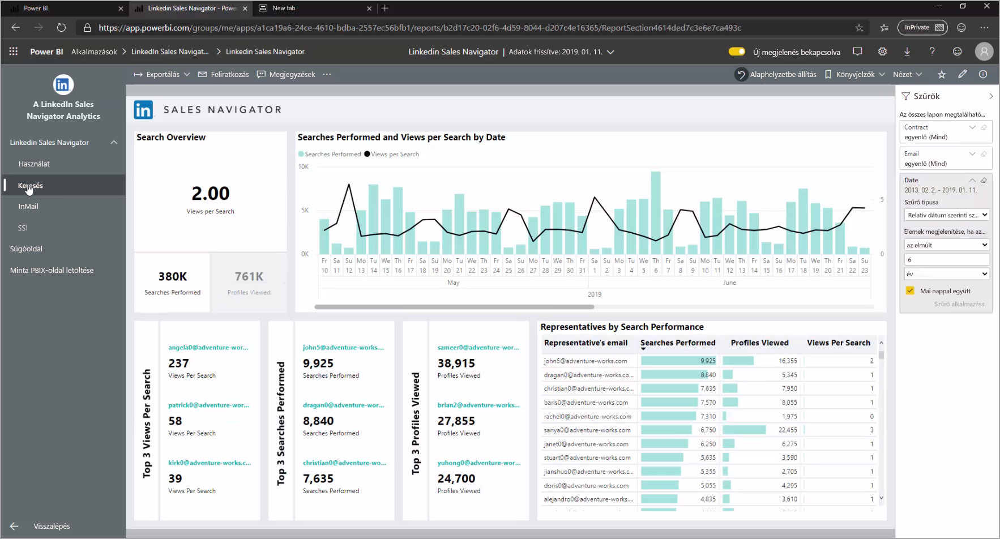

Az **InMail** az InMail használatába nyújt betekintést, beleértve az elküldött InMail-üzenetek számát, az elfogadási arányt és más hasznos információkat:

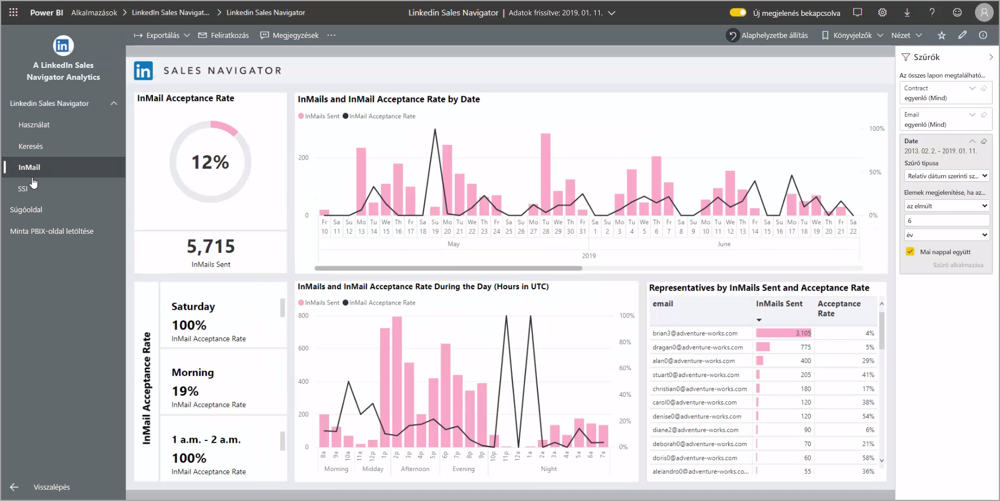

Az **SSI** lap a közösségi értékesítési indexről (SSI) nyújt további részleteket:

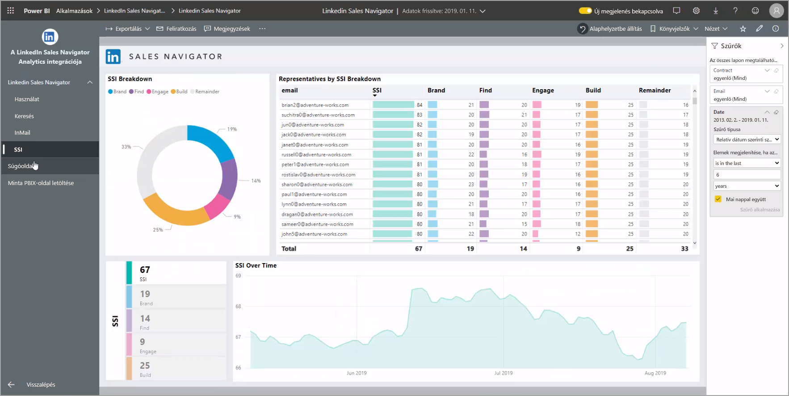

Ha át szeretne térni a mintaadatokról a saját adataira, válassza az **alkalmazás szerkesztése** lehetőséget a jobb felső sarokban (ceruza ikon), majd a megjelenő képernyőn válassza a **Csatlakozás az adatokhoz** lehetőséget.

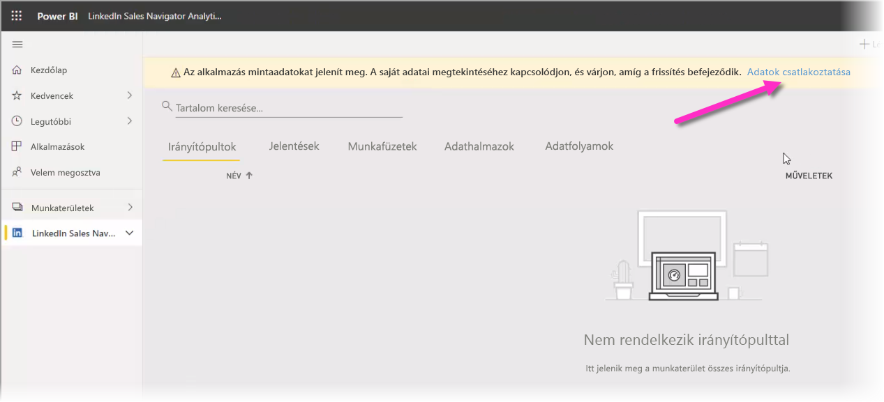

Innen csatlakozhat a saját adataihoz, és megadhatja, hogy hány napi adatot szeretne betölteni. Legfeljebb 365 nap adatait töltheti be. Be kell jelentkeznie, ezúttal is ugyanazzal az e-mail-címmel, amelyet a LinkedIn Sales Navigator webhelyen használ a bejelentkezéshez. 

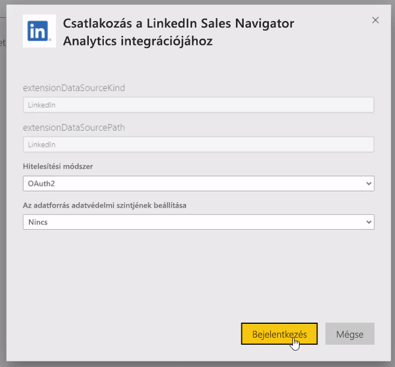

A sablonalkalmazás ekkor az Ön adataira frissíti az alkalmazásban megjelenő adatokat. Beállíthat ütemezett frissítést is, hogy az alkalmazásban lévő adatok a frissítés gyakoriságának mértékében naprakészek legyenek. 

Az adatok frissítése után már a saját adatait láthatja az alkalmazásba betöltve.

## A súgó használata

Ha az adataihoz való kapcsolódás során problémák merülnek fel, a https://www.linkedin.com/help/sales-navigator címen léphet kapcsolatba a LinkedIn Sales Navigator támogatási szolgálatával. 

## Következő lépések
A Power BI Desktop használatával számos adatforráshoz csatlakozhat. Az adatforrásokkal kapcsolatos információkért lásd az alábbi forrásanyagokat:

* [Mi az a Power BI Desktop?](desktop-what-is-desktop.md)
* [Adatforrások a Power BI Desktopban](desktop-data-sources.md)
* [Adatok formázása és kombinálása a Power BI Desktoppal](desktop-shape-and-combine-data.md)
* [Kapcsolódás az Excelhez a Power BI Desktopban](desktop-connect-excel.md)   
* [Adatok közvetlen bevitele a Power BI Desktopba](desktop-enter-data-directly-into-desktop.md)   

