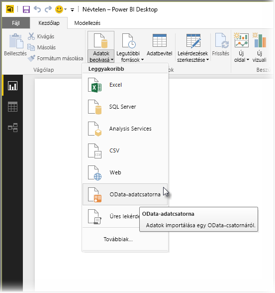
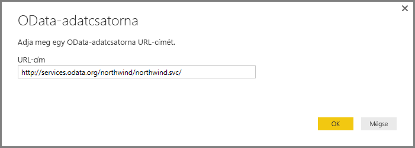
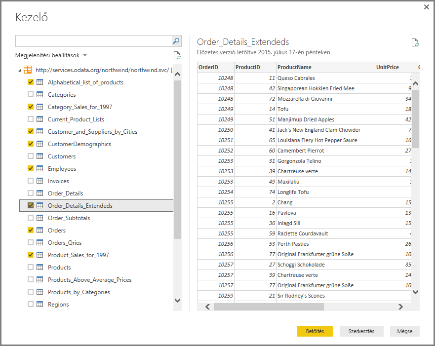
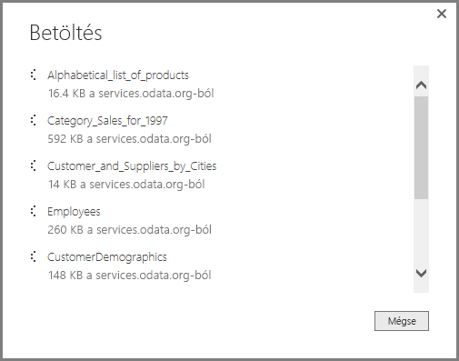
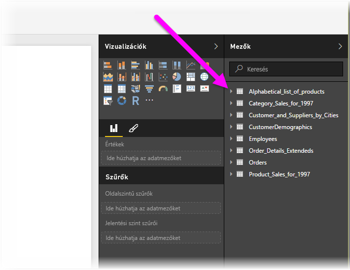

# Csatlakozás OData-csatornákhoz a Power BI Desktopban
A Power BI Desktopban csatlakozhat egy **OData-csatornához**, és úgy használhatja az alapul szolgáló adatokat, mint a Power BI Desktop bármely más adatforrását.

Az OData-csatornához való csatlakozáshoz a Power BI Desktop **Kezdőlap** szalagján válassza az **Adatok lekérése > OData-adatcsatorna** lehetőséget.

A megjelenő **OData-csatorna** ablakban gépelje vagy másolja be a mezőbe az Odata-csatorna URL-címét, majd kattintson az **OK** gombra.

Ezt követően a Power BI Desktop csatlakozik az OData-csatornához, majd a **Kezelő** ablakban megjeleníti az elérhető táblázatokat és más adatelemeket. Egy adott elem kiválasztása után az adatok előnézete a **Kezelő** ablak jobb oldali ablaktábláján fog megjelenni. Annyi táblázatot választhat ki, amennyit importálni szeretne. A **Kezelő** ablak az aktuálisan kiválasztott táblázat előnézetét jeleníti meg.

A **Szerkesztés** gombra kattintva elindíthatja a **Lekérdezésszerkesztőt**, amelyben átformálhatja és átalakíthatja az OData-csatornából származó adatokat, mielőtt importálná azokat a Power BI Desktopba. A **Betöltés** gombra kattintva pedig az összes kiválasztott adatelemet a baloldali panelbe importálhatja.

A **Betöltés** gombra kattintva a Power BI Desktop importálja a kiválasztott elemeket, és megjelenít egy, az importálás folyamatát mutató **Betöltés** ablakot.

A folyamat befejeződésekor a Power BI Desktop elérhetővé teszi a kiválasztott táblázatokat és más adatelemeket a Power BI Desktop **Jelentések** nézetének jobb oldalán található *Mezők* panelen.

Ennyi az egész!

Azonnal fel is használhatja az OData-csatorna importált adatait a Power BI Desktopban vizualizációk és jelentések készítéséhez, valamint kombinálhatja őket más csatlakoztatott és importált adatokkal, amelyek például egyéb Excel-munkafüzetekből, adatbázisokból vagy más adatforrásokból származnak.

## További lépések
A Power BI Desktop használatával számos adatforráshoz csatlakozhat. Az adatforrásokkal kapcsolatos információkért lásd az alábbi forrásanyagokat:

* [Mi az a Power BI Desktop?](desktop-what-is-desktop.md)
* [Adatforrások a Power BI Desktopban](desktop-data-sources.md)
* [Adatok formázása és kombinálása a Power BI Desktoppal](desktop-shape-and-combine-data.md)
* [Kapcsolódás az Excelhez a Power BI Desktopban](desktop-connect-excel.md)   
* [Adatok közvetlen bevitele a Power BI Desktopba](desktop-enter-data-directly-into-desktop.md)   

