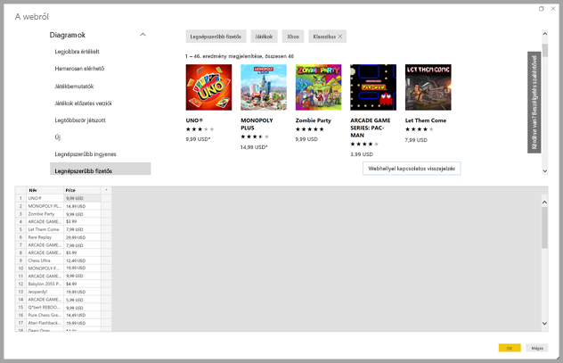
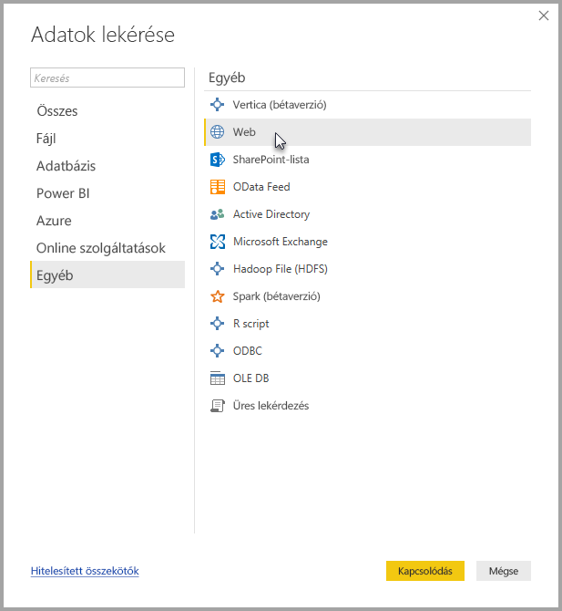
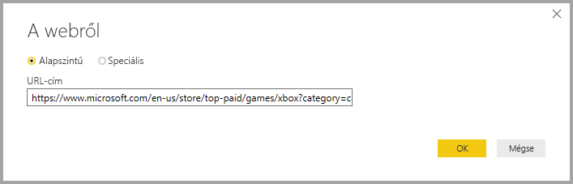
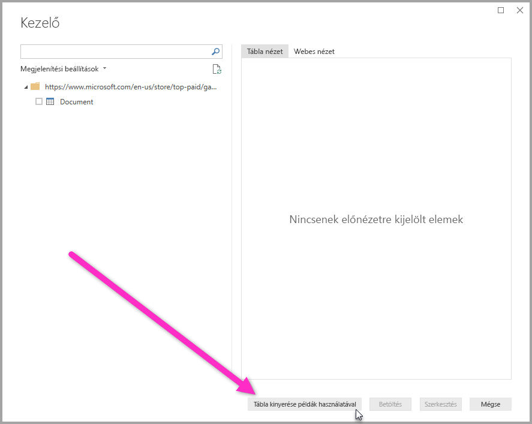
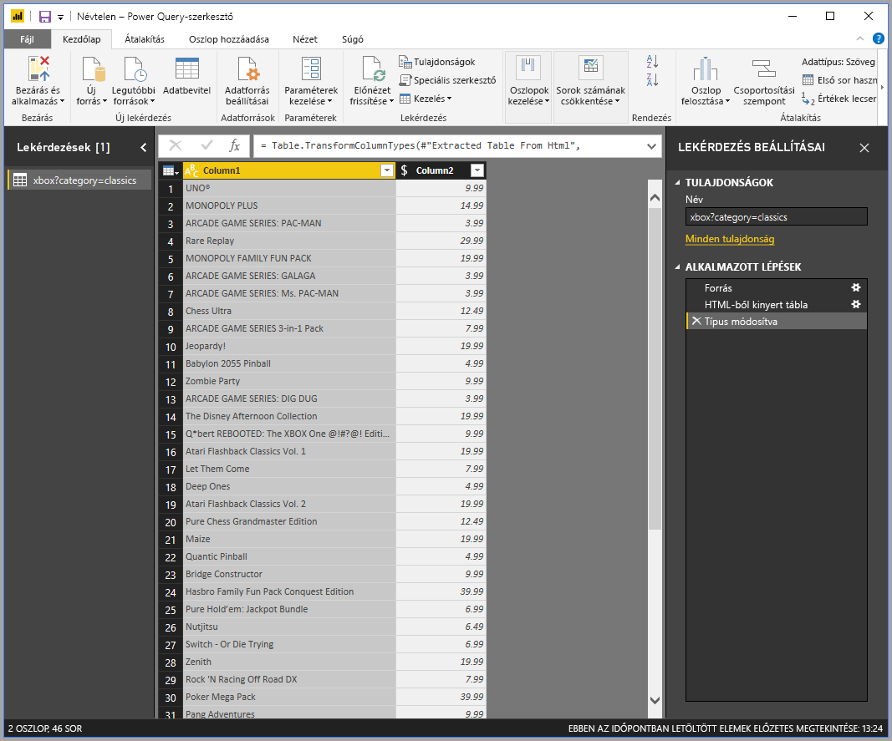

# Adatok lekérése egy weblapról egy példa megadásával

A weboldalak adatainak letöltésével a felhasználók egyszerűen nyerhetnek ki és importálhatnak adatokat a **Power BI Desktopba**. A weboldalak adatai azonban nem könnyen kiolvasható, rendezett táblázatokban találhatók, ezért egy ilyen oldalról még akkor is nehéz lehet adatokat gyűjteni, ha azok strukturáltak és egységesek. 

Létezik megoldás. Az **Adatgyűjtés a webről példa alapján** funkcióval tulajdonképpen megmutathatja a **Power BI Desktopnak**, hogy mely adatokat szeretné kinyerni. Ehhez egy vagy több példát kell megadni az összekötő párbeszédablakban, és a funkció kigyűjti az oldal többi adatát, amelyek megfelelnek a példáknak. Ezzel a megoldással sokféle, így táblázatban rendezett *és* más, nem rendezett adat is kinyerhető a weboldalakról. 

## Az Adatgyűjtés a webről példa alapján funkció használata

Az **Adatgyűjtés a webről példa alapján** funkció használatához válassza a **Kezdőlap** menüszalagjának **Adatok lekérése** elemét. A megjelenő ablak bal oldali paneljén a kategóriák között válassza az **Egyéb**, majd a **Web** lehetőséget.

Ez után adja meg annak a weboldalnak az URL-címét, amelyről adatokat szeretne kinyerni. Ez a cikk a Microsoft Store weboldalát használja, és bemutatja ennek az összekötőnek a működését. 

Ha követni kívánja, használhatja a cikkben is használt [Microsoft Store URL-címet](https://www.microsoft.com/en-us/store/top-paid/games/xbox?category=classics):

    https://www.microsoft.com/en-us/store/top-paid/games/xbox?category=classics

Az **OK** választásával átvált a **Navigátor** párbeszédablakra, ahol megjelennek a weboldal automatikusan észlelt táblázatai. Az ábrán látható esetben nem találhatók táblázatok, de az oldal alján látható a **Táblázat kinyerése példa alapján** gomb, tehát meg lehet adni példákat.

A **Táblázat kinyerése példa alapján** választásával megnyílik egy interaktív ablak a weboldal tartalmának előnézetével, és megadhatók a kinyerni kívánt adatok példái. 

Ebben az esetben az oldalon látható játékok *Nevét* és *Árát* fogjuk kigyűjteni. Ehhez néhány példát kell megadni az oldalról minden oszlopban, ahogyan a következő ábrán látható. A példák begépelése közben a **Power Query** (a háttérben dolgozó technológia, amely kinyeri az adatokat a weboldalról) intelligens adatkinyerési algoritmusok használatával megtalálja a példák mintázatának megfelelő adatokat.

> Megjegyzés: Az ajánlott értékek legfeljebb 128 karakter hosszúságúak.

Ha elégedett a weboldalról kinyert adatokkal, az **OK** választásával átléphet a **Lekérdezésszerkesztőbe**, ahol az adatok tovább alakíthatók vagy formázhatók, például más forrásból származó adatokkal is kombinálhatók.

Ez után már létrehozhat vizualizációkat, vagy másként is felhasználhatja a weboldal adatait **Power BI Desktop**-jelentései elkészítéséhez.

## Következő lépések
A **Power BI Desktop** használatával számos adatforráshoz csatlakozhat. Az adatforrásokkal kapcsolatos információkért lásd az alábbi forrásanyagokat:

* [Oszlop hozzáadása példa alapján](desktop-add-column-from-example.md)
* [Csatlakozás weboldalhoz](desktop-connect-to-web.md)
* [Adatforrások a Power BI Desktopban](desktop-data-sources.md)
* [Adatok formázása és kombinálása a Power BI Desktoppal](desktop-shape-and-combine-data.md)
* [Kapcsolódás az Excelhez a Power BI Desktopban](desktop-connect-excel.md)   
* [Csatlakozás CSV-fájlokhoz a Power BI Desktopban](desktop-connect-csv.md)   
* [Adatok közvetlen bevitele a Power BI Desktopba](desktop-enter-data-directly-into-desktop.md)   

