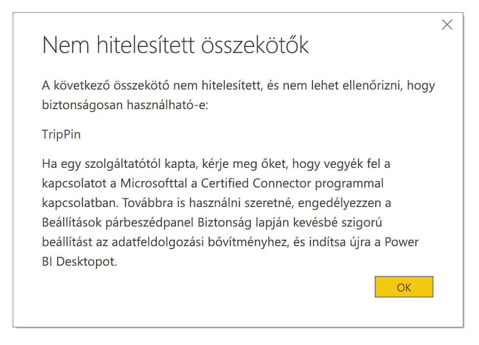

# Összekötők bővíthetősége a Power BI-ban

A Power BI-ügyfelek és a fejlesztők kiterjesztheti az adatforrásokat, számos módon csatlakoznak. Általános adatforrások (például ODBC, OData, Oledb, Web, CSV, XML vagy JSON) és a meglévő összekötők használata. Vagy a fejlesztők, hozzon létre adatkiterjesztések néven **egyéni összekötők**, és azokat **hitelesített összekötők**.

Jelenleg engedélyezi **egyéni összekötők** egyéni kód lehetővé teheti a rendszerben szintjének használatával egy menüt, amelyben biztonságosan szabályozhatja. Kiválaszthatja az összes egyéni összekötők vagy csak a hitelesített, és a Microsoft által terjesztett összekötők a **adatok lekérése** párbeszéd.

## Egyéni összekötők

**Egyéni összekötők** lehetnek lehetőségek széles skáláját, és a kis méretű API-k kritikus fontosságú üzleti nagy iparág-specifikus szolgáltatások, a Microsoft nyilvánosan nem összekötő. Számos összekötő a szállító által oszlanak meg. Ha egy adott adatösszekötő szüksége van, lépjen kapcsolatba szállító.

Használata egy **egyéni összekötő**, helyezni, a  *\[dokumentumok]\\Power BI Desktop\\egyéni összekötők* mappát, és módosítsa úgy a biztonsági beállításokat a leírtak szerint a következő szakaszt.

A **hitelesített összekötők** használatához nem kell módosítania a biztonsági beállításokat.

## Adatkiterjesztés biztonsága

Az adatok kiterjesztése biztonsági beállítások módosításához **Power BI Desktop** kiválasztása **fájl > lehetőségek és beállítások > Beállítások > biztonsági**.

Az **Adatkiterjesztések** területen két biztonsági szint közül választhat:

* (Ajánlott) Csak a tanúsítvánnyal rendelkező bővítmények betöltésének engedélyezése
* (Nem ajánlott) Bármilyen bővítmény betöltésének engedélyezése figyelmeztetés nélkül

Ha azt tervezi, hogy használatával **egyéni összekötők** vagy jelöljön kidolgoztunk, vagy egy harmadik féltől származó összekötők **"(Not Recommended) minden figyelmeztetés nélkül betölteni a bővítmény engedélyezése"** . Ez a beállítás nem ajánlott, kivéve, ha az egyéni összekötőkhöz teljesen megbízható. Mivel a kódot az itt lévő hitelesítő adatait, beleértve a HTTP-n keresztül elküldi azokat kezelni és adatvédelmi szintek figyelmen kívül.

Jelenleg a **"(ajánlott)"** biztonsági beállítást, ha a rendszer az egyéni összekötők, hibaüzenet jelenik meg, amely leírja az összekötőket, amelyek biztonsági miatt nem tölthető be.

Hárítsa el a hibát, és ezeket az összekötőket használ, módosítsa a biztonsági beállításokat a **"(Not Recommended) minden figyelmeztetés nélkül betölteni a bővítmény engedélyezése"** beállítása a korábban leírtaknak megfelelően. Ezután indítsa újra **Power BI Desktop**.

## Hitelesített összekötők

Adatkiterjesztések korlátozott részhalmaza számít **Certified**. A hitelesített összekötők eléréséhez a **adatok lekérése** párbeszéd. De a külső fejlesztő, aki létrehozta az összekötő feladata a karbantartási és támogatási. Bár a Microsoft elosztja az összekötők, akkor sem felelős a teljesítmény vagy a folyamatos függvény.

Ha hitelesíteni szeretne egy egyéni összekötőt, kérje meg a szállítót, hogy lépjen kapcsolatba a dataconnectors@microsoft.com képviselőivel.
