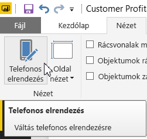
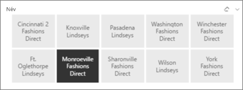
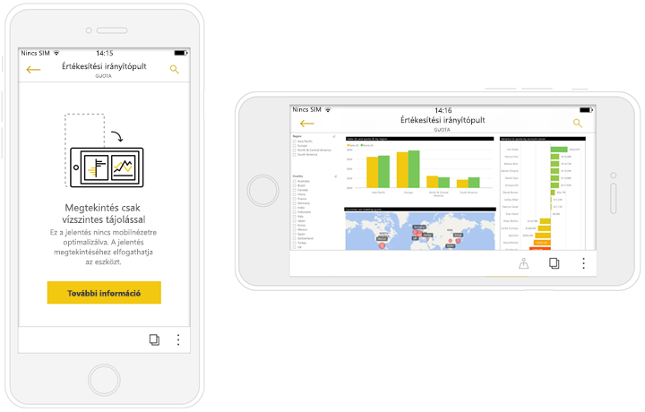

# Jelentések optimalizálása a Power BI-mobilalkalmazásokhoz
Álló elrendezés létrehozásával javíthatja a felhasználói élményt a jelentések mobilalkalmazással történő megtekintésénél. A Power BI Desktopban és a Power BI szolgáltatásban átrendezheti és átméretezheti a jelentések vizualizációit az optimális, álló elrendezésű élmény érdekében.  

Jelentések mobileszközökön való megtekintéséről szeretne többet megtudni? Olvassa el az alábbi rövid útmutatót: [Irányítópultok és jelentések felfedezése a Power BI mobilalkalmazásokban](consumer/mobile/mobile-apps-quickstart-view-dashboard-report.md).

Emellett [*rugalmas* vizualizációkat](#optimize-a-visual-for-any-size) és [rugalmas szeletelőket](#enhance-slicers-to-work-well-in-phone-reports) is létrehozhat, amelyek megfelelően átméretezhetők bárhol. Ha a jelentéshez szűrőket is hozzáad, azok automatikusan megjelennek az optimalizált jelentésben.

## Jelentésoldal álló tájolású elrendezése

Miután létrehozott egy jelentést, optimalizálhatja azt a telefonon vagy táblagépen történő megjelenítésre.

1. A Power BI Desktop **Nézet** lapján válassza a **Telefonos elrendezés** lehetőséget.  
   
    
   
    A Power BI szolgáltatásban válassza a **Jelentés szerkesztése** > **Telefonos elrendezés** lehetőséget.

    Telefon formájú fekete vászon jelenik meg. Az eredeti jelentésoldalon lévő minden vizualizáció fel van sorolva a jobb oldali Vizualizációk panelen.

3. Ha hozzá szeretne adni egy vizualizációt a telefonos elrendezéshez, húzza azt a Vizualizációk panelről a telefonos vászonra.
   
    A telefonos jelentések rács elrendezésűek. Ahogy a vizualizációkat a mobil vászonra húzza, azok a rácsra illeszkednek.
   
    
   
    A telefonos jelentésoldalhoz a fő jelentésoldalon lévő mindegyik vizualizációt is hozzáadhatja, vagy kiválaszthat néhányat, amelyeket hozzá szeretne adni. Egy-egy vizualizációt csak egyszer adhat meg. Nem szükséges mindegyiket felhasználni sem.

4. A rácson átméretezheti a vizualizációkat, ahogy az irányítópultokon és mobil irányítópultokon lévő csempék esetében tenné.
   
   A telefonos jelentések rácsa a különféle telefonok méretének megfelelően átméreteződik, így a jelentés kis és nagy képernyőjű telefonokon egyaránt jól fog kinézni.
   
   

## Vizualizációk optimalizálása bármely méretre
Az irányítópulton vagy a jelentésben a vizualizációkat *rugalmasra* is beállíthatja. Ezek a képernyő méretétől függően dinamikusan a lehető legtöbb adatot és megállapítást jeleníti meg egyszerre. 

A vizualizáció méretének változásával a Power BI átrangsorolja az adatnézet elemeit. Például eltávolítja a kitöltéseket, vagy automatikusan áthelyezi a jelmagyarázatot a vizualizáció tetejére, hogy az egyre kisebb méretű vizualizáció változatlanul áttekinthető maradjon.

Vizualizációnként külön eldöntheti, hogy bekapcsolja-e a rugalmasságot. További információk a [vizualizációk optimalizálásáról](visuals/desktop-create-responsive-visuals.md).

## Megfontolandó szempontok jelentések telefonos elrendezésének létrehozásához
* A többoldalas jelentések esetében eldöntheti, hogy mindegyik oldalt optimalizálja-e, vagy csak egyes oldalakat. 
* Ha adott meg háttérszínt egy adott jelentésoldalhoz, a telefonos jelentésben is ugyanaz lesz a háttérszín.
* A formázási beállítások nem vonatkozhatnak kizárólag a telefonos elrendezésre. A fő és a mobil elrendezés formázása megegyezik, például a betűméretek sem változnak.
* A vizualizációk megváltoztatásához, a formázásuk, adatkészleteik, szűrőik és bármely egyéb attribútumuk módosításához lépjen vissza a rendes jelentésszerkesztési módba.
* A Power BI alapértelmezett címeket és oldalelnevezéseket biztosít a mobilalkalmazások telefonos jelentéseihez. Ha a jelentés címeihez és oldalelnevezéseihez hozott létre szöveges vizualizációkat, ezeket nem feltétlenül érdemes szerepeltetnie a telefonos jelentésekben.     

## Vizualizációk eltávolítása a telefonos elrendezésekből
* A vizualizációk eltávolításához kattintson az X gombra a telefonvásznon a vizualizáció jobb felső sarkában, vagy jelölje ki a vizualizációt, és nyomja le a **Delete** billentyűt.
  
   Ha itt távolítja el a vizualizációt, az csak a telefonos elrendezés vásznáról tűnik el. Magát a vizualizációt és az eredeti jelentést az eltávolítás nem érinti.
  
   

## Szeletelők optimalizálása a telefonos jelentésekhez
A szeletelők a jelentések adatainak szűrését teszik lehetővé a vásznon. Amikor szeletelőket tervez a rendes jelentésszerkesztő módban, módosíthatja egyes beállításukat, hogy jobban megfeleljenek a telefonos jelentésekben való használathoz:

* Döntse el, hogy a jelentés olvasói egyszerre csak egy vagy több elemet is kijelölhetnek-e.
* Helyezzen egy téglalapot a szeletelő köré, hogy a jelentés könnyebben beolvasható legyen.
* Állítsa a szeletelőt függőlegesre, vízszintesre vagy *rugalmasra*. 

Ha rugalmasra állítja a szeletelőt, akkor a méretének vagy az alakjának a módosításával bővül vagy szűkül a lehetőségek köre. Lehet magas, alacsony, széles és keskeny. Ha kellően kicsire alakítja, akkor csupán egy szűrőikon lesz belőle a jelentéslapon. 

További információ a [rugalmas szeletelők létrehozásáról](power-bi-slicer-filter-responsive.md).

## Telefonos jelentés közzététele
* A jelentés telefonos verziójának közzétételéhez [közzé kell tennie a fő jelentést Power BI Desktopból a Power BI szolgáltatásba](desktop-upload-desktop-files.md). Ezzel a telefonos verziót is közzéteszi.
  
    További információk [a megosztásról és az engedélyekről a Power BI-ban](service-how-to-collaborate-distribute-dashboards-reports.md).

## Optimalizált és nem optimalizált jelentések megtekintése telefonon vagy tábalegépen
A telefonos mobilalkalmazásokban a Power BI automatikusan észleli, hogy melyik jelentés optimalizált és melyik nem. Ha egy jelentésnek létezik telefonra optimalizált verziója, a Power BI telefonos alkalmazás automatikusan a telefonos módban nyitja meg a jelentést.

Ha a jelentésnek nincsen telefonra optimalizált változata, a jelentés a nem optimalizált fekvő tájolásban nyílik meg.  

Ha a telefonos jelentés megtekintése közben a telefont fekvő tájolásba fordítja, a jelentés átvált az eredeti elrendezés szerinti nem optimalizált nézetbe, akár optimalizálva van, akár nem.

Ha csak egyes oldalak vannak optimalizálva, álló tájolásban egy üzenet jelenik meg, miszerint a jelentés fekvő tájolásban tekinthető meg.

A jelentések olvasói a telefont vagy a táblagépet oldalra fordítva fekvő tájolásban tekinthetik meg az oldalt. További információk az [álló tájolásra optimalizált Power BI-jelentések használatáról](consumer/mobile/mobile-apps-view-phone-report.md).

## Következő lépések
* [Power BI-irányítópult telefonos nézetének létrehozása](service-create-dashboard-mobile-phone-view.md)
* [Telefonra optimalizált Power BI-jelentések megtekintése](consumer/mobile/mobile-apps-view-phone-report.md)
* [Bármely méretre optimalizált rugalmas vizualizációk létrehozása](visuals/desktop-create-responsive-visuals.md)
* További kérdései vannak? [Kérdezze meg a Power BI közösségét](http://community.powerbi.com/)

