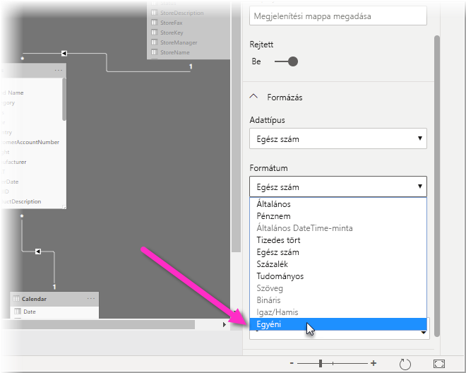
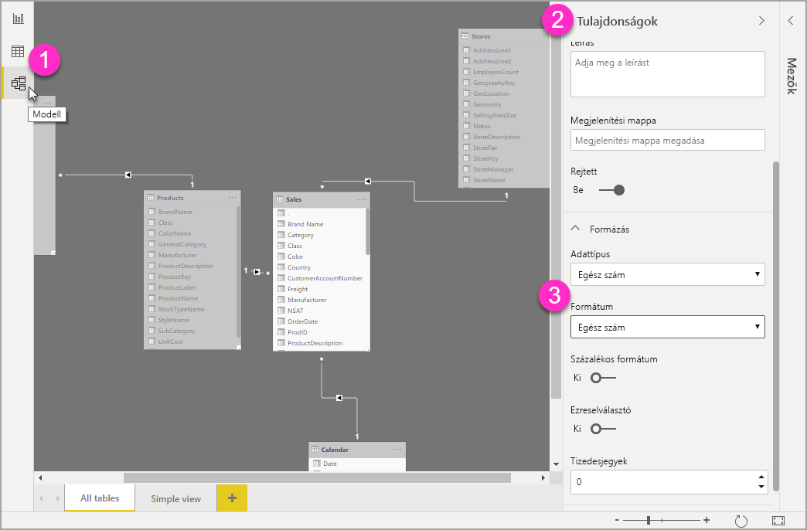

# Egyéni formázó sztringek használata a Power BI Desktopban

A **Power BI Desktopban** egyéni formázó sztringek használatával testre szabhatja a mezők megjelenését a jelentésekben, és biztosíthatja, hogy a jelentések úgy nézzenek ki, ahogyan Ön elképzelte.

## Egyéni formázó sztringek használata

Egyéni formázó sztring létrehozásához jelölje ki a mezőt a **Modellezés** nézetben, majd válassza a **Formátum** lehetőséget a **Tulajdonságok** panelen.

Miután az **Egyéni** lehetőséget választotta a **Formátum** legördülő listából, választhat egyet a gyakran használt formázó sztringek közül. 

## Egyéni formátum támogatott szintaxisa

Az egyéni formázó sztringek szintaxisa az Excelben és más Microsoft-termékekben megszokott VBA-stíluson alapul, de nem támogatja a más termékekben használt összes szintaxist. 

A következő táblázatok a Power BI-ban támogatott szintaxist definiálják.

Az alábbi táblázat a támogatott **dátumszimbólumokat** mutatja be:

| **Szimbólum** | **Tartomány** |
| --- | --- |
| _n_ | 1-31 (a hónap napja, kezdő nulla nélkül) |
| _nn_ | 01-31 (a hónap napja kezdő nullával) |
| _h_ | 1-12 (hónap éven belüli sorszáma kezdő nulla nélkül, a január = 1 értékkel kezdve) |
| _hh_ | 01-12 (hónap éven belüli sorszáma kezdő nullával, a január = 01 értékkel kezdve) |
| _hhh_ | A hónapok rövidített nevét jeleníti meg (az iszlám hónapneveknek nincs rövidítésük) |
| _hhhh_ | A hónapok teljes nevét jeleníti meg |
| _é_ | 1-366 (nap éven belüli sorszáma) |
| _éé_ | 00-99 (az évszám utolsó két számjegye) |
| _éééé_ | 100-9999 (három- vagy négyjegyű évszám) |

Az alábbi táblázat a támogatott **időszimbólumokat** mutatja be:

| **Szimbólum** | **Tartomány** |
| --- | --- |
| _ó_ | 0-23 (1-12 a &quot;de&quot; vagy &quot;du&quot; utótaggal) (a napon belüli óra kezdő nulla nélkül) |
| _óó_ | 00-23 (01-12 a &quot;de&quot; vagy &quot;du&quot; utótaggal) (a napon belüli óra kezdő nullával) |
| _p_ | 0-59 (az órán belüli perc kezdő nulla nélkül) |
| _pp_ | 00-59 (az órán belüli perc kezdő nullával) |
| _p_ | 0-59 (az órán belüli perc kezdő nulla nélkül). Csak közvetlenül _ó_ vagy _óó_ után használható |
| _pp_ | 00-59 (az órán belüli perc kezdő nullával). Csak közvetlenül _ó_ vagy _óó_ után használható |
| _m_ | 0-59 (percen belüli másodperc kezdő nulla nélkül) |
| _mm_ | 00-59 (percen belüli másodperc kezdő nullával) |

Megtekinthet egy [példát](https://docs.microsoft.com/office/vba/language/reference/user-interface-help/format-function-visual-basic-for-applications#example) az egyéni értéksztringek formázására.

A felhasználó által számokhoz megadott formátum-kifejezések egy, kettő vagy három, pontosvesszővel elválasztott szakaszból állhatnak. Két egymást követő pontosvessző hatására a hiányzó szakasz nem lesz megjelenítve (&quot;&quot; lesz). Pontosvessző hiányában a pozitív számok formátuma lesz használva.

Az alábbi példák különböző értéksztringek különböző formázásait mutatják be:

|   | **Formázó sztring** |   |   |   |
| --- | --- | --- | --- | --- |
| **Értékek** | **0,00;-0,0;&quot;Nulla&quot;** | **0,00;;** | **0,00;-0,0;** | **0,00;** |
| **-1,234** | -1,2 | &quot;&quot; | -1,2 | &quot;&quot; |
| **0** | &quot;Nulla&quot; | &quot;&quot; | &quot;&quot; | 0,00 |
| **1,234** | 1,23 | 1,23 | 1,23 | 1,23 |

Az alábbi táblázat az előre definiált, **névvel rendelkező dátum- és időformátumokat** sorolja fel:

| **Formátumnév** | **Leírás** |
| --- | --- |
| **Általános dátum** | Dátum és/vagy idő megjelenítése, például 93.04.03. 05:34 du. Ha nincs törtrész, csak dátumot jelenít meg, például 93.04.03. Ha a szám egynél kisebb, csak időt jelenít meg, például 05:34 du. A dátum megjelenését a rendszer beállításai határozzák meg. |
| **Hosszú dátum** | Dátumot jelenít meg a rendszer hosszú dátumformátumának megfelelően. |
| **Rövid dátum** | Dátumot jelenít meg a rendszer rövid dátumformátumának használatával. |
| **Hosszú idő** | Időt jelenít meg a rendszer hosszú időformátumának használatával. Tartalmazza az óra, perc és másodperc értékét. |
| **Rövid idő** | Időt jelenít meg 24 órás formátumban, például 17:45. |

Névvel rendelkező számformátumok

Az alábbi táblázat az előre definiált, **névvel rendelkező számformátumokat** sorolja fel:

| **Formátumnév** | **Leírás** |
| --- | --- |
| **Általános szám** | Számot jelenít meg ezreselválasztó nélkül. |
| **Pénznem** | Számot jelenít meg ezreselválasztóval, a tizedesjeltől jobbra két tizedesjeggyel. A kimenet a rendszer területi beállításain alapul. |
| **Rögzített** | Legalább egy számjegyet a tizedesjeltől balra, két számjegyet a tizedesjeltől jobbra jelenít meg. |
| **Normál** | Számot jelenít meg ezreselválasztóval. Legalább egy számjegyet a tizedesjeltől balra, két számjegyet a tizedesjeltől jobbra jelenít meg. |
| **Százalék** | A szám 100-szorosát jeleníti meg az attól jobbra hozzáfűzött százalékjellel ( **%** ). Mindig két számjegyet jelenít meg a tizedesjeltől jobbra. |
| **Tudományos** | Szabványos tudományos írásmód. |

Az alábbi táblázat a **felhasználó által megadott dátum- és időformátumokban** használható karaktereket sorolja fel.

| **Karakter** | **Leírás** |
| --- | --- |
| ( **:** ) | Időelválasztó. Bizonyos területi beállítások más karaktereket használhatnak az időérték részeinek elválasztására. Az időelválasztó az időértékek formázásakor választja el az órák, percek és másodpercek számát. A formázott kimenetben ténylegesen megjelenő időelválasztót a rendszerbeállítások határozzák meg. |
| ( **/** ) | Dátumelválasztó. Bizonyos területi beállítások más karaktereket használhatnak az dátumérték részeinek elválasztására. A dátumelválasztó a dátumértékek formázásakor választja el a napok, hónapok és évek számát. A formázott kimenetben ténylegesen megjelenő dátumelválasztót a rendszerbeállítások határozzák meg. |
| n | Bevezető nullát nem tartalmazó számként jeleníti meg a napot (1-31). |
| nn | Bevezető nullát tartalmazó számként jeleníti meg a napot (01-31). |
| nnn | Rövidítéssel jeleníti meg a napot (H – V). Honosított. |
| nnnn | Teljes névvel jeleníti meg a napot (hétfő – vasárnap). Honosított. |
| f | Bevezető nullát nem tartalmazó számként jeleníti meg a hónapot (1-12). Az ó vagy az óó kódot közvetlenül követő p percet jelenít meg. |
| hh | Bevezető nullát tartalmazó számként jeleníti meg a hónapot (01-12). Az ó vagy az óó kódot közvetlenül követő p percet jelenít meg. |
| hhh | Rövidítésként jeleníti meg a hónapot (jan. – dec.). Honosított. |
| hhhh | Teljes névvel jeleníti meg a hónapot (január – december). Honosított. |
| é | Az év napját jeleníti meg számként (1-366). |
| éé | Az évszámot jeleníti meg kétjegyű számként (00-99). |
| éééé | Az évszámot jeleníti meg négyjegyű számként (00-9999). |
| ó | Bevezető nullát nem tartalmazó számként jeleníti meg az órát (0-23). |
| óó | Bevezető nullát tartalmazó számként jeleníti meg az órát (00-23). |
| p | Bevezető nullát nem tartalmazó számként jeleníti meg a percet (0-59). |
| pp | Bevezető nullát tartalmazó számként jeleníti meg a percet (00-59). |
| s | Bevezető nullát nem tartalmazó számként jeleníti meg a másodpercet (0-59). |
| mm | Bevezető nullát tartalmazó számként jeleníti meg a másodpercet (00-59). |
| de./du. | A 12 órás időt használva a de. karaktereket jeleníti meg a dél előtti órákhoz, és a du. karaktereket a dél és az éjjel 11:59 közötti órákhoz. |

Az alábbi táblázat a **felhasználó által megadott numerikus formátumokban** használható karaktereket sorolja fel.

| **Karakter** | **Leírás** |
| --- | --- |
| Nincs | Formázás nélkül jeleníti meg a számot. |
| ( **0** ) | Számjegy-helyőrző. Számjegyet vagy nullát jelenít meg. Ha a kifejezésben számjegy szerepel ott, ahol a formázó sztringben a 0, akkor az megjelenik, egyébként ezen a helyen egy nulla jelenik meg. Ha a szám kevesebb számjegyből áll, mint a nullák száma (a tizedesjel bármelyik oldalán) a formázó sztringben, akkor bevezető vagy lezáró nullákat jelenít meg. Ha a szám több számjegyet tartalmat a tizedesjeltől jobbra, mint a formázó sztringben a tizedesjeltől jobbra elhelyezkedő nullák száma, akkor annyi tizedesjegyre kerekíti a számot, ahány nulla van. Ha a szám több számjegyet tartalmat a tizedesjeltől balra, mint a formázó sztringben a tizedesjeltől balra elhelyezkedő nullák száma, akkor módosítás nélkül jeleníti meg a további számjegyeket. |
| ( **#** ) | Számjegy-helyőrző. Számjegyet vagy semmit sem jelenít meg. Ha a kifejezésben számjegy szerepel ott, ahol a formázó sztringben a # jel, akkor az megjelenik, egyébként ezen a helyen semmi sem jelenik meg. Ez a szimbólum ugyanúgy működik, mint a 0 számjegy-helyőrző, de a bevezető és lezáró nullák nincsenek megjelenítve, ha a szám ugyanannyi vagy kevesebb számjegyből áll, mint a formázó sztringben a tizedesjel bármelyik oldalán álló # karakterek száma. |
| ( **,** ) | Tizedesjel helyőrzője. Egyes területi beállítások pontot használnak tizedesjelként. A tizedesjel helyőrzője határozza meg, hogy hány számjegy legyen megjelenítve a tizedesjeltől balra és jobbra. Ha a formázó kifejezés ettől a szimbólumtól balra csak # jeleket tartalmaz, akkor az 1-nél kisebb számok a tizedesjellel kezdődnek. Ahhoz, hogy a törtszámok bevezető nullával kezdődjenek, használja a 0 számjegy-helyőrzőt a tizedesjel bal oldalán. A tizedesjel-helyőrzőként a formázott kimenetben ténylegesen használt karakter a rendszer által felismert számformátumtól függ. |
| ( **%)** | Százalék helyőrzője. A kifejezés meg van szorozva 100-zal. A százalékjel karakter ( **%** ) arra a helyre van beszúrva, ahol a formázó sztringben található. |
| ( **.** ) | Ezreselválasztó. Egyes területi beállítások vesszőt használnak ezreselválasztóként. Az ezreselválasztó az ezres és a százas helyiértéket választja el egy olyan számban, amely a tizedesjeltől balra négynél vagy több helyet foglal el. Az ezreselválasztó használata akkor van szabványosan megadva, ha a formátum számjegy-helyőrzők között tartalmazza azt ( **0**  vagy  **#** ). Két szomszédos ezreselválasztó, vagy egy közvetlenül a tizedesjeltől balra elhelyezett ezreselválasztó (akár meg van adva tizedestört, akár nem) azt jelenti, hogy &quot;a szám 1000-rel osztva és szükség szerint kerekítve&quot; lesz átváltva. A &quot;##0..&quot; formázó sztriggel például a 100 millió a 100 formában jeleníthető meg. Az 1 milliónál kisebb számok 0-ként jelennek meg. Ha két szomszédos ezreselválasztó a nem tizedesjeltől közvetlenül balra van elhelyezve, egyszerűen az ezreselválasztó használatként lesz értelmezve. Az ezreselválasztóként a formázott kimenetben ténylegesen használt karakter a rendszer által felismert számformátumtól függ. |
| ( **:** ) | Időelválasztó. Bizonyos területi beállítások más karaktereket használhatnak az időérték részeinek elválasztására. Az időelválasztó az időértékek formázásakor választja el az órák, percek és másodpercek számát. A formázott kimenetben ténylegesen megjelenő időelválasztót a rendszerbeállítások határozzák meg. |
| ( **/** ) | Dátumelválasztó. Bizonyos területi beállítások más karaktereket használhatnak az dátumérték részeinek elválasztására. A dátumelválasztó a dátumértékek formázásakor választja el a napok, hónapok és évek számát. A formázott kimenetben ténylegesen megjelenő dátumelválasztót a rendszerbeállítások határozzák meg. |
| ( **E- E+ e- e+** ) | Tudományos formátum. Ha a formázó kifejezés legalább egy számjegy-helyőrzőt ( **0**  vagy  **#** ) tartalmaz az E-, E+, e- vagy e+ kódtól jobbra, akkor a szám tudományos formátumban lesz megjelenítve, és az E vagy az e jel a szám és a kitevő közé lesz beszúrva. A jobb oldali számjegy-helyőrzők száma a kitevő számjegyeinek számát határozza meg. Az E- vagy e- használatával mínuszjel helyezhető el a negatív kitevők mellett. Az E+ vagy e+ használatával mínuszjel helyezhető el a negatív kitevők, és pluszjel a pozitív kitevők mellett. |
| **- + $**  ( ) | Literál karaktert jelenít meg. Az itt fel nem sorolt karakter megjelenítéséhez fordított perjelet (\) írhat elé, vagy kettős idézőjelek közé zárhatja (&quot; &quot;) azokat. |
| ( * *\** ) | A formázó sztring következő karakterét jeleníti meg. Olyan karakter megjelenítéséhez, amely literál karakterként külön jelentéssel bír, helyezzen el előtte egy fordított perjelet (\). Maga a fordított perjel nem jelenik meg. A fordított perjel hatása ugyanaz, mintha a következő karaktert kettős idézőjelek közé zárná. Fordított perjel megjelenítéséhez használjon két fordított perjelet (\\). Literál karakterekként nem megjeleníthető karakterek például a dátumformázási és időformázási karakterek (a, c, n, ó, p, m, h, q, s, t, w, é, /, és :), a számformázási karakterek (#, 0, %, E, e, vessző és pont) és a sztringformázási karakterek (@, &amp;, \&lt;, \&gt;, és !). |
| (&quot;ABC&quot;) | A kettős idézőjelek (&quot; &quot;) közötti szöveget jeleníti meg. A sztring **formázásba** foglalásához kódon belül a **Chr(34)** karaktert használhatja a szöveg közreforgására (34 az idézőjel karakterkódja (&quot;)). |

## Következő lépések
Az alábbi cikkeket is érdekesnek találhatja:

* [VBA formázó sztringek](https://docs.microsoft.com/office/vba/language/reference/user-interface-help/format-function-visual-basic-for-applications#example)
* [Táblázatok feltételes formázása](desktop-conditional-table-formatting.md)
* [Kifejezésalapú címek a Power BI Desktopban](desktop-conditional-format-visual-titles.md)

