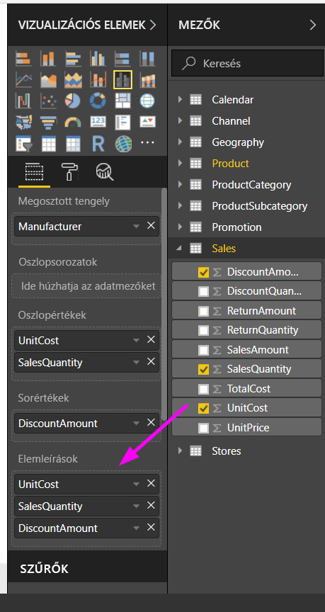
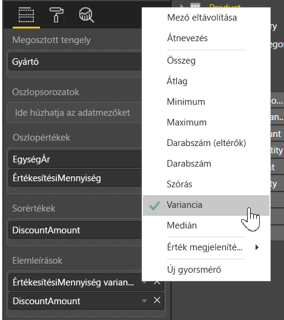

# Elemleírások testreszabása a Power BI Desktopban
Az elemleírások használatával elegáns módon lehet kiegészítő környezeti információkat és részleteket megjeleníteni a vizualizációkban lévő adatpontokról. Az alábbi képen egy diagramhoz hozzáadott elemleírás látható a Power BI Desktopban.

A képi megjelenítés létrehozásakor az alapértelmezett elemleírás az adatpont értékét és kategóriáját jeleníti meg. Nincsenek számos hasznos az elemleírásban megjelenő információk testreszabása, és valószínűleg tartalmaz olyan további kontextus és információk biztosíthatók a vizualizációt megtekintő felhasználóknak. Az egyéni elemleírásokkal további adatpontokat adhat meg, amelyek az elemleírás részeként jelennek meg.

## Az elemleírások testreszabása
Hozhat létre egy egyéni elemleírás a **mezők** , valamint a **Vizualizációk** ablaktáblán húzzon egy mezőt a **elemleírások** gyűjtőbe, akkor az alábbi képen látható. Az alábbi ábrán két mező van az **Elemleírások** gyűjtőbe húzva.

Miután hozzáadta az Elemleírásokat a Mezők területen, a kurzort a képi megjelenítés adatpontjai fölé mozgatva az adott mezők értékei megjelennek az elemleírásban.

## Elemleírások testreszabása összesítésekkel és gyors számításokkal
Lehetősége van az eszközelemek további testreszabására aggregátumfüggvények vagy *gyors számítások* kiválasztásával. Ehhez kattintson az **Elemleírás** gyűjtő melletti nyílra, majd válasszon az elérhető lehetőségek közül.

Számos módon szabhatja testre **elemleírások**, közvetíteni gyors információk és az irányítópultokat és jelentéseket megtekintő felhasználók számára elérhető, az adatkészlet bármely mező használatával.

